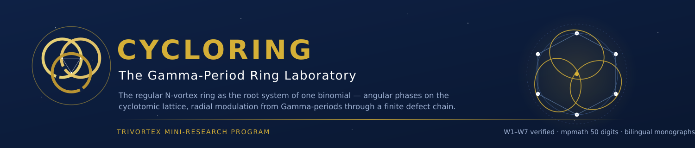
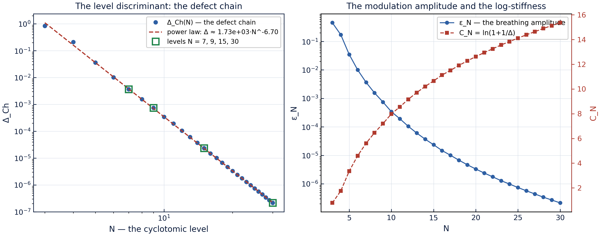
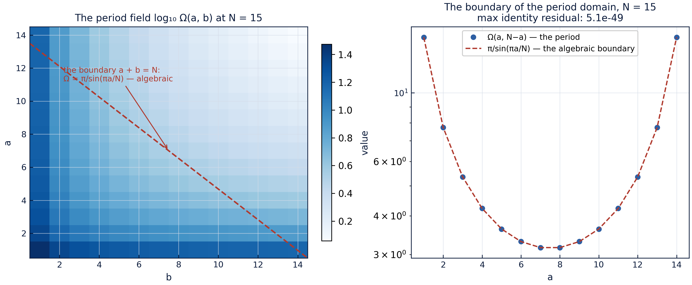
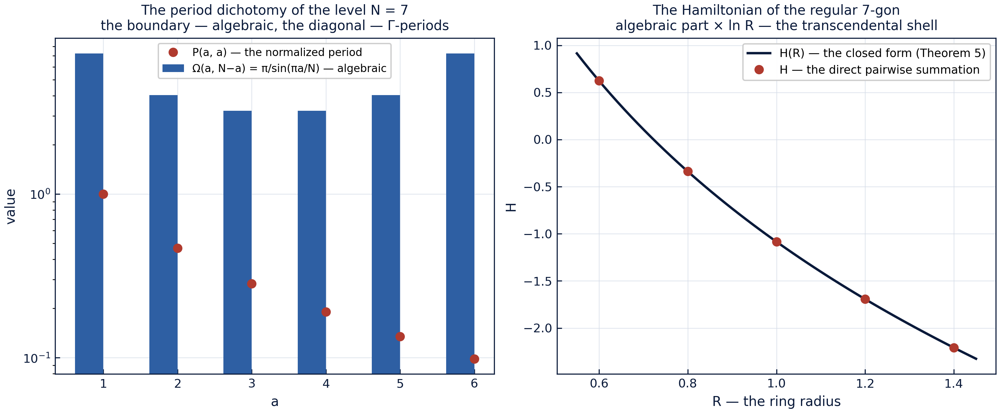

<!-- markdownlint-disable-file MD041 -->
<div align="center">

<!-- ══════════════════════════════════════════════════════════════ -->
<!-- CYCLORING — monumental navy-and-gold header                    -->
<!-- ══════════════════════════════════════════════════════════════ -->


### The Gamma-Period Ring Laboratory

**A self-contained mini-research program inside the TRIVORTEX framework:**
the regular N-vortex ring treated as an algebraic object — the root system
of one binomial — with its angular phases on the cyclotomic lattice and its
radial modulation produced from Gamma-periods through a finite defect chain.
The program ships its own codes, its own verification ladder, its own
protocols, its own figures and its own bilingual monographs.


**[Isaev Iskhak Khamzatovich](https://orcid.org/0009-0003-7299-0701)** · ORCID `0009-0003-7299-0701` · Independent Researcher

[🧭 Parent framework](../README.md) · [🔬 The research program](../research/README.md) · [🏛 Reading room](../publications/README.md) · [🧪 Verification](../verification/README.md)

<!-- ROW 1 — STATUS -->
[](https://github.com/wild8highlander/Trivortex/actions/workflows/ci.yml)
[](https://github.com/wild8highlander/Trivortex/actions/workflows/lint.yml)
[](tests/)
[](results/protocols/)

<!-- ROW 2 — IDENTITY -->
[](CHANGELOG.md)
[](../LICENSE.md)
[](../pyproject.toml)
[](../pyproject.toml)
[](python/cycloring/periods.py)

<!-- ROW 3 — SCHOLARLY PAYLOAD -->
[](docs/monograph/)
[](docs/monographs/)
[](figures/)
[](results/protocols/)

</div>

---

## Table of contents

1. [What this is](#1-what-this-is)
2. [The mathematics — five theorems, one ring](#2-the-mathematics--five-theorems-one-ring)
3. [The W-ladder — seven registered stages](#3-the-w-ladder--seven-registered-stages)
4. [The registered level table](#4-the-registered-level-table)
5. [The figure gallery](#5-the-figure-gallery)
6. [The publication stack](#6-the-publication-stack)
7. [Quickstart](#7-quickstart)
8. [Repository layout](#8-repository-layout)
9. [The module guide](#9-the-module-guide)
10. [The test guard — 37 tests](#10-the-test-guard--37-tests)
11. [Relation to the parent TRIVORTEX framework](#11-relation-to-the-parent-trivortex-framework)
12. [The reproduction protocol](#12-the-reproduction-protocol)
13. [Honesty notes](#13-honesty-notes)
14. [FAQ](#14-faq)
15. [Roadmap of the mini-research](#15-roadmap-of-the-mini-research)

---

## 1. What this is

The program starts from the **frozen regular N-gon of equal point vortices**
— the rigid relative equilibrium that rotates at the classical Lagrange rate
$\omega_L = \Gamma(N-1)/(4\pi R^2)$ — and asks one precise question: **can
the whole breathing dynamics of the ring be read off from a finite set of
periods of the level?** The answer assembled here is *yes*, and it is
assembled as a machine-checkable ladder rather than as prose. The ring's
configuration space, its period domain, its modulation program and its
closure law turn out to be four views of one algebraic object, and every
quantitative claim of the program is pinned to a committed JSON protocol
that CI re-derives on every push.

The delivery mechanism is the same that the parent
[TRIVORTEX](../README.md) framework uses for its core document: an
executable, protocol-bound laboratory with zero unregistered numbers. Four
registers carry the science:

1. **The ring is a root system (Theorem 1).** The breathing configuration
   is exactly the full root set of one binomial $z^N = \sigma(t)$; the
   Galois group of the cyclotomic field acts on it by relabeling vortices.
2. **The period domain has an algebraic boundary (Theorem 2).** Every
   boundary period equals $\pi/\sin(\pi a/N)$ — an algebraic multiple of
   $\pi$ — while the interior periods are genuine Gamma-transcendentals.
3. **The defect chain is a period transducer (Theorem 3).** A finite chain
   of defects converts the level triple $(N, B, \lambda_0)$ into the
   modulation program $\varepsilon$, $\nu$, $C_N$ of the breathing ring.
4. **The synchronous breathing closes exactly (Theorem 4).** The frozen
   transport law has a cycle mean that, compensated by the angular
   frequency, returns the whole configuration after $T_c = 2\pi/\nu$.

Around these four registers the mini-research ships a five-theorem
publication stack in two languages, a seven-stage verification ladder with
committed protocols, a 37-test guard, a bilingual 300-dpi figure factory
and a deterministic runner — everything the parent framework does, at the
scale of one ring.

---

## 2. The mathematics — five theorems, one ring

### 2.1 Theorem 1 — the ring is a root system

Fix the level $N$ and write the breathing configuration as

$z_k(t) = r(t)\,\zeta_N^k\, e^{i\nu t}, \qquad k = 0,\dots,N-1,$

where $\zeta_N = e^{2\pi i/N}$ and $r(t)$ is the common breathing radius.
Then $\{z_k(t)\}$ is **exactly the full set of roots** of the binomial

$z^N = \sigma(t), \qquad \sigma(t) = r(t)^N e^{iN\nu t}.$

Three consequences follow at once and are certified by stage W3:

- **the power sums vanish below the top:**
  $S_m = \sum_k z_k^m = 0$ for $1 \le m < N$ and $S_N = N\sigma$ — the
  roots-of-unity filter in its purest form;
- **the linear impulse vanishes identically:**
  $P = \sum_k \Gamma\,\mathrm{Re}\,z_k = Q = 0$ for every $t$ — a breathing
  ring is a translation-free object;
- **the Galois group is the relabeling group:**
  $\mathrm{Gal}(\mathbb{Q}(\zeta_N)/\mathbb{Q}) \cong (\mathbb{Z}/N)^\times$
  acts on the ring by $\zeta_N \mapsto \zeta_N^a$, i.e. by permuting
  vortices — the character lattice $\widehat\mu_N$ **is** the mode
  decomposition of the ring.

The theorem costs almost nothing to state and is the cheapest possible
target for formalization (roadmap item **C1**): it is polynomial algebra
over a cyclotomic field, with no analysis attached.

### 2.2 Theorem 2 — the algebraic boundary of the period domain

Define the Gamma-period of the level by

$\Omega_{a,b} = \frac{\Gamma(a/N)\,\Gamma(b/N)}{\Gamma((a+b)/N)}, \qquad a, b \ge 1.$

The reflection identity $\Gamma(z)\Gamma(1-z) = \pi/\sin(\pi z)$ applied at
$a + b = N$ collapses the pair to

$\boxed{\ \Omega_{a,N-a} = \frac{\pi}{\sin(\pi a/N)}\ }$

— **every boundary period is an algebraic multiple of $\pi$**, while every
interior period ($a + b \ne N$) is a genuine transcendental of Gamma type.
The complementary algebraic backbone is the sine product

$\prod_{m=1}^{N-1} 2\sin\frac{\pi m}{N} = N,$

which stage W2 certifies at the $10^{-49}$ level together with the boundary
identity. The dichotomy "algebraic boundary vs transcendental interior" is
what Theorem 5 below turns into a statement about observables.

### 2.3 Theorem 3 — the defect chain as a period transducer

From the level triple $(N, B, \lambda_0)$ — level, angular impulse
$B = N\Gamma R_0^2$, frozen frequency $\lambda_0 = \Gamma(N-1)/(4\pi R_0^2)$
— the chain of defects produces the modulation program in five deterministic
steps:

| step | quantity | formula |
|------|----------|---------|
| 1 | the elementary defect | $\delta = \pi/N$ |
| 2 | the defect count | $k = \lceil B\lambda_0/\Gamma^2 \rceil$ |
| 3 | the defect weights | $\gamma = \delta^4/k$, $\delta_{eff} = \delta^5/k$ |
| 4 | the normalized diagonal sum | $W_N = \sum_a P(a,a)$ |
| 5 | the level discriminant | $\Delta_{Ch} = \gamma\, W_N/(N-1)$ |

and the transducer converts $\Delta_{Ch}$ into the breathing program:

$\varepsilon = \frac{\Delta}{1+\Delta}, \qquad \nu = \omega_L\,\frac{(1+\Delta)^3}{(1+2\Delta)^{3/2}} = \omega_L\,(1-\varepsilon^2)^{-3/2}, \qquad C_N = \ln\!\frac{1}{\varepsilon} = -\ln\varepsilon.$

The classical limit $\Delta \to 0$ returns the rigid ring: $\varepsilon\to 0$
and $\nu \to \omega_L$. Stage W7 certifies the whole chain on the levels
$N = 7, 9, 15, 30$ and the monotonic ordering of $\gamma$ on $N = 3..30$.

### 2.4 Theorem 4 — the synchronous breathing closes exactly

Under the frozen transport law $\Lambda_0/r(t)^2$ the cycle mean of one
full breathing period satisfies the integral identity

$\Big\langle (1+\varepsilon\cos u)^{-2} \Big\rangle = \frac{1}{2\pi}\int_0^{2\pi}\frac{du}{(1+\varepsilon\cos u)^2} = (1-\varepsilon^2)^{-3/2}.$

Choosing the angular frequency $\nu$ to be **exactly this mean** (which is
what the transducer of Theorem 3 does) makes every vortex ride a closed
rosette: the angular lag accumulated over one breathing period is exactly
$2\pi$, and the whole configuration returns after the closure time

$T_c = \frac{2\pi}{\nu}.$

Stage W6 pins the closure residual of the level $N = 7$ to
$3.1\times10^{-16}$ — machine zero — and the shape rigidity residual to
$4.4\times10^{-16}$. This is the exact statement that upgrades the kinematic
picture from "qualitative rosettes" to a certified periodic-orbit claim.

### 2.5 Theorem 5 — the dichotomy of the invariants

The algebraicity of the boundary propagates into the observables. The
pair-distance product and the discriminant of the frozen polygon are
**algebraic**:

$\prod_{i<j} |z_i - z_j|^2 = N^N \sigma^{N-1},$

while the Hamiltonian carries a **transcendental shell** on top of its
algebraic core:

$H(R) = -\frac{\Gamma^2}{2\pi}\left[\frac{N(N-1)}{2}\ln R + \frac{N}{2}\ln N\right]$

— the $\ln R$ piece is where the Gamma-transcendentals hide, and the
closed form matches the direct pairwise summation exactly (stage W4,
$h_{closed\_form\_error} = 0$). The ring is algebraic in its shape,
transcendental in its energy — one dichotomy, two registers, both
protocol-bound.

---

## 3. The W-ladder — seven registered stages

The ladder is the independent acceptance layer of the mini-research. Every
stage carries a registered tolerance committed **before** the recorded run,
and every run writes a deterministic JSON protocol into
[`results/protocols/`](results/protocols/) bound to a full parameter
snapshot. The committed protocols of the default preset:

| stage | register | registered tolerance | recorded result | status |
|-------|----------|----------------------|-----------------|:------:|
| **W1** | the period core: reflection identity, $P(1,1)=1$, symmetry | $\le 10^{-30}$ | $5.1\times10^{-49}$ | PASS |
| **W2** | the algebraic boundary $\Omega_{a,N-a} = \pi/\sin(\pi a/N)$ + the sine product | $\le 10^{-30}$ | $5.1\times10^{-49}$ | PASS |
| **W3** | the root system: $z^N - \sigma$ identity, moments, impulse | $\le 10^{-9}$ | $6.4\times10^{-11}$ (worst level) | PASS |
| **W4** | the polygon flow: rigid rotation, shape, invariants, $H$ form | $\le 10^{-9}$ rate; $\le 10^{-12}$ drifts | $1.4\times10^{-12}$ rate; $1.7\times10^{-14}$ drift | PASS |
| **W5** | the transport identity + the exact $2\pi$ phase advance | $\le 10^{-30}$ mp; $\le 10^{-12}$ float | $2.7\times10^{-51}$ mp; $1.8\times10^{-15}$ phase | PASS |
| **W6** | the synchronous closure of the rosettes | $\le 10^{-12}$ | $3.1\times10^{-16}$ | PASS |
| **W7** | the transducer table of the levels $N = 7, 9, 15, 30$ | ordering + round trip | table §4, all rows | PASS |

The computational registers are strict: the mpmath layer runs at **50
working digits** (identity tolerances $10^{-30}$), the dynamics layer uses
**RK4** (rate tolerance $10^{-9}$, invariant drifts $10^{-12}$). A passing
check is a claim held to a published band; a failing check is a broken
claim, not a noisy measurement — the same registration discipline the
parent framework applies to its V1–V4 ladder.

Every protocol is re-derivable in one command (`make ladder`) and re-checked
by the pytest guard on every CI run. The protocols are preset-keyed: the
`default` preset is the committed one; `quick` and `full` re-derive the same
registers at coarser/finer integration effort for smoke testing and release
validation respectively.

---

## 4. The registered level table

The default-preset output of stage W7 — the transducer table of the four
registered levels. These are the numbers the monographs quote, each bound
to its protocol:

| $N$ | $k$ | $W_N$ | $\Delta_{Ch}$ | $\varepsilon_N$ | $\nu/\omega_L$ | $C_N$ |
|----:|----:|-------:|---------:|---------:|---------:|------:|
| 7 | 4 | 2.175445 | $3.677\times10^{-3}$ | $3.664\times10^{-3}$ | 1.0000201 | 5.609 |
| 9 | 6 | 2.416452 | $7.474\times10^{-4}$ | $7.469\times10^{-4}$ | 1.0000008 | 7.200 |
| 15 | 17 | 2.915447 | $2.357\times10^{-5}$ | $2.357\times10^{-5}$ | 1.0000000 | 10.656 |
| 30 | 70 | 3.603649 | $2.135\times10^{-7}$ | $2.135\times10^{-7}$ | 1.0000000 | 15.360 |

The stiffness grows steeply with the level: on the scanned range
$N = 3..30$ the breathing amplitude falls like the power law

$\Delta_{Ch}(N) \approx 1.7\times10^{3}\, N^{-6.7},$

so **high cyclotomic levels are stiff rings and the low levels breathe**.
The power law is a numerical fit, not an asymptotic theorem — only the
monotonicity of $\gamma$ is proved (see [§13](#13-honesty-notes)).

<div align="center">

</div>

---

## 5. The figure gallery

All figures are generated at **300 dpi** by the protocol-bound factory
[`python/cycloring/figures.py`](python/cycloring/figures.py) and are
regenerable with `make figures`. The repository ships **two language
editions** of the complete set: the English primary in
[`figures/`](figures/) and the Russian mirror in
[`figures/ru/`](figures/ru/) — the same pixels discipline, two languages.

| figure | stages | what it shows |
|--------|:------:|----------------|
| [`fig01_periods_lattice.png`](figures/fig01_periods_lattice.png) | W1, W2 | the period field $\log_{10}\Omega(a,b)$ at $N=15$ and the algebraic boundary $\pi/\sin(\pi a/N)$ |
| [`fig02_transducer.png`](figures/fig02_transducer.png) | W7 | the defect chain across levels with the fitted power law; the amplitude and the log-stiffness |
| [`fig03_breathing.png`](figures/fig03_breathing.png) | W6 | the synchronous-breathing rosettes of the seven vortices and the quarter-phase snapshots |
| [`fig04_transport_law.png`](figures/fig04_transport_law.png) | W5 | the mean-transport identity: quadrature mean against the closed form $(1-\varepsilon^2)^{-3/2}$ |
| [`fig05_dichotomy.png`](figures/fig05_dichotomy.png) | W2–W4 | the period dichotomy at $N=7$; the closed-form Hamiltonian against direct pairwise summation |
| [`scheme_cycloring.svg`](figures/scheme_cycloring.svg) | — | the research architecture: triple → chain → discriminant → transducer → breathing |

<div align="center">

**The period field and its algebraic boundary (W1–W2)**



**The synchronous-breathing rosettes (W6)**


**The mean-transport identity (W5)**


**The dichotomy of the invariants (W2–W4)**



</div>

Every figure embeds its protocol residuals in the title — the pictures
quote the same numbers the protocols certify, never independent ones.

---

## 6. The publication stack

The publication stack is modelled one-to-one on the parent repository:
each document exists in Russian and English as separate files, each in
typeset PDF and editable DOCX renditions. Every document embeds the
figures and quotes only protocol-bound numbers.

| item | languages | formats | where |
|------|-----------|---------|-------|
| the big research monograph | RU, EN | `.md`, `.docx`, `.pdf` | [`docs/monograph/`](docs/monograph/) |
| Theorem 1 — the root system of the ring | RU, EN | `.docx`, `.pdf` | [`docs/monographs/`](docs/monographs/) |
| Theorem 2 — the algebraic boundary of the period domain | RU, EN | `.docx`, `.pdf` | [`docs/monographs/`](docs/monographs/) |
| Theorem 3 — the period transducer | RU, EN | `.docx`, `.pdf` | [`docs/monographs/`](docs/monographs/) |
| Theorem 4 — the synchronous breathing | RU, EN | `.docx`, `.pdf` | [`docs/monographs/`](docs/monographs/) |
| Theorem 5 — the dichotomy of the invariants | RU, EN | `.docx`, `.pdf` | [`docs/monographs/`](docs/monographs/) |
| figures (fig01–fig05 + the scheme), two editions | EN, RU | `.png` 300 dpi, `.svg` | [`figures/`](figures/) |

The DOCX files carry proper field TOCs; the PDFs are the LibreOffice
render of the very same DOCX — the parent repository's pipeline, so the
two stacks stay typographically identical.

---

## 7. Quickstart

Requirements: Python ≥ 3.10 with `numpy`, `mpmath`, `matplotlib` (figures
only) and `pytest` (guard only). From the mini-research root:

```bash
cd cycloring

make ladder   # run W1..W7 (default preset), refresh the JSON protocols
make quick    # fast smoke of the whole ladder (quick preset)
make full     # long integration (full preset)
make figures  # regenerate figures/ — EN primary + RU mirror (figures/ru/)
make test     # the pytest guard (37 tests)
make lint     # black --check + ruff + mypy (scoped to this mini-research)
```

The runner can also address a single stage:

```bash
PYTHONPATH=python python3 python/cycloring/runner.py --stage W5 --preset default
```

The presets trade integration effort for wall time:

| preset | what it does | typical wall | used by |
|--------|--------------|--------------|---------|
| `quick` | coarse smoke of all seven stages | ≈ 1 s | CI, iteration |
| `default` | the committed protocol preset | ≈ 10 s | protocols, tests |
| `full` | long integration, tight tolerances | ≈ 60 s | release validation |

The Python API is one import away:

```python
import sys; sys.path.insert(0, "python")

from cycloring import chain, periods, ring

# the transducer of the level N = 7 in one call
program = chain.transduce(7)
print(program["eps"], program["nu_ratio"], program["c_log"])

# boundary periods are algebraic: Omega(a, N-a) = pi / sin(pi a / N)
from mpmath import mp, sin, pi
mp.dps = 50
print(periods.boundary_period(2, 15) == pi / sin(2 * pi / 15))  # exact at 50 digits
```

---

## 8. Repository layout

```text
cycloring/
├── README.md            ← this file
├── README_RU.md         ← the Russian mirror
├── CHANGELOG.md         ← the mini-research changelog
├── Makefile             ← ladder / quick / full / figures / test / lint
├── docs/
│   ├── monograph/       ← THE BIG MONOGRAPH: monograph_RU|EN.{md,docx,pdf}
│   └── monographs/      ← THEOREM EDITION: Theorems 1–5
│                          (CYCLORING-Theorem{k}_{RU,EN}.docx / .pdf, 20 files)
├── figures/             ← the ENGLISH primary set: fig01–fig05 (300 dpi PNG)
│   │                       + scheme_cycloring.svg — generated by `make figures`
│   └── ru/              ← the RUSSIAN mirror set (same five figures + scheme)
├── python/cycloring/
│   ├── periods.py       ← the Gamma-period core (mpmath)
│   ├── chain.py         ← the defect chain + the transducer
│   ├── ring.py          ← the root system, characters, the breathing program
│   ├── dynamics.py      ← the Kirchhoff layer: RHS, RK4, H/P/Q/I, Jacobian
│   ├── ladder.py        ← the W1..W7 checks
│   ├── runner.py        ← the JSON protocol CLI
│   └── figures.py       ← the bilingual figure factory (EN + RU, 300 dpi)
├── tests/               ← the pytest guard (37 tests)
└── results/protocols/   ← the committed JSON protocols (default preset)
```

Each subfolder carries its own README with the local API, file index and
regeneration instructions — start with
[`python/cycloring/`](python/cycloring/) for the module guide.

---

## 9. The module guide

Eight modules, ≈ 1.9 kLOC, zero dependencies beyond `numpy` + `mpmath`:

| module | lines | role | key entry points |
|--------|------:|------|------------------|
| [`periods.py`](python/cycloring/periods.py) | 157 | the Gamma-period core at 50 digits | `omega`, `boundary_period`, `boundary_periods_mp`, `normalized_p` |
| [`chain.py`](python/cycloring/chain.py) | 5.3 KB | the defect chain and the transducer | `defect_chain`, `transduce` |
| [`ring.py`](python/cycloring/ring.py) | 217 | root system, characters, breathing program | `polygon_positions`, `synchronous_frequency`, `rosette_curve`, `mean_transport_ratio` |
| [`dynamics.py`](python/cycloring/dynamics.py) | 172 | the Kirchhoff layer | `rhs`, `rk4_step`, `invariants`, `jacobian`, `hamiltonian_closed_form` |
| [`ladder.py`](python/cycloring/ladder.py) | 454 | the W1–W7 registered checks | `run_stage`, `run_ladder` |
| [`runner.py`](python/cycloring/runner.py) | 77 | the JSON protocol CLI | `--stage`, `--preset` |
| [`figures.py`](python/cycloring/figures.py) | 473 | the bilingual figure factory | `main`, `--lang both/en/ru` |
| [`__init__.py`](python/cycloring/__init__.py) | — | the package surface | re-exports the public API |

The dependency direction is strict: `periods → chain → ring → dynamics →
ladder → runner/figures`. Nothing in the package imports the parent
framework at runtime — the parent appears only in tests, as the reference
oracle (see [§11](#11-relation-to-the-parent-trivortex-framework)).

---

## 10. The test guard — 37 tests

The pytest guard re-derives every preset-independent number of the ladder
and pins the preset-dependent ones to the committed protocols:

| suite | tests | what they guard |
|-------|------:|-----------------|
| `test_cr_periods.py` | 7 | the reflection identity, $P(1,1)=1$, symmetry, the boundary values at 50 digits |
| `test_cr_chain.py` | 10 | the defect chain, the transducer, the level table rows, the monotonic ordering |
| `test_cr_dynamics.py` | 10 | the Kirchhoff RHS, invariants, the closed-form Hamiltonian, the rosette program |
| `test_cr_ladder.py` | 10 | the ladder rungs themselves + the committed protocol shape and status |

Run them with `make test` or `python3 -m pytest tests/ -v`. The guard
needs only `numpy`, `mpmath` and `pytest` — the same dependency floor the
CI uses, so a green guard on your laptop is the same green guard CI sees.

---

## 11. Relation to the parent TRIVORTEX framework

The mini-research is deliberately self-contained, but it is not isolated:
its registers generalize the parent's verification ladder and feed its
roadmap items.

| parent register / item | this mini-research | note |
|-------------------------|--------------------|------|
| V2 (the Lagrange rigid rotation) | W4 | the same $\omega_L$, measured on the frozen $N$-gon |
| V3/V4 (integral conservation) | W4 | $H, P, Q, I$ conserved along the polygon flow |
| roadmap **T1** (regular N-gon ring) | Theorem 1 + W3 | the algebraic shadow: roots, moments, impulse |
| roadmap **T3** (spectral stability) | `dynamics.jacobian` | the spectral diagnostic of the frozen ring |
| roadmap **T5** (admissible region) | Theorem 2 | the algebraic boundary of the period domain |
| the multi-language ports | `tests/` | the same pinning discipline, mini scale |

The parent framework imports nothing here and this mini-research imports
nothing from the parent at runtime; the pytest guard is the only place the
two trees touch, exactly mirroring how the parent treats its language
ports — as independent oracles pinned by committed numbers.

---

## 12. The reproduction protocol

To reproduce every number in this README from scratch:

1. **clone and enter** — `git clone https://github.com/wild8highlander/Trivortex.git && cd Trivortex/cycloring`;
2. **run the ladder** — `make ladder`; the seven JSON protocols in
   `results/protocols/` are regenerated byte-for-byte (deterministic runs,
   no wall-clock fields in the numbers);
3. **regenerate the figures** — `make figures`; the factory reads the
   committed protocols and rebuilds both language editions;
4. **run the guard** — `make test`; 37 tests re-derive the
   preset-independent registers and pin the rest to the protocols;
5. **compare** — every number quoted in [§3](#3-the-w-ladder--seven-registered-stages)
   and [§4](#4-the-registered-level-table) must match your run to the
   printed precision; a mismatch is a bug — open an issue with your
   protocol JSON attached.

The whole loop takes well under a minute on a laptop; the mpmath layer is
the only computationally heavy part and it is bounded by the 50-digit
working precision.

---

## 13. Honesty notes

- The breathing program is a **kinematic program**: the frozen polygon has
  no radial velocity in the Kirchhoff field (pair cancellation), so the
  pump must supply the radial drive; the angular transport, however, is
  not prescribed but follows the frozen law $\Lambda_0/r(t)^2$ — and that
  is why the transport identity and the synchronous closure are exact
  statements, not approximations.
- The interior periods $\Omega(a,b)$ with $a + b \ne N$ are treated as
  transcendental constants of Gamma type; no algebraic reduction is
  claimed for them, and none is used anywhere in the chain — the only
  periods the chain consumes are the normalized diagonal sums $W_N$ and
  the algebraic boundary values.
- The power law $\Delta_{Ch}(N) \approx 1.7\times10^{3} N^{-6.7}$ is a
  numerical fit on $N = 3..30$, not an asymptotic theorem; only the
  monotonicity of $\gamma$ is proved.
- All dynamics registers are RK4 with the tolerances of [§3](#3-the-w-ladder--seven-registered-stages);
  the spectral registers of the Jacobian are used only as diagnostics —
  the ladder does not claim nonlinear stability results.

---

## 14. FAQ

**Q: What is a "Gamma-period" and why does the ring care?**
The level's period $\Omega_{a,b}$ is a ratio of Euler Gamma functions at
rational arguments — the natural transcendental constants of the
cyclotomic setting. The boundary periods collapse to algebraic multiples
of $\pi$, and the diagonal sums $W_N$ enter the defect chain as its only
transcendental input. The ring's breathing program is literally a function
of these constants — hence *the Gamma-period ring laboratory*.

**Q: Is the breathing of the ring a real Kirchhoff orbit?**
The angular transport is (it follows the frozen law exactly), the radial
program is kinematic: the pump supplies the radial drive. The synchronous
closure (Theorem 4) is exact *given* the frozen law — the statement is
about the transport, not about a pump mechanism. See
[§13](#13-honesty-notes) for the certified-vs-recorded boundary.

**Q: Which N should I start with?**
$N = 7$: it is the smallest registered level, its table row is
protocol-pinned, and its rosettes are the cover picture
([`fig03`](figures/fig03_breathing.png)). For stiff, nearly rigid rings
scan upward to $N = 15, 30$ and watch $\Delta_{Ch}$ fall by six orders.

**Q: How do the EN and RU figure editions differ?**
Only in language: the factory regenerates the same five figures + scheme
twice (`figures/` in English, `figures/ru/` in Russian) from the same
protocols, with identical numbers, palettes and layout. The READMEs embed
their respective editions.

**Q: Can I add a new level to the table?**
Yes — `chain.transduce(n)` works for any $N \ge 3$, and the ladder's W7
stage takes the level list as a parameter. If you register a new level,
add it to the protocol *before* the run and keep the monograph's quoting
rule: protocol-bound numbers only.

---

## 15. Roadmap of the mini-research

1. **C1 — formalize Theorem 1** (the root system + the roots-of-unity
   filter) in Coq and Lean 4: pure algebra, the cheapest decidable target.
2. **C2 — the reflection register** (Theorem 2) as an interval-arithmetic
   certificate on a dense grid of levels.
3. **C3 — the transport identity** (Theorem 4) via the differentiated
   Poisson integral, or a verified quadrature certificate.
4. **C4 — widening**: unequal circulations (when does a deformed ring keep
   a period lattice?), the two-frequency breathing programs with
   $\Omega/\nu = P(a,b)$, and the character-mode shear experiment.

---

<div align="center">


**CYCLORING** · The Gamma-Period Ring Laboratory · **Version 1.0.0** ·
part of the [TRIVORTEX](../README.md) research program ·
[DOI 10.5281/zenodo.21825394](https://doi.org/10.5281/zenodo.21825394) ·
[ORCID 0009-0003-7299-0701](https://orcid.org/0009-0003-7299-0701) ·
[The Russian mirror](README_RU.md) · MMXXVI

</div>

