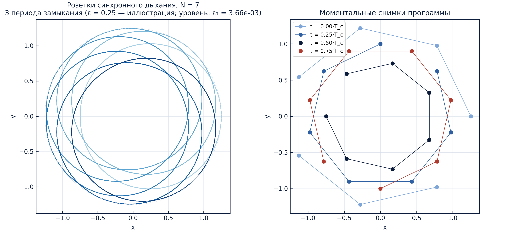
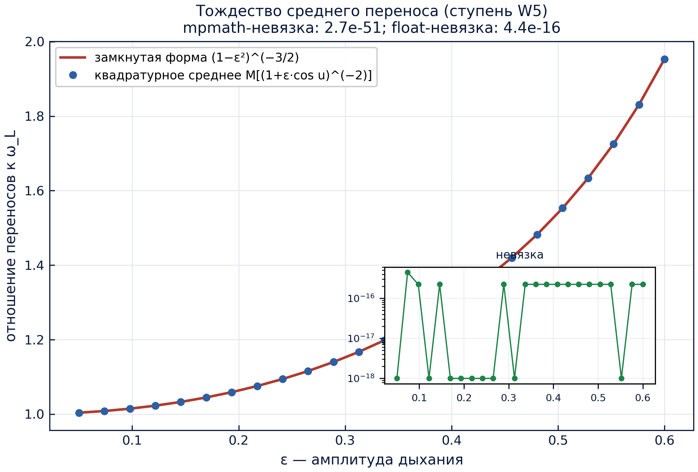
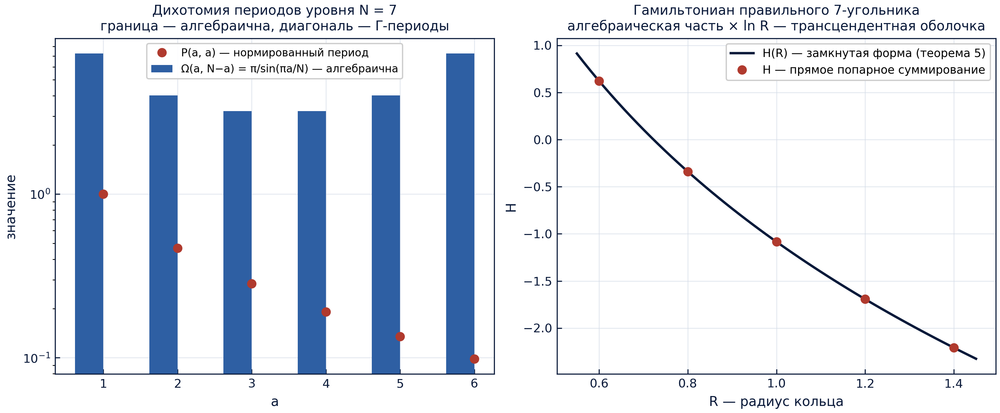

<!-- markdownlint-disable-file MD041 -->
<div align="center">

<!-- ══════════════════════════════════════════════════════════════ -->
<!-- CYCLORING — монументальная тёмно-синяя шапка с золотом          -->
<!-- ══════════════════════════════════════════════════════════════ -->


### Лаборатория Γ-периодов кольца

**Самодостаточная мини-исследовательская программа в составе TRIVORTEX:**
правильное N-вихревое кольцо как алгебраический объект — корневая система
одного двучлена — с угловыми фазами на циклотомической решётке и радиальной
модуляцией, порождаемой Γ-периодами через конечную цепочку дефектов.
Программа несёт собственные коды, собственную верификационную лестницу,
собственные протоколы, собственные графики и собственные двуязычные
монографии.


**[Исаев Исхак Хамзатович](https://orcid.org/0009-0003-7299-0701)** · ORCID `0009-0003-7299-0701` · независимый исследователь

[🧭 Родительский фреймворк](../README.md) · [🔬 Исследовательская программа](../research/README.md) · [🏛 Читальный зал](../publications/README.md) · [🧪 Верификация](../verification/README.md)

<!-- ROW 1 — STATUS -->
[](https://github.com/wild8highlander/Trivortex/actions/workflows/ci.yml)
[](https://github.com/wild8highlander/Trivortex/actions/workflows/lint.yml)
[](tests/)
[](results/protocols/)

<!-- ROW 2 — IDENTITY -->
[](CHANGELOG.md)
[](../LICENSE.md)
[](../pyproject.toml)
[](../pyproject.toml)
[](python/cycloring/periods.py)

<!-- ROW 3 — SCHOLARLY PAYLOAD -->
[](docs/monograph/)
[](docs/monographs/)
[](figures/)
[](results/protocols/)

</div>

---

## Оглавление

1. [Что это](#1-что-это)
2. [Математика — пять теорем, одно кольцо](#2-математика--пять-теорем-одно-кольцо)
3. [Лестница W — семь зарегистрированных ступеней](#3-лестница-w--семь-зарегистрированных-ступеней)
4. [Зарегистрированная таблица уровней](#4-зарегистрированная-таблица-уровней)
5. [Галерея графиков](#5-галерея-графиков)
6. [Публикационный стек](#6-публикационный-стек)
7. [Быстрый старт](#7-быстрый-старт)
8. [Структура](#8-структура)
9. [Путеводитель по модулям](#9-путеводитель-по-модулям)
10. [Тестовый гард — 37 тестов](#10-тестовый-гард--37-тестов)
11. [Отношение к родительскому фреймворку](#11-отношение-к-родительскому-фреймворку)
12. [Протокол воспроизведения](#12-протокол-воспроизведения)
13. [Заметки честности](#13-заметки-честности)
14. [ЧаВо](#14-чаво)
15. [Дорожная карта мини-исследования](#15-дорожная-карта-мини-исследования)

---

## 1. Что это

Программа исходит из **замороженного правильного N-угольника одинаковых
точечных вихрей** — жёсткого относительного равновесия, вращающегося со
скоростью $\omega_L = \Gamma(N-1)/(4\pi R^2)$ — и задаёт один точный
вопрос: **можно ли всю дыхательную динамику кольца прочитать из конечного
набора периодов уровня?** Собранный здесь ответ — *да*, и собран он как
машинно-проверяемая лестница, а не как проза. Конфигурационное
пространство кольца, его область периодов, его модуляционная программа и
его закон замыкания оказываются четырьмя взглядами на один алгебраический
объект, и каждое количественное утверждение программы пришито к
закоммиченному JSON-протоколу, который CI пере-выводит на каждый push.

Механизм доставки тот же, что у родительского
[TRIVORTEX](../README.md): исполняемая, привязанная к протоколам
лаборатория без ни одного незарегистрированного числа. Четыре регистра
несут науку:

1. **Кольцо — корневая система (теорема 1).** Дышащая конфигурация —
   это в точности полный набор корней одного двучлена $z^N = \sigma(t)$;
   группа Галуа циклотомического поля действует на неё релябелингом
   вихрей.
2. **Область периодов имеет алгебраическую границу (теорема 2).** Каждый
   граничный период равен $\pi/\sin(\pi a/N)$ — алгебраическому кратному
   π, — а внутренние периоды суть подлинные Γ-трансцендентности.
3. **Цепочка дефектов — трансдьюсер периодов (теорема 3).** Конечная
   цепочка дефектов переводит тройку уровня $(N, B, \lambda_0)$ в
   модуляционную программу дыхания $\varepsilon$, $\nu$, $C_N$.
4. **Синхронное дыхание замыкается точно (теорема 4).** Замороженный
   закон переноса имеет среднее по циклу, которое, скомпенсированное
   угловой частотой, возвращает всю конфигурацию через $T_c = 2\pi/\nu$.

Вокруг этих четырёх регистров мини-исследование везёт публикационный стек
из пяти теорем на двух языках, семиступенчатую верификационную лестницу с
закоммиченными протоколами, гард из 37 тестов, двуязычную фабрику
300-dpi графиков и детерминированный раннер — всё то, что делает
родительский фреймворк, в масштабе одного кольца.

---

## 2. Математика — пять теорем, одно кольцо

### 2.1 Теорема 1 — кольцо есть корневая система

Зафиксируем уровень $N$ и запишем дышащую конфигурацию как

$z_k(t) = r(t)\,\zeta_N^k\, e^{i\nu t}, \qquad k = 0,\dots,N-1,$

где $\zeta_N = e^{2\pi i/N}$, а $r(t)$ — общий дыхательный радиус. Тогда
$\{z_k(t)\}$ — **в точности полный набор корней** двучлена

$z^N = \sigma(t), \qquad \sigma(t) = r(t)^N e^{iN\nu t}.$

Три следствия читаются сразу и сертифицируются ступенью W3:

- **суммы степеней исчезают ниже вершины:**
  $S_m = \sum_k z_k^m = 0$ при $1 \le m < N$ и $S_N = N\sigma$ — фильтр
  корней из единицы в чистейшем виде;
- **линейный импульс тождественно нулевой:**
  $P = \sum_k \Gamma\,\mathrm{Re}\,z_k = Q = 0$ при любом $t$ — дышащее
  кольцо свободно от трансляций;
- **группа Галуа есть группа релябелинга:**
  $\mathrm{Gal}(\mathbb{Q}(\zeta_N)/\mathbb{Q}) \cong (\mathbb{Z}/N)^\times$
  действует на кольцо заменой $\zeta_N \mapsto \zeta_N^a$, то есть
  перестановкой вихрей — решётка характеров $\widehat\mu_N$ **и есть**
  модовое разложение кольца.

Теорема почти ничего не стоит в формулировке и является дешёвейшей целью
формализации (пункт дорожной карты **C1**): полиномиальная алгебра над
циклотомическим полем без какой-либо анализа.

### 2.2 Теорема 2 — алгебраическая граница области периодов

Определим Γ-период уровня равенством

$\Omega_{a,b} = \frac{\Gamma(a/N)\,\Gamma(b/N)}{\Gamma((a+b)/N)}, \qquad a, b \ge 1.$

Тождество отражения $\Gamma(z)\Gamma(1-z) = \pi/\sin(\pi z)$ при
$a + b = N$ схлопывает пару к виду

$\boxed{\ \Omega_{a,N-a} = \frac{\pi}{\sin(\pi a/N)}\ }$

— **каждый граничный период есть алгебраическое кратное π**, тогда как
каждый внутренний период ($a + b \ne N$) — подлинная трансцендентность
Γ-типа. Алгебраический хребет конструкции дополняет синусное произведение

$\prod_{m=1}^{N-1} 2\sin\frac{\pi m}{N} = N,$

которое ступень W2 сертифицирует на уровне $10^{-49}$ вместе с граничным
тождеством. Дихотомия «алгебраичная граница против трансцендентной
внутренности» — то, что теорема 5 ниже превращает в утверждение об
наблюдаемых.

### 2.3 Теорема 3 — цепочка дефектов как трансдьюсер периодов

Из тройки уровня $(N, B, \lambda_0)$ — уровень, угловой импульс
$B = N\Gamma R_0^2$, замороженная частота
$\lambda_0 = \Gamma(N-1)/(4\pi R_0^2)$ — цепочка дефектов производит
модуляционную программу за пять детерминированных шагов:

| шаг | величина | формула |
|-----|----------|---------|
| 1 | элементарный дефект | $\delta = \pi/N$ |
| 2 | число дефектов | $k = \lceil B\lambda_0/\Gamma^2 \rceil$ |
| 3 | веса дефектов | $\gamma = \delta^4/k$, $\delta_{eff} = \delta^5/k$ |
| 4 | нормированная диагональная сумма | $W_N = \sum_a P(a,a)$ |
| 5 | дискриминант уровня | $\Delta_{Ch} = \gamma\, W_N/(N-1)$ |

а трансдьюсер переводит $\Delta_{Ch}$ в программу дыхания:

$\varepsilon = \frac{\Delta}{1+\Delta}, \qquad \nu = \omega_L\,\frac{(1+\Delta)^3}{(1+2\Delta)^{3/2}} = \omega_L\,(1-\varepsilon^2)^{-3/2}, \qquad C_N = \ln\!\frac{1}{\varepsilon} = -\ln\varepsilon.$

Классический предел $\Delta \to 0$ возвращает жёсткое кольцо:
$\varepsilon\to 0$ и $\nu \to \omega_L$. Ступень W7 сертифицирует всю
цепочку на уровнях $N = 7, 9, 15, 30$ и монотонный порядок $\gamma$ на
$N = 3..30$.

### 2.4 Теорема 4 — синхронное дыхание замыкается точно

При замороженном законе переноса $\Lambda_0/r(t)^2$ среднее по циклу от
одного полного дыхательного периода удовлетворяет интегральному
тождеству

$\Big\langle (1+\varepsilon\cos u)^{-2} \Big\rangle = \frac{1}{2\pi}\int_0^{2\pi}\frac{du}{(1+\varepsilon\cos u)^2} = (1-\varepsilon^2)^{-3/2}.$

Выбор угловой частоты $\nu$ **в точности равным этому среднему** (что и
делает трансдьюсер теоремы 3) заставляет каждый вихрь ехать по замкнутой
розетке: угловой отставание, накопленное за один дыхательный период, —
ровно $2\pi$, и вся конфигурация возвращается через время замыкания

$T_c = \frac{2\pi}{\nu}.$

Ступень W6 пришивает невязку замыкания уровня $N = 7$ к
$3.1\times10^{-16}$ — машинный ноль — и невязку жёсткости формы к
$4.4\times10^{-16}$. Это точное утверждение, поднимающее кинематическую
картинку от «качественных розеток» до сертифицированного утверждения о
периодической орбите.

### 2.5 Теорема 5 — дихотомия инвариантов

Алгебраичность границы распространяется на наблюдаемые. Произведение
попарных расстояний и дискриминант замороженного многоугольника
**алгебраичны**:

$\prod_{i<j} |z_i - z_j|^2 = N^N \sigma^{N-1},$

а гамильтониан несёт **трансцендентную оболочку** поверх алгебраического
ядра:

$H(R) = -\frac{\Gamma^2}{2\pi}\left[\frac{N(N-1)}{2}\ln R + \frac{N}{2}\ln N\right]$

— в куске $\ln R$ и прячутся Γ-трансцендентности, а замкнутая форма
совпадает с прямым попарным суммированием точно (ступень W4,
$h_{closed\_form\_error} = 0$). Кольцо алгебраично по форме и
трансцендентно по энергии — одна дихотомия, два регистра, оба пришиты к
протоколам.

---

## 3. Лестница W — семь зарегистрированных ступеней

Лестница — независимый приёмочный слой мини-исследования. Каждая ступень
несёт зарегистрированный допуск, закоммиченный **до** записанного прогона,
и каждый прогон пишет детерминированный JSON-протокол в
[`results/protocols/`](results/protocols/) с полным снимком параметров.
Закоммиченные протоколы пресета default:

| ступень | регистр | зарегистрированный допуск | записанный результат | статус |
|---------|---------|---------------------------|----------------------|:------:|
| **W1** | ядро периодов: тождество отражения, $P(1,1)=1$, симметрия | $\le 10^{-30}$ | $5.1\times10^{-49}$ | PASS |
| **W2** | алгебраическая граница $\Omega_{a,N-a} = \pi/\sin(\pi a/N)$ + синусное произведение | $\le 10^{-30}$ | $5.1\times10^{-49}$ | PASS |
| **W3** | корневая система: тождество $z^N - \sigma$, моменты, импульс | $\le 10^{-9}$ | $6.4\times10^{-11}$ (худший уровень) | PASS |
| **W4** | поток кольца: жёсткое вращение, форма, инварианты, форма $H$ | $\le 10^{-9}$ скорость; $\le 10^{-12}$ дрейфы | $1.4\times10^{-12}$; $1.7\times10^{-14}$ | PASS |
| **W5** | тождество переноса + точный сдвиг фазы $2\pi$ | $\le 10^{-30}$ mp; $\le 10^{-12}$ float | $2.7\times10^{-51}$; $1.8\times10^{-15}$ | PASS |
| **W6** | синхронное замыкание розеток | $\le 10^{-12}$ | $3.1\times10^{-16}$ | PASS |
| **W7** | таблица трансдьюсера уровней $N = 7, 9, 15, 30$ | порядок + обратный ход | таблица §4, все строки | PASS |

Вычислительные регистры строгие: слой mpmath работает с **50 рабочими
знаками** (допуск тождеств $10^{-30}$), слой динамики использует **RK4**
(допуск скорости $10^{-9}$, дрейфы инвариантов $10^{-12}$). Зелёная
проверка — утверждение, удержанное в опубликованной полосе; красная
проверка — сломанное утверждение, а не шумное измерение. Тот же принцип
регистрации, что и у лестницы V1–V4 родительского фреймворка.

Каждый протокол пере-выводится одной командой (`make ladder`) и
перепроверяется pytest-гардом на каждом прогоне CI. Протоколы
ключуются пресетом: `default` — закоммиченный пресет, `quick` и `full`
пере-выводят те же регистры с грубейшим/тончайшим интегрированием для
дыма и релизной валидации соответственно.

---

## 4. Зарегистрированная таблица уровней

Выход ступени W7 пресета default — таблица трансдьюсера четырёх
зарегистрированных уровней. Это числа, которые цитируют монографии,
каждое пришито к своему протоколу:

| $N$ | $k$ | $W_N$ | $\Delta_{Ch}$ | $\varepsilon_N$ | $\nu/\omega_L$ | $C_N$ |
|----:|----:|-------:|---------:|---------:|---------:|------:|
| 7 | 4 | 2.175445 | $3.677\times10^{-3}$ | $3.664\times10^{-3}$ | 1.0000201 | 5.609 |
| 9 | 6 | 2.416452 | $7.474\times10^{-4}$ | $7.469\times10^{-4}$ | 1.0000008 | 7.200 |
| 15 | 17 | 2.915447 | $2.357\times10^{-5}$ | $2.357\times10^{-5}$ | 1.0000000 | 10.656 |
| 30 | 70 | 3.603649 | $2.135\times10^{-7}$ | $2.135\times10^{-7}$ | 1.0000000 | 15.360 |

Жёсткость быстро растёт с уровнем: на просканированном диапазоне
$N = 3..30$ амплитуда дыхания падает по степенному закону

$\Delta_{Ch}(N) \approx 1.7\times10^{3}\, N^{-6.7},$

то есть **высокие циклотомические уровни — жёсткие кольца, низкие —
дышат**. Степенной закон — численная аппроксимация, а не асимптотическая
теорема; доказана только монотонность γ (см. [§13](#13-заметки-честности)).

<div align="center">

</div>

---

## 5. Галерея графиков

Все графики генерируются в **300 dpi** привязанной к протоколам фабрикой
[`python/cycloring/figures.py`](python/cycloring/figures.py) и
перегенерируются командой `make figures`. Репозиторий везёт **две
языковые редакции** полного набора: английскую основную в
[`figures/`](figures/) и русское зеркало в [`figures/ru/`](figures/ru/) —
одна дисциплина пикселей, два языка.

| график | ступени | что показывает |
|--------|:------:|-----------------|
| [`fig01_periods_lattice.png`](figures/ru/fig01_periods_lattice.png) | W1, W2 | поле периодов $\log_{10}\Omega(a,b)$ при $N=15$ и алгебраическая граница $\pi/\sin(\pi a/N)$ |
| [`fig02_transducer.png`](figures/ru/fig02_transducer.png) | W7 | цепочка дефектов по уровням со степенным законом; амплитуда и логарифмическая жёсткость |
| [`fig03_breathing.png`](figures/ru/fig03_breathing.png) | W6 | розетки синхронного дыхания семи вихрей и снимки четвертных фаз |
| [`fig04_transport_law.png`](figures/ru/fig04_transport_law.png) | W5 | тождество среднего переноса: квадратурное среднее против замкнутой формы $(1-\varepsilon^2)^{-3/2}$ |
| [`fig05_dichotomy.png`](figures/ru/fig05_dichotomy.png) | W2–W4 | дихотомия периодов при $N=7$; замкнутая форма гамильтониана против прямого суммирования |
| [`scheme_cycloring.svg`](figures/ru/scheme_cycloring.svg) | — | архитектура исследования: тройка → цепочка → дискриминант → трансдьюсер → дыхание |

<div align="center">

**Поле периодов и его алгебраическая граница (W1–W2)**


**Розетки синхронного дыхания (W6)**



**Тождество среднего переноса (W5)**



**Дихотомия инвариантов (W2–W4)**



</div>

Каждый график вписывает невязки своего протокола в заголовок — картинки
цитируют те же числа, которые сертифицируют протоколы, и никогда
независимые.

---

## 6. Публикационный стек

Публикационный стек моделирован один-к-одному на родительский
репозиторий: каждый документ существует на русском и английском как
отдельный файл, каждый — в вёрстке PDF и редактируемом DOCX. Каждый
документ встраивает графики и цитирует только числа, привязанные к
протоколам.

| издание | языки | форматы | где |
|---------|-------|---------|-----|
| большая исследовательская монография | RU, EN | `.md`, `.docx`, `.pdf` | [`docs/monograph/`](docs/monograph/) |
| Теорема 1 — корневая система кольца | RU, EN | `.docx`, `.pdf` | [`docs/monographs/`](docs/monographs/) |
| Теорема 2 — алгебраическая граница области периодов | RU, EN | `.docx`, `.pdf` | [`docs/monographs/`](docs/monographs/) |
| Теорема 3 — трансдьюсер периодов | RU, EN | `.docx`, `.pdf` | [`docs/monographs/`](docs/monographs/) |
| Теорема 4 — синхронное дыхание | RU, EN | `.docx`, `.pdf` | [`docs/monographs/`](docs/monographs/) |
| Теорема 5 — дихотомия инвариантов | RU, EN | `.docx`, `.pdf` | [`docs/monographs/`](docs/monographs/) |
| графики (fig01–fig05 + схема), две редакции | EN, RU | `.png` 300 dpi, `.svg` | [`figures/`](figures/) |

DOCX несут полноценные полевые оглавления; PDF — рендер того же DOCX
через LibreOffice — конвейер родительского репозитория, поэтому оба стека
типографически идентичны.

---

## 7. Быстрый старт

Требования: Python ≥ 3.10 с `numpy`, `mpmath`, `matplotlib` (только
графики) и `pytest` (только гард). Из корня мини-исследования:

```bash
cd cycloring

make ladder   # прогнать W1..W7 (пресет default), обновить JSON-протоколы
make quick    # быстрый дым всей лестницы (пресет quick)
make full     # длинное интегрирование (пресет full)
make figures  # перегенерировать figures/ — EN-основная + RU-зеркало (figures/ru/)
make test     # pytest-гард (37 тестов)
make lint     # black --check + ruff + mypy (скоуп мини-исследования)
```

Раннер умеет адресовать отдельную ступень:

```bash
PYTHONPATH=python python3 python/cycloring/runner.py --stage W5 --preset default
```

Пресеты обменивают усилие интегрирования на время:

| пресет | что делает | типичное время | кто использует |
|--------|------------|----------------|----------------|
| `quick` | грубый дым всех семи ступеней | ≈ 1 с | CI, итерации |
| `default` | закоммиченный протокольный пресет | ≈ 10 с | протоколы, тесты |
| `full` | длинное интегрирование, жёсткие допуски | ≈ 60 с | релизная валидация |

Python-API в одном импорте:

```python
import sys; sys.path.insert(0, "python")

from cycloring import chain, periods, ring

# трансдьюсер уровня N = 7 одним вызовом
program = chain.transduce(7)
print(program["eps"], program["nu_ratio"], program["c_log"])

# граничные периоды алгебраичны: Omega(a, N-a) = pi / sin(pi a / N)
from mpmath import mp, sin, pi
mp.dps = 50
print(periods.boundary_period(2, 15) == pi / sin(2 * pi / 15))  # точно на 50 знаках
```

---

## 8. Структура

```text
cycloring/
├── README.md            ← английская основная версия
├── README_RU.md         ← этот файл
├── CHANGELOG.md         ← changelog мини-исследования
├── Makefile             ← ladder / quick / full / figures / test / lint
├── docs/
│   ├── monograph/       ← БОЛЬШАЯ МОНОГРАФИЯ: monograph_RU|EN.{md,docx,pdf}
│   └── monographs/      ← ТЕОРЕМНОЕ ИЗДАНИЕ: теоремы 1–5
│                          (CYCLORING-Theorem{k}_{RU,EN}.docx / .pdf, 20 файлов)
├── figures/             ← АНГЛИЙСКИЙ основной набор: fig01–fig05 (300 dpi PNG)
│   │                       + scheme_cycloring.svg — генерируются `make figures`
│   └── ru/              ← РУССКОЕ зеркальное множество (те же пять графиков + схема)
├── python/cycloring/
│   ├── periods.py       ← ядро Γ-периодов (mpmath)
│   ├── chain.py         ← цепочка дефектов + трансдьюсер
│   ├── ring.py          ← корневая система, характеры, программа дыхания
│   ├── dynamics.py      ← слой Кирхгофа: RHS, RK4, H/P/Q/I, якобиан
│   ├── ladder.py        ← проверки W1..W7
│   ├── runner.py        ← JSON-протокольный CLI
│   └── figures.py       ← двуязычная фабрика графиков (EN + RU, 300 dpi)
├── tests/               ← pytest-гард (37 тестов)
└── results/protocols/   ← закоммиченные JSON-протоколы (пресет default)
```

Каждая подпапка несёт собственный README с локальным API, индексом
файлов и инструкциями перегенерации — начните с
[`python/cycloring/`](python/cycloring/).

---

## 9. Путеводитель по модулям

Восемь модулей, ≈ 1.9 kLOC, ноль зависимостей сверх `numpy` + `mpmath`:

| модуль | строки | роль | ключевые точки входа |
|--------|-------:|------|----------------------|
| [`periods.py`](python/cycloring/periods.py) | 157 | ядро Γ-периодов на 50 знаках | `omega`, `boundary_period`, `boundary_periods_mp`, `normalized_p` |
| [`chain.py`](python/cycloring/chain.py) | 5.3 КБ | цепочка дефектов и трансдьюсер | `defect_chain`, `transduce` |
| [`ring.py`](python/cycloring/ring.py) | 217 | корневая система, характеры, программа дыхания | `polygon_positions`, `synchronous_frequency`, `rosette_curve`, `mean_transport_ratio` |
| [`dynamics.py`](python/cycloring/dynamics.py) | 172 | слой Кирхгофа | `rhs`, `rk4_step`, `invariants`, `jacobian`, `hamiltonian_closed_form` |
| [`ladder.py`](python/cycloring/ladder.py) | 454 | зарегистрированные проверки W1–W7 | `run_stage`, `run_ladder` |
| [`runner.py`](python/cycloring/runner.py) | 77 | JSON-протокольный CLI | `--stage`, `--preset` |
| [`figures.py`](python/cycloring/figures.py) | 473 | двуязычная фабрика графиков | `main`, `--lang both/en/ru` |
| [`__init__.py`](python/cycloring/__init__.py) | — | поверхность пакета | ре-экспорт публичного API |

Направление зависимостей строгое: `periods → chain → ring → dynamics →
ladder → runner/figures`. Ничто в пакете не импортирует родительский
фреймворк во время исполнения — родитель появляется только в тестах как
эталонный оракул (см. [§11](#11-отношение-к-родительскому-фреймворку)).

---

## 10. Тестовый гард — 37 тестов

Pytest-гард пере-выводит каждое не зависящее от пресета число лестницы и
пришивает пресет-зависимые к закоммиченным протоколам:

| набор | тесты | что охраняют |
|-------|------:|---------------|
| `test_cr_periods.py` | 7 | тождество отражения, $P(1,1)=1$, симметрия, граничные значения на 50 знаках |
| `test_cr_chain.py` | 10 | цепочка дефектов, трансдьюсер, строки таблицы уровней, монотонный порядок |
| `test_cr_dynamics.py` | 10 | RHS Кирхгофа, инварианты, замкнутая форма гамильтониана, программа розеток |
| `test_cr_ladder.py` | 10 | сами ступени лестницы + форма и статус закоммиченных протоколов |

Запуск: `make test` или `python3 -m pytest tests/ -v`. Гарду нужны
только `numpy`, `mpmath` и `pytest` — тот же dependency-минимум, что и у
CI, поэтому зелёный гард на вашем ноутбуке — тот же зелёный гард в CI.

---

## 11. Отношение к родительскому фреймворку

Мини-исследование сознательно самодостаточно, но не изолировано: его
регистры обобщают верификационную лестницу родителя и питают пункты его
дорожной карты.

| регистр / пункт родителя | здесь | примечание |
|---------------------------|-------|------------|
| V2 (жёсткое вращение Лагранжа) | W4 | то же $\omega_L$, измеренное на замороженном N-угольнике |
| V3/V4 (сохранение инвариантов) | W4 | $H, P, Q, I$ сохраняются вдоль потока многоугольника |
| дорожная карта **T1** (кольцо N-угольника) | Теорема 1 + W3 | алгебраическая тень: корни, моменты, импульс |
| дорожная карта **T3** (спектральная устойчивость) | `dynamics.jacobian` | спектральная диагностика замороженного кольца |
| дорожная карта **T5** (допустимая область) | Теорема 2 | алгебраическая граница области периодов |
| мультиязычные порты | `tests/` | та же дисциплина пришивки, мини-масштаб |

Родительский фреймворк ничего не импортирует отсюда, и это
мини-исследование не импортирует ничего из родителя во время исполнения;
pytest-гард — единственное место, где два дерева соприкасаются, — в
точности как родитель обращается со своими языковыми портами: независимые
оракулы, пришитые закоммиченными числами.

---

## 12. Протокол воспроизведения

Чтобы воспроизвести каждое число этого README с нуля:

1. **клонировать и войти** — `git clone https://github.com/wild8highlander/Trivortex.git && cd Trivortex/cycloring`;
2. **прогнать лестницу** — `make ladder`; семь JSON-протоколов в
   `results/protocols/` перегенерируются байт-в-байт (детерминированные
   прогоны, никаких полей настенных часов в числах);
3. **перегенерировать графики** — `make figures`; фабрика читает
   закоммиченные протоколы и пересобирает обе языковые редакции;
4. **прогнать гард** — `make test`; 37 тестов пере-выводят
   пресет-независимые регистры и пришивают остальные к протоколам;
5. **сравнить** — каждое число из [§3](#3-лестница-w--семь-зарегистрированных-ступеней)
   и [§4](#4-зарегистрированная-таблица-уровней) должно совпасть с вашим
   прогоном до напечатанной точности; расхождение — баг: откройте issue с
   приложенным JSON-протоколом.

Весь цикл занимает заведомо меньше минуты на ноутбуке; слой mpmath —
единственная вычислительно тяжёлая часть, ограниченная 50-значной
рабочей точностью.

---

## 13. Заметки честности

- Программа дыхания — **кинематическая программа**: у замороженного
  многоугольника нет радиальной скорости в кирхгофовском поле (попарные
  сокращения), поэтому радиальную подпитку обязан поставлять насос;
  угловой же транспорт не предписывается, а следует замороженному закону
  $\Lambda_0/r(t)^2$ — именно поэтому тождество переноса и синхронное
  замыкание — точные утверждения, а не приближения.
- Внутренние периоды $\Omega(a,b)$ при $a + b \ne N$ трактуются как
  трансцендентные константы Γ-типа; никакая алгебраическая редукция для
  них не утверждается и нигде в цепочке не используется — цепочка
  потребляет только нормированные диагональные суммы $W_N$ и
  алгебраические граничные значения.
- Степенной закон $\Delta_{Ch}(N) \approx 1.7\times10^{3} N^{-6.7}$ —
  численная аппроксимация на $N = 3..30$, а не асимптотическая теорема;
  доказана только монотонность $\gamma$.
- Все динамические регистры — RK4 с допусками [§3](#3-лестница-w--семь-зарегистрированных-ступеней);
  спектральные регистры якобиана используются лишь как диагностика —
  лестница не заявляет нелинейных результатов об устойчивости.

---

## 14. ЧаВо

**В: Что такое «Γ-период» и почему кольцу до него дело?**
Период уровня $\Omega_{a,b}$ — отношение гамма-функций Эйлера в
рациональных точках — естественная трансцендентная константа
циклотомической постановки. Граничные периоды схлопываются в алгебраические
кратные π, а диагональные суммы $W_N$ входят в цепочку дефектов как её
единственный трансцендентный вход. Дыхательная программа кольца буквально
есть функция этих констант — отсюда и *лаборатория Γ-периодов кольца*.

**В: Дыхание кольца — настоящая кирхгофовская орбита?**
Угловой транспорт — да (он точно следует замороженному закону), радиальная
программа — кинематическая: радиальную подпитку поставляет насос.
Синхронное замыкание (теорема 4) точное *при данном* замороженном законе —
утверждение касается переноса, а не механизма насоса. См.
[§13](#13-заметки-честности) о границе сертифицированного и записанного.

**В: С какого N начать?**
$N = 7$: наименьший зарегистрированный уровень, его строка таблицы пришита
к протоколу, а его розетки — обложечная картинка
([`fig03`](figures/ru/fig03_breathing.png)). Для жёстких, почти
твёрдых колец сканируйте вверх до $N = 15, 30$ и наблюдайте, как
$\Delta_{Ch}$ падает на шесть порядков.

**В: Чем отличаются EN- и RU-редакции графиков?**
Только языком: фабрика перегенерирует те же пять графиков + схему дважды
(`figures/` — английский, `figures/ru/` — русский) из одних и тех же
протоколов, с одинаковыми числами, палитрами и компоновкой. README
встраивают свои соответствующие редакции.

**В: Можно ли добавить новый уровень в таблицу?**
Да — `chain.transduce(n)` работает при любом $N \ge 3$, а ступень W7
принимает список уровней параметром. Если регистрируете новый уровень,
добавьте его в протокол *до* прогона и держите правило цитирования
монографий: только числа, привязанные к протоколам.

---

## 15. Дорожная карта мини-исследования

1. **C1 — формализовать теорему 1** (корневая система + фильтр корней из
   единицы) в Coq и Lean 4: чистая алгебра, самый дешёвый разрешимый
   объект.
2. **C2 — регистр отражения** (теорема 2) как сертификат интервальной
   арифметики на плотной сетке уровней.
3. **C3 — тождество переноса** (теорема 4) через дифференцированный
   интеграл Пуассона либо верифицированный квадратурный сертификат.
4. **C4 — расширение**: неравные циркуляции (когда деформированное кольцо
   сохраняет решётку периодов?), двухчастотные программы дыхания с
   $\Omega/\nu = P(a,b)$ и эксперимент со сдвигом характер-мод.

---

<div align="center">


**CYCLORING** · Лаборатория Γ-периодов кольца · **Версия 1.0.0** ·
часть исследовательской программы [TRIVORTEX](../README.md) ·
[DOI 10.5281/zenodo.21825394](https://doi.org/10.5281/zenodo.21825394) ·
[ORCID 0009-0003-7299-0701](https://orcid.org/0009-0003-7299-0701) ·
[Английское зеркало](README.md) · MMXXVI

</div>
