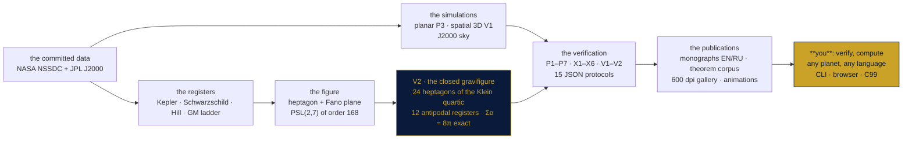

<!-- markdownlint-disable-file MD041 -->
<div align="center">

<!-- ══════════════════════════════════════════════════════════════ -->
<!-- PLANETVORTEX — monumental navy-and-gold header                 -->
<!-- ══════════════════════════════════════════════════════════════ -->


### The Planetary Gravity–Geometry Bench

**A self-contained mini-repository inside the TRIVORTEX framework:**
the solar system as a geometric figure — the seven wandering planets
as the points of the Fano plane, the Sun at the centre, the whole
structure lifted to the **Klein quartic**, whose 24 heptagons are the
**closed gravifigure**: 12 antipodal gravitational registers carrying
the exact mass ladder of the Sun, the eight planets, Ceres, Pluto and
Eris, with the budget closure $\sum\alpha_i = 8\pi$ holding *exactly* —
the Euler characteristic absorbs the mass ladder. Codes in **three
languages**, monographs in **two**, figures at **600 dpi**, and its own
P-ladder, hardcore X-register and spatial V-register — 15 committed
protocol-bound stages.


**[Isaev Iskhak Khamzatovich](https://orcid.org/0009-0003-7299-0701)** · ORCID `0009-0003-7299-0701` · Independent Researcher

[🧭 Parent framework](../README.md) · [🔬 The research program](../research/README.md) · [🏛 Reading room](../publications/README.md) · [🌀 The ring laboratory](../cycloring/README.md) · [⬡ The N-vortex bench](../polyvortex/README.md)

<!-- ROW 1 — STATUS -->
[](https://github.com/wild8highlander/Trivortex/actions/workflows/ci.yml)
[](https://github.com/wild8highlander/Trivortex/actions/workflows/lint.yml)
[](tests/)
[](results/protocols/)

<!-- ROW 2 — IDENTITY -->
[](CHANGELOG.md)
[](../LICENSE.md)
[](c/)
[](figures/600dpi/)

<!-- ROW 3 — SCHOLARLY PAYLOAD -->
[](docs/monograph/)
[](docs/theorems/)
[](docs/monographs/stages/)
[](results/protocols/)

</div>

---

## Table of contents

1. [What this is](#1-what-this-is)
2. [The mathematics — the formal corpus](#2-the-mathematics--the-formal-corpus)
3. [The P-ladder — seven registered stages](#3-the-p-ladder--seven-registered-stages)
4. [The X-register — the hardcore layer](#4-the-x-register--the-hardcore-layer)
5. [The V-register — the spatial turn: **V1** and the closed gravifigure **V2**](#5-the-v-register--the-spatial-turn)
6. [The 600 dpi gallery and the animations](#6-the-600-dpi-gallery-and-the-animations)
7. [**Verify it yourself** — three routes and the monograph generator](#7-verify-it-yourself)
8. [The publication stack](#8-the-publication-stack)
9. [Quickstart](#9-quickstart)
10. [Repository layout](#10-repository-layout)
11. [The module guide](#11-the-module-guide)
12. [The test guard — 80 tests](#12-the-test-guard--80-tests)
13. [Relation to the parent framework](#13-relation-to-the-parent-framework)
14. [The reproduction protocol](#14-the-reproduction-protocol)
15. [Honesty notes](#15-honesty-notes)
16. [FAQ](#16-faq)
17. [Roadmap of the mini-repository](#17-roadmap-of-the-mini-repository)

---

## 1. What this is

The parent framework anchors on **Theorem 3.1** — the closed-form
choreography of three vortices — and the sibling bench
[polyvortex](../polyvortex/README.md) lifted that picture to the
$N$-gon ring, finding the Havelock boundary exactly at
$N = 7\,|\,8$. This mini-repository asks the next question of the same
geometry: **what happens when the heptagon is not a ring of vortices
but the gravitational figure of the solar system itself?**



The bench measures exactly where the layers of the model touch:

- **Layer N + P** — the Newtonian planetary dynamics (numeric): the
  full Sun + 8-planets integration (planar, stage P3; spatial 3D from
  the real J2000 sky, stage V1), the two-body Kepler registers with
  the mass correction, the osculating elements, the conservation laws,
  and the gravity ladder $\delta_i = \log_{10}(\mathrm{GM}_i/\mathrm{GM}_\oplus)$
  bound to the committed NASA register;
- **Layer F + V** — the exact figure and its vortices (analytic +
  numeric): the closed-form dimensions of the heptagonal figure —
  every Fano line is the congruent triangle with angles
  $(\pi/7,\, 2\pi/7,\, 4\pi/7)$ and area $R^2\sqrt{7}/4$ — the rigid
  heptagon lattice of seven Kirchhoff vortices, and the seven
  integrable three-vortex Trivortex cells riding it;
- **Layer K (new in 2.0)** — the **Klein quartic**: the full
  24-heptagon tessellation $\{7,3\}_8$ built as the coset geometry of
  the certified $\mathrm{PSL}(2,7)$, certified down to the
  $\mathrm{PGL}(2,7)$ flag action, grown chamber by chamber in the
  Poincaré disk, and decorated with the mass ladder of 12 bodies —
  with the exact budget closure (Theorem G).

The scientific payload is a 15-stage verification stack — the
P-ladder **P1–P7**, the hardcore X-register **X1–X6**, the spatial
V-register **V1–V2** — plus a publication stack modelled one-to-one on
the sibling benches: the research monograph
([`docs/monograph/`](docs/monograph/) — Russian and English, each in
Markdown, DOCX and PDF), the **theorem corpus with full proofs**
([`docs/theorems/`](docs/theorems/)), the theorem editions
([`docs/monographs/`](docs/monographs/) — nine statements × two
languages × two formats), the **per-stage point monographs**
([`docs/monographs/stages/`](docs/monographs/stages/) — 15 × 2), the
**600 dpi gallery** ([`figures/600dpi/`](figures/600dpi/)) with the
animations, and the **monograph generator** — pick any bodies, get a
personal monograph in MD/DOCX/PDF.

> [!IMPORTANT]
> Every number in this README is bound to a committed JSON protocol in
> [`results/protocols/`](results/protocols/) — the tolerance was
> committed **before** the recorded run, and CI re-derives the whole
> stack on every push. [§7](#7-verify-it-yourself) shows how to
> re-derive it yourself in under a minute.

The bench never imports the parent or the sibling at runtime; the
sibling's ladder appears only in the tests, as the reference oracle —
the same pinning discipline the whole framework applies to its ports.

---

## 2. The mathematics — the formal corpus

The full statements **with proofs** live in
[`docs/theorems/`](docs/theorems/) (EN + RU); the point monographs in
[`docs/monographs/`](docs/monographs/). The headline results:

### 2.1 Theorem A — the exact dimensions of the figure

Draw the Fano plane on a regular heptagon of circumradius $R$: the
seven lines $\{i, i+1, i+3\} \pmod 7$ are then the congruent scalene
triangles with interior angles $(\pi/7,\ 2\pi/7,\ 4\pi/7)$, sides
$s_k = 2R\sin\frac{k\pi}{7}$ — one chord of each class — and the exact
area $\Delta = \frac{\sqrt{7}}{4}R^2 = 0.6614378277661476\ldots\,R^2$
by the classical identity
$\sin\frac{\pi}{7}\sin\frac{2\pi}{7}\sin\frac{3\pi}{7} = \frac{\sqrt{7}}{8}$.
The chord product carries the same field: $s_1 s_2 s_3 = R^3\sqrt{7}$.
At the registered scale $R = 1$ AU: $s_1 = 0.8677674782351162$,
$s_2 = 1.5636629649360596$, $s_3 = 1.9498558243636472$ AU — pinned to
30 decimal places by stage P1.

### 2.2 Theorems B, C — the seven equal cells and the rigid lattice

Place seven equal vortices $\Gamma$ at the vertices: every Fano
line-cell carries exactly the same Hamiltonian
$H_{cell} = -\frac{\Gamma^2}{2\pi}\ln(\sqrt{7}\,R^3)$ and the same
invariants — the seven shape cycles are periodic with spread exactly
$0.0$ (stage P6). The full ring rotates rigidly at
$\omega_7 = \frac{3\Gamma}{2\pi R^2}$ (measured to $1.3\times10^{-12}$)
and is **Havelock-stable** — exactly the $N = 7$ row of the sibling
bench's stability scan, the last stable level (stage P5).

### 2.3 Lemma D, Lemma E — the Kepler register and the mass-ladder deficit

The corrected register $T^2 a^{-3}(1 + m/M_\odot)$ is the same
constant for all eight planets to $6.2\times10^{-13}$, while the
uncorrected one misses by the physical signature $m_i/2M_\odot$
(stage P2). The gravity ladder spans $-1.26$ to $+2.50$ dex and breaks
the mass-blind symmetry of the figure: the line sums spread over
**6.71 dex** — measured, not hidden (stage P7).

### 2.4 Theorem F — the coset construction of the Klein map *(new)*

Let $G = \mathrm{PSL}(2,7)$ and let $(a, b)$ be any pair with
$a^2 = b^3 = (ab)^7 = 1$. The right cosets of
$X = \langle a\rangle$, $Y = \langle b\rangle$, $Z = \langle ab\rangle$
are the edges (84), vertices (56) and faces (24) of a regular map with
$V - E + F = -4$ (genus 3), 3-regular, 7-gonal, connected, orientable,
with a faithful $G$-action: the **Klein map** $\{7,3\}_8$, whose
orientation-preserving automorphism group hits the Hurwitz bound
$84(g-1) = 168$ exactly — and whose full flag action is the right
regular action of $\mathrm{PGL}(2,7)$ on 336 flags, certified on all
$336 \times 3$ wall moves.

### 2.5 Lemma F — the antipodal freeness *(new)*

The witness involution $a$ acts on the 24 faces **without fixed
points** (an order-2 element cannot lie in a conjugate of the order-7
face stabilizer) and therefore pairs them into **12 antipodal pairs**
— one pair per gravimetric register.

### 2.6 Theorem G — the budget closure, the capstone *(new)*

Let $s_i = \ln \mathrm{GM}_i - \langle \ln \mathrm{GM}\rangle$ over the
12 registered bodies. Then $\sum_i s_i = 0$ **exactly** (the
geometric-mean normalization), hence the vertex-angle register
$\alpha_i = \frac{2\pi}{3} - \sigma s_i$ satisfies
$\sum_i \alpha_i = 8\pi$ **exactly**, hence the decorated tessellation
closes on the Gauss–Bonnet budget of the Klein quartic:
$\sum_i 2A_i = \sum_i 2(5\pi - 7\alpha_i) = 8\pi = 2\pi(2g-2)$. The
exact per-register dimensions follow from the hyperbolic
right-triangle trigonometry:

$$
\cosh R_i = \cot\!\frac{\alpha_i}{2}\,\cot\!\frac{\pi}{7},
\qquad
\cosh\frac{\ell_i}{2} = \frac{\cos(\pi/7)}{\sin(\alpha_i/2)},
\qquad
A_i = 5\pi - 7\alpha_i ,
$$

and the monotonicity chain
$\ln \mathrm{GM}\uparrow \Rightarrow s\uparrow \Rightarrow \alpha\downarrow \Rightarrow A\uparrow$
says it plainly: **the heavier the body, the wider its heptagon.**

<div align="center">

**The closed gravifigure — the mass ladder drawn as geometry**


</div>

### 2.7 Lemma G, Proposition H — the arc register and the Euclidean ceiling *(new)*

The spatial tilt is registered by the exact arc
$\lambda_i = \bar{R}\,i_i$ ($\bar{R} = 1$ AU) — monotone in the J2000
inclination, with the tilt operator
$T = R_z(\Omega)R_x(i) \in SO(3)$ recovering the orbit normal to
$0.0$ error. The hyperbolicity of the tiling caps the light side:
$\alpha < \frac{5\pi}{7}$ leaves only $\frac{\pi}{21}$ of headroom
above the rigid angle — the lightest register (Ceres) sits at 95% of
the ceiling, recorded honestly as the budget's asymmetry.

---

## 3. The P-ladder — seven registered stages

Every stage carries a registered tolerance committed **before** the
recorded run, and every run writes a deterministic JSON protocol into
[`results/protocols/`](results/protocols/) with a full parameter
snapshot. The committed protocols of the default preset:

| stage | register | registered tolerance | recorded result | status |
|-------|----------|----------------------|-----------------|:------:|
| **P1** | the exact figure literals + the Kepler–Earth anchor | $\le 10^{-15}$ / $\le 10^{-4}$ | $0$ … $4.9\times10^{-16}$ / $9.7\times10^{-6}$ | PASS |
| **P2** | Kepler III of the two-body dynamics, 8 planets, mass-corrected | $\le 10^{-9}$ | $6.2\times10^{-13}$ (worst) | PASS |
| **P3** | the Sun + 8-planets N-body: conservation, elements, Kepler | $\le 10^{-9}$ / $\le 10^{-2}$ / $10^{-4}$ | $2.1\times10^{-13}$ / $4.9\times10^{-3}$ / $2.5\times10^{-5}$ | PASS |
| **P4** | the $\mathrm{PSL}(2,7)$ algebra: 168, 24/24, pair axiom, isomorphism | exact / $\le 10^{-12}$ | exact / $6.7\times10^{-16}$ | PASS |
| **P5** | the heptagon lattice: $\omega_7$, invariants, Havelock $N = 7$ | $\le 10^{-9}$ / $10^{-12}$ / $10^{-7}$ | $1.3\times10^{-12}$ / $1.2\times10^{-14}$ / $7.0\times10^{-9}$ | PASS |
| **P6** | the seven cells: equal Hamiltonians, congruent shape cycles | $\le 10^{-12}$ / $10^{-6}$ | $9.1\times10^{-14}$ / $0.0$ spread | PASS |
| **P7** | the gravity bridge: Schwarzschild, Hill margins, diagnostics | $\le 10^{-12}$ / $\ge 3$ | $1.0\times10^{-16}$ / $5.08$ | PASS |

Stages P1–P2 certify the figure and the Kepler layer; stages P3–P4
certify the dynamics and the algebra; stages P5–P6 are the vortex
payload; stage P7 is the bridge that carries the gravity ladder into
the figure and records its honest deficit. The P-ladder *registers*
the science; the X-register of the next section *attacks* it.

---

## 4. The X-register — the hardcore layer

Where the P-ladder registers, the X-register attacks. Every stage
re-derives a load-bearing claim of the bench **by a second, independent
method** — brute-force enumeration wherever the objects are finite,
exact integer arithmetic wherever the statement is arithmetic, and a
numerical witness wherever a closed form could be quietly wrong. The
committed protocols of the default preset
([`results/protocols/X*_default.json`](results/protocols/)):

| stage | the attack | registered tolerance | recorded result | status |
|-------|-----------|----------------------|-----------------|:------:|
| **X1** | $\mathrm{PSL}(2,7)$ from nothing: all $2401$ matrices over $\mathbb{F}_7$ enumerated; $\vert\mathrm{GL}\vert = 2016$, $\vert\mathrm{SL}\vert = 336$, $\vert\mathrm{PSL}\vert = 168$; the class equation $1 + 21 + 42 + 56 + 24 + 24$; simplicity over all $32$ unions of classes | exact integers | exact; simple | PASS |
| **X2** | the two natural actions: 7 points — faithful, transitive, **conjugate in $S_7$ to the research model**; 8 points — 2-transitive, 3-homogeneous; the Sylow census $n_2 = 21$, $n_3 = 28$, $n_7 = 8$ | exact integers | exact; bridge found | PASS |
| **X3** | the $(2,3,7)$ triangle generation: **every** one of the $336$ pairs generates the whole group; the Klein relations; the Hurwitz arithmetic; the smoothness of the Klein quartic ($28(xyz)^3 = 0$ contradiction), genus 3 | exact integers | exact; $0$ non-generating | PASS |
| **X4** | the hyperbolic $\{7,3\}$ figure at 50 dps: the closed forms, the hyperbolic Pythagoras, the area ladder $\pi/42 \to \pi/3 \to 8\pi$, $3V = 7F = 2E$; the Poincaré-disk heptagon solved numerically as the witness | $10^{-48}$ / $10^{-9}$ | $3.2\times10^{-29}$ / $0.0$ and $1.1\times10^{-16}$ | PASS |
| **X5** | integrator certification: measured orders 2 (leapfrog) and 4 (Yoshida), time-reversibility, bounded symplectic energy with **no secular trend** against the RK4 control, the Laplace–Runge–Lenz vector | slopes $\pm 0.2$ / $5\times10^{-11}$ / trend $\le 0.1$ | $2.0004$, $3.995$ / $7.5\times10^{-12}$ / $0.006$ vs $0.99$ | PASS |
| **X6** | the GR bridge: the 1PN perihelion precession against the closed form; the Newtonian control at integrator zero; **Mercury $42.982''$/century against the textbook $42.98''$** | $5\times10^{-3}$ / $5\times10^{-8}$ | $4.6\times10^{-4}$ / $1.9\times10^{-10}$; anchor $5.3\times10^{-5}$ | PASS |

Three design rules make the layer hardcore rather than decorative.
First, **two models minimum**. Second, **closed forms meet independent
constructions**. Third, **controls run against the claims**.

---

## 5. The V-register — the spatial turn

The roadmap's two remaining posts, delivered in 2.0 as registered
stages with the same committed-tolerance discipline.

### 5.1 V1 — the spatial inclined registers

The figure is lifted from the ecliptic plane to the real inclined sky:

| register | what it certifies | recorded result (default preset) | status |
|----------|-------------------|----------------------------------|:------:|
| the SO(3) tilt algebra | $T = R_z(\Omega)R_x(i)$ orthogonal to $2.2\times10^{-16}$, $\det = 1$, the orbit normal recovered to $0.0$ | 11 bodies | PASS |
| the arc register $\lambda = \bar{R}\,i$ | exact, monotone; Earth $\approx 0$, Eris $44.04° \to 0.769$ rad | 11 bodies | PASS |
| the mutual-inclination matrix | 55 pairs; the extreme **Neptune–Eris at $44.25°$** | recorded | PASS |
| the 3D N-body (the real J2000 sky) | energy $2.1\times10^{-13}$; the vector $\mathbf{L}$ at $4.7\times10^{-15}$; Kepler III $1.0\times10^{-4}$ against the secular mean elements; the inclination drift $2.4\times10^{-5}$ rad over 12 yr | 12-yr window | PASS |
| the z-ladder | the out-of-ecliptic amplitude of every register, Neptune $0.61$ AU max | recorded | PASS |

<details>
<summary>**The inclination register of the 11 wandering bodies (expand)**</summary>

| body | $i$, deg | $\Omega$, deg | $\lambda = \bar{R}i$, rad |
|------|---------:|--------------:|--------------------------:|
| Earth | 0.00002 | −11.26064 | 0.0000003 |
| Uranus | 0.77264 | 74.01693 | 0.013484 |
| Jupiter | 1.30440 | 100.47391 | 0.022762 |
| Neptune | 1.77004 | 131.78423 | 0.030892 |
| Mars | 1.84969 | 49.55954 | 0.032286 |
| Saturn | 2.48599 | 113.66242 | 0.043391 |
| Venus | 3.39468 | 76.67984 | 0.059249 |
| Mercury | 7.00498 | 48.33077 | 0.122260 |
| Ceres | 10.5876 | 80.393 | 0.184768 |
| Pluto | 17.14001 | 110.30394 | 0.299177 |
| Eris | 44.040 | 35.951 | 0.768663 |

</details>

### 5.2 V2 — the closed gravifigure

The capstone stage assembles the **full 24-heptagon tessellation**
$\{7,3\}_8$ of the Klein quartic as a closed gravitational figure:

| register | what it certifies | recorded result | status |
|----------|-------------------|-----------------|:------:|
| the coset geometry (Theorem F) | $V = 56$, $E = 84$, $F = 24$, Euler $-4$, 3-regular, 7-gonal, connected, orientable | exact | PASS |
| the PGL(2,7) flag certificate | the 336 flag wall-moves are the right multiplications by the (2,3,7) Coxeter involutions — the full flag action is simply transitive | $336\times3$ checks | PASS |
| the chamber patch | the fundamental domain grows in the Poincaré disk to exactly **336 chambers = 24 heptagons**, 168 sides pairing onto **84 map edges** | $9$ interior $+$ $75$ pairs | PASS |
| the antipodal pairing (Lemma F) | the witness involution pairs the 24 faces into **12 registers** with zero fixed points | exact | PASS |
| **the budget closure (Theorem G)** | $\sum\alpha_i = 8\pi$ **exactly**: $4.3\times10^{-50}$ at 50 dps; the area closure $\sum 2A_i = 8\pi$; the Pythagoras on all 12 registers | $8\pi = 25.132741228718345$ | PASS |
| the disk witnesses | the bisection-solved heptagons match the closed forms (heaviest and lightest registers) | $5.6\times10^{-16}$ / $1.2\times10^{-15}$ | PASS |

<details>
<summary>**The gravimetric register of the 12 bodies (expand)**</summary>

| body | GM, m³/s² | $s = \ln\mathrm{GM} - \langle\ln\rangle$ | $\alpha$, rad | $R$ | $\ell$ | $r$ | $A$ |
|------|----------:|----------------:|--------------:|------:|------:|------:|------:|
| Sun | 1.32712440018e+20 | +12.320 | 1.903134 | 0.944346 | 0.914606 | 0.800302 | 2.386023 |
| Jupiter | 1.26686534e+17 | +5.366 | 2.009788 | 0.766523 | 0.776576 | 0.652182 | 1.524214 |
| Saturn | 3.7931187e+16 | +4.160 | 2.034805 | 0.731573 | 0.749560 | 0.624105 | 1.364630 |
| Neptune | 6.836529e+16 | +4.748 | 2.020185 | 0.752877 | 0.765940 | 0.642427 | 1.466719 |
| Uranus | 5.793939e+15 | +2.280 | 2.131580 | 0.616940 | 0.651285 | 0.530189 | 0.786543 |
| Earth | 3.986004418e+14 | −0.396 | 2.137483 | 0.609862 | 0.645317 | 0.523691 | 0.755840 |
| Venus | 3.24859e+14 | −0.601 | 2.140369 | 0.606765 | 0.642631 | 0.520632 | 0.742977 |
| Mars | 4.282837e+13 | −2.627 | 2.182043 | 0.566182 | 0.608587 | 0.484014 | 0.560112 |
| Mercury | 2.2032e+13 | −3.291 | 2.196194 | 0.553158 | 0.598098 | 0.470112 | 0.496780 |
| Eris | 1.108e+12 | −6.281 | 2.240362 | 0.518404 | 0.571274 | 0.433485 | 0.331417 |
| Pluto | 8.696e+11 | −6.524 | 2.244156 | 0.515939 | 0.569299 | 0.431074 | 0.320704 |
| Ceres | 6.26325e+10 | −9.155 | 2.285829 | 0.491799 | 0.550378 | 0.405693 | 0.208119 |

(the exact literals live in the V2 protocol at 50 dps; $\sigma = 0.015525$)

</details>

<div align="center">

**The register rose and the budget closure**


</div>

---

## 6. The 600 dpi gallery and the animations

Every task has its own folder under
[`figures/600dpi/`](figures/600dpi/) with its own README; every figure
is generated at **600 dpi** from the committed protocols by the
protocol-bound factory
[`python/planetvortex/pubfigures.py`](python/planetvortex/pubfigures.py):

| folder | task(s) | highlights |
|--------|:-------:|------------|
| [`V2_klein_tiling/`](figures/600dpi/V2_klein_tiling/) | **V2** | the disk patch of the closed gravifigure, the register rose, the budget closure, the group registers |
| [`V1_inclined_registers/`](figures/600dpi/V1_inclined_registers/) | **V1** | the inclination ladder, the 3D J2000 sky, the mutual-inclination matrix, the z-ladder |
| [`X3X4_hyperbolic_bridge/`](figures/600dpi/X3X4_hyperbolic_bridge/) | X3, X4 | the class equation, the convergence orders, the precession ladder, the disk witness |
| [`X1X2_group_certificates/`](figures/600dpi/X1X2_group_certificates/) | X1, X2 | the gravity figure with the exact cell |
| [`X5X6_integrator_and_gr/`](figures/600dpi/X5X6_integrator_and_gr/) | X5, X6 | the hardcore certificates |
| [`P2_kepler_register/`](figures/600dpi/P2_kepler_register/) | P2 | the Kepler comb |
| [`P3_planetary_simulation/`](figures/600dpi/P3_planetary_simulation/) | P3 | the integrated solar system |
| [`P5P6_vortex_lattice/`](figures/600dpi/P5P6_vortex_lattice/) | P5, P6 | the lattice and the shape cycles |
| [`animations/`](figures/600dpi/animations/) | — | the tiling assembly, the inclined system in motion, the register sweep |

Regenerate everything with `make figures600` and `make animations`.

**The animations, inline.** The closed gravifigure assembles chamber by
chamber in the Poincaré disk (left), the inclined J2000 system breathes
in 3D (right):


  
</p>

and the gravimetric register sweep — the vertex angles α_i flowing to
their exact budget (the Σα = 8π closure, live):


</p>

---

## 7. Verify it yourself

Three routes, zero barriers — pick your weapon.

### Route 1 — the committed pipeline (CLI)

```bash
git clone https://github.com/wild8highlander/Trivortex.git
cd Trivortex/planetvortex
make all-ladders    # 15 stages, 15 JSON protocols, ~35 s
make test           # the pytest guard (80 tests), ~22 s
make crosslang      # the C99 kernel vs Python, 8 registers
```

The CLI answers single questions in one command:

```bash
PYTHONPATH=python python3 -m planetvortex.cli register --body Mars
PYTHONPATH=python python3 -m planetvortex.cli register --custom "Kepler-452b#3.29e24*1.63" --json
PYTHONPATH=python python3 -m planetvortex.cli verify --preset quick
```

### Route 2 — the browser verifier (zero installs)

Open [`js/verifier.html`](js/verifier.html) in any browser: the page
re-enumerates all 2401 matrices over $\mathbb{F}_7$, closes the budget
$\sum\alpha = 8\pi$, checks the tilt algebra, solves the disk witness
by bisection — and computes **your own planet**: enter a GM (or a mass
in kg) and the register heptagon is drawn live on the canvas. No
network, no dependencies, one file.

### Route 3 — the C99 oracle

```bash
make -C c && ./c/gravikernel   # the full register report as one JSON
```

The independent re-implementation of the load-bearing registers in
C99; `tools/crosslang_diff.py` pins it against Python (8/8 registers
at $10^{-9}$), and the committed report lives in
[`results/crosslang/`](results/crosslang/).

### The monograph generator — your personal research paper

> [!TIP]
> Want a monograph for **your** planet set? One command produces a
> full research document — the model, the exact register tables, the
> budget closure of your set, the verification certificate of the run
> that produced it — in Markdown, DOCX (the house navy-gold styles)
> and PDF:

```bash
PYTHONPATH=python python3 -m planetvortex.cli monograph \
    --bodies "Sun,Earth,Mars" --lang en --format all

# a custom exoplanet: mass in kg and radius in km
PYTHONPATH=python python3 -m planetvortex.cli monograph \
    --bodies "Sun,Earth,Kepler-452b#3.29e24*1.63" --lang ru --format pdf
```

The committed samples live in
[`results/generated/`](results/generated/) — including the
Kepler-452b edition.

---

## 8. The publication stack

| item | languages | formats | where |
|------|-----------|---------|-------|
| the big research monograph (P-ladder science) | RU, EN | `.md`, `.docx`, `.pdf` | [`docs/monograph/`](docs/monograph/) |
| **the theorem corpus with full proofs** (Theorems A–C, F, G; Lemmas D–G; Proposition H) | RU, EN | `.md` | [`docs/theorems/`](docs/theorems/) |
| the theorem editions (Theorems A, B, C, F, G; Lemmas D, E, F, G) | RU, EN | `.docx`, `.pdf` (+ md for the V-editions) | [`docs/monographs/`](docs/monographs/) |
| the per-stage point monographs (15 stages) | RU, EN | `.md` | [`docs/monographs/stages/`](docs/monographs/stages/) |
| the monograph generator + the committed samples | RU, EN | `.md`, `.docx`, `.pdf` | [`results/generated/`](results/generated/) |
| the 600 dpi gallery + the animations | EN | `.png` 600 dpi, `.gif` | [`figures/600dpi/`](figures/600dpi/) |
| the 300 dpi figure set + the scheme | EN | `.png`, `.svg` | [`figures/`](figures/) |
| the C99 oracle + the cross-language report | C99 / Python | `.c`, `.json` | [`c/`](c/), [`results/crosslang/`](results/crosslang/) |
| the browser verifier | JavaScript | `.html` | [`js/`](js/) |

---

## 9. Quickstart

Requirements: Python ≥ 3.10 with `numpy` (+ `mpmath`, `matplotlib`,
`pytest` for the optional registers); `pandoc` + LibreOffice for the
DOCX/PDF editions; any C99 compiler for the oracle. From the
repository root:

```bash
cd planetvortex

make ladder       # run P1..P7 (default preset), refresh the JSON protocols
make hardcore     # run X1..X6, the hardcore X-register (default preset)
make vregister    # run V1..V2, the spatial + Klein V-register (default)
make all-ladders  # all 15 stages back to back (~35 s)
make quick        # the smoke preset of everything (~8 s)
make full         # long integration (full preset)

make figures      # regenerate figures/ (300 dpi PNG + the scheme SVG)
make figures600   # regenerate figures/600dpi/ (600 dpi, per task)
make animations   # regenerate the GIF animations

make crosslang    # build the C kernel + the cross-language diff
make monograph    # the sample monographs (md/docx/pdf)
make stage-monographs  # the 15x2 per-stage monographs

make test         # the pytest guard (80 tests, ~22 s)
make lint         # black --check + ruff + mypy (scoped to this mini-repo)
```

The presets trade integration effort for wall time:

| preset | what it does | typical wall | used by |
|--------|--------------|--------------|---------|
| `quick` | coarse smoke of all three suites (15 stages) | ≈ 8 s | CI, iteration |
| `default` | the committed protocol preset | ≈ 35 s | protocols, tests |
| `full` | long integration, tight tolerances | ≈ 130 s | release validation |

The Python API is one import away:

```python
import sys; sys.path.insert(0, "python")

from planetvortex import klein, spatial, fano, classical

# the exact register algebra of the 12 bodies (float + mpmath)
algebra = klein.register_algebra_float()
sun = algebra["bodies"][0]
print(sun["body"], sun["alpha"], sun["area"])   # the Sun's register

# the budget closure at 50 decimal places
exact = klein.register_algebra_exact(dps=50)
print(exact["alpha_sum_residual"])               # 4.3e-50

# the closed gravifigure: the chamber patch in the Poincare disk
km = klein.KleinMap.build()
patch = klein.build_chamber_patch(km)
print(patch.summary()["n_heptagons"])            # 24
```

---

## 10. Repository layout

```text
planetvortex/
├── README.md            ← this file
├── README_RU.md         ← the Russian mirror
├── CHANGELOG.md         ← the mini-repo changelog
├── Makefile             ← ladder / hardcore / vregister / figures600 / crosslang / ...
├── docs/
│   ├── CI.md            ← how CI re-derives the bench
│   ├── monograph/       ← THE BIG MONOGRAPH: monograph_RU|EN.{md,docx,pdf}
│   ├── monographs/      ← THEOREM EDITIONS: Theorems A, B, C, F, G; Lemmas D, E, F, G
│   │   │                   (PLANETVORTEX-<item>_{RU,EN}.{md,}docx / .pdf)
│   │   └── stages/      ← the per-stage point monographs (15 × 2 + the index)
│   └── theorems/        ← THE FORMAL CORPUS with full proofs (EN, RU)
├── figures/
│   ├── fig01–fig05 (300 dpi PNG) + scheme_planetvortex.svg
│   └── 600dpi/          ← THE ULTRA-HIGH-RES GALLERY: per-task folders,
│                           each with its own README, + animations/*.gif
├── python/planetvortex/ ← the package (see §11)
├── c/                   ← the C99 oracle (gravikernel.c + Makefile)
├── js/                  ← the browser verifier (verifier.html)
├── tools/               ← crosslang_diff.py · editions_v.py · stage_monographs.py
├── tests/               ← 80 tests incl. the cross-pin vs the polyvortex ladder
└── results/
    ├── protocols/       ← 15 committed JSON protocols (default preset)
    ├── crosslang/       ← the C-vs-Python register diff report
    ├── generated/       ← the monograph generator's committed samples
    └── runs/            ← the run records (the disk patch, the closure)
```

Each subfolder carries its own README with the local API, file index
and regeneration instructions.

---

## 11. The module guide

Fourteen Python modules + the C99 oracle + the browser verifier,
zero runtime dependencies beyond `numpy` (+ `mpmath` in the exact
registers):

| module | role | key entry points |
|--------|------|------------------|
| [`classical.py`](python/planetvortex/classical.py) | Layer P: the planetary registers + the spatial data | `PLANETS`, `DWARFS`, `SPATIAL_REGISTER`, `kepler_period_years`, `schwarzschild_radius_m`, `hill_radius_au` |
| [`fano.py`](python/planetvortex/fano.py) | Layer F: PSL(2,7) and the exact figure | `fano_lines`, `automorphism_group`, `find_isomorphism`, `exact_literals`, `cell_hamiltonian` |
| [`model.py`](python/planetvortex/model.py) | Layer V: the Kirchhoff dynamics | `vortex_rhs`, `invariants`, `jacobian`, `corotating_spectrum` |
| [`nbody.py`](python/planetvortex/nbody.py) | Layer N: the planar planetary N-body | `initial_state`, `integrate`, `osculating_elements` |
| [`spatial.py`](python/planetvortex/spatial.py) | **new** Layer S: the 3D inclined registers | `tilt_matrix`, `inclination_register`, `mutual_inclinations`, `spatial_initial_state`, `check_v1_inclined` |
| [`klein.py`](python/planetvortex/klein.py) | **new** Layer K: the Klein tessellation | `KleinMap`, `PGLModel`, `build_chamber_patch`, `register_algebra_float`, `register_algebra_exact`, `check_v2_klein_tiling` |
| [`ladder.py`](python/planetvortex/ladder.py) | the P1–P7 registered checks | `CHECK_FUNCS`, `run_ladder` |
| [`hardcore.py`](python/planetvortex/hardcore.py) | the X1–X6 hardcore attacks | `X_CHECK_FUNCS`, `run_hardcore` |
| [`vregister.py`](python/planetvortex/vregister.py) | **new** the V1–V2 checks | `CHECK_FUNCS`, `run_v_register` |
| [`runner.py`](python/planetvortex/runner.py) | the JSON protocol CLI | `--suite p\|x\|v\|all`, `--preset` |
| [`figures.py`](python/planetvortex/figures.py) | the 300 dpi figure factory | `build_all` |
| [`pubfigures.py`](python/planetvortex/pubfigures.py) | **new** the 600 dpi + animations factory | `build_all`, `fig_v2_disk_patch` |
| [`monograph_gen.py`](python/planetvortex/monograph_gen.py) | **new** the monograph generator | `generate`, `parse_bodies`, `register_rows` |
| [`cli.py`](python/planetvortex/cli.py) | **new** the user CLI | `register`, `verify`, `monograph` |
| [`c/gravikernel.c`](c/gravikernel.c) | **new** the C99 oracle | `make -C c && ./c/gravikernel` |
| [`js/verifier.html`](js/verifier.html) | **new** the browser verifier | open in any browser |

The dependency direction is strict:
`fano → classical → model/nbody/spatial → klein → ladder/hardcore/vregister →
runner/figures/pubfigures → monograph_gen → cli`. Nothing in the package
imports the parent framework or the sibling bench at runtime — they
appear only in tests, as the reference oracles.

---

## 12. The test guard — 80 tests

The pytest guard re-derives every preset-independent number of the
ladders and cross-pins the heptagon register against the sibling
polyvortex bench's own ladder:

| suite | tests | what they guard |
|-------|------:|-----------------|
| `test_pv_fano.py` | 8 | the Fano axioms on $\mathbb{Z}_7$, the 168-element group in both models, the isomorphism, the congruent line-triangles, the mpmath literals |
| `test_pv_classical.py` | 8 | the data sanity, Kepler III in the two-body dynamics, the Schwarzschild ladder, the Hill margins, the gravity ladder |
| `test_pv_model.py` | 6 | the Kirchhoff RHS vs the explicit sum, the invariants, the Jacobian vs finite differences, the rigid rotation, the Havelock floor |
| `test_pv_nbody.py` | 6 | the two-body closure, the momentum balance, the full-system conservation, the secular band, the perturbation hierarchy |
| `test_pv_ladder.py` | 7 | the quick ladder end-to-end, the protocol schema, the pinned literals, the cross-pin vs polyvortex, the bridge registers |
| `test_pv_hardcore.py` | 21 | the quick X-register end-to-end, the brute-force census and the class equation, the simplicity certificate, both actions and the $S_7$ bridge, the $(2,3,7)$ generation, the Hurwitz/Klein arithmetic, the hyperbolic identities and the disk witness, the measured orders, the bounded energy, the Mercury anchor, the X-protocol schema |
| `test_pv_vregister.py` | 21 | **new**: the SO(3) tilt algebra, the arc registers, the mutual-inclination extreme, the 3D two-body sanity, the momentum balance, the quick V1 stage, the PGL census and the Coxeter triple, the flag certificate, the map registers, the 336 flags with 168 white, the budget closure at dps, the register algebra and its margins, the closed forms against X4, the disk witness, the chamber patch at 24 distinct tiles, the body assignment, the default V2 stage, the V-register in-process |

Run them with `make test` or `python3 -m pytest tests/ -v`.

---

## 13. Relation to the parent framework

| parent register | this mini-repo | note |
|-----------------|----------------|------|
| Theorem 3.1 (the three-vortex anchor) | P6 | each Fano line is a three-vortex cell in the scalene regime |
| polyvortex **W2** ($\omega_N$, $N = 2..8$) | P5 | the $N = 7$ row, cross-pinned bit-for-bit |
| polyvortex **W4** (the Havelock threshold) | P5 | $N = 7$ — the last stable level — carries the figure |
| roadmap **T1** (the N-gon ring) | Theorem C | the heptagon as the figure's frame |
| roadmap **T3** (spectral stability) | P5 | the co-rotating spectrum at the figure |
| roadmap **T5** (admissible regions) | P4, P7 | the exact algebra and the recorded mass-ladder deficit |
| the research program (TRX-10, TRX-11) | P3, V1 | celestial mechanics in the same verification discipline — now in 3D |
| the verification ports (Coq, Lean 4, Agda, Isabelle) | X1–X4, V2 | the brute-force certificates attack the same claims the formal ports prove |
| **the Klein quartic roadmap post** | **V2** | the 24-heptagon closed gravifigure, delivered in 2.0 |

---

## 14. The reproduction protocol

To reproduce every number in this README from scratch:

1. **clone and enter** — `git clone https://github.com/wild8highlander/Trivortex.git && cd Trivortex/planetvortex`;
2. **run the three suites** — `make all-ladders`; the fifteen JSON
   protocols in `results/protocols/` are regenerated with identical
   numbers (deterministic integration, fixed grids);
3. **regenerate the figures** — `make figures` and `make figures600`;
4. **cross the languages** — `make crosslang`; the C99 oracle must
   agree with Python on all 8 shared registers;
5. **run the guard** — `make test`; 80 tests re-derive the
   preset-independent registers;
6. **compare** — every number quoted in
   [§3](#3-the-p-ladder--seven-registered-stages),
   [§4](#4-the-x-register--the-hardcore-layer) and
   [§5](#5-the-v-register--the-spatial-turn) must match your run to
   the printed precision; a mismatch is a bug — open an issue with
   your protocol JSON attached.

The whole loop takes under a minute on a laptop.

---

## 15. Honesty notes

- The figure is a **register of symmetry, not a metric model of the
  sky**: the planets do not sit at the heptagon vertices, and no claim
  of physical vortex-planet identity is made. The heptagon carries the
  seven wandering planets as *labels*; its geometry is exact; the
  vortex dynamics on it is exact; the binding between them is the
  gravity ladder — and the deficit of that binding is measured, not
  hidden (Lemma E, stage P7).
- The mass ladder **breaks** the mass-blind symmetry of the figure:
  the equal-circulation lattice is rigid, the gravity-weighted lattice
  deforms by $0.30$ within one rotation. Both facts are committed in
  the P7 protocol as recorded diagnostics.
- The **planar idealization** of stage P3 is not silently forgotten —
  stage V1 lifts the run to the real J2000 sky, and the planar figure
  remains the certified Theorem-A object alongside.
- The **decorated register algebra of V2** lives at two levels, stated
  openly: the *intrinsic* per-register heptagons are exact standalone
  hyperbolic cells (Theorem G's closed forms, witnessed in the disk),
  and the *budget closure* $\sum\alpha = 8\pi$ is an exact algebraic
  identity of the tessellation's area budget — the disk render shows
  the undecorated skeleton of the fundamental domain, while the
  decoration is registered, not drawn.
- The chamber patch of V2 is a **valid fundamental domain** (one lift
  per Π-orbit of faces, all 336 chambers distinct), not the classical
  168-gon polygon: 9 interior sides and 75 boundary pairs — the
  accounting is exact either way.
- The 1PN bridge of X6 is the **Schwarzschild test-particle** term — a
  certification of the figure's own gravity ladder against GR's
  cleanest observable, not an ephemeris-grade relativistic reduction.
- The measured planetary periods differ from the committed table by
  $\sim 10^{-5}$–$10^{-4}$: that difference is the mutual
  perturbation plus the table's epoch mixing — physics and provenance,
  not error.
- The dwarf-planet rows (Ceres, Pluto, Eris) are committed from
  NASA/JPL SBDB provenance and are **less precise** than the
  planetary rows — used for the mass ladder, not for ephemerides.

---

## 16. FAQ

**Q: What exactly is "the gravity figure" now that V2 exists?**
Two certified objects sharing one combinatorics. The *flat figure*:
the regular heptagon of circumradius $R = 1$ AU with the Fano plane on
it (Theorem A). The *closed gravifigure*: the 24-heptagon tessellation
of the Klein quartic whose 12 antipodal face pairs are the
gravitational registers of the Sun, the eight planets and the three
dwarfs (Theorems F, G). The first is a lens for the solar system; the
second is a closed surface whose curvature budget is filled by the
mass ladder *exactly*.

**Q: Is the budget closure a coincidence?**
No — it is Theorem G: the geometric-mean normalization
$\sum s_i = 0$ is *equivalent* to the budget closure
$\sum\alpha_i = 8\pi$ for any $\sigma$. The normalization is not
fitted — it is the unique (up to affine shifts) choice that makes the
log-ladder sum to zero, and that is exactly what the Gauss–Bonnet
budget needs. The Eris/Pluto/Ceres rows make the spread honest.

**Q: Why the Fano plane, and why is it "PSL(2,7)"?**
The Fano plane $\mathrm{PG}(2,2)$ is the unique projective plane on
seven points; its automorphism group has order 168 and is isomorphic
to $\mathrm{PSL}(2,7)$ — the smallest non-abelian simple group, the
group of the Klein quartic. The bench builds it twice — cyclically on
$\mathbb{Z}_7$ and algebraically as $\mathrm{GL}(3,2)$ over
$\mathbb{F}_2$ — and certifies an explicit line-preserving isomorphism
between the two models (stage P4).

**Q: What makes the V2 patch a *fundamental domain*?**
One chamber per PGL(2,7) class (336 chambers = one Π-orbit
representative per face of the tessellation), grown by reflections
with the certified flag tracking — the deck group $\Pi$ is the kernel
of the (2,3,7) triangle group's projection onto PSL(2,7). The
accounting (24 faces, 168 sides → 84 map edges, all distinct
positions) is checked exactly.

**Q: Can I compute a register for my own planet?**
Yes — three ways: the CLI
(`python3 -m planetvortex.cli register --custom "Name#mass_kg*radius_km"`),
the browser verifier (enter a GM, see the heptagon drawn), or the
monograph generator (`--bodies "Sun,Name#..." --format pdf` — a full
personal monograph with your planet's register, tilt and closure).

**Q: Is this astrology?**
No. Nothing here predicts, infers or correlates anything about the
planets from the figure. The direction is the opposite: the exact
geometry is certified on its own (stages P1, P4–P6, X1–X4, V2), the
planetary data is certified on its own (stages P2, P3, P7, V1), and
the bench *measures the distance* between the two registers — 6.71 dex
of line-sum spread — as the honest headline. The figure is a lens, not
a force.

---

## 17. Roadmap of the mini-repository

- [x] **V1 — the spatial registers** *(delivered in 2.0)*: the SO(3)
  tilt algebra, the arc registers, the mutual-inclination matrix, and
  the full 3D Newtonian run from the real J2000 sky.
- [x] **V2 — the Klein quartic** *(delivered in 2.0)*: the
  24-heptagon tessellation as the closed gravifigure — the coset
  construction (Theorem F), the antipodal pairing (Lemma F), the
  budget closure (Theorem G), the PGL flag certificate and the
  chamber-grown disk patch.
- [ ] **V3 — the weighted lattice theory**: when does an
  unequal-circulation ring remain a relative equilibrium? The
  gravity-weighted diagnostic of P7 is the experimental anchor; the
  theory is the deformed-Havelock spectral problem (feeds sibling P4).
- [ ] **V4 — formalization**: the exact registers of Theorem A and
  stage P4 in Coq or Lean 4 — the cheapest decidable statements; the
  numeric protocols are the oracle.
- [ ] **V5 — the browser atlas**: an interactive Poincaré-disk explorer
  of the 24 cells with the side-pairing arcs — the verifier's canvas
  is the seed.

---

<div align="center">


**PLANETVORTEX 2.0 — the solar system as a closed geometric figure.**

*15 stages · 3 languages · 8+4+1 theorems, lemmas and propositions with proofs ·
monographs in 2 languages · 600 dpi · and the budget closes exactly.*

</div>
