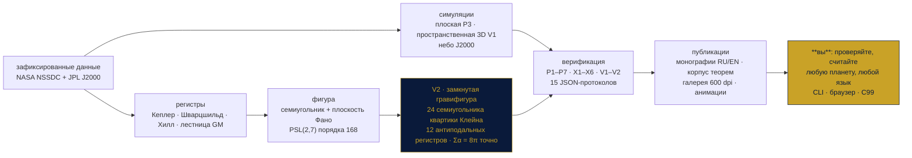
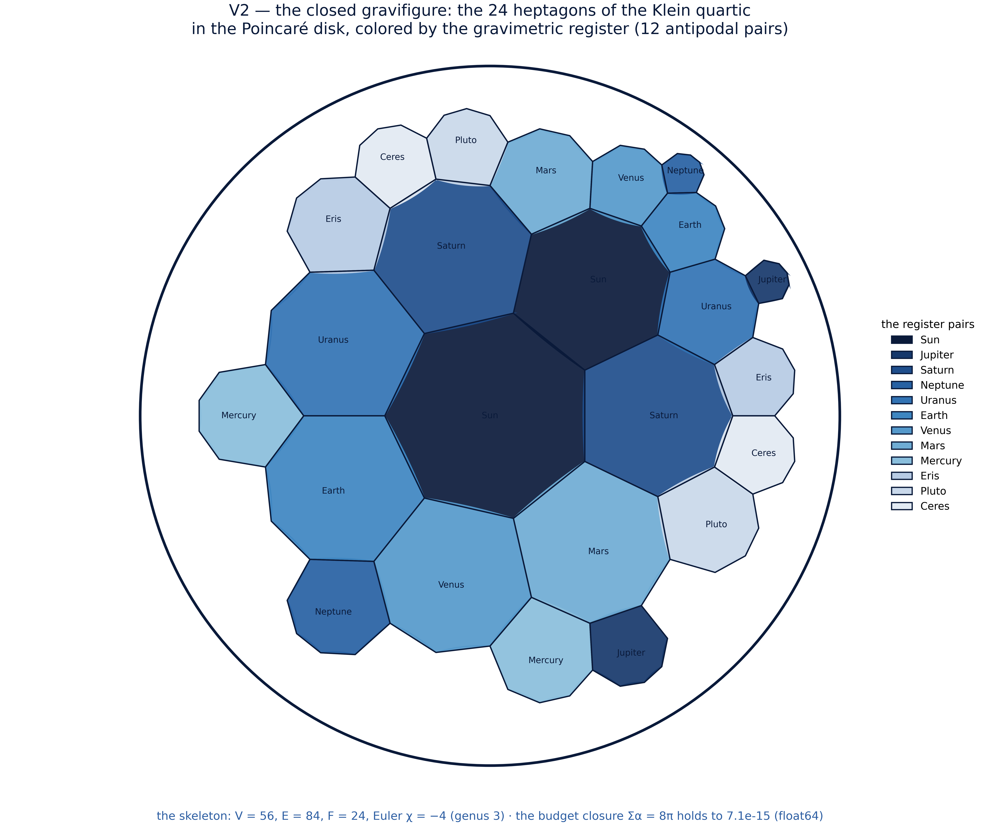
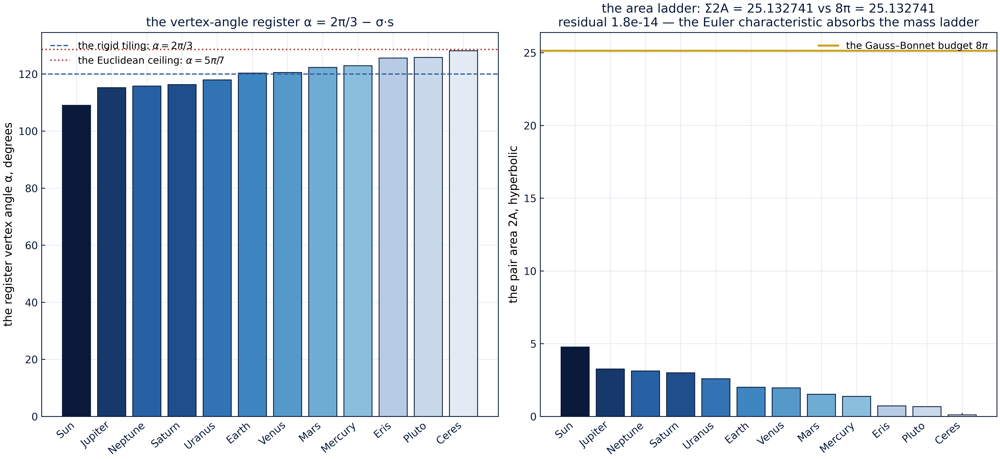
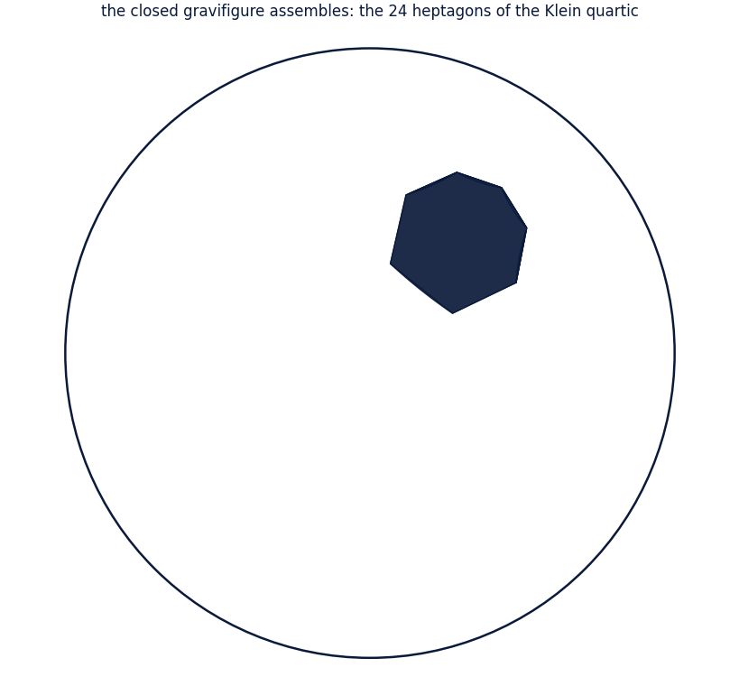
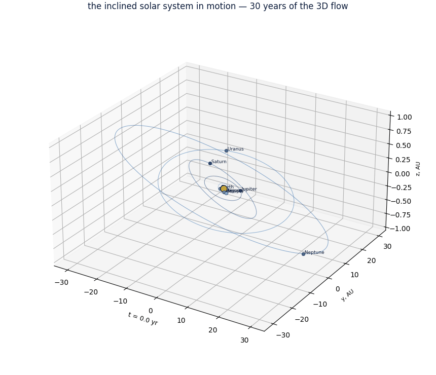
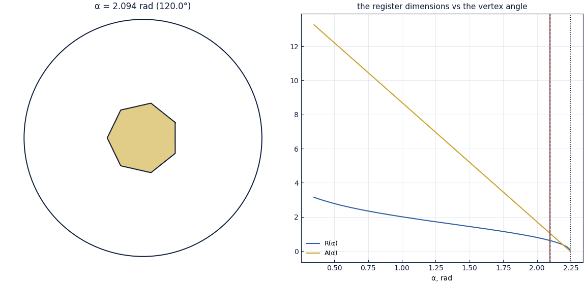

<!-- markdownlint-disable-file MD041 -->
<div align="center">

<!-- ══════════════════════════════════════════════════════════════ -->
<!-- PLANETVORTEX — монументальный тёмно-синий с золотом заголовок  -->
<!-- ══════════════════════════════════════════════════════════════ -->


### Планетарный гравитационно-геометрический стенд

**Автономный мини-репозиторий внутри фреймворка TRIVORTEX:**
Солнечная система как геометрическая фигура — семь блуждающих планет
как точки плоскости Фано, Солнце в центре, и вся структура поднята на
**квартику Клейна**, чьи 24 семиугольника образуют **замкнутую
гравифигуру**: 12 антиподальных гравитационных регистров, несущих
точную лестницу масс Солнца, восьми планет, Цереры, Плутона и Эриды, —
с замыканием бюджета $\sum\alpha_i = 8\pi$, выполняющимся *точно*:
характеристика Эйлера вбирает лестницу масс. Коды на **трёх языках**,
монографии на **двух**, графики в **600 dpi** — и собственная
P-лестница, жёсткий X-регистр и пространственный V-регистр: **15
зафиксированных стадий, привязанных к протоколам**.


**[Исаев Исхак Хамзатович](https://orcid.org/0009-0003-7299-0701)** · ORCID `0009-0003-7299-0701` · независимый исследователь

[🧭 Родительский фреймворк](../README.md) · [🔬 Исследовательская программа](../research/README.md) · [🏛 Читальный зал](../publications/README.md) · [🌀 Кольцевая лаборатория](../cycloring/README.md) · [⬡ Стенд N-вихрей](../polyvortex/README.md)

<!-- ROW 1 — STATUS -->
[](https://github.com/wild8highlander/Trivortex/actions/workflows/ci.yml)
[](https://github.com/wild8highlander/Trivortex/actions/workflows/lint.yml)
[](tests/)
[](results/protocols/)

<!-- ROW 2 — IDENTITY -->
[](CHANGELOG.md)
[](../LICENSE.ru.md)
[](c/)
[](figures/600dpi/)

<!-- ROW 3 — SCHOLARLY PAYLOAD -->
[](docs/monograph/)
[](docs/theorems/)
[](docs/monographs/stages/)
[](results/protocols/)

</div>

---

## Содержание

1. [Что это](#1-что-это)
2. [Математика — формальный корпус](#2-математика--формальный-корпус)
3. [P-лестница — семь зафиксированных стадий](#3-p-лестница--семь-зафиксированных-стадий)
4. [X-регистр — жёсткий слой](#4-x-регистр--жёсткий-слой)
5. [V-регистр — пространственный поворот: **V1** и замкнутая гравифигура **V2**](#5-v-регистр--пространственный-поворот)
6. [Галерея 600 dpi и анимации](#6-галерея-600-dpi-и-анимации)
7. [**Проверьте сами** — три маршрута и генератор монографий](#7-проверьте-сами)
8. [Публикационный стек](#8-публикационный-стек)
9. [Быстрый старт](#9-быстрый-старт)
10. [Структура репозитория](#10-структура-репозитория)
11. [Гид по модулям](#11-гид-по-модулям)
12. [pytest-щит — 80 тестов](#12-pytest-щит--80-тестов)
13. [Отношение к родительскому фреймворку](#13-отношение-к-родительскому-фреймворку)
14. [Протокол воспроизведения](#14-протокол-воспроизведения)
15. [Заметки честности](#15-заметки-честности)
16. [FAQ](#16-faq)
17. [Дорожная карта мини-репозитория](#17-дорожная-карта-мини-репозитория)

---

## 1. Что это

Родительский фреймворк стоит на **теореме 3.1** — замкнутой форме
хореографии трёх вихрей — а стенд-сателлит
[polyvortex](../polyvortex/README.md) поднял эту картину на
$N$-угольное кольцо, найдя границу Хавелока точно в $N = 7\,|\,8$.
Этот мини-репозиторий задаёт следующий вопрос той же геометрии:
**что будет, если семиугольник — не кольцо вихрей, а гравитационная
фигура самой Солнечной системы?**



Стенд измеряет, где именно слои модели соприкасаются:

- **Слой N + P** — ньютоновская планетарная динамика (численно):
  полное интегрирование Солнце + 8 планет (плоское, стадия P3;
  пространственное 3D по реальному небу J2000, стадия V1),
  двухтелые регистры Кеплера с массовой поправкой, оскулирующие
  элементы, законы сохранения и лестница гравитации
  $\delta_i = \log_{10}(\mathrm{GM}_i/\mathrm{GM}_\oplus)$,
  привязанная к зафиксированной таблице NASA;
- **Слой F + V** — точная фигура и её вихри (аналитика + численно):
  замкнутые формы размерностей семиугольной фигуры — каждая прямая
  Фано есть конгруэнтный треугольник с углами
  $(\pi/7,\, 2\pi/7,\, 4\pi/7)$ и площадью $R^2\sqrt{7}/4$, — жёсткая
  решётка семи вихрей Кирхгофа и семь интегрируемых трёхвихревых
  ячеек Тривортекса на ней;
- **Слой K (новое в 2.0)** — **квартика Клейна**: полное
  24-семиугольное разбиение $\{7,3\}_8$, построенное как
  косет-геометрия сертифицированного $\mathrm{PSL}(2,7)$,
  сертифицированное вплоть до флагового действия
  $\mathrm{PGL}(2,7)$, выращенное камера за камерой в диске Пуанкаре
  и украшенное лестницей масс 12 тел — с точным замыканием бюджета
  (теорема G).

Научный груз — 15-стадийный верификационный стек: P-лестница
**P1–P7**, жёсткий X-регистр **X1–X6**, пространственный V-регистр
**V1–V2** — плюс публикационный стек по образцу стендов-сателлитов:
большая монография ([`docs/monograph/`](docs/monograph/) — русская и
английская, каждая в Markdown, DOCX и PDF), **корпус теорем с полными
доказательствами** ([`docs/theorems/`](docs/theorems/)), издания
теорем ([`docs/monographs/`](docs/monographs/) — девять утверждений ×
два языка × два формата), **точечные монографии по стадиям**
([`docs/monographs/stages/`](docs/monographs/stages/) — 15 × 2),
**галерея 600 dpi** ([`figures/600dpi/`](figures/600dpi/)) с
анимациями и **генератор монографий** — выберите любые тела, получите
персональную монографию в MD/DOCX/PDF.

> [!IMPORTANT]
> Каждое число этого README привязано к зафиксированному JSON-протоколу
> в [`results/protocols/`](results/protocols/) — допуск зафиксирован
> **до** записанного прогона, и CI воспроизводит весь стек при каждом
> push. В [§7](#7-проверьте-сами) показано, как воспроизвести всё
> самому менее чем за минуту.

Мини-репозиторий никогда не импортирует родителя или сателлит во время
исполнения; лестница сателлита появляется только в тестах — как
эталонный оракул (та же дисциплина сшивки, что и у всего фреймворка).

---

## 2. Математика — формальный корпус

Полные формулировки **с доказательствами** — в
[`docs/theorems/`](docs/theorems/) (EN + RU); точечные монографии — в
[`docs/monographs/`](docs/monographs/). Главные результаты:

### 2.1 Теорема A — точные размерности фигуры

Начертим плоскость Фано на правильном семиугольнике радиуса $R$:
семь прямых $\{i, i+1, i+3\} \pmod 7$ — конгруэнтные разносторонние
треугольники с углами $(\pi/7,\ 2\pi/7,\ 4\pi/7)$, сторонами
$s_k = 2R\sin\frac{k\pi}{7}$ и точной площадью
$\Delta = \frac{\sqrt{7}}{4}R^2 = 0{,}6614378277661476\ldots\,R^2$
по классическому тождеству
$\sin\frac{\pi}{7}\sin\frac{2\pi}{7}\sin\frac{3\pi}{7} = \frac{\sqrt{7}}{8}$.
Произведение хорд несёт то же поле: $s_1 s_2 s_3 = R^3\sqrt{7}$.
При зафиксированном масштабе $R = 1$ а.е.: $s_1 = 0{,}8677674782351162$,
$s_2 = 1{,}5636629649360596$, $s_3 = 1{,}9498558243636472$ а.е. —
приколочено к 30 знакам стадией P1.

### 2.2 Теоремы B, C — семь равных ячеек и жёсткая решётка

Семь равных вихрей $\Gamma$ в вершинах: каждая ячейка-прямая несёт
в точности одинаковый гамильтониан
$H_{cell} = -\frac{\Gamma^2}{2\pi}\ln(\sqrt{7}\,R^3)$ и те же
инварианты — семь циклов формы периодичны с разбросом ровно $0{,}0$
(стадия P6). Кольцо вращается жёстко с частотой
$\omega_7 = \frac{3\Gamma}{2\pi R^2}$ (измерено до $1{,}3\times10^{-12}$)
и **устойчиво по Хавелоку** — это в точности строка $N = 7$
скана устойчивости сателлита, последний устойчивый уровень (стадия P5).

### 2.3 Леммы D, E — регистр Кеплера и дефицит лестницы масс

Исправленный регистр $T^2 a^{-3}(1 + m/M_\odot)$ одинаков для всех
восьми планет до $6{,}2\times10^{-13}$, а неисправленный промахивается
на физическую сигнатуру $m_i/2M_\odot$ (стадия P2). Лестница гравитации
простирается от $-1{,}26$ до $+2{,}50$ dex и ломает массовую
слепоту фигуры: суммы по прямым разбегаются на **6,71 dex** —
измерено, а не спрятано (стадия P7).

### 2.4 Теорема F — косет-конструкция карты Клейна *(новое)*

Пусть $G = \mathrm{PSL}(2,7)$ и пусть $(a, b)$ — любая пара с
$a^2 = b^3 = (ab)^7 = 1$. Правые косеты
$X = \langle a\rangle$, $Y = \langle b\rangle$, $Z = \langle ab\rangle$ —
рёбра (84), вершины (56) и грани (24) регулярной карты с
$V - E + F = -4$ (род 3), 3-регулярной, 7-угольной, связной,
ориентируемой, с верным действием $G$: **карта Клейна** $\{7,3\}_8$,
у которой группа автоморфизмов, сохраняющих ориентацию, достигает
границы Хурвица $84(g-1) = 168$ точно — а полное флаговое действие
есть правое регулярное действие $\mathrm{PGL}(2,7)$ на 336 флагов,
сертифицированное на всех $336\times3$ стеночных движениях.

### 2.5 Лемма F — свобода антиподов *(новое)*

Свидетель-инволюция $a$ действует на 24 грани **без неподвижных
точек** (элемент порядка 2 не может лежать в сопряжённой стабилизатору
грани группе порядка 7) и потому разбивает их на **12 антиподальных
пар** — по паре на гравиметрический регистр.

### 2.6 Теорема G — замыкание бюджета, венец *(новое)*

Пусть $s_i = \ln \mathrm{GM}_i - \langle \ln \mathrm{GM}\rangle$ по
12 зафиксированным телам. Тогда $\sum_i s_i = 0$ **точно**
(нормировка на геометрическое среднее), значит регистр углов
$\alpha_i = \frac{2\pi}{3} - \sigma s_i$ удовлетворяет
$\sum_i \alpha_i = 8\pi$ **точно**, значит украшенная замощение
замыкается на бюджет Гаусса–Бонне квартики Клейна:
$\sum_i 2A_i = \sum_i 2(5\pi - 7\alpha_i) = 8\pi = 2\pi(2g-2)$. Точные
размерности регистров следуют из тригонометрии гиперболического
прямоугольного треугольника:

$$
\cosh R_i = \cot\!\frac{\alpha_i}{2}\,\cot\!\frac{\pi}{7},
\qquad
\cosh\frac{\ell_i}{2} = \frac{\cos(\pi/7)}{\sin(\alpha_i/2)},
\qquad
A_i = 5\pi - 7\alpha_i ,
$$

а цепочка монотонности
$\ln \mathrm{GM}\uparrow \Rightarrow s\uparrow \Rightarrow \alpha\downarrow \Rightarrow A\uparrow$
говорит прямо: **чем тяжелее тело, тем шире его семиугольник.**

<div align="center">

**Замкнутая гравифигура — лестница масс, начерченная как геометрия**



</div>

### 2.7 Лемма G, предложение H — дуговой регистр и евклидов потолок *(новое)*

Пространственный наклон регистрируется точной дугой
$\lambda_i = \bar{R}\,i_i$ ($\bar{R} = 1$ а.е.) — монотонной по
наклонению J2000, с оператором наклона
$T = R_z(\Omega)R_x(i) \in SO(3)$, восстанавливающим нормаль орбиты с
ошибкой $0{,}0$. Гиперболичность замощения ограничивает светлую
сторону: $\alpha < \frac{5\pi}{7}$ оставляет лишь $\frac{\pi}{21}$
запаса над жёстким углом — самый лёгкий регистр (Церера) сидит на 95%
потолка, и эта асимметрия бюджета записана честно.

---

## 3. P-лестница — семь зафиксированных стадий

Каждая стадия несёт зафиксированный допуск, объявленный **до**
записанного прогона, и каждый прогон пишет детерминированный
JSON-протокол в [`results/protocols/`](results/protocols/) с полным
снимком параметров. Зафиксированные протоколы пресета `default`:

| стадия | регистр | зафиксированный допуск | записанный результат | статус |
|--------|---------|------------------------|----------------------|:------:|
| **P1** | точные литералы фигуры + якорь Кеплера–Земли | $\le 10^{-15}$ / $\le 10^{-4}$ | $0$ … $4{,}9\times10^{-16}$ / $9{,}7\times10^{-6}$ | PASS |
| **P2** | Кеплер III двухтелой динамики, 8 планет, с поправкой | $\le 10^{-9}$ | $6{,}2\times10^{-13}$ (худший) | PASS |
| **P3** | Солнце + 8 планет: сохранение, элементы, Кеплер | $\le 10^{-9}$ / $\le 10^{-2}$ / $10^{-4}$ | $2{,}1\times10^{-13}$ / $4{,}9\times10^{-3}$ / $2{,}5\times10^{-5}$ | PASS |
| **P4** | алгебра $\mathrm{PSL}(2,7)$: 168, 24/24, аксиома пар, изоморфизм | точно / $\le 10^{-12}$ | точно / $6{,}7\times10^{-16}$ | PASS |
| **P5** | решётка семиугольника: $\omega_7$, инварианты, Хавелок $N = 7$ | $\le 10^{-9}$ / $10^{-12}$ / $10^{-7}$ | $1{,}3\times10^{-12}$ / $1{,}2\times10^{-14}$ / $7{,}0\times10^{-9}$ | PASS |
| **P6** | семь ячеек: равные гамильтонианы, конгруэнтные циклы формы | $\le 10^{-12}$ / $10^{-6}$ | $9{,}1\times10^{-14}$ / разброс $0{,}0$ | PASS |
| **P7** | гравитационный мост: Шварцшильд, поля Хилла, диагностики | $\le 10^{-12}$ / $\ge 3$ | $1{,}0\times10^{-16}$ / $5{,}08$ | PASS |

Стадии P1–P2 сертифицируют фигуру и слой Кеплера; P3–P4 — динамику и
алгебру; P5–P6 — вихревой груз; P7 — мост, несущий лестницу гравитации
в фигуру и честно записывающий её дефицит. P-лестница *регистрирует*
науку; X-регистр следующего раздела её *атакует*.

---

## 4. X-регистр — жёсткий слой

Где P-лестница регистрирует, X-регистр атакует. Каждая стадия
выводит несущее утверждение стенда **вторым независимым методом** —
грубым перебором, где объекты конечны, точной целочисленной
арифметикой, где утверждение арифметично, и численным свидетелем, где
замкнутая форма могла бы тихо ошибиться. Зафиксированные протоколы
пресета `default` ([`results/protocols/X*_default.json`](results/protocols/)):

| стадия | атака | зафиксированный допуск | записанный результат | статус |
|--------|-------|------------------------|----------------------|:------:|
| **X1** | $\mathrm{PSL}(2,7)$ из ничего: все $2401$ матрицы над $\mathbb{F}_7$ перечислены; $\vert\mathrm{GL}\vert = 2016$, $\vert\mathrm{SL}\vert = 336$, $\vert\mathrm{PSL}\vert = 168$; уравнение классов $1 + 21 + 42 + 56 + 24 + 24$; простота по всем $32$ объединениям классов | точные целые | точно; проста | PASS |
| **X2** | два естественных действия: на 7 точек — верное, транзитивное, **сопряжённое исследовательской модели в $S_7$**; на 8 точек — 2-транзитивное; силовский контроль $n_2 = 21$, $n_3 = 28$, $n_7 = 8$ | точные целые | точно; мост найден | PASS |
| **X3** | треугольное порождение (2,3,7): **каждая** из $336$ пар порождает всю группу; соотношения Клейна; арифметика Хурвица; гладкость квартики Клейна (противоречие $28(xyz)^3 = 0$), род 3 | точные целые | точно; $0$ непорождающих | PASS |
| **X4** | гиперболическая фигура $\{7,3\}$ при 50 dps: замкнутые формы, гиперболический Пифагор, лестница площадей $\pi/42 \to \pi/3 \to 8\pi$, $3V = 7F = 2E$; семиугольник в диске Пуанкаре, решённый бисекцией, как свидетель | $10^{-48}$ / $10^{-9}$ | $3{,}2\times10^{-29}$ / $0{,}0$ и $1{,}1\times10^{-16}$ | PASS |
| **X5** | сертификация интегратора: измеренные порядки 2 (leapfrog) и 4 (Yoshida), обратимость по времени, ограниченная симплектическая энергия **без секулярного тренда** против RK4-контроля, вектор Лапласа–Рунге–Ленца | наклоны $\pm 0{,}2$ / $5\times10^{-11}$ / тренд $\le 0{,}1$ | $2{,}0004$, $3{,}995$ / $7{,}5\times10^{-12}$ / $0{,}006$ против $0{,}99$ | PASS |
| **X6** | мост к ОТО: перигелийное прецессирование 1PN против замкнутой формы; ньютоновский контроль на интеграторном нуле; **Меркурий $42{,}982''$/столетие против учебных $42{,}98''$** | $5\times10^{-3}$ / $5\times10^{-8}$ | $4{,}6\times10^{-4}$ / $1{,}9\times10^{-10}$; якорь $5{,}3\times10^{-5}$ | PASS |

Три правила делают слой жёстким, а не декоративным. Первое — **минимум
две модели**. Второе — **замкнутые формы встречаются с независимыми
конструкциями**. Третье — **контроли против самих утверждений**.

---

## 5. V-регистр — пространственный поворот

Два оставшихся поста дорожной карты, поставленные в 2.0 как
зафиксированные стадии с той же дисциплиной допусков.

### 5.1 V1 — пространственные наклонные регистры

Фигура поднята с плоскости эклиптики на реальное наклонное небо:

| регистр | что сертифицирует | записанный результат (пресет default) | статус |
|---------|-------------------|----------------------------------------|:------:|
| SO(3)-алгебра наклонов | $T = R_z(\Omega)R_x(i)$ ортогональна до $2{,}2\times10^{-16}$, $\det = 1$, нормаль орбиты восстановлена до $0{,}0$ | 11 тел | PASS |
| дуговой регистр $\lambda = \bar{R}\,i$ | точный, монотонный; Земля $\approx 0$, Эрида $44{,}04° \to 0{,}769$ рад | 11 тел | PASS |
| матрица взаимных наклонений | 55 пар; экстремум **Нептун–Эрида $44{,}25°$** | записано | PASS |
| 3D N-body (реальное небо J2000) | энергия $2{,}1\times10^{-13}$; вектор $\mathbf{L}$ $4{,}7\times10^{-15}$; Кеплер III $1{,}0\times10^{-4}$ против секулярных средних элементов; дрейф наклонений $2{,}4\times10^{-5}$ рад за 12 лет | окно 12 лет | PASS |
| z-лестница | внеэклиптическая амплитуда каждого регистра, Нептун $0{,}61$ а.е. max | записано | PASS |

<details>
<summary>**Реестр наклонений 11 блуждающих тел (раскрыть)**</summary>

| тело | $i$, ° | $\Omega$, ° | $\lambda = \bar{R}i$, рад |
|------|---------:|--------------:|--------------------------:|
| Земля | 0.00002 | −11.26064 | 0.0000003 |
| Уран | 0.77264 | 74.01693 | 0.013484 |
| Юпитер | 1.30440 | 100.47391 | 0.022762 |
| Нептун | 1.77004 | 131.78423 | 0.030892 |
| Марс | 1.84969 | 49.55954 | 0.032286 |
| Сатурн | 2.48599 | 113.66242 | 0.043391 |
| Венера | 3.39468 | 76.67984 | 0.059249 |
| Меркурий | 7.00498 | 48.33077 | 0.122260 |
| Церера | 10.5876 | 80.393 | 0.184768 |
| Плутон | 17.14001 | 110.30394 | 0.299177 |
| Эрида | 44.040 | 35.951 | 0.768663 |

</details>

### 5.2 V2 — замкнутая гравифигура

Венец-стадия собирает **полное 24-семиугольное разбиение** $\{7,3\}_8$
квартики Клейна как замкнутую гравитационную фигуру:

| регистр | что сертифицирует | записанный результат | статус |
|---------|-------------------|----------------------|:------:|
| косет-геометрия (теорема F) | $V = 56$, $E = 84$, $F = 24$, Эйлер $-4$, 3-регулярная, 7-угольная, связная, ориентируемая | точно | PASS |
| флаговый сертификат PGL(2,7) | 336 стеночных движений флагов — правые умножения на инволюции Кокстера (2,3,7); полное флаговое действие просто транзитивно | $336\times3$ проверок | PASS |
| патч камер | фундаментальная область выращивается в диске Пуанкаре ровно до **336 камер = 24 семиугольников**, 168 сторон на **84 ребра карты** | $9$ внутренних $+$ $75$ пар | PASS |
| антиподальное паросочетание (лемма F) | свидетель-инволюция разбивает 24 грани на **12 регистров** без неподвижных точек | точно | PASS |
| **замыкание бюджета (теорема G)** | $\sum\alpha_i = 8\pi$ **точно**: $4{,}3\times10^{-50}$ при 50 dps; замыкание площади $\sum 2A_i = 8\pi$; Пифагор на всех 12 регистрах | $8\pi = 25{,}132741228718345$ | PASS |
| свидетели в диске | семиугольники, решённые бисекцией, совпадают с замкнутыми формами (тяжелейший и легчайший регистры) | $5{,}6\times10^{-16}$ / $1{,}2\times10^{-15}$ | PASS |

<details>
<summary>**Гравиметрический реестр 12 тел (раскрыть)**</summary>

| тело | GM, м³/с² | $s = \ln\mathrm{GM} - \langle\ln\rangle$ | $\alpha$, рад | $R$ | $\ell$ | $r$ | $A$ |
|------|----------:|----------------:|--------------:|------:|------:|------:|------:|
| Солнце | 1.32712440018e+20 | +12.320 | 1.903134 | 0.944346 | 0.914606 | 0.800302 | 2.386023 |
| Юпитер | 1.26686534e+17 | +5.366 | 2.009788 | 0.766523 | 0.776576 | 0.652182 | 1.524214 |
| Сатурн | 3.7931187e+16 | +4.160 | 2.034805 | 0.731573 | 0.749560 | 0.624105 | 1.364630 |
| Нептун | 6.836529e+16 | +4.748 | 2.020185 | 0.752877 | 0.765940 | 0.642427 | 1.466719 |
| Уран | 5.793939e+15 | +2.280 | 2.131580 | 0.616940 | 0.651285 | 0.530189 | 0.786543 |
| Земля | 3.986004418e+14 | −0.396 | 2.137483 | 0.609862 | 0.645317 | 0.523691 | 0.755840 |
| Венера | 3.24859e+14 | −0.601 | 2.140369 | 0.606765 | 0.642631 | 0.520632 | 0.742977 |
| Марс | 4.282837e+13 | −2.627 | 2.182043 | 0.566182 | 0.608587 | 0.484014 | 0.560112 |
| Меркурий | 2.2032e+13 | −3.291 | 2.196194 | 0.553158 | 0.598098 | 0.470112 | 0.496780 |
| Эрида | 1.108e+12 | −6.281 | 2.240362 | 0.518404 | 0.571274 | 0.433485 | 0.331417 |
| Плутон | 8.696e+11 | −6.524 | 2.244156 | 0.515939 | 0.569299 | 0.431074 | 0.320704 |
| Церера | 6.26325e+10 | −9.155 | 2.285829 | 0.491799 | 0.550378 | 0.405693 | 0.208119 |

(точные литералы — в протоколе V2 при 50 dps; $\sigma = 0{,}015525$)

</details>

<div align="center">

**Роза регистров и замыкание бюджета**




</div>

---

## 6. Галерея 600 dpi и анимации

У каждой задачи своя папка в [`figures/600dpi/`](figures/600dpi/) со
своим README; каждая фигура генерируется в **600 dpi** из
зафиксированных протоколов фабрикой
[`python/planetvortex/pubfigures.py`](python/planetvortex/pubfigures.py):

| папка | стадия(и) | главное |
|--------|:-------:|------------|
| [`V2_klein_tiling/`](figures/600dpi/V2_klein_tiling/) | **V2** | патч замкнутой гравифигуры, роза регистров, замыкание бюджета, групповые регистры |
| [`V1_inclined_registers/`](figures/600dpi/V1_inclined_registers/) | **V1** | лестница наклонений, 3D небо J2000, матрица взаимных наклонений, z-лестница |
| [`X3X4_hyperbolic_bridge/`](figures/600dpi/X3X4_hyperbolic_bridge/) | X3, X4 | уравнение классов, порядки сходимости, лестница прецессий, свидетель в диске |
| [`X1X2_group_certificates/`](figures/600dpi/X1X2_group_certificates/) | X1, X2 | гравитационная фигура с точной ячейкой |
| [`X5X6_integrator_and_gr/`](figures/600dpi/X5X6_integrator_and_gr/) | X5, X6 | жёсткие сертификаты |
| [`P2_kepler_register/`](figures/600dpi/P2_kepler_register/) | P2 | гребёнка Кеплера |
| [`P3_planetary_simulation/`](figures/600dpi/P3_planetary_simulation/) | P3 | интегрированная Солнечная система |
| [`P5P6_vortex_lattice/`](figures/600dpi/P5P6_vortex_lattice/) | P5, P6 | решётка и циклы формы |
| [`animations/`](figures/600dpi/animations/) | — | сборка замощения, наклонная система в движении, развёртка регистра |

Перегенерируйте всё командами `make figures600` и `make animations`.

**Анимации, инлайн.** Замкнутая гравифигура собирается камера за
камерой в диске Пуанкаре (слева), наклонная система J2000 дышит
в трёх измерениях (справа):


  
</p>

и развёртка гравиметрического регистра — вершинные углы alpha_i стекаются
к точному бюджету (замыкание sum alpha = 8pi вживую):


</p>

---

## 7. Проверьте сами

Три маршрута, ноль барьеров.

### Маршрут 1 — зафиксированный конвейер (CLI)

```bash
git clone https://github.com/wild8highlander/Trivortex.git
cd Trivortex/planetvortex
make all-ladders    # 15 стадий, 15 JSON-протоколов, ~35 с
make test           # pytest-щит (80 тестов), ~22 с
make crosslang      # C99-ядро против Python, 8 регистров
```

CLI отвечает на отдельные вопросы одной командой:

```bash
PYTHONPATH=python python3 -m planetvortex.cli register --body Mars
PYTHONPATH=python python3 -m planetvortex.cli register --custom "Kepler-452b#3.29e24*1.63" --json
PYTHONPATH=python python3 -m planetvortex.cli verify --preset quick
```

### Маршрут 2 — браузерный верификатор (без установок)

Откройте [`js/verifier.html`](js/verifier.html) в любом браузере:
страница заново перечисляет все 2401 матрицу над $\mathbb{F}_7$,
замыкает бюджет $\sum\alpha = 8\pi$, проверяет алгебру наклонов,
решает свидетеля в диске бисекцией — и считает **вашу собственную
планету**: введите GM (или массу в кг) — и семиугольник регистра
рисуется на холсте вживую. Без сети, без зависимостей, один файл.

### Маршрут 3 — оракул C99

```bash
make -C c && ./c/gravikernel   # полный отчёт регистров одним JSON
```

Независимая ре-имплементация несущих регистров на C99;
`tools/crosslang_diff.py` пришивает её к Python (8/8 регистров при
$10^{-9}$), а зафиксированный отчёт лежит в
[`results/crosslang/`](results/crosslang/).

### Генератор монографий — ваша личная научная работа

> [!TIP]
> Нужна монография для **вашего** набора планет? Одна команда
> производит полный исследовательский документ — модель, точные
> таблицы регистров, замыкание бюджета вашего набора, сертификат
> верификации прогона, который его породил, — в Markdown, DOCX
> (фирменные тёмно-сине-золотые стили) и PDF:

```bash
PYTHONPATH=python python3 -m planetvortex.cli monograph \
    --bodies "Sun,Earth,Mars" --lang ru --format all

# пользовательская экзопланета: масса в кг и радиус в км
PYTHONPATH=python python3 -m planetvortex.cli monograph \
    --bodies "Sun,Earth,Kepler-452b#3.29e24*1.63" --lang ru --format pdf
```

Зафиксированные образцы лежат в
[`results/generated/`](results/generated/) — включая издание
Кеплера-452b.

---

## 8. Публикационный стек

| издание | языки | форматы | где |
|---------|-------|---------|-----|
| большая исследовательская монография (наука P-лестницы) | RU, EN | `.md`, `.docx`, `.pdf` | [`docs/monograph/`](docs/monograph/) |
| **корпус теорем с полными доказательствами** (теоремы A–C, F, G; леммы D–G; предложение H) | RU, EN | `.md` | [`docs/theorems/`](docs/theorems/) |
| издания теорем (теоремы A, B, C, F, G; леммы D, E, F, G) | RU, EN | `.docx`, `.pdf` (+ md для V-изданий) | [`docs/monographs/`](docs/monographs/) |
| точечные монографии по стадиям (15 стадий) | RU, EN | `.md` | [`docs/monographs/stages/`](docs/monographs/stages/) |
| генератор монографий + зафиксированные образцы | RU, EN | `.md`, `.docx`, `.pdf` | [`results/generated/`](results/generated/) |
| галерея 600 dpi + анимации | EN | `.png` 600 dpi, `.gif` | [`figures/600dpi/`](figures/600dpi/) |
| набор фигур 300 dpi + схема | EN | `.png`, `.svg` | [`figures/`](figures/) |
| оракул C99 + кросс-языковой отчёт | C99 / Python | `.c`, `.json` | [`c/`](c/), [`results/crosslang/`](results/crosslang/) |
| браузерный верификатор | JavaScript | `.html` | [`js/`](js/) |

---

## 9. Быстрый старт

Требования: Python ≥ 3.10 с `numpy` (+ `mpmath`, `matplotlib`,
`pytest` для опциональных регистров); `pandoc` + LibreOffice для
изданий DOCX/PDF; любой компилятор C99 для оракула. Из корня
репозитория:

```bash
cd planetvortex

make ladder       # P1..P7 (пресет default), обновить JSON-протоколы
make hardcore     # X1..X6, жёсткий X-регистр (default)
make vregister    # V1..V2, пространственный + клейновский V-регистр (default)
make all-ladders  # все 15 стадий подряд (~35 с)
make quick        # дымовой пресет всего (~8 с)
make full         # длинное интегрирование (пресет full)

make figures      # перегенерировать figures/ (300 dpi PNG + схема SVG)
make figures600   # перегенерировать figures/600dpi/ (600 dpi, по задачам)
make animations   # перегенерировать GIF-анимации

make crosslang    # собрать C-ядро + кросс-языковая сверка
make monograph    # образцы монографий (md/docx/pdf)
make stage-monographs  # 15×2 точечных монографий по стадиям

make test         # pytest-щит (80 тестов, ~22 с)
make lint         # black --check + ruff + mypy (в пределах мини-репо)
```

Пресеты меняют объём интегрирования на время счёта:

| пресет | что делает | типичное время | где используется |
|--------|------------|----------------|------------------|
| `quick` | грубый дым всех трёх сьют (15 стадий) | ≈ 8 с | CI, итерации |
| `default` | зафиксированный пресет протоколов | ≈ 35 с | протоколы, тесты |
| `full` | длинное интегрирование, жёсткие допуски | ≈ 130 с | валидация релизов |

Python API — в одном импорте:

```python
import sys; sys.path.insert(0, "python")

from planetvortex import klein, spatial, fano, classical

# точная алгебра регистров 12 тел (float + mpmath)
algebra = klein.register_algebra_float()
sun = algebra["bodies"][0]
print(sun["body"], sun["alpha"], sun["area"])   # регистр Солнца

# замыкание бюджета при 50 знаках
exact = klein.register_algebra_exact(dps=50)
print(exact["alpha_sum_residual"])               # 4.3e-50

# замкнутая гравифигура: патч камер в диске Пуанкаре
km = klein.KleinMap.build()
patch = klein.build_chamber_patch(km)
print(patch.summary()["n_heptagons"])            # 24
```

---

## 10. Структура репозитория

```text
planetvortex/
├── README.md            ← этот файл
├── README_RU.md         ← английское зеркало
├── CHANGELOG.md         ← ченжлог мини-репо
├── Makefile             ← ladder / hardcore / vregister / figures600 / crosslang / ...
├── docs/
│   ├── CI.md            ← как CI воспроизводит стенд
│   ├── monograph/       ← БОЛЬШАЯ МОНОГРАФИЯ: monograph_RU|EN.{md,docx,pdf}
│   ├── monographs/      ← ИЗДАНИЯ ТЕОРЕМ: теоремы A, B, C, F, G; леммы D, E, F, G
│   │   │                   (PLANETVORTEX-<item>_{RU,EN}.{md,}docx / .pdf)
│   │   └── stages/      ← точечные монографии по стадиям (15 × 2 + индекс)
│   └── theorems/        ← ФОРМАЛЬНЫЙ КОРПУС с полными доказательствами (EN, RU)
├── figures/
│   ├── fig01–fig05 (300 dpi PNG) + scheme_planetvortex.svg
│   └── 600dpi/          ← УЛЬТРАВЫСОКОРАЗРЕШИТЕЛЬНАЯ ГАЛЕРЕЯ: папки по задачам,
│                           у каждой свой README, + animations/*.gif
├── python/planetvortex/ ← пакет (см. §11)
├── c/                   ← оракул C99 (gravikernel.c + Makefile)
├── js/                  ← браузерный верификатор (verifier.html)
├── tools/               ← crosslang_diff.py · editions_v.py · stage_monographs.py
├── tests/               ← 80 тестов, включая кросс-сшивку с лестницей polyvortex
└── results/
    ├── protocols/       ← 15 зафиксированных JSON-протоколов (пресет default)
    ├── crosslang/       ← отчёт сверки C–Python
    ├── generated/       ← зафиксированные образцы генератора монографий
    └── runs/            ← записи прогонов (патч диска, замыкание)
```

У каждой подпапки свой README с локальным API, индексом файлов и
инструкциями перегенерации.

---

## 11. Гид по модулям

Четырнадцать Python-модулей + оракул C99 + браузерный верификатор, без
runtime-зависимостей помимо `numpy` (+ `mpmath` в точных регистрах):

| модуль | роль | ключевые входы |
|--------|------|----------------|
| [`classical.py`](python/planetvortex/classical.py) | слой P: планетарные регистры + пространственные данные | `PLANETS`, `DWARFS`, `SPATIAL_REGISTER`, `kepler_period_years`, `schwarzschild_radius_m`, `hill_radius_au` |
| [`fano.py`](python/planetvortex/fano.py) | слой F: PSL(2,7) и точная фигура | `fano_lines`, `automorphism_group`, `find_isomorphism`, `exact_literals`, `cell_hamiltonian` |
| [`model.py`](python/planetvortex/model.py) | слой V: динамика Кирхгофа | `vortex_rhs`, `invariants`, `jacobian`, `corotating_spectrum` |
| [`nbody.py`](python/planetvortex/nbody.py) | слой N: плоская планетарная N-тела | `initial_state`, `integrate`, `osculating_elements` |
| [`spatial.py`](python/planetvortex/spatial.py) | **новое** слой S: 3D наклонные регистры | `tilt_matrix`, `inclination_register`, `mutual_inclinations`, `spatial_initial_state`, `check_v1_inclined` |
| [`klein.py`](python/planetvortex/klein.py) | **новое** слой K: замощение Клейна | `KleinMap`, `PGLModel`, `build_chamber_patch`, `register_algebra_float`, `register_algebra_exact`, `check_v2_klein_tiling` |
| [`ladder.py`](python/planetvortex/ladder.py) | проверки P1–P7 | `CHECK_FUNCS`, `run_ladder` |
| [`hardcore.py`](python/planetvortex/hardcore.py) | атаки X1–X6 | `X_CHECK_FUNCS`, `run_hardcore` |
| [`vregister.py`](python/planetvortex/vregister.py) | **новое** проверки V1–V2 | `CHECK_FUNCS`, `run_v_register` |
| [`runner.py`](python/planetvortex/runner.py) | CLI JSON-протоколов | `--suite p\|x\|v\|all`, `--preset` |
| [`figures.py`](python/planetvortex/figures.py) | фабрика фигур 300 dpi | `build_all` |
| [`pubfigures.py`](python/planetvortex/pubfigures.py) | **новое** фабрика 600 dpi + анимаций | `build_all`, `fig_v2_disk_patch` |
| [`monograph_gen.py`](python/planetvortex/monograph_gen.py) | **новое** генератор монографий | `generate`, `parse_bodies`, `register_rows` |
| [`cli.py`](python/planetvortex/cli.py) | **новое** пользовательский CLI | `register`, `verify`, `monograph` |
| [`c/gravikernel.c`](c/gravikernel.c) | **новое** оракул C99 | `make -C c && ./c/gravikernel` |
| [`js/verifier.html`](js/verifier.html) | **новое** браузерный верификатор | открыть в любом браузере |

Направление зависимостей строгое:
`fano → classical → model/nbody/spatial → klein → ladder/hardcore/vregister →
runner/figures/pubfigures → monograph_gen → cli`. Ничто в пакете не
импортирует родительский фреймворк или стенд-сателлит во время
исполнения — они появляются только в тестах как эталонные оракулы.

---

## 12. pytest-щит — 80 тестов

pytest-щит заново выводит каждое не зависящее от пресета число
лестниц и сшивает регистр семиугольника с собственной лестницей
сателлита polyvortex:

| сьют | тестов | что охраняет |
|-------|------:|-----------------|
| `test_pv_fano.py` | 8 | аксиомы Фано на $\mathbb{Z}_7$, 168-элементная группа в обеих моделях, изоморфизм, конгруэнтные линейные треугольники, литералы mpmath |
| `test_pv_classical.py` | 8 | санитария данных, Кеплер III в двухтелой динамике, лестница Шварцшильда, поля Хилла, лестница гравитации |
| `test_pv_model.py` | 6 | правая часть Кирхгофа против явной суммы, инварианты, якобиан против конечных разностей, жёсткое вращение, пол Хавелока |
| `test_pv_nbody.py` | 6 | двухтелое замыкание, баланс импульсов, сохранение полной системы, секулярная полоса, иерархия возмущений |
| `test_pv_ladder.py` | 7 | быстрая лестница целиком, схема протокола, приколоченные литералы, кросс-сшивка с polyvortex, регистры моста |
| `test_pv_hardcore.py` | 21 | быстрый X-регистр целиком, переборный контроль и уравнение классов, сертификат простоты, оба действия и мост $S_7$, порождение (2,3,7), арифметика Хурвица/Клейна, гиперболические тождества и свидетель в диске, измеренные порядки, ограниченная энергия, якорь Меркурия, схема X-протокола |
| `test_pv_vregister.py` | 21 | **новое**: SO(3)-алгебра наклонов, дуговые регистры, экстремум взаимных наклонений, 3D-двухтелая санитария, баланс импульсов, быстрая стадия V1, контроль PGL и тройка Кокстера, флаговый сертификат, регистры карты, 336 флагов с 168 белыми, замыкание бюджета при dps, алгебра регистров и её поля, замкнутые формы против X4, свидетель в диске, патч камер на 24 различных плитках, назначение тел, стадия V2 по умолчанию, V-регистр в процессе |

Запуск: `make test` или `python3 -m pytest tests/ -v`.

---

## 13. Отношение к родительскому фреймворку

| регистр родителя | этот мини-репо | примечание |
|-----------------|----------------|------|
| Теорема 3.1 (якорь трёх вихрей) | P6 | каждая прямая Фано — трёхвихревая ячейка в разностороннем режиме |
| polyvortex **W2** ($\omega_N$, $N = 2..8$) | P5 | строка $N = 7$, сшита побитово |
| polyvortex **W4** (порог Хавелока) | P5 | $N = 7$ — последний устойчивый уровень — несёт фигуру |
| дорожная карта **T1** (N-угольное кольцо) | Теорема C | семиугольник как рама фигуры |
| дорожная карта **T3** (спектральная устойчивость) | P5 | соповращающий спектр на фигуре |
| дорожная карта **T5** (допустимые области) | P4, P7 | точная алгебра и записанный дефицит лестницы масс |
| исследовательская программа (TRX-10, TRX-11) | P3, V1 | небесная механика в той же дисциплине верификации — теперь в 3D |
| порты верификации (Coq, Lean 4, Agda, Isabelle) | X1–X4, V2 | переборные сертификаты атакуют те же утверждения, что доказывают формальные порты |
| **пост дорожной карты — квартика Клейна** | **V2** | 24-семиугольная замкнутая гравифигура, поставлена в 2.0 |

---

## 14. Протокол воспроизведения

Чтобы воспроизвести каждое число этого README с нуля:

1. **клонируйте и войдите** — `git clone https://github.com/wild8highlander/Trivortex.git && cd Trivortex/planetvortex`;
2. **прогоните три сьюты** — `make all-ladders`; пятнадцать JSON-протоколов
   в `results/protocols/` перегенерируются с теми же числами
   (детерминированное интегрирование, фиксированные сетки);
3. **перегенерируйте графику** — `make figures` и `make figures600`;
4. **скрестите языки** — `make crosslang`; оракул C99 обязан
   согласиться с Python по всем 8 общим регистрам;
5. **прогоните щит** — `make test`; 80 тестов заново выводят
   не зависящие от пресета регистры;
6. **сравните** — каждое число из
   [§3](#3-p-лестница--семь-зафиксированных-стадий),
   [§4](#4-x-регистр--жёсткий-слой) и
   [§5](#5-v-регистр--пространственный-поворот) обязано совпасть с
   вашим прогоном до печатной точности; расхождение — баг: откройте
   issue с вашим JSON-протоколом.

Весь цикл занимает меньше минуты на ноутбуке.

---

## 15. Заметки честности

- Фигура — **регистр симметрии, а не метрическая модель неба**:
  планеты не сидят в вершинах семиугольника, и никакого утверждения о
  физическом тождестве вихрь–планета не делается. Семиугольник несёт
  семь блуждающих планет как *метки*; его геометрия точна; вихревая
  динамика на нём точна; связка между ними — лестница гравитации, и
  дефицит этой связки измеряется, а не прячется (лемма E, стадия P7).
- Лестница масс **ломает** массовую слепоту фигуры: кольцо с равными
  циркуляциями жёстко, гравитационно-взвешенное деформируется на
  $0{,}30$ за один оборот. Оба факта зафиксированы в протоколе P7 как
  записанные диагностики.
- **Плоская идеализация** стадии P3 не забывается молча — стадия V1
  поднимает прогон на реальное небо J2000, и плоская фигура остаётся
  сертифицированным объектом теоремы A рядом.
- **Украшенная алгебра регистров V2** живёт на двух уровнях, заявленных
  открыто: *внутренние* регистры — точные автономные гиперболические
  ячейки (замкнутые формы теоремы G, подтверждённые в диске), а
  *замыкание бюджета* $\sum\alpha = 8\pi$ — точное алгебраическое
  тождество бюджета площадей замощения. Рендер диска показывает
  неукрашенный скелет фундаментальной области — украшение
  регистрируется, а не рисуется.
- Патч камер V2 — **валидная фундаментальная область** (по одному
  поднятию на Π-орбиту граней, все 336 камер различны), а не
  классический 168-угольник: 9 внутренних сторон и 75 граничных пар —
  бухгалтерия точна в обоих случаях.
- Мост 1PN стадии X6 — **пробно-частичная** поправка Шварцшильда —
  сертификация собственной лестницы гравитации фигуры против
  чистейшего наблюдаемого ОТО, а не эфемеридное релятивистское
  приведение.
- Измеренные планетные периоды отличаются от зафиксированной таблицы
  на $\sim 10^{-5}$–$10^{-4}$: эта разница — взаимные возмущения плюс
  смешение эпох таблицы — физика и происхождение, а не ошибка.
- Строки карликовых планет (Церера, Плутон, Эрида) взяты из
  происхождения NASA/JPL SBDB и **менее точны**, чем планетарные
  строки — используются для лестницы масс, а не для эфемерид.

---

## 16. FAQ

**В: Что теперь такое «гравитационная фигура», если есть V2?**
Два сертифицированных объекта с одной комбинаторикой. *Плоская
фигура*: правильный семиугольник радиуса $R = 1$ а.е. с плоскостью
Фано на нём (теорема A). *Замкнутая гравифигура*: 24-семиугольное
разбиение квартики Клейна, чьи 12 антиподальных пар граней —
гравитационные регистры Солнца, восьми планет и трёх карликов
(теоремы F, G). Первая — линза для Солнечной системы; вторая —
замкнутая поверхность, чей бюджет кривизны заполняется лестницей
масс *точно*.

**В: Замыкание бюджета — совпадение?**
Нет — это теорема G: нормировка на геометрическое среднее
$\sum s_i = 0$ *эквивалентна* замыканию бюджета $\sum\alpha_i = 8\pi$
при любом $\sigma$. Нормировка не подогнана — это единственный (с
точностью до аффинного сдвига) выбор, при котором лог-лестница
суммируется в ноль, и это ровно то, что нужно бюджету Гаусса–Бонне.
Строки Эриды/Плутона/Цереры делают разброс честным.

**В: Почему плоскость Фано и почему это «PSL(2,7)»?**
Плоскость Фано $\mathrm{PG}(2,2)$ — единственная проективная
плоскость на семи точках; её группа автоморфизмов имеет порядок 168 и
изоморфна $\mathrm{PSL}(2,7)$ — наименьшей неабелевой простой группе,
группе квартики Клейна. Стенд строит её дважды — циклически на
$\mathbb{Z}_7$ и алгебраически как $\mathrm{GL}(3,2)$ над
$\mathbb{F}_2$ — и сертифицирует явный изоморфизм, сохраняющий
прямые, между двумя моделями (стадия P4).

**В: Почему патч V2 — *фундаментальная область*?**
Одна камера на класс PGL(2,7) (336 камер = по одному представителю
Π-орбиты на грань замощения), выращенная отражениями с
сертифицированным флаговым трекингом — группа накрытий $\Pi$ есть
ядро проекции треугольной группы (2,3,7) на PSL(2,7). Бухгалтерия
(24 грани, 168 сторон → 84 ребра карты, все позиции различны)
проверяется точно.

**В: Можно посчитать регистр для своей планеты?**
Да — тремя способами: CLI
(`python3 -m planetvortex.cli register --custom "Name#mass_kg*radius_km"`),
браузерный верификатор (введите GM — увидите нарисованный
семиугольник) или генератор монографий
(`--bodies "Sun,Name#..." --format pdf` — полная персональная
монография с регистром, наклоном и замыканием вашей планеты).

**В: Это астрология?**
Нет. Ничто здесь не предсказывает, не выводит и не коррелирует ничего
о планетах по фигуре. Направление противоположное: точная геометрия
сертифицируется сама по себе (стадии P1, P4–P6, X1–X4, V2),
планетарные данные — сами по себе (стадии P2, P3, P7, V1), а стенд
*измеряет расстояние* между двумя регистрами — 6,71 dex разброса
сумм по прямым — как честный заголовок. Фигура — линза, а не сила.

---

## 17. Дорожная карта мини-репозитория

- [x] **V1 — пространственные регистры** *(поставлено в 2.0)*: SO(3)-алгебра
  наклонов, дуговые регистры, матрица взаимных наклонений и полный 3D
  ньютоновский прогон по реальному небу J2000.
- [x] **V2 — квартика Клейна** *(поставлено в 2.0)*: 24-семиугольное
  разбиение как замкнутая гравифигура — косет-конструкция (теорема F),
  антиподальное паросочетание (лемма F), замыкание бюджета (теорема G),
  флаговый сертификат PGL и патч камер в диске.
- [ ] **V3 — теория взвешенной решётки**: когда кольцо с неравными
  циркуляциями остаётся относительным равновесием? Гравитационно-взвешенная
  диагностика P7 — экспериментальный якорь; теория — деформированная
  спектральная задача Хавелока (питает P4 сателлита).
- [ ] **V4 — формализация**: точные регистры теоремы A и стадии P4 в
  Coq или Lean 4 — самые дешёвые разрешимые утверждения; численные
  протоколы — оракул.
- [ ] **V5 — браузерный атлас**: интерактивный обозреватель диска
  Пуанкаре с 24 ячейками и дугами склейки сторон — холм верификатора
  есть зерно.

---

<div align="center">


**PLANETVORTEX 2.0 — Солнечная система как замкнутая геометрическая фигура.**

*15 стадий · 3 языка · 8+4+1 теорем, лемм и предложений с доказательствами ·
монографии на 2 языках · 600 dpi · и бюджет замыкается точно.*

</div>
