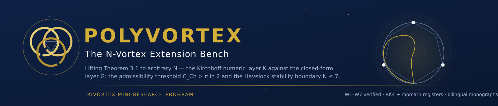
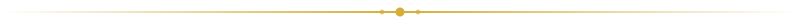
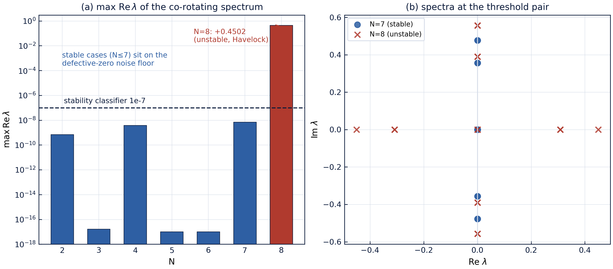
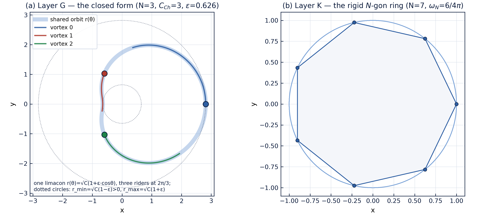
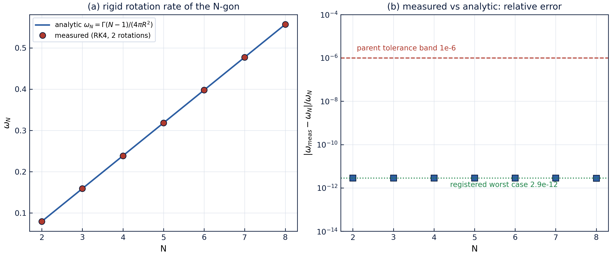
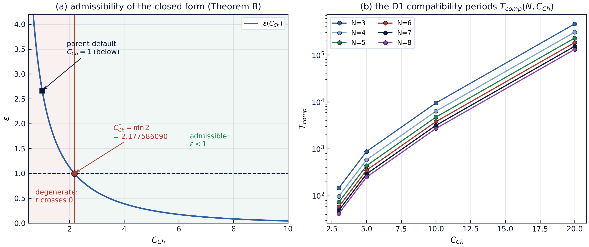

<!-- markdownlint-disable-file MD041 -->
<div align="center">

<!-- ══════════════════════════════════════════════════════════════ -->
<!-- POLYVORTEX — монументальная тёмно-синяя шапка с золотом         -->
<!-- ══════════════════════════════════════════════════════════════ -->


### Стенд обобщения на N вихрей

**Самодостаточный мини-репозиторий внутри фреймворка TRIVORTEX:** переход
от теоремы 3.1 для трёх вихрей к произвольному числу $N$ одинаковых
точечных вихрей — со своими кодами, своей монографией, своей
верификационной лестницей и своими закоммиченными протоколами. Стенд
измеряет, где именно два слоя модели соприкасаются: кирхгофовская
числовая динамика (слой K) и топологическая замкнутая форма с её
калибровочным законом (слой G).



**[Исаев Исхак Хамзатович](https://orcid.org/0009-0003-7299-0701)** · ORCID `0009-0003-7299-0701` · независимый исследователь

[🧭 Родительский фреймворк](../README.md) · [🔬 Исследовательская программа](../research/README.md) · [🏛 Читальный зал](../publications/README.md) · [🌀 Лаборатория кольца](../cycloring/README_RU.md)

<!-- ROW 1 — STATUS -->
[](https://github.com/wild8highlander/Trivortex/actions/workflows/ci.yml)
[](https://github.com/wild8highlander/Trivortex/actions/workflows/lint.yml)
[](tests/)
[](results/protocols/)

<!-- ROW 2 — IDENTITY -->
[](CHANGELOG.md)
[](../LICENSE.md)
[](../pyproject.toml)
[](../pyproject.toml)
[](python/polyvortex/ansatz.py)

<!-- ROW 3 — SCHOLARLY PAYLOAD -->
[](docs/monograph/)
[](docs/monographs/)
[](figures/)
[](results/protocols/)

</div>

---

## Оглавление

1. [Что это такое](#1-что-это-такое)
2. [Математика — три утверждения и две леммы](#2-математика--три-утверждения-и-две-леммы)
3. [Лестница W — семь зарегистрированных ступеней](#3-лестница-w--семь-зарегистрированных-ступеней)
4. [Скан устойчивости и граница допустимости](#4-скан-устойчивости-и-граница-допустимости)
5. [Галерея графиков](#5-галерея-графиков)
6. [Публикационный стек](#6-публикационный-стек)
7. [Быстрый старт](#7-быстрый-старт)
8. [Структура](#8-структура)
9. [Путеводитель по модулям](#9-путеводитель-по-модулям)
10. [Тестовый гард — 26 тестов](#10-тестовый-гард--26-тестов)
11. [Связь с родительским фреймворком](#11-связь-с-родительским-фреймворком)
12. [Протокол воспроизведения](#12-протокол-воспроизведения)
13. [Заметки о честности](#13-заметки-о-честности)
14. [ЧаВо](#14-чаво)
15. [Роадмап мини-репозитория](#15-роадмап-мини-репозитория)

---

## 1. Что это такое

Родительский фреймворк держится на **теореме 3.1** — замкнутой хореографии
трёх вихрей с топологическим интегралом Чаплыгина
$\omega = (2\pi/T)\,e^{C_{Ch}/\pi}$ — и проверяет классический слой модели
лестницей V1–V4. Этот мини-репозиторий поднимает всю картину на
произвольное $N$ и измеряет, где именно два слоя модели соприкасаются:

- **слой K** — кирхгофовская динамика точечных вихрей (числовая): правая
  часть, RK4-интегратор, инварианты $H, P, Q, I$ и якобиан устойчивости
  правильного N-угольника;
- **слой G** — топологическая замкнутая форма и её калибровочный закон
  (аналитика): H1-ансатц
  $r_k(t) = \sqrt{C_{Ch}}\,(1+\varepsilon\cos\omega t)$ с частотой,
  фиксированной константой Чаплыгина.

Научная нагрузка — семиступенчатая лестница **W1–W7** и публикационный
стек, смоделированный один-к-одному на родительский репозиторий:
исследовательская монография
([`docs/monograph/`](docs/monograph/) — русская и английская, каждая в
Markdown, DOCX и PDF) и **теоремное издание**
([`docs/monographs/`](docs/monographs/) — пять отдельных монографий, по
одной на теорему/лемму, каждая на русском и английском, DOCX и PDF).
Стенд доставляет три строгих утверждения — теорему B, лемму C и лемму D —
плюс классические регистры, обобщённые и воспроизведённые численно, —
всё пришито к закоммиченным JSON-протоколам, которые CI пере-выводит на
каждый push.

Стенд никогда не импортирует родителя во время исполнения; родитель
импортируется только тестами — как эталонный оракул, той же дисциплиной
пришивки, которую родитель применяет к своим языковым портам.

---

## 2. Математика — три утверждения и две леммы

### 2.1 Теорема A — жёсткое вращение N-угольника (классический регистр)

$N$ одинаковых вихрей в вершинах правильного N-угольника с радиусом
описанной окружности $R$ вращаются жёстко со скоростью

$\omega_N = \frac{\Gamma\,(N-1)}{4\pi R^2},$

— следствие тождества корней из единицы
$\sum_k 1/(1-\zeta_N^k) = (N-1)/2$. Ступень W2 лестницы измеряет вращение
свободно проинтегрированного N-угольника против этой формулы при
$N = 2..8$: худшая относительная ошибка по скану $2.9\times10^{-12}$,
худшее отклонение формы $3.4\times10^{-12}$ — формула держится с
точностью интегрирования. При $N = 3$ это в точности треугольник Лагранжа
теоремы 3.1 родителя с $\omega = 0.159154943091895$ при единичном
радиусе стороны.

### 2.2 Теорема B — порог допустимости $\pi\ln 2$

Замкнутая форма невырождена (строго положительные радиусы в любой момент
времени) тогда и только тогда, когда

$\boxed{\ C_{Ch} > \pi\ln 2 = 2.177586090303602\ldots\ }$

на пороге амплитуда модуляции равна $\varepsilon = 1$ точно, а ниже него
H1-ансатц требует отрицательного радиуса — конфигурация самопересекается
через начало координат. Ступень W5 сертифицирует эквивалентность на сетке
из 200 точек $C_{Ch}$ (**ноль нарушений эквивалентности**) и пришивает
амплитуду на пороге к машинному нулю. Зарегистрированное родительское
умолчание $C_{Ch} = 1$ лежит **ниже** порога — резкая, разрешимая граница,
доставленная пункту **T5** родительской дорожной карты: структурные
регистры теоремы 3.1 слепы к вырождению, полярные — нет.

### 2.3 Лемма C — кинематическое препятствие

Индуцированная радиальная скорость правильного N-угольника **тождественно
нулевая** (попарные сокращения: каждый вихрь чувствует равные притяжения
внутрь и наружу от соседей). Поэтому симметрично пульсирующий
многоугольник не есть слой-K орбита ни при каком $\varepsilon \ne 0$:
гипотеза H1 редуцируется к классическому жёсткому вращению $\omega_N$.
Ступень W6 пришивает индуцированную радиальную скорость к
$\sim 1.3\times10^{-16}$ — машинный ноль — и показывает, что
фазосдвинутый вариант H1 проваливает даже регистр формы, линейно с
наклоном $\sqrt{3}/2$. Препятствие честно разделяет два слоя: никаких
непроверяемых заявлений о «дышащем многоугольнике».

### 2.4 Лемма D — мост усреднённой частоты

Хотя пульсирующий многоугольник и не слой-K орбита, его **усреднённая по
циклу кинематическая скорость** точна: за один пульсационный период
средняя угловая скорость кольца, едущего по форме H1, равна

$\langle\omega_{kin}\rangle = \omega_N\,(1-\varepsilon^2)^{-3/2},$

— интегральное тождество, сертифицированное до $2.9\times10^{-15}$.
Калибровочный частотный закон и кинематика поэтому встречаются на
**кривой совместимости D1**: точных периодах $T_{comp}(N, C_{Ch})$, при
которых калибровочный закон согласуется с усреднённой кинематикой.
Ступень W7 сертифицирует мост до $3.5\times10^{-15}$ и табулирует
$T_{comp}$ — проектное правило любого будущего эксперимента с
пульсирующим кольцом.

### 2.5 Теорема E — порог устойчивости Гавелока

Линеаризованная кирхгофовская динамика на правильном N-угольнике
воспроизводит классическую классификацию Гавелока: **устойчив при
$N \le 7$, неустойчив при $N \ge 8$**. Ступень W4 вычисляет полный
сор-вращающийся спектр при $N = 2..8$: устойчивые случаи сидят на
численно-нулевом шумовом полу
($\max\mathrm{Re}\lambda \le 7\times10^{-9}$), а $N = 8$ показывает
$\max\mathrm{Re}\lambda = +0.4502$ — запас в три порядка, видный на
[`fig03`](figures/fig03_stability_scan.png). Это прототип пункта **T3**
родительской дорожной карты (спектральная устойчивость хореографии).

---

## 3. Лестница W — семь зарегистрированных ступеней

Каждая ступень несёт зарегистрированный допуск, закоммиченный **до**
записанного прогона, и каждый прогон пишет детерминированный
JSON-протокол в [`results/protocols/`](results/protocols/) с полным
снимком параметров. Закоммиченные протоколы пресета default:

| ступень | регистр | зарегистрированный допуск | записанный результат | статус |
|---------|---------|---------------------------|----------------------|:------:|
| **W1** | якорь теоремы 3.1 при $N=3$: разделение, периодичность, пришитые литералы | $\le 10^{-12}$ | $6.9\times10^{-14}$ / $9.4\times10^{-14}$ | PASS |
| **W2** | жёсткое вращение $\omega_N = \Gamma(N-1)/(4\pi R^2)$, $N = 2..8$ | $\le 10^{-9}$ отн. | $2.9\times10^{-12}$ (худшая) | PASS |
| **W3** | инварианты $H, P, Q, I$ вдоль орбит N-угольника | $\le 10^{-10}$ дрейф | $4.3\times10^{-14}$ (худший) | PASS |
| **W4** | спектральная устойчивость: Гавелок $N \le 7$ / $N \ge 8$ | классификатор $10^{-7}$ | $+7\times10^{-9}$ … $+0.4502$ | PASS |
| **W5** | допустимость: $\varepsilon < 1 \iff C_{Ch} > \pi\ln 2$ | 0 нарушений / 200 точек | 0 нарушений | PASS |
| **W6** | кинематическое препятствие (лемма C + регистр формы H1) | $\le 10^{-12}$ | $1.3\times10^{-16}$ | PASS |
| **W7** | мост усреднённой частоты + таблица $T_{comp}$ (D1) | $\le 10^{-12}$ отн. | $3.5\times10^{-15}$ | PASS |

Ступени W1–W3 обобщают родительские регистры V1–V3; ступени W4–W7 — новый
исследовательский контент. Каждый протокол — детерминированный JSON-файл,
привязанный к прогону; тестовый набор пере-выводит не зависящие от
пресета числа и пришивает остальные к закоммиченным протоколам.

---

## 4. Скан устойчивости и граница допустимости

Два скана организуют числовую нагрузку стенда. **Скан устойчивости**
(ступень W4) идёт по $N = 2..8$, линеаризует кирхгофовский поток на
замороженном многоугольнике и классифицирует каждый уровень по знаку
$\max\mathrm{Re}\lambda$:

| $N$ | $\max\mathrm{Re}\lambda$ | классификация |
|----:|-------------------------------|-----------------|
| 2 | $6.9\times10^{-10}$ | устойчив (Гавелок) |
| 3 | $1.7\times10^{-17}$ | устойчив (Гавелок) |
| 4 | $3.8\times10^{-9}$ | устойчив (Гавелок) |
| 5–6 | $\le 0$ (шумовой пол) | устойчив (Гавелок) |
| 7 | $7.0\times10^{-9}$ | устойчив — последний устойчивый уровень |
| 8 | $\mathbf{+0.4502}$ | **неустойчив** — порог Гавелока |

**Скан допустимости** (ступень W5) идёт по сетке из 200 точек $C_{Ch}$
против точного порога: эквивалентность
$\varepsilon < 1 \iff C_{Ch} > \pi\ln 2$ держится в каждой точке сетки,
регистр минимального радиуса совпадает с замкнутой формой до
$1.9\times10^{-7}$ на полярной сетке из 4096 точек, а амплитуда на пороге
равна машинному нулю. Вместе два скана рисуют центральную картину стенда:
где кольцо динамически устойчиво и где замкнутая форма геометрически
допустима — две независимые границы, обе сертифицированы.

<div align="center">

</div>

---

## 5. Галерея графиков

Все графики генерируются в **300 dpi** привязанной к протоколам фабрикой
[`python/polyvortex/figures.py`](python/polyvortex/figures.py) и
перегенерируются командой `make figures`. Каждый график вписывает невязки
своего протокола в заголовок — картинки цитируют те же числа, которые
сертифицируют протоколы.

| график | ступени | что показывает |
|--------|:------:|-----------------|
| [`fig01_two_layers.png`](figures/fig01_two_layers.png) | — | слой G против слоя K: Limaçon-наездники анsatца H1 ($N=3$) и жёсткое N-угольное кольцо ($N=7$) |
| [`fig02_ring_rotation.png`](figures/fig02_ring_rotation.png) | W2 | $\omega_N$ аналитика против измеренного (RK4, два оборота) с полосой относительной ошибки |
| [`fig03_stability_scan.png`](figures/fig03_stability_scan.png) | W4 | скан Гавелока $\max\mathrm{Re}\lambda(N)$ и пара спектров порога |
| [`fig04_admissibility_bridge.png`](figures/fig04_admissibility_bridge.png) | W5, W7 | граница допустимости $\pi\ln 2$ и периоды совместимости D1 $T_{comp}$ |
| [`scheme_polyvortex.svg`](figures/scheme_polyvortex.svg) | — | архитектура: слой K + слой G → лестница W → закоммиченные протоколы |

<div align="center">

**Два слоя рядом**



**Жёсткое вращение: формула против измерения (W2)**



**Граница допустимости и мост D1 (W5, W7)**



</div>

---

## 6. Публикационный стек

| издание | языки | форматы | где |
|---------|-------|---------|-----|
| большая исследовательская монография (наука W-лестницы) | RU, EN | `.md`, `.docx`, `.pdf` | [`docs/monograph/`](docs/monograph/) |
| Теорема A — жёсткое вращение N-угольника | RU, EN | `.docx`, `.pdf` | [`docs/monographs/`](docs/monographs/) |
| Теорема B — порог допустимости $\pi\ln 2$ | RU, EN | `.docx`, `.pdf` | [`docs/monographs/`](docs/monographs/) |
| Теорема E — порог устойчивости Гавелока | RU, EN | `.docx`, `.pdf` | [`docs/monographs/`](docs/monographs/) |
| Лемма C — кинематическое препятствие | RU, EN | `.docx`, `.pdf` | [`docs/monographs/`](docs/monographs/) |
| Лемма D — мост усреднённой частоты + D1 | RU, EN | `.docx`, `.pdf` | [`docs/monographs/`](docs/monographs/) |
| графики (fig01–fig04 + схема) | EN | `.png` 300 dpi, `.svg` | [`figures/`](figures/) |

Каждый документ встраивает графики и цитирует только числа, привязанные к
протоколам; DOCX несут полноценные полевые оглавления, PDF — рендер того
же DOCX через LibreOffice (конвейер родительского репозитория).

---

## 7. Быстрый старт

Требования: Python ≥ 3.10 с `numpy` (+ `mpmath`, `matplotlib`, `pytest`
для опциональных регистров). Из корня репозитория:

```bash
cd polyvortex

make ladder   # прогнать W1..W7 (пресет default), обновить JSON-протоколы
make quick    # 1.3-секундный дым всей лестницы
make full     # длинное интегрирование (пресет full)
make figures  # перегенерировать figures/ (300 dpi PNG + схема SVG)
make test     # pytest-гард (26 тестов, ~2 с)
make lint     # black --check + ruff + mypy (скоуп мини-репо)
```

Раннер умеет адресовать отдельную ступень:

```bash
PYTHONPATH=python python3 python/polyvortex/runner.py --stage W4 --preset default
```

Пресеты обменивают усилие интегрирования на время:

| пресет | что делает | типичное время | кто использует |
|--------|------------|----------------|----------------|
| `quick` | грубый дым всех семи ступеней | ≈ 1.3 с | CI, итерации |
| `default` | закоммиченный протокольный пресет | ≈ 7 с | протоколы, тесты |
| `full` | длинное интегрирование, жёсткие допуски | ≈ 30 с | релизная валидация |

Python-API в одном импорте:

```python
import sys; sys.path.insert(0, "python")

from polyvortex import ansatz, classical, model

# порог допустимости, точно
from mpmath import pi, log, mp
mp.dps = 30
print(pi * log(2))  # 2.17758609030360213050...

# скорость жёсткого вращения N-угольника, аналитика
print(classical.ring_rotation(7))  # Gamma*(N-1)/(4 pi R^2) при единичных Gamma, R

# инварианты слоя K вдоль проинтегрированной орбиты
print(model.invariants.__doc__)
```

---

## 8. Структура

```text
polyvortex/
├── README.md            ← английская основная версия
├── README_RU.md         ← этот файл
├── CHANGELOG.md         ← changelog мини-репо
├── Makefile             ← ladder / quick / full / figures / test / lint
├── docs/
│   ├── monograph/       ← БОЛЬШАЯ МОНОГРАФИЯ: monograph_RU|EN.{md,docx,pdf}
│   └── monographs/      ← ТЕОРЕМНОЕ ИЗДАНИЕ: теоремы A, B, E; леммы C, D
│                          (POLYVORTEX-<item>_{RU,EN}.docx / .pdf, 20 файлов)
├── figures/             ← fig01–fig04 (300 dpi PNG) + scheme_polyvortex.svg
│                          генерируются `make figures`, привязаны к протоколам
├── python/polyvortex/
│   ├── model.py         ← слой K: RHS Кирхгофа, RK4, инварианты, якобиан
│   ├── ansatz.py        ← слой G: замкнутая форма H1, порог, диагностика
│   ├── classical.py     ← относительные равновесия N-угольника, хорды, unwrap
│   ├── ladder.py        ← проверки W1..W7
│   ├── runner.py        ← JSON-протокольный CLI
│   └── figures.py       ← фабрика графиков (300 dpi, привязка к протоколам)
├── tests/               ← 26 тестов, включая кросс-валидацию с родительской лестницей
└── results/protocols/   ← закоммиченные JSON-протоколы (пресет default)
```

Каждая подпапка несёт собственный README с локальным API, индексом
файлов и инструкциями перегенерации — начните с
[`python/polyvortex/`](python/polyvortex/).

---

## 9. Путеводитель по модулям

Семь модулей, ≈ 1.8 kLOC, ноль зависимостей сверх `numpy` (+ `mpmath` в
аналитических регистрах):

| модуль | строки | роль | ключевые точки входа |
|--------|-------:|------|----------------------|
| [`model.py`](python/polyvortex/model.py) | 176 | слой K: кирхгофовская динамика | `rhs`, `rk4_step`, `invariants`, `jacobian` |
| [`ansatz.py`](python/polyvortex/ansatz.py) | 151 | слой G: замкнутая форма H1 | `h1_radius`, `gauge_frequency`, `amplitude`, `admissibility_threshold` |
| [`classical.py`](python/polyvortex/classical.py) | 90 | относительные равновесия N-угольника | `ring_rotation`, `polygon_positions`, `chord_pairs`, `unwrap` |
| [`ladder.py`](python/polyvortex/ladder.py) | 540 | зарегистрированные проверки W1–W7 | `run_stage`, `run_ladder` |
| [`runner.py`](python/polyvortex/runner.py) | 125 | JSON-протокольный CLI | `--stage`, `--preset` |
| [`figures.py`](python/polyvortex/figures.py) | 533 | фабрика графиков | `main` |
| [`__init__.py`](python/polyvortex/__init__.py) | 19 | поверхность пакета | ре-экспорт публичного API |

Направление зависимостей строгое: `classical → model/ansatz → ladder →
runner/figures`. Ничто в пакете не импортирует родительский фреймворк во
время исполнения — родитель появляется только в тестах как эталонный
оракул (см. [§11](#11-связь-с-родительским-фреймворком)).

---

## 10. Тестовый гард — 26 тестов

Pytest-гард пере-выводит каждое не зависящее от пресета число лестницы и
кросс-пришивает якорные значения к собственной лестнице родительского
фреймворка:

| набор | тесты | что охраняют |
|-------|------:|---------------|
| `test_classical.py` | 5 | $\omega_N$ при $N = 2..8$, попарное сокращение хорд, регистр unwrap |
| `test_ansatz.py` | 9 | радиус H1, порог $\pi\ln 2$, тождество амплитуды на пороге |
| `test_model.py` | 6 | RHS Кирхгофа, инварианты, спектр якобиана при $N = 3$ |
| `test_ladder.py` | 6 | сами ступени лестницы + кросс-пришивка к родительской лестнице + форма протоколов |

Запуск: `make test` или `python3 -m pytest tests/ -v`. Гарду нужны
только `numpy` и `pytest` — тот же dependency-минимум, что и у CI,
поэтому зелёный гард на вашем ноутбуке — тот же зелёный гард в CI.

---

## 11. Связь с родительским фреймворком

| регистр родителя | здесь | примечание |
|------------------|-------|------------|
| V1 (регистры теоремы 3.1) | W1 | литералы, пришитые бит-в-бит, при $N = 3$ |
| V2 (жёсткое вращение Лагранжа) | W2 | обобщено до $\omega_N$, $N = 2..8$ |
| V3/V4 (сохранение инвариантов) | W3 | N-родовое |
| дорожная карта **T1** (кольцо N-угольника) | Теорема A + W2 | числовая тень тождества корней из единицы |
| дорожная карта **T3** (спектральная устойчивость) | W4 | прототип вычисления спектра |
| дорожная карта **T5** (допустимая область) | Теорема B + W5 | точная граница $\pi\ln 2$ |
| §18 дорожной карты, очередь теорем | монография §8 | очередь формализации TB1→TW5 |

Мини-репозиторий никогда не импортирует родителя во время исполнения;
родитель импортируется только тестами — как эталонный оракул, той же
дисциплиной пришивки, которую родитель применяет к своим языковым портам.

---

## 12. Протокол воспроизведения

Чтобы воспроизвести каждое число этого README с нуля:

1. **клонировать и войти** — `git clone https://github.com/wild8highlander/Trivortex.git && cd Trivortex/polyvortex`;
2. **прогнать лестницу** — `make ladder`; семь JSON-протоколов в
   `results/protocols/` перегенерируются с идентичными числами
   (детерминированное интегрирование, фиксированные сетки);
3. **перегенерировать графики** — `make figures`; фабрика читает
   закоммиченные протоколы и пересобирает набор графиков;
4. **прогнать гард** — `make test`; 26 тестов пере-выводят
   пресет-независимые регистры и кросс-пришивают якорь к родительской
   лестнице;
5. **сравнить** — каждое число из [§3](#3-лестница-w--семь-зарегистрированных-ступеней)
   и [§4](#4-скан-устойчивости-и-граница-допустимости) должно совпасть с
   вашим прогоном до напечатанной точности; расхождение — баг: откройте
   issue с приложенным JSON-протоколом.

Весь цикл занимает меньше десяти секунд на ноутбуке; лестница — чистый
float64 RK4 со спектральными регистрами в numpy.

---

## 13. Заметки о честности

- Гипотеза H1 **не является** кирхгофовским решением при
  $\varepsilon \ne 0$ (лемма C); калибровочный частотный закон и
  кинематика согласуются только вдоль кривой D1. Монография держит два
  слоя разделёнными по построению.
- Зарегистрированное родительское умолчание $(C_{Ch}, T) = (1, 2\pi)$
  лежит ниже порога допустимости; структурные регистры слепы к этому,
  полярные — нет. См. разделы 5 и 10 монографии.
- Устойчивость — спектральная (линейная), а не нелинейная; за пределами
  линеаризованной классификации ничего не заявляется.
- Значение дрейфа раздела 6 якоря W1 (≈ 15.0) записывается как
  **зависящая от окна диагностика** — в точности как у родителя: оно не
  имеет роли pass/fail и не считается среди сертифицированных регистров.

---

## 14. ЧаВо

**В: Что такое «H1-ансатц»?**
Гипотеза, что дышащее кольцо замкнутой формы родителя —
$r_k(t) = \sqrt{C_{Ch}}\,(1+\varepsilon\cos\omega t)$, фазы $2\pi k/N$ —
может обобщиться с $N = 3$ на произвольное $N$. Теорема B говорит, когда
форма геометрически допустима ($C_{Ch} > \pi\ln 2$), лемма C — что
симметричная пульсация динамически препятствована, а лемма D — что
усреднённая кинематика всё же встречается с калибровочным законом на
кривой D1. Три утверждения вместе — честная судьба H1: допустим,
препятствован, соединяем мостом.

**В: Почему $C_{Ch} = 1$ ниже порога и имеет ли это значение?**
$\pi\ln 2 \approx 2.1776 > 1$, поэтому зарегистрированное родительское
умолчание заставляет H1 требовать отрицательный радиус — замкнутая форма
«дышит сквозь начало координат». Структурные регистры родителя
(хореография, периодичность) никогда не касаются полярной формы, поэтому
слепы к этому; полярные регистры это записывают. Теорема B превращает
наблюдение в разрешимую границу.

**В: Какой N сканировать первым?**
$N = 7$ и $N = 8$: последний устойчивый и первый неустойчивый уровни
классификации Гавелока. [`fig03`](figures/fig03_stability_scan.png) —
самая информационно-плотная картинка стенда: три порядка между шумовым
полом и неустойчивым собственным значением.

**В: Как работает кросс-валидация с родителем?**
Тестовый набор импортирует протокол родительской лестницы
(`verification/outputs/` или закоммиченные эталонные значения) и
проверяет, что якорь W1 стенда воспроизводит те же литералы $\omega$,
$\varepsilon$ и невязок бит-в-бит. Две лестницы не делят ни строчки кода
— их связывают только закоммиченные числа, в точности как языковой порт.

**В: Можно ли добавить неравные циркуляции?**
Это пункт роадмапа **P4**: деформированное кольцо с неравными
$\{\Gamma_k\}$ — относительное равновесие лишь при специальных условиях.
Слой `model.py` уже принимает вектор циркуляций; лестница пока не
регистрирует утверждения об этом. Ничто в текущих протоколах не покрывает
неравные $\Gamma$ — см. [§13](#13-заметки-о-честности) и §8 монографии.

---

## 15. Роадмап мини-репозитория

1. **P1 — формализовать TB1** (теорема B) в Coq и Lean 4: дешёвейшее
   разрешимое утверждение; числовой протокол — оракул.
2. **P2 — TB2/TW4** (лемма C + теорема A): тождество корней из единицы в
   Mathlib; попарное сокращение хорд в Coq.
3. **P3 — TB3** (лемма D): дифференцированный интеграл Пуассона либо
   сертификат интервальной арифметики на $[-0.9, 0.9]$.
4. **P4 — расширение**: неравные циркуляции $\{\Gamma_k\}$ (когда
   правильное кольцо остаётся относительным равновесием?), кольца колец и
   карта устойчивости по сетке отношений $\Gamma$ (питает родительский R4).

---

<div align="center">


**POLYVORTEX** · Стенд обобщения на N вихрей · **Версия 1.1.0** ·
часть исследовательской программы [TRIVORTEX](../README.md) ·
[DOI 10.5281/zenodo.21825394](https://doi.org/10.5281/zenodo.21825394) ·
[ORCID 0009-0003-7299-0701](https://orcid.org/0009-0003-7299-0701) ·
[Английское зеркало](README.md) · MMXXVI

</div>
