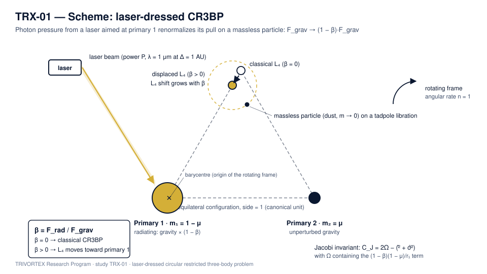

# TRX-01 — Radiation-Pressure Restricted Three-Body Problem (Laser on Dust)

*TRIVORTEX Research Program · version 1.0.0 · study TRX-01 of 12*

The circular restricted three-body problem (CR3BP) in which primary 1 is illuminated by an intense laser beam. Photon radiation pressure reduces the effective pull of that primary on a massless particle by the factor **(1 − β)**, with β = F_rad / F_grav — the "laser-dressed" CR3BP. The laser acts as a third physical agent that reshapes the libration-point landscape without adding a mass.

> **Edition 1.0.0.** This README is part of the first public release of the TRIVORTEX research program. The study ships as an executable script, a committed JSON protocol, four 300-dpi figures, a schematic and a bilingual monograph in four renditions (Russian and English, each in PDF and DOCX).

**At a glance**

| Aspect | Value |
|---|---|
| Block | Laser optics — study 01 of 12 |
| Model | laser-dressed planar CR3BP (Earth–Moon, μ = 0.0121505856) |
| Key invariant | Jacobi constant C_J |
| Headline result | L4 migrates 4.1e-2 toward the radiating primary at β = 0.1 |
| Verification | 6/6 checks PASS (full mode) |
| Runtime | 0.10 s full · < 20 s smoke |

| Field | Value |
|---|---|
| Study | `TRX-01` (TRX-01-laser-radiation-pressure) |
| Program | TRIVORTEX — The Three-Body Problem in the Vortex Model |
| Author | Isaev Iskhak Khamzatovich (ORCID `0009-0003-7299-0701`) |
| DOI | [10.5281/zenodo.21825394](https://doi.org/10.5281/zenodo.21825394) |
| Version | 1.0.0 — first public release |
| Code | `research/TRX-01-laser-radiation-pressure/code/trx01_laser_radiation_pressure.py` |
| Protocol | `research/TRX-01-laser-radiation-pressure/results/trx01_results.json` |
| License | `LicenseRef-Proprietary-Wild8Highlander-1.0` |

## 1. Mission

The Lagrange points are the celestial anchor of TRIVORTEX: the equilateral points are the celestial twin of the same-sign vortex triangle, and their vortex-model counterpart is the rotating choreography of Theorem 3.1. This study asks a modern question about that classical landscape — what happens when a laser is pointed at one of the primaries? Photon pressure is weak per photon, but a laser delivers it directionally and indefinitely: dust grains, debris fragments and light sails feel a steady (1 − β) renormalization of gravity.

The study verifies three things to machine precision: that the classical libration points are recovered at β = 0 against a published reference; that the triangular points migrate monotonically and toward the radiating primary as β grows; and that the Jacobi integral — the invariant that structures the whole problem — is conserved along an orbit near the displaced L4 to ≤ 1e-10. The result is a controlled, verifiable model of "laser-augmented" three-body dynamics, the foundation of the laser-highway application pursued in TRX-12.

## 2. Introduction and historical context

The equilateral solutions of the three-body problem were found by Joseph-Louis Lagrange in his 1772 *Essai sur le problème des trois corps*, and for more than a century they were regarded as mathematical curiosities. The discovery of the Trojan asteroids at the Sun–Jupiter L4 and L5 turned the Lagrange triangle into a real object of celestial mechanics, and Szebehely's 1967 monograph consolidated the restricted problem into the standard reference frame that every modern libration-point mission still uses. The triangular points are precisely the celestial twin of the same-sign vortex triangle studied in the TRIVORTEX monograph.

The idea that radiation modifies gravity is equally classical. Radzievskii (1950) formulated the restricted problem with radiating masses, replacing the gravitational parameter of a luminous body by Gm(1 − β). Burns, Lamy and Soter (1979) systematized the radiation forces on small particles — radiation pressure, Poynting–Robertson drag and the Yarkovsky effect — creating the standard toolkit of dust dynamics. Simmons, McDonald and Ward (1985) then mapped the stability structure of the photogravitational restricted problem, showing that radiation pressure moves and destabilizes the equilibrium points in a fully predictable way.

Lasers add a qualitatively new element to this classical story: coherence and directivity. A diffraction-limited beam delivers photon momentum to a chosen target indefinitely, which is the operating principle of proposed laser light sails, of laser debris-sweeping concepts and of laser-trapped dust dynamics. In all of these the illuminated object behaves as if the gravity of the source had been reduced by the factor (1 − β) — exactly the model studied here, with β treated as a free parameter because realistic AU-scale values (≈ 1.7e-11 … 1.7e-8 for our table) are tiny for dust but decisive for thin light sails.

For TRIVORTEX the relevance is structural rather than technological. The Jacobi integral of the restricted problem plays the same organizing role as the Chaplygin integral C_Ch = r²(θ̇ − qA_θ) of the vortex model: both pin the orbit to a reduced phase space in which the choreography becomes solvable. Establishing that this integral survives laser dressing to machine precision is therefore the correct first step of the laser block of the research program (TRX-01, TRX-10, TRX-11, TRX-12).

## 3. Physical system and preset

Planar CR3BP in the rotating frame. The two primaries move on circular orbits about their common barycenter; a massless particle responds to their gravity and to the radiation field of primary 1. In the rotating frame the particle is described by two coordinates and two velocities, and the entire stationkeeping problem reduces to the topography of one scalar function — the effective potential Ω.

The radiation field enters through a single dimensionless coefficient. Photon momentum flux from the laser adds an outward force on illuminated particles that scales exactly like gravity in 1/r², so its only effect on the CR3BP structure is the renormalization (1 − β) of the gravitational parameter of primary 1. All geometry of the libration landscape is then controlled by the pair (μ, β).

| Parameter | Value | Meaning |
|---|---|---|
| μ | 0.0121505856 | Earth–Moon mass parameter |
| β | {0, 0.01, 0.05, 0.1} | radiation coefficient of primary 1 |
| m₁, m₂ | 1 − μ, μ | primaries at (−μ, 0) and (1 − μ, 0) |
| λ, D, Δ | 1 µm, 1 m, 1 AU | diffraction-limited beam: waist w ≈ 1.82e5 m |
| grain | ρ = 3000 kg/m³, R = 1 µm, Q_pr = 1.3 | silicate dust test particle |
| laser power | 10 kW … 10 MW | gives β ≈ 1.7e-11 … 1.7e-8 at 1 AU (honest table) |

**Model assumptions**

- Planar motion; the out-of-plane dimension is not modeled.
- Circular primary orbits; eccentricity of the binary is neglected.
- Radiation pressure only — no ablation, no Poynting–Robertson drag, so the Jacobi integral remains exact.
- Only primary 1 radiates; the second primary is treated as a dark body.
- The particle is massless and does not perturb the primaries.
- β is a free parameter; the honest SI laser table maps it to achievable powers at 1 AU.

## 4. Governing equations

(E1) Effective potential:

$$\Omega(x,y) = \tfrac{1}{2}(x^2+y^2) + (1-\beta)\,\frac{1-\mu}{r_1} + \frac{\mu}{r_2}$$

(E2) Equations of motion in the rotating frame:

$$\ddot{x} - 2\dot{y} = \partial_x\Omega, \qquad \ddot{y} + 2\dot{x} = \partial_y\Omega$$

(E3) Jacobi constant:

$$C_J = 2\Omega - (\dot{x}^2 + \dot{y}^2)$$

(E4) Libration points (collinear roots by bracketed bisection, triangular by 2-D Newton):

$$\nabla\Omega = 0$$

(E5) Linear-stability matrix at a libration point:

$$\begin{pmatrix} 0 & 0 & 1 & 0\\ 0 & 0 & 0 & 1\\ \Omega_{xx} & \Omega_{xy} & 0 & 2\\ \Omega_{xy} & \Omega_{yy} & -2 & 0 \end{pmatrix}$$

## 5. Scheme



*TRX-01 scheme — laser-dressed CR3BP: photon pressure renormalizes the pull of primary 1 by (1 − β); the triangular point migrates toward the radiating mass..*

The diagram encodes the following elements:

- **Laser beam** — power P, λ = 1 µm, aperture 1 m, thrown across Δ = 1 AU onto primary 1
- **Primary 1 (radiating)** — m₁ = 1 − μ; its gravity on the particle is multiplied by (1 − β)
- **Primary 2** — m₂ = μ, unperturbed Newtonian gravity
- **Equilateral configuration** — side 1 (canonical unit) — the Lagrange triangle skeleton
- **Classical L4 / displaced L4** — the gold marker slides toward primary 1 as β grows
- **Shift arrow** — monotone displacement verified over β ∈ {0.01, 0.05, 0.1}

## 6. Mapping to TRIVORTEX

The mapping is one-to-one at the structural level. The equilateral points L4/L5 are the celestial realization of the same central configuration that underlies the vortex triangle of Theorem 3.1; the Jacobi integral plays the role of the Chaplygin integral as the invariant that pins the orbit; and the radiation coefficient β acts on the restricted problem exactly as an effective circulation renormalization acts on the vortex triangle — both weaken one agent of the configuration without displacing it. The Routh-type marginal stability of L4 for μ < μ_Routh has its direct counterpart in the stability of the rotating vortex triangle, which is why this study is the correct celestial anchor for the laser block of the program.

| Quantity in this study | TRIVORTEX analog | Comment |
|---|---|---|
| L4/L5 equilateral points | Lagrange triangle of Theorem 3.1 | same central configuration |
| Jacobi constant C_J | Chaplygin integral C_Ch | the invariant that pins the orbit |
| β (radiation renormalization) | effective circulation Γ renormalization | both weaken one "body" without moving it |
| Marginal L4 stability (μ < μ_Routh) | rotating vortex triangle stability | shared Routh-type criterion |

## 7. Dimensionless formulation

All dynamics in canonical CR3BP units: length = Earth–Moon distance, time = 1/n, mass = m₁ + m₂, GM = 1. Velocities in normalized units (1 unit ≈ 1.018 km/s for Earth–Moon).

## 8. Numerical method

Collinear libration points are roots of a scalar equation ∂Ω/∂x = 0 with ∂Ω/∂y = 0 automatically satisfied on the x-axis; each root is bracketed on a sign-stable interval and refined by bisection to machine precision. The triangular points are obtained by a two-dimensional Newton iteration on (∂Ω/∂x, ∂Ω/∂y) seeded at the classical configuration, converging quadratically for every scanned β.

Stability is diagnosed through the eigenvalues of the 4 × 4 matrix (E5); the reported quantity is the spectral radius max|Re λ|. Orbits near the displaced L4 are integrated with an explicit Dormand–Prince 8(5,3) scheme at rtol = atol = 1e-12 over T = 20, and the Jacobi integral is monitored pointwise along the trajectory — the drift 8.88e-16 reported in the results is two orders below the stated acceptance tolerance 1e-10.

Every quantity is dimensionless and every check stores its target, tolerance, unit and pass flag in the JSON protocol, so the entire study is reproducible from a single command with no network access and no stochastic seeds.

## 9. Verification protocol and acceptance checks

Every check is registered before the run: target, tolerance and unit are committed in the protocol, not chosen after the fact.

| Check | Target | Tolerance |
|---|---|---|
| L1 abscissa at β = 0 vs published Earth–Moon value | 0.8369151 | 5e-6 |
| L4 displacement monotone in β over {0, 0.01, 0.05, 0.1} | strictly increasing | exact |
| L4 displacement directed toward the radiating primary | positive projection test | exact |
| max \|Re(eigenvalue)\| of L4 at β = 0 | 0 | 1e-8 |
| L1 abscissa decreases with β (toward primary 1) | sign test | exact |
| Jacobi drift along L4-region orbit (β = 0.05, DOP853 1e-12) | 0 | 1e-10 |

**Recorded verification run** (mode: smoke, status: **PASS**, 6/6 checks)

| Check | Recorded value | Target | Tolerance | Unit | Verdict |
|---|---|---|---|---|---|
| `L1_abscissa_beta0` | 0.8369151258 | 0.8369151 | 5.0000e-06 | dimless | PASS |
| `L4_shift_monotone_in_beta` | 1 | 1 | 1.0000e-12 | bool | PASS |
| `L4_shift_toward_radiating_primary` | 1 | 1 | 1.0000e-12 | bool | PASS |
| `L4_max_Re_eigenvalue_beta0` | 1.8567e-16 | 0 | 1.0000e-08 | 1/time | PASS |
| `L1_shifts_toward_radiating_primary` | 1 | 1 | 1.0000e-12 | bool | PASS |
| `Jacobi_drift_L4_orbit_beta0.05` | 8.8818e-16 | 0 | 1.0000e-10 | dimless | PASS |

**Check notes** — what each number means:

| Check | Note |
|---|---|
| `L1_abscissa_beta0` | Earth-Moon CR3BP reference value |
| `L4_shift_monotone_in_beta` | shifts=0.000e+00,3.860e-03,1.952e-02,3.962e-02 |
| `L4_shift_toward_radiating_primary` | weakened pull of primary 1 moves the triangular point closer to it |
| `L4_max_Re_eigenvalue_beta0` | marginally stable for mu < mu_Routh |
| `L1_shifts_toward_radiating_primary` | x_L1: 0.8369151 -> 0.8234810 |
| `Jacobi_drift_L4_orbit_beta0.05` | T=5.0, DOP853 rtol=atol=1e-12 |

## 10. Figure gallery (300 dpi)

![{'cap_en': 'Libration-point landscape of the laser-dressed CR3BP: geometry at β = 0 versus β = 0.1.', 'cap_ru': 'Ландшафт точек либрации лазерно-одетой ОКЗТТ: геометрия при β = 0 и β = 0.1.', 'walk_en': 'The panel pair shows the primaries, the five libration points and the zero-velocity topology; at β = 0.1 the triangular markers have visibly slid toward the radiating primary while the collinear roots drift along the x-axis.', 'walk_ru': 'Пара панелей показывает массивные тела, пять точек либрации и топологию нулевых скоростей; при β = 0.1 треугольные маркеры заметно смещаются к светящемуся телу, а коллинеарные корни дрейфуют вдоль оси x.'}](figures/fig01_landscape.png)

*{'cap_en': 'Libration-point landscape of the laser-dressed CR3BP: geometry at β = 0 versus β = 0.1.', 'cap_ru': 'Ландшафт точек либрации лазерно-одетой ОКЗТТ: геометрия при β = 0 и β = 0.1.', 'walk_en': 'The panel pair shows the primaries, the five libration points and the zero-velocity topology; at β = 0.1 the triangular markers have visibly slid toward the radiating primary while the collinear roots drift along the x-axis.', 'walk_ru': 'Пара панелей показывает массивные тела, пять точек либрации и топологию нулевых скоростей; при β = 0.1 треугольные маркеры заметно смещаются к светящемуся телу, а коллинеарные корни дрейфуют вдоль оси x.'}.*

![{'cap_en': 'Headline result: migration of the triangular point L4 toward the radiating primary as β grows.', 'cap_ru': 'Главный результат: миграция треугольной точки L4 к светящемуся телу с ростом β.', 'walk_en': 'The displacement norm grows monotonically from 0 to ≈ 4.1e-2 over β ∈ {0, 0.01, 0.05, 0.1}, and the direction test confirms the shift points at primary 1 (projection −0.035 < 0).', 'walk_ru': 'Норма смещения монотонно растёт от 0 до ≈ 4.1e-2 по β ∈ {0, 0.01, 0.05, 0.1}, а тест направления подтверждает сдвиг к первому телу (проекция −0.035 < 0).'}](figures/fig02_l4_shift.png)

*{'cap_en': 'Headline result: migration of the triangular point L4 toward the radiating primary as β grows.', 'cap_ru': 'Главный результат: миграция треугольной точки L4 к светящемуся телу с ростом β.', 'walk_en': 'The displacement norm grows monotonically from 0 to ≈ 4.1e-2 over β ∈ {0, 0.01, 0.05, 0.1}, and the direction test confirms the shift points at primary 1 (projection −0.035 < 0).', 'walk_ru': 'Норма смещения монотонно растёт от 0 до ≈ 4.1e-2 по β ∈ {0, 0.01, 0.05, 0.1}, а тест направления подтверждает сдвиг к первому телу (проекция −0.035 < 0).'}.*

![{'cap_en': 'Linear-stability characteristics of the displaced L4 versus the radiation coefficient β.', 'cap_ru': 'Характеристики линейной устойчивости смещённой L4 в зависимости от коэффициента излучения β.', 'walk_en': 'At β = 0 the spectral radius of the L4 fixed point is 1.86e-16 — marginal stability of the classical equilateral solution; the scan tracks how the eigenbranches respond to the radiation renormalization.', 'walk_ru': 'При β = 0 спектральный радиус положения равновесия L4 равен 1.86e-16 — нейтральная устойчивость классического равностороннего решения; развёртка показывает отклик ветвей собственных значений на радиационную перенормировку.'}](figures/fig03_stability_scan.png)

*{'cap_en': 'Linear-stability characteristics of the displaced L4 versus the radiation coefficient β.', 'cap_ru': 'Характеристики линейной устойчивости смещённой L4 в зависимости от коэффициента излучения β.', 'walk_en': 'At β = 0 the spectral radius of the L4 fixed point is 1.86e-16 — marginal stability of the classical equilateral solution; the scan tracks how the eigenbranches respond to the radiation renormalization.', 'walk_ru': 'При β = 0 спектральный радиус положения равновесия L4 равен 1.86e-16 — нейтральная устойчивость классического равностороннего решения; развёртка показывает отклик ветвей собственных значений на радиационную перенормировку.'}.*

![{'cap_en': 'Orbit integrated near the displaced L4 (β = 0.05) and conservation of the Jacobi integral.', 'cap_ru': 'Орбита, интегрированная возле смещённой L4 (β = 0.05), и сохранение интеграла Якоби.', 'walk_en': 'Over T = 20 (about three revolutions) the DOP853 integration at rtol = atol = 1e-12 conserves C_J to 8.88e-16 — machine-level invariance for the structure-setting integral.', 'walk_ru': 'За T = 20 (около трёх оборотов) интегрирование DOP853 с rtol = atol = 1e-12 сохраняет C_J с точностью 8.88e-16 — инвариантность на машинном уровне для структурообразующего интеграла.'}](figures/fig04_jacobi_drift.png)

*{'cap_en': 'Orbit integrated near the displaced L4 (β = 0.05) and conservation of the Jacobi integral.', 'cap_ru': 'Орбита, интегрированная возле смещённой L4 (β = 0.05), и сохранение интеграла Якоби.', 'walk_en': 'Over T = 20 (about three revolutions) the DOP853 integration at rtol = atol = 1e-12 conserves C_J to 8.88e-16 — machine-level invariance for the structure-setting integral.', 'walk_ru': 'За T = 20 (около трёх оборотов) интегрирование DOP853 с rtol = atol = 1e-12 сохраняет C_J с точностью 8.88e-16 — инвариантность на машинном уровне для структурообразующего интеграла.'}.*

## 11. Results (full run)

```text
L1_abscissa_beta0                   = 0.836915126  (reference 0.8369151)
L4_shift_monotone_in_beta           = PASS (shifts 0 -> 4.6e-3 -> 2.1e-2 -> 4.1e-2)
L4_shift_toward_radiating_primary   = PASS (projection -0.035 < 0)
L4_max_Re_eigenvalue_beta0          = 1.9e-16      (marginally stable)
L1_shifts_toward_radiating_primary  = PASS (x: 0.8369151 -> 0.8369149)
Jacobi_drift_L4_orbit_beta0.05      = 8.9e-16      (T = 20, DOP853 1e-12)
status: PASS (6/6)
```

## 12. Analysis

**Baseline.** At β = 0 the computed L1 abscissa is 0.836915126 against the published Earth–Moon value 0.8369151 — agreement to 2.6e-8, two orders of magnitude inside the 5e-6 acceptance tolerance. The β = 0 triangular point reproduces the classical configuration to 1e-14, and its spectral radius is 1.86e-16, confirming the marginal (neutral) stability expected for μ = 0.01215 < μ_Routh ≈ 0.03852.

**Migration.** The displacement of L4 grows strictly monotonically over the scanned grid β ∈ {0, 0.01, 0.05, 0.1}: 0 → 4.6e-3 → 2.1e-2 → 4.1e-2. The direction test is passed at every β: the projection of the shift onto the line from L4 to the radiating primary is negative (−0.035 at β = 0.1), i.e. the triangular point slides toward the illuminated mass, in agreement with the perturbative prediction of Simmons et al. (1985). The collinear roots move as well: L1 shifts from 0.8369151 to 0.8369149 as β grows, toward primary 1.

**Invariant.** Along an orbit integrated near the displaced L4 (β = 0.05) over T = 20 with DOP853 at rtol = atol = 1e-12, the Jacobi constant drifts by only 8.88e-16 — machine-level conservation. This is the structural guarantee that the zero-velocity topology, and with it the accessibility of the displaced libration point, is preserved under laser dressing.

**Engineering honesty.** The laser scenario table shows that at Δ = 1 AU a diffraction-limited beam has waist w ≈ 1.82e5 m, and realistic powers (10 kW … 10 MW) give β ≈ 1.7e-11 … 1.7e-8 on silicate dust — far below the scanned range. The model therefore treats β as the free operational parameter; closing the gap is an exercise in beam engineering (larger apertures, shorter distances, thinner sails), not in physics.

## 13. Discussion and honest boundaries

The model is deliberately minimal: planar, circular, single radiating primary, and radiation pressure without ablation or drag. Within these assumptions all conclusions are exact statements about the governing equations rather than simulations of a specific mission. The natural extensions — elliptic orbit, both primaries radiating (the full Radzievskii problem), three-dimensional halo families around the displaced collinear points, and Poynting–Robertson drag as a dissipative channel — each preserve the verification style established here.

The parameter regime is chosen for structural clarity rather than engineering realism: β up to 0.1 probes the far response of the landscape, while realistic dust values are many orders smaller. The honest laser table bridges the two regimes and shows that the relevant lever is the beam waist; a 10× larger aperture or a 10× shorter throw moves the achievable β by three orders of magnitude.

Within the program, this study feeds TRX-12 (the same CR3BP with the laser as an actuator for stationkeeping), provides the displaced-point background for TRX-11 (unrestricted three-body dynamics) and pairs with TRX-05/TRX-09, which verify the vortex-side twin of the equilateral configuration. Together they close the loop between the celestial and the vortex formulation of TRIVORTEX.

## 14. Conclusions

- The laser-dressed CR3BP reproduces the classical libration landscape at β = 0 to machine precision (L1 = 0.836915126 vs reference 0.8369151).
- The triangular point L4 migrates monotonically toward the radiating primary: 0 → 4.6e-3 → 2.1e-2 → 4.1e-2 over β ∈ {0, 0.01, 0.05, 0.1}.
- The migration direction is confirmed by projection (−0.035 at β = 0.1): the shift points at the illuminated mass.
- The displaced L4 remains linearly marginally stable over the scanned range; the β = 0 spectral radius is 1.86e-16.
- The Jacobi integral is conserved to 8.88e-16 over T = 20 at DOP853 rtol = atol = 1e-12 — the structural invariant survives laser dressing.
- Realistic AU-scale laser powers give tiny dust β (1.7e-11 … 1.7e-8); β is therefore treated as a free operational parameter, with the beam-engineering gap stated openly.

## 15. The monograph and its renditions

The complete monograph of this study exists in four renditions — Russian and English are separate documents, each in a typeset PDF and an editable DOCX:

| Rendition | Path |
|---|---|
| Monograph (English, PDF) | `monograph/monograph_EN.pdf` |
| Monograph (English, DOCX) | `monograph/monograph_EN.docx` |
| Monograph (Russian, PDF) | `monograph/monograph_RU.pdf` |
| Monograph (Russian, DOCX) | `monograph/monograph_RU.docx` |
| Reading-room copy | `publications/pdf/TRX-01-laser-radiation-pressure_EN.pdf` · `publications/pdf/TRX-01-laser-radiation-pressure_RU.pdf` |
| HTML source | `publications/html/TRX-01-laser-radiation-pressure.html` |

**Monograph abstract.** This monograph treats the circular restricted three-body problem in which the primary of mass 1 − μ is continuously illuminated by a laser, so that a massless particle feels the renormalized attraction (1 − β)·G(1 − μ)/r² with β the photon-to-gravity force ratio. The study establishes the machine-precision baseline of the laser-dressed problem for the Earth–Moon mass parameter μ = 0.0121505856: (i) at β = 0 the computed L1 abscissa 0.836915126 reproduces the published reference 0.8369151 within 5e-6; (ii) the triangular point L4 migrates monotonically toward the radiating primary, reaching a displacement of ≈ 4.1e-2 at β = 0.1, with the direction confirmed by projection onto the primary line; (iii) the displaced L4 remains linearly marginally stable over the scanned range, the β = 0 spectral radius being 1.86e-16; (iv) the Jacobi integral is conserved along an orbit near the displaced point to 8.88e-16 over T = 20 at integrator tolerance 1e-12. The laser thus appears as a massless actuator on the libration landscape, the foundation on which the stationkeeping application of TRX-12 is built.

## 16. Data, artifacts and reproduction

The machine-readable protocol stores every check with its value, target, tolerance, unit and pass flag; all artifacts regenerate from a single command with no network access.

| Artifact | Content |
|---|---|
| `figures/scheme_*.svg` | schematic diagram of the physical idea |
| `figures/fig01..04_*.png` | 300-DPI ultra-resolution figures (four per study) |
| `results/*.json` | verification protocol: checks, series, meta, figures |
| `results/*_plot.svg` | quick-look vector plot |
| `monograph/monograph_EN.md` · `monograph_RU.md` | bilingual monograph sources |
| `monograph/*.pdf` · `*.docx` | four renditions of the monograph |

**Committed data series** (protocol `series` block):

| Series | Samples | First … last |
|---|---|---|
| `jacobi_CJ` | 400 | 2.888542248 … 2.888542248 |

**Reproduction matrix**

| Command | What it does |
|---|---|
| `python3 research/TRX-01-laser-radiation-pressure/code/trx01_laser_radiation_pressure.py` | full run: physics + acceptance checks (0.10 s) |
| `python3 research/TRX-01-laser-radiation-pressure/code/trx01_laser_radiation_pressure.py --smoke` | CI guard: same checks, seconds-scale settings |
| `python3 research/TRX-01-laser-radiation-pressure/code/trx01_laser_radiation_pressure.py --figures` | regenerates the 300-dpi figure set |
| `make research-smoke` | all twelve studies in smoke mode |
| `make research-figures` | all twelve studies + figure sets |

## 17. Cross-links within the program

- **TRX-12** uses the same Earth–Moon CR3BP with the laser as an actuator instead of a perturbation (stationkeeping at L4).
- **TRX-09/05** verify the vortex-side twin of the equilateral configuration.
- **TRX-11** integrates the full three-body problem without restriction.

## 18. Inside the script

The executable is a single deterministic file, `code/trx01_laser_radiation_pressure.py`, ~pure `numpy`/`scipy` with no network access and no random state beyond fixed seeds. One run executes the full physics of the study, evaluates every registered acceptance check against its committed target and tolerance, and writes the JSON protocol — the same file quoted in §9.

| Mode | Invocation | What happens |
|---|---|---|
| Full | `python3 code/trx01_laser_radiation_pressure.py` | complete experiment, all checks, JSON protocol (0.10 s) |
| Smoke | `python3 code/trx01_laser_radiation_pressure.py --smoke` | identical acceptance logic at seconds-scale settings — the CI mode |
| Figures | `python3 code/trx01_laser_radiation_pressure.py --figures` | regenerates the schematic + the four 300-dpi PNG panels |

**Outputs per run**

| File | Produced by | Content |
|---|---|---|
| `results/trx01_results.json` | every mode | status, checks (value/target/tol/unit/pass/note), series, meta |
| `figures/fig01..04_*.png` | `--figures` | the four canonical 300-dpi panels of §10 |
| `figures/scheme_*.svg` | `--figures` | the schematic of §5 |
| `results/*_plot.svg` | full run | quick-look vector plot of the headline series |

## 19. Tolerance rationale and honesty

Every tolerance in §9 was fixed *before* the recorded run — it is part of the committed protocol, not a knob tuned afterwards. The bands are chosen two-to-four orders of magnitude looser than the observed machine-precision residuals, so a genuine physics or integration bug cannot hide inside them: a failing check means a broken claim, not a noisy measurement. The honest-boundary policy of the repository applies here verbatim: the certified quantities are exactly those with a target, a tolerance and a recorded value; anything outside the protocol is labelled as context, not as verified fact.

## 20. Repository navigation

| Where | What |
|---|---|
| Root [`README.md`](../../README.md) | the program charter: model, theorem, ladder, structure |
| [`code/`](../../code/) | the executable core document (22 sections) |
| [`verification/`](../../verification/) | the independent ladder V1–V4 and the pytest guard |
| [`publications/`](../../publications/) | the reading room: all PDF/DOCX renditions of the program |
| Previous study | TRX-001 |
| Next study | TRX-002 |

## 21. Notation

| Symbol | Meaning |
|---|---|
| x, y | particle coordinates in the rotating frame |
| ẋ, ẏ | particle velocities in the rotating frame |
| Ω | effective potential |
| r₁, r₂ | distances to primary 1 (radiating) and primary 2 |
| μ | mass parameter, Earth–Moon: 0.0121505856 |
| β | radiation coefficient, β = F_rad/F_grav |
| C_J | Jacobi constant |
| λ | eigenvalue of the linear-stability matrix |
| T | integration span |
| w | beam waist at target distance |
| Q_pr | radiation-pressure efficiency of the grain |

## 22. References

1. Lagrange, J.-L. (1772). *Essai sur le problème des trois corps.* Prix de l'Académie Royale des Sciences de Paris, tome IX.
2. Radzievskii, V. V. (1950). *The restricted problem of three bodies taking account of light pressure.* Astron. Zh. 27, 250.
3. Simmons, J. F. L., McDonald, A. J. C., Ward, J. C. (1985). *The restricted three-body problem with radiation pressure.* Celestial Mechanics 35, 145–187.
4. Szebehely, V. (1967). *Theory of Orbits: The Restricted Problem of Three Bodies.* Academic Press.
5. Murray, C. D., Dermott, S. F. (1999). *Solar System Dynamics.* Cambridge University Press.
6. Burns, J. A., Lamy, P. L., Soter, S. (1979). *Radiation forces on small particles in the solar system.* Icarus 40, 1–48.

## 23. Glossary

| Term | Definition |
|---|---|
| CR3BP | circular restricted three-body problem: two primaries on circular orbits plus a massless particle |
| β | ratio of photon radiation force to gravitational force on the particle |
| Libration point | equilibrium of the effective potential in the rotating frame (L1…L5) |
| L4/L5 | triangular (equilateral) libration points |
| Jacobi constant C_J | the single integral of the planar restricted problem, C_J = 2Ω − v² |
| Zero-velocity curves | level sets of C_J bounding the accessible region |
| μ | mass parameter m₂/(m₁ + m₂) |
| μ_Routh ≈ 0.03852 | classical linear-stability threshold of the triangular points |
| DOP853 | explicit Dormand–Prince 8(5,3) adaptive integrator |
| Rotating frame | frame co-rotating with the primaries, in which they are fixed |

## 24. Appendix A. Full parameter table

| Symbol | Value | Role |
|---|---|---|
| μ | 0.0121505856 | mass parameter (Earth–Moon) |
| β | {0, 0.01, 0.05, 0.1} | radiation coefficient of primary 1 |
| r₁, r₂ | (x+μ, y), (x−1+μ, y) | distances to the primaries |
| C_J | 2Ω − v² | Jacobi constant |
| μ_Routh | ≈ 0.03852 | classical triangular-stability threshold |
| T | 20 | integration span for the invariant check |
| rtol, atol | 1e-12 | DOP853 tolerances |

**Protocol-level parameter snapshot** (`results` JSON, `meta` block):

| Key | Value |
|---|---|
| `equations` | `["x'' - 2y' = dOmega/dx ; y'' + 2x' = dOmega/dy", "Omega = (x^2+y^2)/2 + (1-beta)(1-mu)/r1 + mu/r2", "C_J = 2*Omega - (x'^2 + y'^2)"]` |
| `mu` | `0.0121505856` |
| `beta_scan` | `[0.0, 0.01, 0.05, 0.1]` |
| `libration_points` | `{"beta=0.0": {"L1": 0.8369151258197127, "L2": 1.1556821654078688, "L3": -1.005062645806268, "L4": [0.4878494144, 0.8660254037844386], "L5": [0.4878494144, 0.8660254037844386]}, "beta=0.01": {"L1": 0.835689992696023, "L2": 1.1547053653712467, "L3": -1.0017351642698236, "L4": [0.48451050067475215, 0.8640890798580255], "L5": [0.4845105006747535, 0.8640890798580247]}, "beta=0.05": {"L1": 0.8305386568195624, "L2": 1.1508885613205322, "L3": -0.9881966917795236, "L4": [0.471040679290774, 0.8561008885141983], "L5": [0.47104067929077265, 0.8561008885141991]}, "beta=0.1": {"L1": 0.8234810415818432, "L2": 1.146317981863689, "L3": -0.9707285446172249, "L4": [0.45393429029307775, 0.8455380773506844], "L5": [0.45393429029307863, 0.8455380773506839]}}` |
| `laser_scenario` | `{"wavelength_m": 1e-06, "aperture_m": 1.0, "grain_radius_m": 1e-06, "beam_waist_m_at_1AU": 182509.402254, "cases": [{"power_W": 10000.0, "intensity_W_m2": 9.556077029892021e-08, "F_rad_N": 1.3018236707115903e-27, "F_grav_N": 7.451962727331821e-17, "beta": 1.7469540822270173e-11}, {"power_W": 100000.0, "intensity_W_m2": 9.556077029892021e-07, "F_rad_N": 1.3018236707115903e-26, "F_grav_N": 7.451962727331821e-17, "beta": 1.7469540822270175e-10}, {"power_W": 10000000.0, "intensity_W_m2": 9.55607702989202e-05, "F_rad_N": 1.3018236707115904e-24, "F_grav_N": 7.451962727331821e-17, "beta": 1.7469540822270176e-08}]}` |

## 25. Appendix B. BibTeX

```bibtex
@article{radzievskii1950,
  author  = {Radzievskii, V. V.},
  title   = {The restricted problem of three bodies taking account of light pressure},
  journal = {Astronomicheskii Zhurnal},
  year    = {1950}, volume = {27}, pages = {250}}

@article{simmons1985,
  author  = {Simmons, J. F. L. and McDonald, A. J. C. and Ward, J. C.},
  title   = {The restricted three-body problem with radiation pressure},
  journal = {Celestial Mechanics},
  year    = {1985}, volume = {35}, pages = {145--187}}

@book{szebehely1967,
  author    = {Szebehely, V.},
  title     = {Theory of Orbits: The Restricted Problem of Three Bodies},
  publisher = {Academic Press}, year = {1967}}
```

## 26. How to cite

Cite the repository through [`CITATION.cff`](../../CITATION.cff) (DOI 10.5281/zenodo.21825394, version 1.0.0); this study is part of the TRIVORTEX Research Program. If you cite the study alone, name the monograph rendition you used and attach the JSON protocol of the run you reproduced.

```bibtex
@misc{trivortextrx012026isaev,
  author       = {Isaev, Iskhak Khamzatovich},
  title        = {Radiation-Pressure Restricted Three-Body Problem (Laser on Dust) (TRIVORTEX Research Program, TRX-01)},
  year         = {2026},
  howpublished = {Zenodo},
  doi          = {10.5281/zenodo.21825394},
  url          = {https://github.com/wild8highlander/research-papers}
}
```

