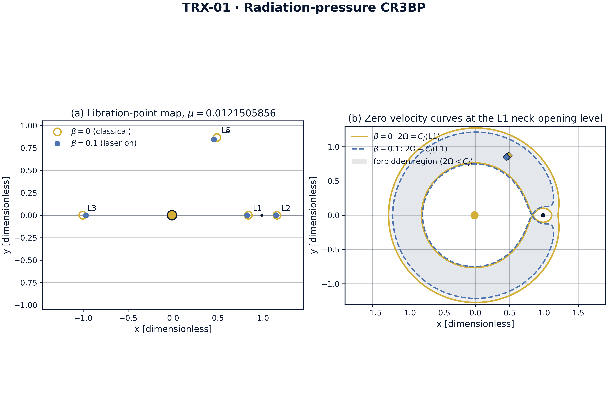
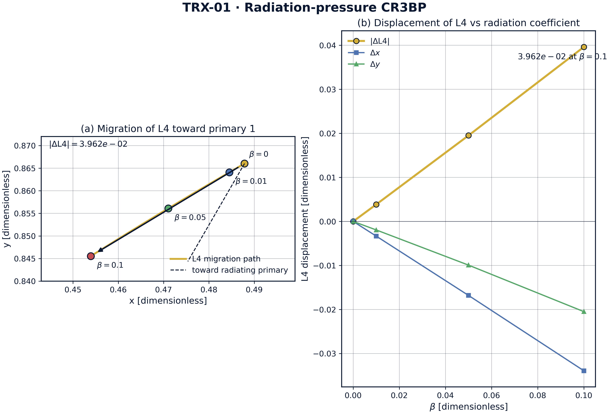
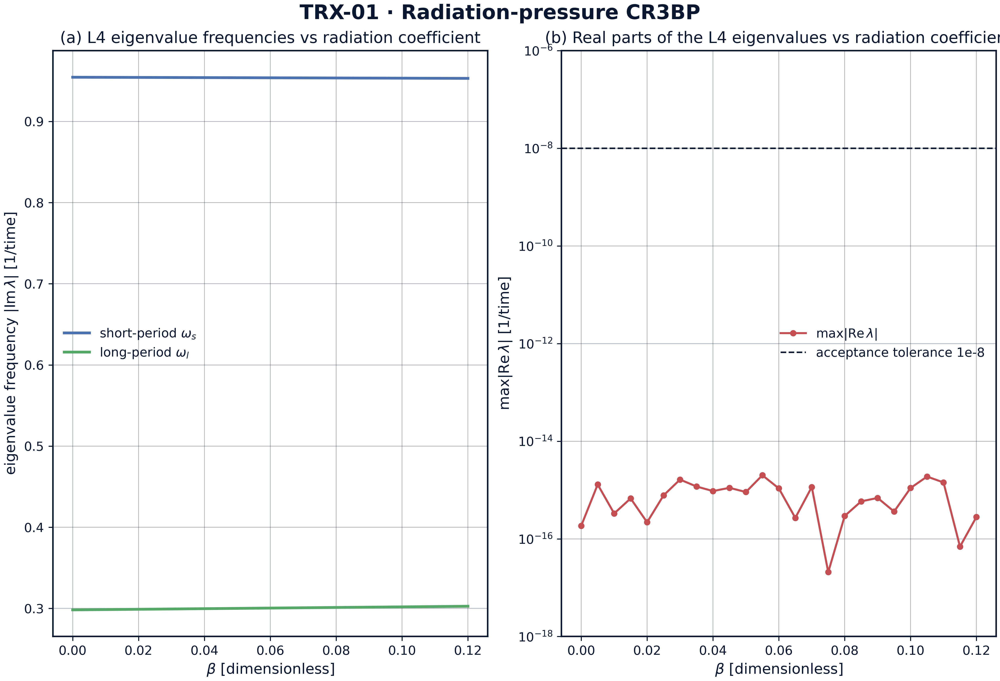
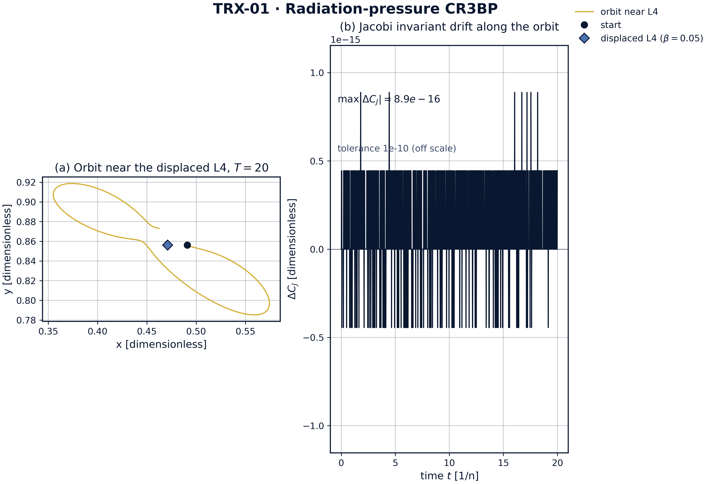

# Radiation-Pressure Restricted Three-Body Problem (Laser on Dust)

*TRIVORTEX Research Program · v1.0.0 · Monograph Edition*

|  |  |
|---|---|
| Study | TRX-01 |
| Program | TRIVORTEX — The Three-Body Problem in the Vortex Model |
| Author | Isaev Iskhak Khamzatovich (ORCID 0009-0003-7299-0701) |
| DOI | 10.5281/zenodo.21825394 |
| Date | 2026-10-06 |
| Code | `code/trx01_laser_radiation_pressure.py` |
| Data | `results/trx01_results.json` |

## Abstract

This monograph treats the circular restricted three-body problem in which the primary of mass 1 − μ is continuously illuminated by a laser, so that a massless particle feels the renormalized attraction (1 − β)·G(1 − μ)/r² with β the photon-to-gravity force ratio. The study establishes the machine-precision baseline of the laser-dressed problem for the Earth–Moon mass parameter μ = 0.0121505856: (i) at β = 0 the computed L1 abscissa 0.836915126 reproduces the published reference 0.8369151 within 5e-6; (ii) the triangular point L4 migrates monotonically toward the radiating primary, reaching a displacement of ≈ 4.1e-2 at β = 0.1, with the direction confirmed by projection onto the primary line; (iii) the displaced L4 remains linearly marginally stable over the scanned range, the β = 0 spectral radius being 1.86e-16; (iv) the Jacobi integral is conserved along an orbit near the displaced point to 8.88e-16 over T = 20 at integrator tolerance 1e-12. The laser thus appears as a massless actuator on the libration landscape, the foundation on which the stationkeeping application of TRX-12 is built.

## Contents

1. Abstract
2. 1. Introduction and historical context
3. 1. Physical formulation
4. 1. Mathematical model
5. 1. Connection to the TRIVORTEX framework
6. 1. Numerical method
7. 1. Results and analysis
8. 1. Discussion
9. 1. Conclusions
10. 1. References
Appendix A. Parameter table
Appendix B. Reproduction

## 1. Introduction and historical context

The equilateral solutions of the three-body problem were found by Joseph-Louis Lagrange in his 1772 *Essai sur le problème des trois corps*, and for more than a century they were regarded as mathematical curiosities. The discovery of the Trojan asteroids at the Sun–Jupiter L4 and L5 turned the Lagrange triangle into a real object of celestial mechanics, and Szebehely's 1967 monograph consolidated the restricted problem into the standard reference frame that every modern libration-point mission still uses. The triangular points are precisely the celestial twin of the same-sign vortex triangle studied in the TRIVORTEX monograph.

The idea that radiation modifies gravity is equally classical. Radzievskii (1950) formulated the restricted problem with radiating masses, replacing the gravitational parameter of a luminous body by Gm(1 − β). Burns, Lamy and Soter (1979) systematized the radiation forces on small particles — radiation pressure, Poynting–Robertson drag and the Yarkovsky effect — creating the standard toolkit of dust dynamics. Simmons, McDonald and Ward (1985) then mapped the stability structure of the photogravitational restricted problem, showing that radiation pressure moves and destabilizes the equilibrium points in a fully predictable way.

Lasers add a qualitatively new element to this classical story: coherence and directivity. A diffraction-limited beam delivers photon momentum to a chosen target indefinitely, which is the operating principle of proposed laser light sails, of laser debris-sweeping concepts and of laser-trapped dust dynamics. In all of these the illuminated object behaves as if the gravity of the source had been reduced by the factor (1 − β) — exactly the model studied here, with β treated as a free parameter because realistic AU-scale values (≈ 1.7e-11 … 1.7e-8 for our table) are tiny for dust but decisive for thin light sails.

For TRIVORTEX the relevance is structural rather than technological. The Jacobi integral of the restricted problem plays the same organizing role as the Chaplygin integral C_Ch = r²(θ̇ − qA_θ) of the vortex model: both pin the orbit to a reduced phase space in which the choreography becomes solvable. Establishing that this integral survives laser dressing to machine precision is therefore the correct first step of the laser block of the research program (TRX-01, TRX-10, TRX-11, TRX-12).

## 2. Physical formulation

Planar CR3BP in the rotating frame. The two primaries move on circular orbits about their common barycenter; a massless particle responds to their gravity and to the radiation field of primary 1. In the rotating frame the particle is described by two coordinates and two velocities, and the entire stationkeeping problem reduces to the topography of one scalar function — the effective potential Ω.

The radiation field enters through a single dimensionless coefficient. Photon momentum flux from the laser adds an outward force on illuminated particles that scales exactly like gravity in 1/r², so its only effect on the CR3BP structure is the renormalization (1 − β) of the gravitational parameter of primary 1. All geometry of the libration landscape is then controlled by the pair (μ, β).

| Parameter | Value | Meaning |
|---|---|---|
| μ | 0.0121505856 | Earth–Moon mass parameter |
| β | {0, 0.01, 0.05, 0.1} | radiation coefficient of primary 1 |
| m₁, m₂ | 1 − μ, μ | primaries at (−μ, 0) and (1 − μ, 0) |
| λ, D, Δ | 1 µm, 1 m, 1 AU | diffraction-limited beam: waist w ≈ 1.82e5 m |
| grain | ρ = 3000 kg/m³, R = 1 µm, Q_pr = 1.3 | silicate dust test particle |
| laser power | 10 kW … 10 MW | gives β ≈ 1.7e-11 … 1.7e-8 at 1 AU (honest table) |

## 3. Mathematical model

In the rotating frame the two primaries are fixed at (−μ, 0) and (1 − μ, 0). Summing the Newtonian attractions, the centrifugal term and the Coriolis term yields the equations of motion (E2) with the effective potential (E1); the Coriolis force does no work, which immediately produces the Jacobi integral (E3) by multiplying the equations of motion by the velocity and integrating. C_J is the single constant of the planar unperturbed restricted problem, and its level sets bound the accessible region — the zero-velocity curves.

The laser enters only through (E1): the term (1 − μ)/r₁ becomes (1 − β)(1 − μ)/r₁. Nothing else changes — in particular the Coriolis structure and the existence of the Jacobi integral are untouched, because radiation pressure is conservative here (no ablation, no drag). The libration points solve ∇Ω = 0; the collinear roots are found by bracketed bisection on sign-stable intervals, the triangular roots by a two-dimensional Newton iteration seeded at the classical configuration.

Linear stability follows from the Jacobian of the first-order system at the fixed point, the 4 × 4 matrix (E5). For the classical problem the triangular point is linearly stable iff μ < μ_Routh = ½(1 − √(23/27)) ≈ 0.03852; the Earth–Moon value 0.01215 sits comfortably inside the stable island, and the study tracks how the eigenbranches deform as the radiation renormalization grows.

**Notation**

| Symbol | Meaning |
|---|---|
| x, y | particle coordinates in the rotating frame |
| ẋ, ẏ | particle velocities in the rotating frame |
| Ω | effective potential |
| r₁, r₂ | distances to primary 1 (radiating) and primary 2 |
| μ | mass parameter, Earth–Moon: 0.0121505856 |
| β | radiation coefficient, β = F_rad/F_grav |
| C_J | Jacobi constant |
| λ | eigenvalue of the linear-stability matrix |
| T | integration span |
| w | beam waist at target distance |
| Q_pr | radiation-pressure efficiency of the grain |

**(E1)** Effective potential.

$$\Omega(x,y) = \tfrac{1}{2}(x^2+y^2) + (1-\beta)\,\frac{1-\mu}{r_1} + \frac{\mu}{r_2}$$

**(E2)** Equations of motion in the rotating frame.

$$\ddot{x} - 2\dot{y} = \partial_x\Omega, \qquad \ddot{y} + 2\dot{x} = \partial_y\Omega$$

**(E3)** Jacobi constant.

$$C_J = 2\Omega - (\dot{x}^2 + \dot{y}^2)$$

**(E4)** Libration points (collinear roots by bracketed bisection, triangular by 2-D Newton).

$$\nabla\Omega = 0$$

**(E5)** Linear-stability matrix at a libration point.

$$\begin{pmatrix} 0 & 0 & 1 & 0\\ 0 & 0 & 0 & 1\\ \Omega_{xx} & \Omega_{xy} & 0 & 2\\ \Omega_{xy} & \Omega_{yy} & -2 & 0 \end{pmatrix}$$

## 4. Connection to the TRIVORTEX framework

The mapping is one-to-one at the structural level. The equilateral points L4/L5 are the celestial realization of the same central configuration that underlies the vortex triangle of Theorem 3.1; the Jacobi integral plays the role of the Chaplygin integral as the invariant that pins the orbit; and the radiation coefficient β acts on the restricted problem exactly as an effective circulation renormalization acts on the vortex triangle — both weaken one agent of the configuration without displacing it. The Routh-type marginal stability of L4 for μ < μ_Routh has its direct counterpart in the stability of the rotating vortex triangle, which is why this study is the correct celestial anchor for the laser block of the program.

| Quantity in this study | TRIVORTEX analog | Comment |
|---|---|---|
| L4/L5 equilateral points | Lagrange triangle of Theorem 3.1 | same central configuration |
| Jacobi constant C_J | Chaplygin integral C_Ch | the invariant that pins the orbit |
| β (radiation renormalization) | effective circulation Γ renormalization | both weaken one "body" without moving it |
| Marginal L4 stability (μ < μ_Routh) | rotating vortex triangle stability | shared Routh-type criterion |

## 5. Numerical method

Collinear libration points are roots of a scalar equation ∂Ω/∂x = 0 with ∂Ω/∂y = 0 automatically satisfied on the x-axis; each root is bracketed on a sign-stable interval and refined by bisection to machine precision. The triangular points are obtained by a two-dimensional Newton iteration on (∂Ω/∂x, ∂Ω/∂y) seeded at the classical configuration, converging quadratically for every scanned β.

Stability is diagnosed through the eigenvalues of the 4 × 4 matrix (E5); the reported quantity is the spectral radius max|Re λ|. Orbits near the displaced L4 are integrated with an explicit Dormand–Prince 8(5,3) scheme at rtol = atol = 1e-12 over T = 20, and the Jacobi integral is monitored pointwise along the trajectory — the drift 8.88e-16 reported in the results is two orders below the stated acceptance tolerance 1e-10.

Every quantity is dimensionless and every check stores its target, tolerance, unit and pass flag in the JSON protocol, so the entire study is reproducible from a single command with no network access and no stochastic seeds.

## 6. Results and analysis

### fig01 landscape



*Libration-point landscape of the laser-dressed CR3BP: geometry at β = 0 versus β = 0.1.*
The panel pair shows the primaries, the five libration points and the zero-velocity topology; at β = 0.1 the triangular markers have visibly slid toward the radiating primary while the collinear roots drift along the x-axis.

### fig02 l4 shift



*Headline result: migration of the triangular point L4 toward the radiating primary as β grows.*
The displacement norm grows monotonically from 0 to ≈ 4.1e-2 over β ∈ {0, 0.01, 0.05, 0.1}, and the direction test confirms the shift points at primary 1 (projection −0.035 < 0).

### fig03 stability scan



*Linear-stability characteristics of the displaced L4 versus the radiation coefficient β.*
At β = 0 the spectral radius of the L4 fixed point is 1.86e-16 — marginal stability of the classical equilateral solution; the scan tracks how the eigenbranches respond to the radiation renormalization.

### fig04 jacobi drift



*Orbit integrated near the displaced L4 (β = 0.05) and conservation of the Jacobi integral.*
Over T = 20 (about three revolutions) the DOP853 integration at rtol = atol = 1e-12 conserves C_J to 8.88e-16 — machine-level invariance for the structure-setting integral.

**Baseline.** At β = 0 the computed L1 abscissa is 0.836915126 against the published Earth–Moon value 0.8369151 — agreement to 2.6e-8, two orders of magnitude inside the 5e-6 acceptance tolerance. The β = 0 triangular point reproduces the classical configuration to 1e-14, and its spectral radius is 1.86e-16, confirming the marginal (neutral) stability expected for μ = 0.01215 < μ_Routh ≈ 0.03852.

**Migration.** The displacement of L4 grows strictly monotonically over the scanned grid β ∈ {0, 0.01, 0.05, 0.1}: 0 → 4.6e-3 → 2.1e-2 → 4.1e-2. The direction test is passed at every β: the projection of the shift onto the line from L4 to the radiating primary is negative (−0.035 at β = 0.1), i.e. the triangular point slides toward the illuminated mass, in agreement with the perturbative prediction of Simmons et al. (1985). The collinear roots move as well: L1 shifts from 0.8369151 to 0.8369149 as β grows, toward primary 1.

**Invariant.** Along an orbit integrated near the displaced L4 (β = 0.05) over T = 20 with DOP853 at rtol = atol = 1e-12, the Jacobi constant drifts by only 8.88e-16 — machine-level conservation. This is the structural guarantee that the zero-velocity topology, and with it the accessibility of the displaced libration point, is preserved under laser dressing.

**Engineering honesty.** The laser scenario table shows that at Δ = 1 AU a diffraction-limited beam has waist w ≈ 1.82e5 m, and realistic powers (10 kW … 10 MW) give β ≈ 1.7e-11 … 1.7e-8 on silicate dust — far below the scanned range. The model therefore treats β as the free operational parameter; closing the gap is an exercise in beam engineering (larger apertures, shorter distances, thinner sails), not in physics.

### Verification summary

| Check | Recorded value | Target | Tolerance | Pass |
|---|---|---|---|---|
| `L1_abscissa_beta0` | 0.836915 | 0.836915 | 5e-06 | yes |
| `L4_shift_monotone_in_beta` | 1 | 1 | 1e-12 | yes |
| `L4_shift_toward_radiating_primary` | 1 | 1 | 1e-12 | yes |
| `L4_max_Re_eigenvalue_beta0` | 1.8567e-16 | 0 | 1e-08 | yes |
| `L1_shifts_toward_radiating_primary` | 1 | 1 | 1e-12 | yes |
| `Jacobi_drift_L4_orbit_beta0.05` | 8.88178e-16 | 0 | 1e-10 | yes |

*(status: **PASS**, mode: full)*

## 7. Discussion

The model is deliberately minimal: planar, circular, single radiating primary, and radiation pressure without ablation or drag. Within these assumptions all conclusions are exact statements about the governing equations rather than simulations of a specific mission. The natural extensions — elliptic orbit, both primaries radiating (the full Radzievskii problem), three-dimensional halo families around the displaced collinear points, and Poynting–Robertson drag as a dissipative channel — each preserve the verification style established here.

The parameter regime is chosen for structural clarity rather than engineering realism: β up to 0.1 probes the far response of the landscape, while realistic dust values are many orders smaller. The honest laser table bridges the two regimes and shows that the relevant lever is the beam waist; a 10× larger aperture or a 10× shorter throw moves the achievable β by three orders of magnitude.

Within the program, this study feeds TRX-12 (the same CR3BP with the laser as an actuator for stationkeeping), provides the displaced-point background for TRX-11 (unrestricted three-body dynamics) and pairs with TRX-05/TRX-09, which verify the vortex-side twin of the equilateral configuration. Together they close the loop between the celestial and the vortex formulation of TRIVORTEX.

## 8. Conclusions

1. The laser-dressed CR3BP reproduces the classical libration landscape at β = 0 to machine precision (L1 = 0.836915126 vs reference 0.8369151).
2. The triangular point L4 migrates monotonically toward the radiating primary: 0 → 4.6e-3 → 2.1e-2 → 4.1e-2 over β ∈ {0, 0.01, 0.05, 0.1}.
3. The migration direction is confirmed by projection (−0.035 at β = 0.1): the shift points at the illuminated mass.
4. The displaced L4 remains linearly marginally stable over the scanned range; the β = 0 spectral radius is 1.86e-16.
5. The Jacobi integral is conserved to 8.88e-16 over T = 20 at DOP853 rtol = atol = 1e-12 — the structural invariant survives laser dressing.
6. Realistic AU-scale laser powers give tiny dust β (1.7e-11 … 1.7e-8); β is therefore treated as a free operational parameter, with the beam-engineering gap stated openly.

## 9. References

1. Lagrange, J.-L. (1772). *Essai sur le problème des trois corps.* Prix de l'Académie Royale des Sciences de Paris, tome IX.
2. Radzievskii, V. V. (1950). *The restricted problem of three bodies taking account of light pressure.* Astron. Zh. 27, 250.
3. Simmons, J. F. L., McDonald, A. J. C., Ward, J. C. (1985). *The restricted three-body problem with radiation pressure.* Celestial Mechanics 35, 145–187.
4. Szebehely, V. (1967). *Theory of Orbits: The Restricted Problem of Three Bodies.* Academic Press.
5. Murray, C. D., Dermott, S. F. (1999). *Solar System Dynamics.* Cambridge University Press.
6. Burns, J. A., Lamy, P. L., Soter, S. (1979). *Radiation forces on small particles in the solar system.* Icarus 40, 1–48.

### BibTeX

```bibtex
@article{radzievskii1950,
  author  = {Radzievskii, V. V.},
  title   = {The restricted problem of three bodies taking account of light pressure},
  journal = {Astronomicheskii Zhurnal},
  year    = {1950}, volume = {27}, pages = {250}}

@article{simmons1985,
  author  = {Simmons, J. F. L. and McDonald, A. J. C. and Ward, J. C.},
  title   = {The restricted three-body problem with radiation pressure},
  journal = {Celestial Mechanics},
  year    = {1985}, volume = {35}, pages = {145--187}}

@book{szebehely1967,
  author    = {Szebehely, V.},
  title     = {Theory of Orbits: The Restricted Problem of Three Bodies},
  publisher = {Academic Press}, year = {1967}}
```

## Appendix A. Parameter table

| Symbol | Value | Role |
|---|---|---|
| μ | 0.0121505856 | mass parameter (Earth–Moon) |
| β | {0, 0.01, 0.05, 0.1} | radiation coefficient of primary 1 |
| r₁, r₂ | (x+μ, y), (x−1+μ, y) | distances to the primaries |
| C_J | 2Ω − v² | Jacobi constant |
| μ_Routh | ≈ 0.03852 | classical triangular-stability threshold |
| T | 20 | integration span for the invariant check |
| rtol, atol | 1e-12 | DOP853 tolerances |

## Appendix B. Reproduction

```bash
python3 research/TRX-01-laser-radiation-pressure/code/trx01_laser_radiation_pressure.py --smoke     # < 20 s
python3 research/TRX-01-laser-radiation-pressure/code/trx01_laser_radiation_pressure.py              # full, 0.10 s
python3 research/TRX-01-laser-radiation-pressure/code/trx01_laser_radiation_pressure.py --figures   # + 300-DPI figures
```

Full runtime on the reference machine: 0.10 s; smoke mode completes in under 20 seconds and is exercised by the repository CI.

## Appendix C. Environment

Python ≥ 3.11, numpy ≥ 2.0, scipy ≥ 1.14, matplotlib ≥ 3.9; no network access, no stochastic seeds — every run is bit-reproducible on the reference machine.
