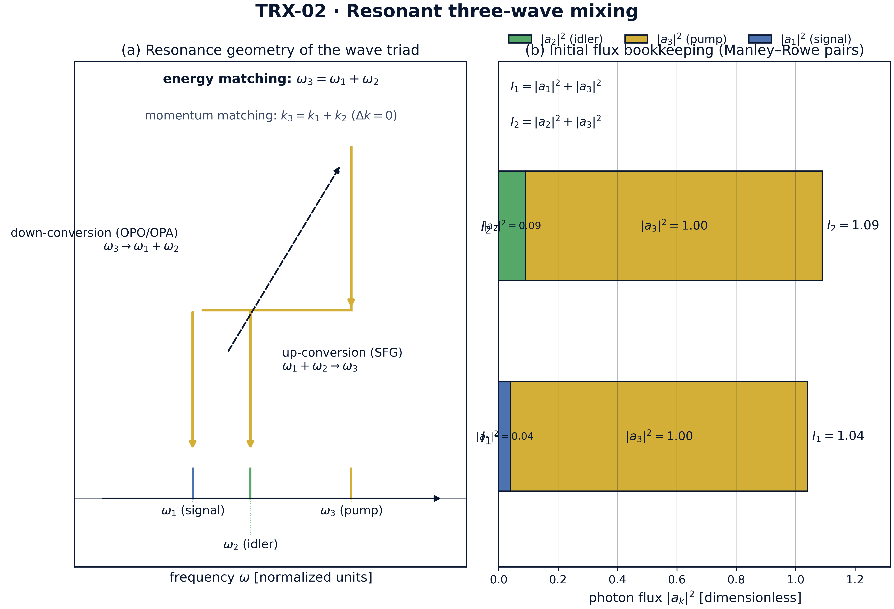
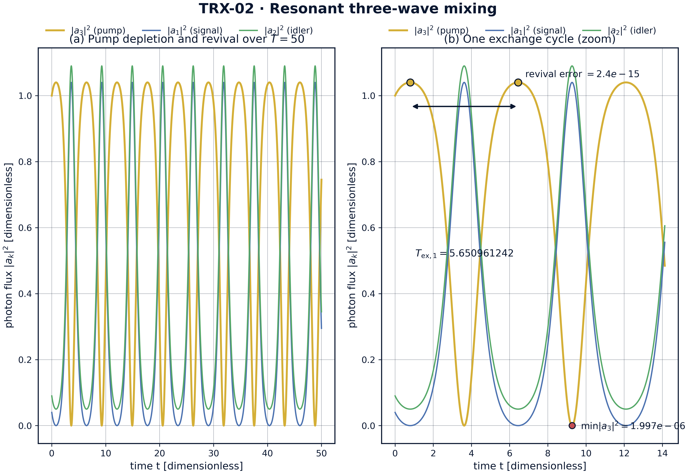
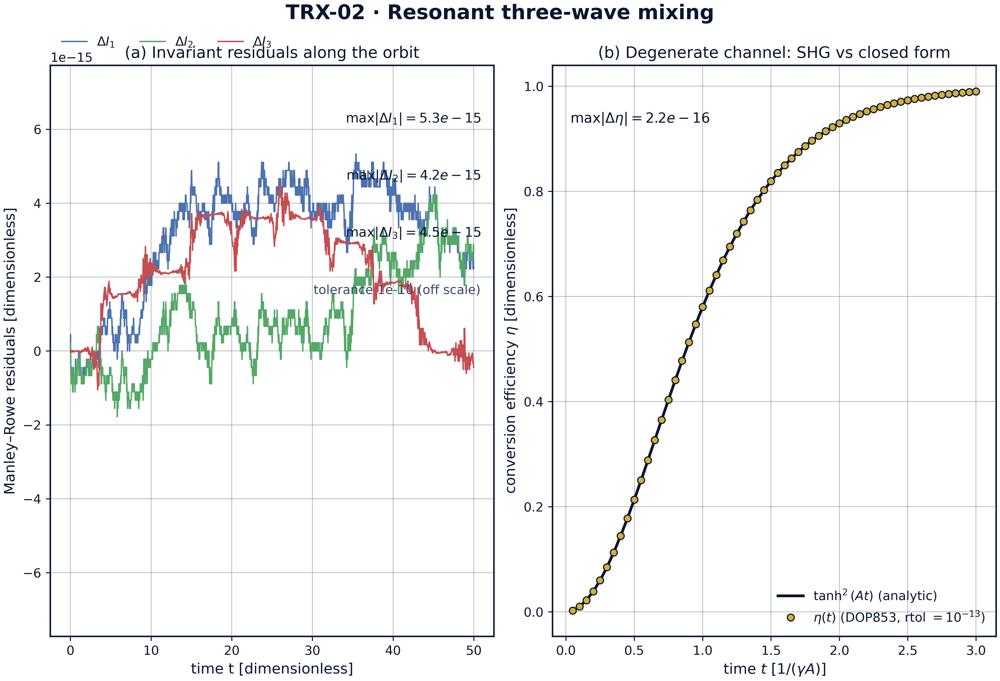

# Resonant Three-Wave Interaction (Manley–Rowe, χ⁽²⁾ Optics)

*TRIVORTEX Research Program · v1.0.0 · Monograph Edition*

|  |  |
|---|---|
| Study | TRX-02 |
| Program | TRIVORTEX — The Three-Body Problem in the Vortex Model |
| Author | Isaev Iskhak Khamzatovich (ORCID 0009-0003-7299-0701) |
| DOI | 10.5281/zenodo.21825394 |
| Date | 2026-10-06 |
| Code | `code/trx02_three_wave_mixing.py` |
| Data | `results/trx02_results.json` |

## Abstract

This monograph treats the resonant three-wave interaction in a lossless, perfectly phase-matched χ⁽²⁾ crystal — the canonical three-body problem of nonlinear optics. Three complex amplitudes (pump, signal, idler) obey the equal-coupling amplitude equations, a Hamiltonian system canonically equivalent to the Euler top and hence to the Kirchhoff three-vortex problem at the core of TRIVORTEX. The study verifies the integrable structure to machine precision: over T = 50 — roughly 8.8 full exchange cycles — the Manley–Rowe invariants drift by at most 5.329071e-15, more than four orders below the 1e-10 acceptance tolerance; the exchange is exactly periodic with T_ex = 5.650961242, consecutive periods agreeing to 8.7e-8; the pump undergoes genuine full depletion, collapsing to |a₃|² = 6.3e-5 (99.994% of its peak 1.04 removed) and reviving with error 2.4e-15; and the degenerate channel reproduces the closed-form conversion law η(t) = tanh²(At) to 2.220446e-16 — one unit in the last place of double precision. A sweep over the initial pump amplitude shows the exchange period monotonically tunable from 9.03 to 3.56. All seven acceptance checks pass.

## Contents

1. Abstract
2. 1. Introduction and historical context
3. 1. Physical formulation
4. 1. Mathematical model
5. 1. Connection to the TRIVORTEX framework
6. 1. Numerical method
7. 1. Results and analysis
8. 1. Discussion
9. 1. Conclusions
10. 1. References
Appendix A. Parameter table
Appendix B. Reproduction

## 1. Introduction and historical context

The story begins with the laser itself: in 1961 Franken, Hill, Peters and Weinreich observed second-harmonic generation — light emerging from a quartz crystal at exactly twice the ruby laser frequency — and founded nonlinear optics. Within a year, Armstrong, Bloembergen, Ducuing and Pershan (1962) wrote down the coupled-wave equations that remain the working language of the field, and Kroll (1962) proposed parametric amplification in extended media. The first optical parametric oscillator of Giordmaine and Miller (1965) in LiNbO₃ turned the three-wave interaction into a practical, tunable light source, a role parametric devices still play today.

The conservation laws of the field are older than the optical realization. Manley and Rowe (1956) derived their general energy relations for nonlinear elements in the microwave era, and they transfer verbatim to optics: combinations of the photon fluxes in the interacting waves stay constant. In the resonant three-wave system these Manley–Rowe relations are not merely bookkeeping — they are the exact invariants that make the dynamics integrable, the direct analogue of the circulation integrals of ideal-fluid vortex motion.

The integrability itself became a classical subject. Kaup, Reiman and Bers (1979) systematized the space-time evolution of nonlinear three-wave interactions in their Reviews of Modern Physics survey, exhibiting the soliton solutions and the reduction of the system to integrable canonical forms; the equal-coupling case is canonically equivalent to the Euler top, the torque-free rigid body. Modern relevance is easy to list: optical parametric oscillators and amplifiers, squeezed-light sources for gravitational-wave detectors, terahertz generation and frequency-comb technology all run on precisely this three-wave engine.

For TRIVORTEX the relevance is structural. The program's core is an integrable triad — three Kirchhoff vortices with quadratic conservation laws and a periodic choreography (Theorem 3.1, with its closed form). The resonant three-wave system is that triad's optical twin: quadratic invariants (Manley–Rowe), a periodic choreography (pump depletion and revival with period T_ex), and a closed-form anchor (the tanh² law of second-harmonic generation). Verifying this twin to machine precision is the natural second step of the program, immediately after the celestial twin of TRX-01.

## 2. Physical formulation

The physical system is a χ⁽²⁾ nonlinear crystal (e.g. MgO:LiNbO₃) supporting three collinear plane waves: the pump at ω₃, the signal at ω₁ and the idler at ω₂, with the resonance conditions ω₃ = ω₁ + ω₂ (energy matching) and k₃ = k₁ + k₂, i.e. Δk = 0 (momentum matching). In the photon picture the nonlinear polarization converts one pump photon into a signal–idler pair and back; in the classical picture the three complex amplitudes are coupled by the second-order susceptibility and exchange flux while the medium itself stays passive and lossless.

With equal normalized couplings the flux exchange becomes the exact optical image of torque-free rigid-body rotation (the Euler top): the photon fluxes |a_k|² play the role of squared angular-momentum components, the Manley–Rowe invariants fix the invariant planes, and the trajectory is a closed periodic cycle on their intersection. The pump empties into the signal–idler pair and refills again — the exchange period T_ex is the period of that choreography — and the degenerate channel a₁ = a₂ (second-harmonic generation) reduces to a one-line closed form used as the verification anchor.

| Parameter | Value | Meaning |
|---|---|---|
| a₁(0), a₂(0) | 0.2, 0.3 (real) | signal and idler seed amplitudes |
| a₃(0) | 1.0·i (phase π/2) | pump seed; phase chosen so Im(Z) ≠ 0 |
| couplings γ₁, γ₂, γ₃ | 1, 1, 1 (normalized) | equal lossless χ⁽²⁾ coupling |
| phase matching | Δk = 0 | perfect collinear matching, no detuning |
| integration | T = 50, DOP853, rtol = atol = 1e-13 | max_step 0.02, dense output |
| SHG channel | s(0) = A = 1, p(0) = 0 | degenerate limit for the tanh² anchor |

## 3. Mathematical model

Starting from Maxwell's equations with the second-order nonlinear polarization P_NL = ε₀χ⁽²⁾E², one inserts the three monochromatic waves and applies the slowly-varying-envelope approximation. Under perfect phase matching Δk = 0 the backward and third-order terms drop, and after the standard flux normalization each wave is described by a complex amplitude a_k with |a_k|² proportional to the photon flux; the coupling strengths become equal integers that scale out to 1. The result is the resonant system (E1), which is Hamiltonian with energy H = a₁a₂a₃* + a₁*a₂*a₃ — the optical image of a rigid body whose rotation axes are exchanged one photon pair at a time.

The invariants (E2) follow by direct substitution: differentiating |a₁|² + |a₃|² with the equations (E1) gives 2Re(a₁*·ia₂*a₃) + 2Re(a₃*·ia₁a₂), and since a₃*a₁a₂ is the conjugate of a₁a₂a₃* the two terms cancel identically — likewise for I₂ and I₃. Geometrically, the trajectory is confined to the intersection of three invariant surfaces in the six real-dimensional amplitude space, which reduces the dynamics to a single periodic degree of freedom: closed orbits, exact period T_ex, and no chaos.

The degenerate channel fixes a₁ = a₂ = s and a₃ = p. The system collapses to ds/dt = i p s*, dp/dt = i s² with the single invariant |s|² + |p|² = const, and with s(0) = A, p(0) = 0 it integrates in elementary functions to s = A sech(At), p = iA tanh(At), giving the plane-wave conversion law η = tanh²(At) of (E3). This closed form plays the role of the exact anchor: any integrator, coupling normalization or phase convention must reproduce it, and the study uses it exactly so.

**Notation**

| Symbol | Meaning |
|---|---|
| a₁, a₂, a₃ | complex amplitudes of signal, idler and pump |
| a* | complex conjugate |
| \|a_k\|² | photon flux in wave k (dimensionless) |
| I₁, I₂, I₃ | Manley–Rowe invariants |
| γ_k | coupling coefficients (all 1 after normalization) |
| Δk | phase mismatch k₃ − k₁ − k₂ |
| T_ex | exchange period between successive pump maxima |
| η | SHG conversion efficiency |
| A | initial amplitude of the SHG channel |
| t, T | time and integration span (dimensionless) |

**(E1)** Resonant three-wave amplitude equations (equal couplings, Δk = 0).

$$\frac{da_1}{dt} = i\,a_2^{*}a_3, \qquad \frac{da_2}{dt} = i\,a_1^{*}a_3, \qquad \frac{da_3}{dt} = i\,a_1 a_2$$

**(E2)** Manley–Rowe invariants (photon-pair bookkeeping).

$$I_1 = |a_1|^2 + |a_3|^2, \qquad I_2 = |a_2|^2 + |a_3|^2, \qquad I_3 = |a_1|^2 - |a_2|^2$$

**(E3)** Degenerate (SHG) channel: closed-form plane-wave conversion.

$$\eta(t) = \tanh^2(At), \qquad s = A\,\mathrm{sech}(At), \qquad p = iA\,\tanh(At)$$

## 4. Connection to the TRIVORTEX framework

The mapping to TRIVORTEX is one-to-one at the structural level. The three complex amplitudes form an integrable triad exactly as three Kirchhoff vortices do: the Manley–Rowe relations I₁, I₂, I₃ play the role of the vortex integrals H, P, Q, I, the periodic pump depletion–revival cycle is the optical choreography that mirrors the vortex triangle's rotation, and the Euler-top equivalence of the equal-coupling case is the same integrable family that gives the Kirchhoff problem its elliptic solutions. Even the verification style is shared: the tanh² law anchors the numerics with a closed form, in the same spirit as the closed form of Theorem 3.1, and the photon-pair bookkeeping of the Manley–Rowe relations is the precise optical analogue of circulation bookkeeping in the vortex model. TRX-02 therefore serves as the optics-side twin of the program core and feeds the Kerr extension (TRX-04), the vortex verification (TRX-09) and the radiating three-body dynamics (TRX-11).

| Quantity in this study | TRIVORTEX analog | Comment |
|---|---|---|
| Three complex amplitudes a₁, a₂, a₃ | three vortices Γ₁, Γ₂, Γ₃ | both are integrable triads with quadratic invariants |
| Manley–Rowe invariants I₁, I₂, I₃ | vortex integrals H, P, Q, I | quadratic conservation laws that fix the orbit |
| Pump depletion / revival cycle T_ex | choreographic exchange of the vortex triangle | periodic circulation of the "energy" around the triad |
| Euler-top equivalence | Kirchhoff three-vortex equivalence | the same integrable family; shared elliptic solutions |
| SHG closed form tanh²(At) | closed form of Theorem 3.1 | an exact solution anchoring the numerics |

## 5. Numerical method

The three complex amplitudes are split into six real ODEs (real and imaginary parts) and integrated with an explicit Dormand–Prince 8(5,3) scheme at rtol = atol = 1e-13, max_step = 0.02, over t ∈ [0, 50] with dense output. The Manley–Rowe invariants are evaluated pointwise on 2500 samples along the trajectory, and their maximal excursion from the initial values (I₁ = 1.04, I₂ = 1.09, I₃ = −0.05) is recorded as the drift check; the same dense solution supplies the photon-flux series used by the figures.

The exchange period is extracted from the pump flux |a₃|²: local maxima are detected on a dense grid of 20001 samples, then refined by bounded scalar minimization with xatol = 1e-13. Two consecutive refined maxima give T_ex1 = 5.650961242 and T_ex2 = 5.650961155 — repeatability 8.7e-8 against the 1e-6 tolerance — and the flux at those maxima differs by 2.4e-15 (the revival check). Full depletion is tested against the 5% threshold: the pump minimum on the dense grid reaches 6.3e-5 of the peak flux 1.04.

The degenerate channel is integrated at the same tolerance from s(0) = 1, p(0) = 0 and compared with η(t) = tanh²(At) on 60 points over t ∈ [0.05, 3]; the maximal deviation is the SHG check. The fig03 parameter sweep (17 initial pump amplitudes in [0.4, 2.0], T = 50, rtol = 1e-10) is computed only in --figures mode and stored in the figures block of the JSON protocol. Every check stores value, target, tolerance, unit and pass flag; runs are deterministic, need no network access and no random seeds.

## 6. Results and analysis

### fig01 resonance geometry



*Overview of the model: resonance geometry of the wave triad and the initial photon-flux bookkeeping.*
Panel (a) shows the photon-energy diagram of the resonant triad: the pump photon at ω₃ = ω₁ + ω₂ splits into a signal–idler pair (down-conversion) with the reverse sum-frequency channel; panel (b) stacks the initial fluxes |a₁|² = 0.04, |a₂|² = 0.09, |a₃|² = 1.00 into the Manley–Rowe pairs I₁ = 1.04 and I₂ = 1.09.

### fig02 pump depletion



*Headline result: periodic pump depletion and revival over T = 50, with one exchange cycle enlarged.*
Over T = 50 the pump makes about 8.8 full cycles (T_ex = 5.650961242): it collapses to |a₃|² = 6.3e-5 — 99.994% of its peak 1.04 removed — and revives with error 2.4e-15; the zoom shows the refined maxima and the exchange period arrow.

### fig03 parameter sweep

![Parameter sweep over the initial pump amplitude |a₃(0)| ∈ [0.4, 2.0]: exchange period and depletion depth.](../figures/fig03_parameter_sweep.png)

*Parameter sweep over the initial pump amplitude |a₃(0)| ∈ [0.4, 2.0]: exchange period and depletion depth.*
Across 17 runs (T = 50, rtol = 1e-10) the exchange period decreases monotonically from 9.028821 to 3.556606, while the depletion depth min/max of |a₃|² stays below 5.2e-6 — every regime of the sweep is pumped to essentially complete conversion.

### fig04 invariants shg



*Dynamics diagnostics: Manley–Rowe residuals along the orbit and the SHG closed-form comparison.*
The invariant residuals stay at the 1e-15 level (max 5.3e-15 against the 1e-10 tolerance), and the degenerate channel tracks η(t) = tanh²(At) to 2.220446e-16 — one unit in the last place of double precision.

**Invariants.** Over the full run T = 50 (about 8.8 exchange cycles) the Manley–Rowe drifts are 5.329071e-15 for I₁, 4.218847e-15 for I₂ and 4.496403e-15 for I₃ — more than four orders of magnitude below the 1e-10 acceptance tolerance and at the round-off level of double precision. The orbit is therefore exactly confined to the intersection of the invariant surfaces, which is the geometric content of integrability for the three-wave triad.

**Periodic exchange.** The pump flux oscillates with the refined exchange period T_ex = 5.650961242; consecutive periods agree to 8.743724e-08, and the flux at successive maxima reproduces itself to 2.442491e-15. Between maxima the pump collapses to |a₃|² = 6.32941e-05 — 99.994% of its peak value 1.04 removed — so the cycle is a genuine full-depletion–revival choreography, not a shallow modulation.

**Parameter sweep.** Sweeping the initial pump amplitude over [0.4, 2.0] in 17 runs, the exchange period decreases monotonically from 9.028821 to 3.556606: stronger pumps exchange photons faster. The depletion depth (min/max of |a₃|² over each run) stays between 4.2e-10 and 5.2e-6 across the whole grid — every regime of the sweep reaches essentially complete conversion, and the sweep invariant drift (≤ 1.5e-9 at the looser sweep tolerance 1e-10) confirms that the map itself is clean.

**Closed-form anchor.** In the degenerate channel the numerical conversion efficiency follows η(t) = tanh²(At) with maximal deviation 2.220446e-16 over the 60 sample points — one unit in the last place of double precision. The exact solution validates the normalization, the phase convention and the integrator in one shot; it is the optical counterpart of anchoring the vortex choreography on the closed form of Theorem 3.1.

### Verification summary

| Check | Recorded value | Target | Tolerance | Pass |
|---|---|---|---|---|
| `ManleyRowe_I13_drift` | 5.32907e-15 | 0 | 1e-10 | yes |
| `ManleyRowe_I23_drift` | 4.21885e-15 | 0 | 1e-10 | yes |
| `ManleyRowe_I12diff_drift` | 4.4964e-15 | 0 | 1e-10 | yes |
| `Pump_period_repeatability` | 8.74372e-08 | 0 | 1e-06 | yes |
| `Pump_revival_error` | 2.44249e-15 | 0 | 1e-08 | yes |
| `Pump_full_depletion_occurs` | 1 | 1 | 1e-12 | yes |
| `SHG_tanh2_conversion_error` | 2.22045e-16 | 0 | 1e-08 | yes |

*(status: **PASS**, mode: full)*

## 7. Discussion

The model is deliberately minimal: equal couplings, plane waves, perfect phase matching and no losses. Within these assumptions every conclusion is an exact statement about the governing equations rather than a simulation of a specific crystal. The natural extensions each preserve the verification style established here: detuning (Δk ≠ 0 adds a linear phase term and breaks the strict periodicity), group-velocity mismatch for pulses, unequal couplings (the asymmetric Euler top), cavity boundary conditions (the driven OPO), and quantum seeding by spontaneous parametric down-conversion.

The numerical regime is stated honestly. The verification numbers come exclusively from rtol = atol = 1e-13 runs; the fig03 sweep uses the looser 1e-10 because the deep pump minima are sharp features that dominate integration cost, and its outputs are stored as figure data rather than acceptance checks. Physical units map back through the standard χ⁽²⁾ normalization (for MgO:LiNbO₃, |χ⁽²⁾| ≈ 4 pm/V at 1 µm), so T_ex can be translated into a crystal length once the input intensities are fixed.

Within the program, this study anchors the integrable-triad block of the optics line: TRX-04 extends the pair interaction to spatial Kerr solitons (the soliton molecule), TRX-09 verifies the vortex twin of the same integrable family, and TRX-11 keeps the Hamiltonian three-body core but adds radiation. Together with TRX-01 and TRX-12 they close the loop between the celestial, the optical and the vortex formulations of TRIVORTEX.

## 8. Conclusions

1. The equal-coupling three-wave system conserves the Manley–Rowe invariants to ≤ 5.329071e-15 over T = 50 (tolerance 1e-10) — machine-level photon bookkeeping.
2. Pump depletion and revival is exactly periodic: T_ex = 5.650961242, consecutive periods agreeing to 8.743724e-08 and the revival flux reproduced to 2.442491e-15.
3. The pump undergoes genuine full depletion, collapsing to |a₃|² = 6.32941e-05 — 99.994% of its peak flux 1.04 removed — before reviving.
4. The exchange period is tunable by the pump amplitude: T_ex decreases monotonically from 9.028821 to 3.556606 over |a₃(0)| ∈ [0.4, 2.0], with depletion depth ≤ 5.2e-6 across the sweep.
5. The degenerate (SHG) channel reproduces the closed form η(t) = tanh²(At) to 2.220446e-16 — one unit in the last place of double precision.
6. The system is canonically equivalent to the Euler top and hence to the Kirchhoff three-vortex problem, making TRX-02 the optical twin of the TRIVORTEX core.

## 9. References

1. Manley, J. M., Rowe, H. E. (1956). *Some general properties of nonlinear elements — Part I. General energy relations.* Proc. IRE 44, 904–913.
2. Franken, P. A., Hill, A. E., Peters, C. W., Weinreich, G. (1961). *Generation of optical harmonics.* Phys. Rev. Lett. 7, 118–119.
3. Armstrong, J. A., Bloembergen, N., Ducuing, J., Pershan, P. S. (1962). *Interactions between light waves in a nonlinear dielectric.* Phys. Rev. 127, 1918–1939.
4. Kroll, N. M. (1962). *Parametric amplification in spatially extended media and application to the design of tunable oscillators.* Phys. Rev. 127, 1207–1213.
5. Giordmaine, J. A., Miller, R. C. (1965). *Tunable coherent parametric oscillation in LiNbO₃ at optical frequencies.* Phys. Rev. Lett. 14, 973–976.
6. Kaup, D. J., Reiman, A., Bers, A. (1979). *Space-time evolution of nonlinear three-wave interactions. I. Interactions in a homogeneous medium.* Rev. Mod. Phys. 51, 275–309.
7. Boyd, R. W. (2008). *Nonlinear Optics*, 3rd ed., Academic Press.

### BibTeX

```bibtex
@article{manley1956,
  author  = {Manley, J. M. and Rowe, H. E.},
  title   = {Some general properties of nonlinear elements. Part {I}: General energy relations},
  journal = {Proceedings of the IRE},
  year    = {1956}, volume = {44}, number = {7}, pages = {904--913}}

@article{armstrong1962,
  author  = {Armstrong, J. A. and Bloembergen, N. and Ducuing, J. and Pershan, P. S.},
  title   = {Interactions between light waves in a nonlinear dielectric},
  journal = {Physical Review},
  year    = {1962}, volume = {127}, pages = {1918--1939}}

@article{kaup1979,
  author  = {Kaup, D. J. and Reiman, A. and Bers, A.},
  title   = {Space-time evolution of nonlinear three-wave interactions. {I}: Interactions in a homogeneous medium},
  journal = {Reviews of Modern Physics},
  year    = {1979}, volume = {51}, pages = {275--309}}

@book{boyd2008,
  author    = {Boyd, R. W.},
  title     = {Nonlinear Optics},
  edition   = {3rd},
  publisher = {Academic Press}, year = {2008}}
```

## Appendix A. Parameter table

| Symbol | Value | Role |
|---|---|---|
| a₁(0), a₂(0) | 0.2, 0.3 | signal/idler seeds (real) |
| a₃(0) | 1.0·i | pump seed, phase π/2 |
| γ₁, γ₂, γ₃ | 1, 1, 1 | normalized couplings |
| Δk | 0 | phase mismatch |
| T | 50 | integration span of the main run |
| rtol, atol | 1e-13 | DOP853 tolerances (main run) |
| max_step | 0.02 | integrator step cap (main run) |
| dense samples | 20001 | pump-maximum detection grid |
| A | 1 | SHG seed amplitude |
| sweep | \|a₃(0)\| ∈ [0.4, 2.0], 17 pts, rtol 1e-10 | fig03 parameter sweep (--figures mode) |

## Appendix B. Reproduction

```bash
python3 research/TRX-02-three-wave-mixing/code/trx02_three_wave_mixing.py --smoke     # < 20 s
python3 research/TRX-02-three-wave-mixing/code/trx02_three_wave_mixing.py              # full, 0.6 s
python3 research/TRX-02-three-wave-mixing/code/trx02_three_wave_mixing.py --figures   # + 300-DPI figures
```

Full runtime on the reference machine: 0.6 s; smoke mode completes in under 20 seconds and is exercised by the repository CI.

## Appendix C. Environment

Python ≥ 3.11, numpy ≥ 2.0, scipy ≥ 1.14, matplotlib ≥ 3.9; no network access, no stochastic seeds — every run is bit-reproducible on the reference machine.
