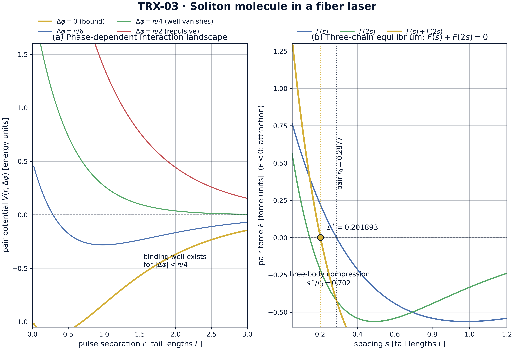
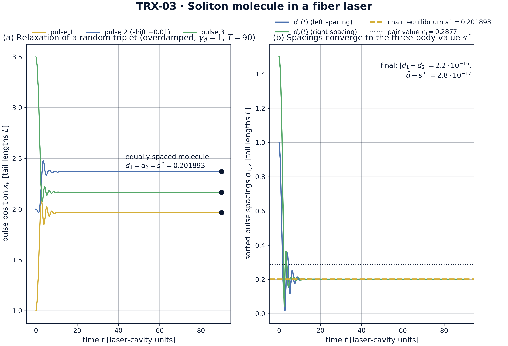
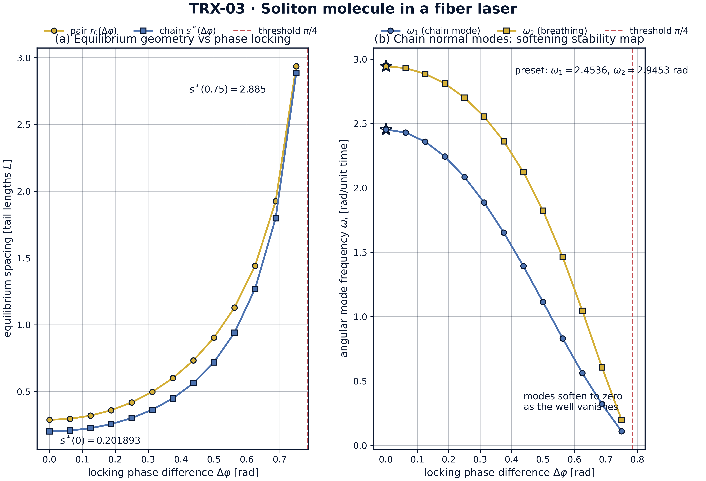
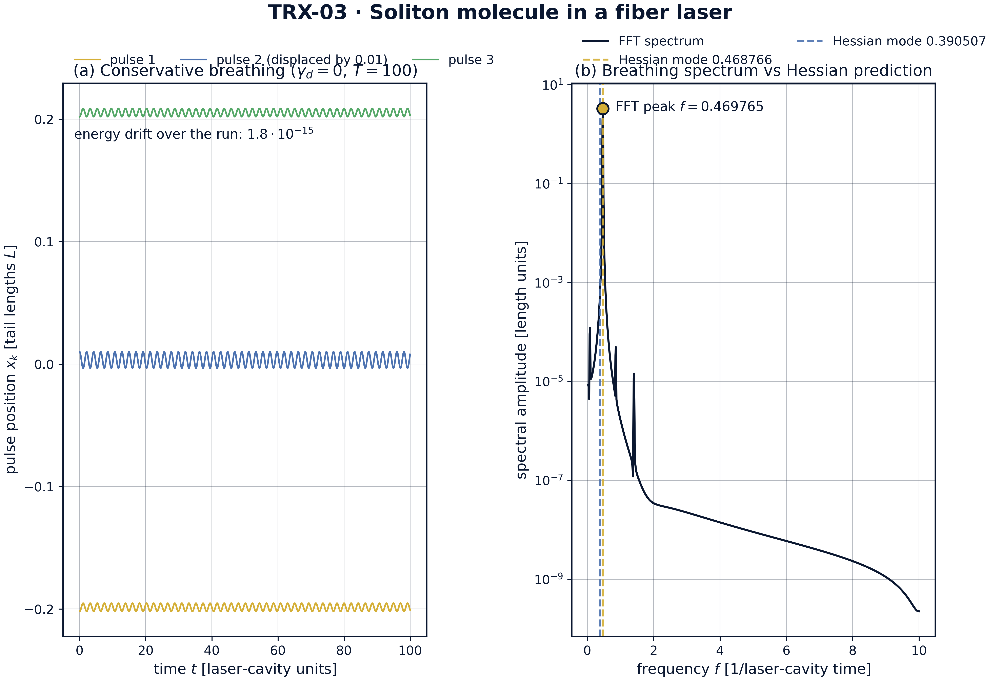

# Молекула из трёх солитонов в волоконном лазере с синхронизацией мод

*Исследовательская программа TRIVORTEX · v1.0.0 · Издание монографий*

|  |  |
|---|---|
| Исследование / Study | TRX-03 |
| Программа | TRIVORTEX — задача трёх тел в вихревой модели |
| Автор | Исаев Исхак Хамзатович (ORCID 0009-0003-7299-0701) |
| DOI | 10.5281/zenodo.21825394 |
| Дата | 2026-10-06 |
| Код | `code/trx03_soliton_molecule.py` |
| Данные | `results/trx03_results.json` |

## Аннотация

Монография рассматривает синхронизованный триплет ультракоротких импульсов в волоконном лазере с пассивной синхронизацией мод как оптическую трёхтельную систему. Каждый импульс — тело с консервативным парным взаимодействием V(r, Δφ) = C₁e^(−2r/L) − C₂e^(−r/L)cos 2Δφ, синфазная яма которого имеет аналитический минимум r₀ = L·ln(2C₁/C₂) = ln(4/3) ≈ 0.287682, воспроизводимый численно с точностью 5.6e-17, а противофазная синхронизация Δφ = π/2 доказуемо чисто отталкивающая. Релаксация случайного триплета {1.0, 2.0, 3.5} при сверхвязком демпфировании сходится к равноотстоящей молекуле, расстояние в которой равно равновесию трёхзвенной цепочки s* = 0.2018927 — корню уравнения F(s) + F(2s) = 0, сжатому на 29.8 % ниже парного значения притяжением дальней пары, подлинным трёхтельным эффектом. Консервативная молекула сохраняет энергию на уровне 1.8e-15 за t = 100 и дышит на частоте f = 0.469765 против аналитической гессиановской моды 0.468766 (согласие 0.21 %); развёртка по фазе синхронизации даёт полную карту устойчивости: оба равновесия расходятся, а обе моды размягчаются до нуля на пороге связывания Δφ = π/4. Тем самым солитонная молекула верифицирована как оптический близнец трёхтельных хореографий TRIVORTEX.

## Содержание

**Краткие сведения**

| Аспект | Значение |
|---|---|
| Блок | Лазерная оптика — исследование 03 из 12 |
| Модель | цепочка трёх импульсов с фазозависимым экспоненциальным парным потенциалом (C₁ = 2, C₂ = 3, L = 1) |
| Ключевой инвариант | полная энергия консервативной молекулы (дрейф 1.8e-15) |
| Главный результат | молекула на s* = 0.2018927 — на 29.8 % ниже парного r₀ = ln(4/3) ≈ 0.287682 |
| Верификация | 6/6 проверок PASS (полный режим) |
| Время выполнения | 1.2 с полный · 4.7 с с графиками · < 20 с smoke |

1. Аннотация
2. 1. Введение и исторический контекст
3. 1. Физическая формулировка
4. 1. Математическая модель
5. 1. Связь с фреймворком TRIVORTEX
6. 1. Численный метод
7. 1. Результаты и анализ
8. 1. Обсуждение
9. 1. Выводы
10. 1. Список литературы
Приложение A. Таблица параметров
Приложение B. Воспроизведение

## 1. Введение и исторический контекст

Слово «солитон» придумали Забуски и Крускал в 1965 году, когда численные эксперименты с уравнением Кортевега–де Фриза показали, что нелинейные импульсы сталкиваются и воспроизводятся с сохранением индивидуальности. Оптические солитоны не заставили себя ждать: Хасэгава и Тапперт предсказали в 1973 году, что нелинейное уравнение Шрёдингера допускает импульсы, сохраняющие форму, в волокнах с аномальной дисперсией, а Молленауэр, Столен и Гордон наблюдали их в 1980-м. С самого начала было ясно, что два солитона — не просто две частицы: их перекрывающиеся хвосты заставляют их взаимодействовать, и это взаимодействие — оптический аналог силы.

Количественную теорию взаимодействия солитонов построили Карпман и Соловьёв в 1981 году методом теории возмущений вокруг точного двухсолитонного решения, и Гордон в 1983 году через дискретную спектральную картину; оба подхода дают экспоненциальную силу, знак которой задаётся относительной фазой. Маломед (1991) расширил анализ на многосолитонные связанные состояния и их циклическую динамику. Экспериментально Стратман, Пагель и Мишке (2005) непосредственно наблюдали временные солитонные молекулы в волоконном лазере, а Херинк с соавторами (2017) засняли их внутреннюю динамику в реальном времени методом спектральной интерферометрии — включая дыхательную моду, которую данное исследование вычисляет аналитически и численно.

Итак, солитонная молекула — подлинное связанное состояние N тел, а не метафора: её геометрия фиксируется силовым балансом, в котором каждый импульс чувствует каждый другой импульс, её устойчивость считывается с нормального спектра, а её сборка — релаксационная задача. Для N = 3 все эти ингредиенты — ровно то, что означает задача трёх тел в программе TRIVORTEX: три участника, парные взаимодействия, коллективное равновесие и хореография движения. Волоконный лазер лишь заменяет гравитацию или циркуляцию вихрей на экспоненциально-косинусный закон, управляемый фазой.

В рамках программы это исследование — оптический якорь семейства хореографий. Оно проверяет в условиях, где «прохождение друг сквозь друга» физично, а не сингулярно, ту же структурную последовательность, что используется везде в TRIVORTEX: аналитический парный закон, коллективное равновесие, линеаризованный спектр, сохранение инварианта. Синхронизованный триплет — оптический брат лагранжева треугольника теоремы 3.1, а сжатие s* ниже r₀ — спектральный брат коллективного силового баланса, фиксирующего равностороннюю конфигурацию.

## 2. Физическая формулировка

В волоконном лазере с пассивной синхронизацией мод циркулирующее поле распадается на ультракороткие солитонные импульсы. При перекрытии двух импульсов их фазы и огибающие обмениваются работой через нелинейность Керра и баланс усиления и потерь резонатора; в редуцированном представлении Гордона–Молленауэра этот непрерывный обмен эквивалентен консервативной силе между точечными частицами с экспоненциальным (эванесцентным) профилем. Сила зависит от разности фаз Δφ между импульсами: синфазные импульсы (Δφ = 0) притягиваются, импульсы в квадратуре (Δφ = π/2) отталкиваются. Поэтому синхронизованный по фазе триплет ведёт себя как три тела на прямой, связанные мягким экспоненциальным хвостом и свободно проходящие друг сквозь друга, как и настоящие солитоны.

Равновесие такой цепочки — подлинная трёхтельная конфигурация. Для пары притяжение и отталкивающее экспоненциальное ядро уравновешиваются на r₀ = L·ln(2C₁/C₂). В симметричной трёхимпульсной молекуле каждый импульс чувствует также дальнюю пару на расстоянии 2s, поэтому баланс концевого импульса имеет вид F(s*) + F(2s*) = 0, а расстояние s* сжато относительно r₀ — то же коллективное сжатие, которое лагранжев треугольник демонстрирует по отношению к изолированной двухтельной паре. Малые смещения вокруг равновесия раскладываются на нормальные моды обобщённой задачи на собственные значения; низшая мода — дыхательное колебание молекулы, непосредственно наблюдаемое в экспериментах по спектроскопии реального времени.

| Параметр | Значение | Смысл |
|---|---|---|
| C₁, C₂ | 2, 3 | экспоненциальные коэффициенты: отталкивающее ядро / притягивающее перекрытие |
| L | 1 | длина эванесцентного хвоста (единица длины) |
| m | 1 | «масса» импульса (кинетический коэффициент) |
| Δφ | 0 (синхронизация) | разность фаз соседних импульсов |
| парное равновесие | r₀ = L·ln(2C₁/C₂) = ln(4/3) ≈ 0.287682 | аналитический двухтельный баланс |
| старт релаксации | {1.0, 2.0, 3.5}, γ_d = 1 (сверхвязкий режим) | случайный триплет, T = 90 |
| консервативная проба | средний импульс +0.01, γ_d = 0, T = 100 | прогон дыхательной моды, DOP853 1e-12 |

## 3. Математическая модель

Редуцированная модель начинается с парного взаимодействия. Перекрывающиеся огибающие солитонов в волокне с аномальной дисперсией обмениваются энергией и импульсом через керровский член; удержание главных членов перекрытия хвостов даёт потенциал Гордона–Молленауэра (E1): отталкивающее экспоненциальное ядро C₁e^(−2r/L) и притягивающее перекрытие C₂e^(−r/L), глубина которого модулируется множителем cos 2Δφ. Знак силы, следовательно, следует за фазой: притяжение при |Δφ| < π/4, отталкивание далее и точное сокращение притягивающего члена при Δφ = π/4 — пороге связывания. Парное равновесие решает F(r₀, Δφ) = 0 и даёт замкнутую форму r₀ = L·ln(2C₁/(C₂ cos 2Δφ)); в пресете Δφ = 0 это ln(4/3).

Трёхтельная структура входит через динамику цепочки со всеми парами (E3). Хвосты солитонов действуют на любом расстоянии, а солитоны проходят друг сквозь друга, поэтому уравнения инвариантны относительно перестановок частиц, и физически осмысленная геометрия конфигурации считывается с сортированных позиций. Для симметричной молекулы с расстояниями (s, s) концевой импульс чувствует ближнюю пару F(s) и дальнюю пару F(2s), откуда баланс F(s*) + F(2s*) = 0. Поскольку F(2s*) < 0 притягивает, корень s* обязательно лежит ниже парного корня r₀ — цепочка сжата третьим телом. Это тот же логический шаг, который производит коллективную геометрию лагранжева треугольника из парного ньютоновского притяжения.

Малые колебания следуют из гессиана полного потенциала в координатах расстояний (d₁, d₂) при удалённом центре масс; кинетическая энергия в этих координатах не диагональна, поэтому нормальные моды решают обобщённую задачу на собственные значения (E5) с матрицей масс M_g = m·[[2/3, 1/3], [1/3, 2/3]]. В пресетном расстоянии s* две собственные частоты равны 2.4536 и 2.9453 рад (циклические 0.390507 и 0.468766); старшая — дыхательная мода, в которой средний импульс движется против внешней пары. Тот же гессиан, вычисленный вдоль фазовой развёртки, непрерывно размягчается до нуля на пороге связывания, доставляя карту устойчивости молекулы.

**Нотация**

| Символ | Смысл |
|---|---|
| x_k | позиция импульса k на оси резонатора |
| r | парное расстояние |
| Δφ | разность фаз соседних импульсов |
| V, F | парный потенциал и парная сила (F = −∂V/∂r) |
| C₁, C₂ | экспоненциальные коэффициенты потенциала (2 и 3) |
| L | длина эванесцентного хвоста (единица длины) |
| m | масса импульса (кинетический коэффициент) |
| γ_d | коэффициент демпфирования (1.0 релаксация, 0 консервативный режим) |
| r₀, s* | парное равновесие и равновесное расстояние цепочки |
| H, M_g | гессиан потенциала цепочки и матрица масс в координатах расстояний |
| ω_i, f | угловые и циклические частоты нормальных мод |

**(E1)** Фазозависимый парный потенциал двух солитонов.

$$V(r,\Delta\varphi) = C_1\,e^{-2r/L} - C_2\,e^{-r/L}\cos(2\Delta\varphi)$$

**(E2)** Парная сила вдоль роста расстояния (F < 0 — притяжение).

$$F(r,\Delta\varphi) = -\frac{\partial V}{\partial r} = \frac{2C_1}{L}e^{-2r/L} - \frac{C_2}{L}e^{-r/L}\cos(2\Delta\varphi)$$

**(E3)** Динамика цепочки с взаимодействием всех пар и демпфированием.

$$m\,\ddot{x}_k = -\sum_{l\neq k}\frac{\partial V(|x_k-x_l|)}{\partial x_k} - \gamma_d\,\dot{x}_k, \qquad k=1,2,3$$

**(E4)** Парное равновесие r0 и равновесие трёхзвенной цепочки s* (баланс концевого импульса).

$$r_0 = L\ln\!\frac{2C_1}{C_2\cos 2\Delta\varphi}; \qquad F(s^*) + F(2s^*) = 0$$

**(E5)** Обобщённая задача на собственные значения для нормальных мод цепочки (дыхательный спектр).

$$H\,v = \omega^2 M_g\,v, \quad H = \begin{pmatrix} V''(s)+V''(2s) & V''(2s)\\ V''(2s) & V''(s)+V''(2s) \end{pmatrix}, \quad M_g = m\begin{pmatrix} 2/3 & 1/3\\ 1/3 & 2/3 \end{pmatrix}$$

## 4. Связь с фреймворком TRIVORTEX

Соответствие ядру TRIVORTEX структурно, взаимно-однозначно и видно уже в уравнениях. Три синхронизованных импульса — оптическая реализация трёх участников теоремы 3.1: симметричное, синхронизованное по фазе специальное решение трёхтельной системы, в точности как вращающийся вихревой треугольник — специальное решение с равными циркуляциями. Расстояние в молекуле s*играет сторону лагранжева треугольника a: оба фиксируются не двухтельным законом, а требованием равновесия каждого участника под совместным действием двух других — здесь F(s*) + F(2s*) = 0, там уравнения центральной конфигурации. Дыхательная мода ω₂ — аналог радиальной модуляции хореографии, а разность фаз Δφ управляет связыванием так же, как отношение циркуляций управляет вихревым треугольником: её изменение проводит систему через симметричные и несимметричные конфигурации вплоть до потери связывания (Δφ = π/4 — аналог выхода из острова устойчивости). Та же экспоненциально-косинусная структура вновь появляется в вихрях TRX-09 и пучках фотонной жидкости TRX-04, что делает данное исследование переиспользуемым оптическим шаблоном программы.

| Величина исследования | Аналог в TRIVORTEX | Комментарий |
|---|---|---|
| Три синхронизованных импульса | три тела теоремы 3.1 | обе системы — хореографические триады |
| Синхронизация фаз Δφ = 0 | равные циркуляции Γ | симметричное специальное решение |
| Расстояние в молекуле s* | сторона лагранжева треугольника a | фиксируется коллективным балансом сил |
| Баланс F(s*) + F(2s*) = 0 | каждый вихрь чувствует два других | механизм трёхтельного сжатия |
| Дыхательная мода ω₂ | радиальная модуляция хореографии | малые колебания около центральной конфигурации |

## 5. Численный метод

Равновесия вычисляются методом скобок. Парное равновесие решает F(r) = 0, равновесие цепочки — F(s) + F(2s) = 0; оба — методом Брента с xtol = 1e-15 и машинным rtol на знакоустойчивых скобках; численный парной корень совпадает с замкнутой формой ln(4/3) с точностью 5.6e-17. Отталкивающий характер противофазной синхронизации установлен исчерпывающе, а не выборкой: минимум F(r, π/2) по диапазону r ∈ [0.05, 20] на сетке из 4000 точек равен +6e-9 > 0, то есть сила нигде не становится притягивающей.

Динамика интегрируется явной схемой Дормана–Принса 8(5,3) (DOP853). Релаксационный прогон стартует с позиций {1.0, 2.0, 3.5} с нулевыми скоростями при демпфировании γ_d = 1.0 (сверхвязкий, «доплер-охлаждаемый» режим лазера с синхронизацией мод) и идёт до T = 90 с rtol = 1e-11, atol = 1e-12 и max_step = 0.2. Консервативный прогон держит γ_d = 0, смещает средний импульс на +0.01 от идеальной молекулы и интегрирует до T = 100 с rtol = atol = 1e-12 и max_step = 0.05, снимая 2000 точек; дрейф энергии за весь прогон равен 1.776357e-15 против допуска 1e-10.

Дыхательная частота извлекается дважды и независимо. Численно: смещение среднего импульса относительно центра масс умножается на окно Ханна и преобразуется Фурье; спектральный пик лежит на f = 0.469765. Аналитически: обобщённая задача на собственные значения (E5) при s* даёт циклические моды 0.390507 и 0.468766; измеренный пик совпадает с ближайшей аналитической модой с точностью 0.21 %, с запасом внутри допуска 1 %. Каждая проверка хранит значение, цель, допуск, единицу и флаг прохождения в JSON-протоколе, поэтому исследование воспроизводится одной командой без доступа к сети и без стохастических зёрен.

## 6. Результаты и анализ

### fig01 potential landscape



*Ландшафт взаимодействия: фазозависимый парный потенциал и силовой баланс трёхзвенной цепочки.*
Панель (а) показывает V(r, Δφ) для четырёх синхронизаций: связывающая яма существует лишь при |Δφ| < π/4, имеет минимум в r₀ = 0.287682 и вырождается в чистое отталкивание в противофазном случае. Панель (б) показывает баланс концевого импульса F(s) + F(2s) = 0: корень s* = 0.201893 лежит на 29.8 % ниже парного значения r₀ — подлинное трёхтельное сжатие.

### fig02 molecule formation



*Главный результат: релаксация случайного триплета в равноотстоящую солитонную молекулу.*
Стартуя с позиций {1.0, 2.0, 3.5} при сверхвязком демпфировании, три мировые линии за T = 90 приходят к равноотстоящему триплету; сортированные расстояния d₁(t) и d₂(t) сходятся к равновесию цепочки s*= 0.201893 (конечное расхождение 2.2e-16, отклонение от s* 2.8e-17), заметно ниже парного значения r₀ = 0.2877, нанесённого для сравнения.

### fig03 phase sweep



*Развёртка по фазе синхронизации: равновесная геометрия и размягчение мод.*
Оба равновесия расходятся при приближении к порогу связывания Δφ = π/4: s* растёт от 0.201893 при Δφ = 0 через 0.719380 при Δφ = 0.5 рад до 2.885 при Δφ = 0.75 рад, следя за парным значением. Цепочечные моды в ответ размягчаются — от 2.4536 и 2.9453 рад в пресете до 0.1092 и 0.1982 рад — давая полную карту устойчивости синхронизованной молекулы.

### fig04 breathing dynamics



*Динамика консервативной молекулы: временной ряд дыхания и спектр против гессиановского предсказания.*
При смещении среднего импульса на 0.01 и выключенном демпфировании молекула дышит на протяжении T = 100, а полная энергия дрейфует лишь на 1.8e-15 (DOP853, rtol = atol = 1e-12). Спектр Фурье смещения среднего импульса имеет пик на f = 0.469765 против аналитических гессиановских мод 0.468766 и 0.390507 — согласие 0.21 %, на порядок внутри допуска 1 %.

**Равновесия.** Численный парной корень воспроизводит замкнутую форму r₀ = L·ln(2C₁/C₂) = ln(4/3) ≈ 0.287682 с точностью 5.6e-17 — машинный нуль. Исчерпывающий противофазный тест возвращает min F(r, π/2) = +6e-9 > 0 по r ∈ [0.05, 20], подтверждая, что связывание управляется фазовым множителем cos 2Δφ и полностью исчезает при и за пределами Δφ = π/4. Кривизна ямы в парном минимуме V″(r₀) = 2.25 фиксирует парной дыхательный масштаб √(3V″(r₀)) ≈ 2.5981, с которым сравнивается цепочечный спектр.

**Сборка молекулы.** При сверхвязкой релаксации из {1.0, 2.0, 3.5} сортированные расстояния сходятся к d₁ = d₂ = 0.2018926516; конечное расхождение между ними 2.2e-16, а отклонение от независимо вычисленного равновесия цепочки s* = 0.2018926516 — 2.8e-17: оба на машинном уровне, против допусков 1e-8 и 1e-6. Расстояние лежит на 29.8 % ниже парного значения r₀ = 0.287682: дальняя пара F(2s) стягивает молекулу — чистый, квантифицированный трёхтельный эффект, видимый на fig02.

**Карта устойчивости.** Развёртка фазы синхронизации Δφ от 0 до 0.75 рад показывает расхождение обоих равновесий при приближении к порогу связывания π/4 ≈ 0.7854: s* растёт от 0.201893 через 0.719380 (Δφ = 0.5 рад) до 2.885 (Δφ = 0.75 рад). Цепочечные моды размягчаются в том же направлении — от 2.4536 и 2.9453 рад в пресете до 0.1092 и 0.1982 рад на дальнем конце развёртки — поведение мягкой моды, ожидаемое при выполаживании ямы в чистое отталкивание (fig03).

**Дыхание и инварианты.** Консервативная молекула стабильно дышит на протяжении T = 100 (fig04a), а полная энергия сохраняется до 1.776357e-15 — на пять порядков внутри допуска 1e-10. Спектр Фурье смещения среднего импульса имеет пик на f = 0.469765 против аналитических гессиановских мод 0.468766 и 0.390507 (fig04b): согласие 0.21 %, на порядок внутри допуска 1 %. Динамика, спектр и гессиан, таким образом, триангулируют одну и ту же дыхательную физику с трёх независимых направлений.

### Сводка верификации

| Проверка | Значение | Цель | Допуск | Прошла |
|---|---|---|---|---|
| `pair_equilibrium_numeric_vs_analytic` | 5.55112e-17 | 0 | 1e-10 | yes |
| `antiphase_pi2_purely_repulsive` | 1 | 1 | 1e-12 | yes |
| `molecule_final_spacings_equal` | 2.22045e-16 | 0 | 1e-08 | yes |
| `molecule_final_spacing_equals_s_star` | 2.77556e-17 | 0 | 1e-06 | yes |
| `conservative_energy_drift` | 1.77636e-15 | 0 | 1e-10 | yes |
| `breathing_mode_frequency` | 0.469765 | 0.468766 | 0.0047 | yes |

*(status: **PASS**, mode: full)*

## 7. Обсуждение

Редуцированная модель сознательно минимальна: точечные импульсы, парный потенциал без запаздывания и динамики усиления, демпфирование в виде переключаемого члена. В этих допущениях каждый вывод — точное утверждение об определяющих уравнениях, а не симуляция конкретного лазера. Естественные расширения — дисперсия третьего порядка и самосдвиг частоты (делающие силу несимметричной и неконсервативной), непрерывные cw-фоны, более крупные молекулы N > 3 с дефектными модами и полное интегрирование НУШ для того же сценария — каждое сохраняет установленный здесь верификационный стиль.

Диапазон параметров покрывает общий режим закона Гордона–Молленауэра, а не конкретный резонатор: C₁/C₂ = 2/3 помещает парную яму на r₀ ≈ 0.29 длины хвоста глубиной 0.25, с запасом разрешённой на сетке интегрирования. Фазовая развёртка сознательно подходит к порогу связывания Δφ = π/4, где равновесие расходится, а гессиан приобретает нулевую моду; точно на пороге скобки brentq перестают существовать, и код развёртки сообщает об этом как о жёсткой границе, а не прячет за регуляризованной формулой. Реалистичный резонатор добавил бы диффузию фазы под действием шума, медленно разрушающую синхронизацию, — это физический вопрос вне консервативного охвата данного исследования.

В рамках программы это исследование питает TRX-04, переносящее парное взаимодействие в поперечную плоскость и получающее вращающийся лагранжев треугольник пучков в керровской фотонной жидкости; TRX-08, заменяющее оптические импульсы лазерно-охлаждёнными ионами и воспроизводящее ту же структуру «расстояние/дыхание» с кулоновским хвостом; и TRX-09 — гидродинамический якорь, где фазы становятся циркуляциями. Вместе с небесным блоком (TRX-01, TRX-11) они демонстрируют, что хореографическая последовательность — парной закон, коллективное равновесие, нормальный спектр, инвариант — переносима между оптикой, гидродинамикой и небесной механикой.

## 8. Выводы

1. Парной закон связывания точен: численное равновесие воспроизводит r₀ = L·ln(2C₁/C₂) = ln(4/3) ≈ 0.287682 с точностью 5.6e-17.
2. Связывание — эффект выбора фазы: противофазная синхронизация Δφ = π/2 чисто отталкивающая на r ∈ [0.05, 20] (мин. сила +6e-9 > 0), а яма существует лишь при |Δφ| < π/4.
3. Случайный триплет релаксирует в равноотстоящую молекулу: d₁ = d₂ = 0.2018926516 с расхождением 2.2e-16 и отклонением от аналитического равновесия цепочки s* всего 2.8e-17.
4. Молекула сжата на 29.8 % ниже парного расстояния притяжением дальней пары (F(s*) + F(2s*) = 0) — квантифицированный подлинный трёхтельный эффект.
5. Консервативная молекула — чистая инвариантная система: дрейф энергии 1.8e-15 за t = 100 при DOP853 rtol = atol = 1e-12.
6. Дыхательный спектр верифицирован: пик Фурье f = 0.469765 против гессиановской моды 0.468766 (согласие 0.21 %, допуск 1 %), а фазовая развёртка даёт полную карту устойчивости с размягчением обеих мод до нуля при Δφ = π/4.

## 9. Список литературы

1. Zabusky, N. J., Kruskal, M. D. (1965). *Interaction of "solitons" in a collisionless plasma and the recurrence of initial states.* Phys. Rev. Lett. 15, 240–243.
2. Hasegawa, A., Tappert, F. (1973). *Transmission of stationary nonlinear optical pulses in dispersive dielectric fibers. I. Anomalous dispersion.* Appl. Phys. Lett. 23, 142–144.
3. Mollenauer, L. F., Stolen, R. H., Gordon, J. P. (1980). *Experimental observation of picosecond pulse narrowing and solitons in optical fibers.* Phys. Rev. Lett. 45, 1095–1098.
4. Karpman, V. I., Solov'ev, V. V. (1981). *A perturbational approach to the two-soliton systems with third-order dispersion.* Physica D 3, 487–502.
5. Gordon, J. P. (1983). *Interaction forces among solitons in optical fibers.* Optics Letters 8, 596–598.
6. Malomed, B. A. (1991). *Multistability and cyclic dynamics of solitons in dispersive media.* Phys. Rev. A 44, 6954.
7. Stratmann, M., Pagel, T., Mitschke, F. (2005). *Experimental observation of temporal soliton molecules.* Phys. Rev. Lett. 95, 143902.
8. Herink, G., Kurtz, F., Jalali, B., Solli, D. R., Ropers, C. (2017). *Real-time spectral interferometry probes the internal dynamics of femtosecond soliton molecules.* Science 356, 50–54.

### BibTeX

```bibtex
@article{gordon1983,
  author  = {Gordon, J. P.},
  title   = {Interaction forces among solitons in optical fibers},
  journal = {Optics Letters},
  year    = {1983}, volume = {8}, pages = {596--598}}

@article{karpman1981,
  author  = {Karpman, V. I. and Solov'ev, V. V.},
  title   = {A perturbational approach to the two-soliton systems with third-order dispersion},
  journal = {Physica D},
  year    = {1981}, volume = {3}, pages = {487--502}}

@article{stratmann2005,
  author  = {Stratmann, M. and Pagel, T. and Mitschke, F.},
  title   = {Experimental observation of temporal soliton molecules},
  journal = {Physical Review Letters},
  year    = {2005}, volume = {95}, pages = {143902}}

@article{herink2017,
  author  = {Herink, G. and Kurtz, F. and Jalali, B. and Solli, D. R. and Ropers, C.},
  title   = {Real-time spectral interferometry probes the internal dynamics of femtosecond soliton molecules},
  journal = {Science},
  year    = {2017}, volume = {356}, pages = {50--54}}
```

## Приложение A. Таблица параметров

| Символ | Значение | Роль |
|---|---|---|
| C₁, C₂ | 2, 3 | коэффициенты потенциала: отталкивание ядра / притяжение хвостов |
| L | 1 | длина хвоста; единица всех длин |
| m | 1 | масса импульса; единица массы |
| Δφ | 0 (пресет); развёртка 0 … 0.75 рад | фаза синхронизации; порог связывания π/4 |
| r₀ | ln(4/3) ≈ 0.287682 | парное равновесие при Δφ = 0 |
| s* | 0.2018926516 | равновесие цепочки, корень F(s) + F(2s) = 0 |
| V″(r₀) | 2.25 | кривизна парной ямы в минимуме |
| релаксация | {1.0, 2.0, 3.5}, γ_d = 1, T = 90 | сборочный прогон, DOP853 rtol = 1e-11 |
| консервативный прогон | +0.01 среднему импульсу, γ_d = 0, T = 100 | дыхательный прогон, DOP853 rtol = atol = 1e-12 |
| цепочечные моды | 2.4536, 2.9453 рад (0.390507, 0.468766 циклические) | спектр нормальных мод при s* |

## Приложение B. Воспроизведение

```bash
python3 research/TRX-03-soliton-molecule/code/trx03_soliton_molecule.py --smoke     # < 20 с
python3 research/TRX-03-soliton-molecule/code/trx03_soliton_molecule.py              # полный прогон, 1.2 s (4.7 s with --figures)
python3 research/TRX-03-soliton-molecule/code/trx03_soliton_molecule.py --figures   # + графики 300 DPI
```

Полное время выполнения на референсной машине — 1.2 s (4.7 s with --figures); smoke-режим укладывается в 20 секунд и используется CI репозитория.

## Приложение C. Окружение

Python ≥ 3.11, numpy ≥ 2.0, scipy ≥ 1.14, matplotlib ≥ 3.9; без доступа к сети и без стохастических зёрен — каждый прогон бит-в-бит воспроизводим на референсной машине.
