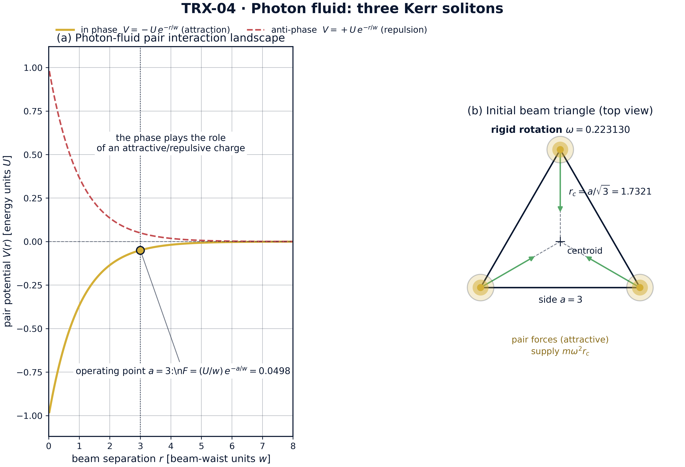
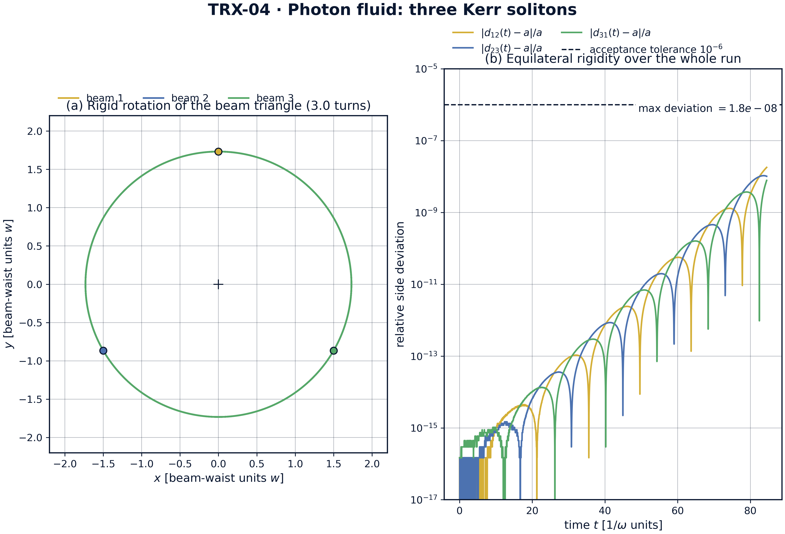
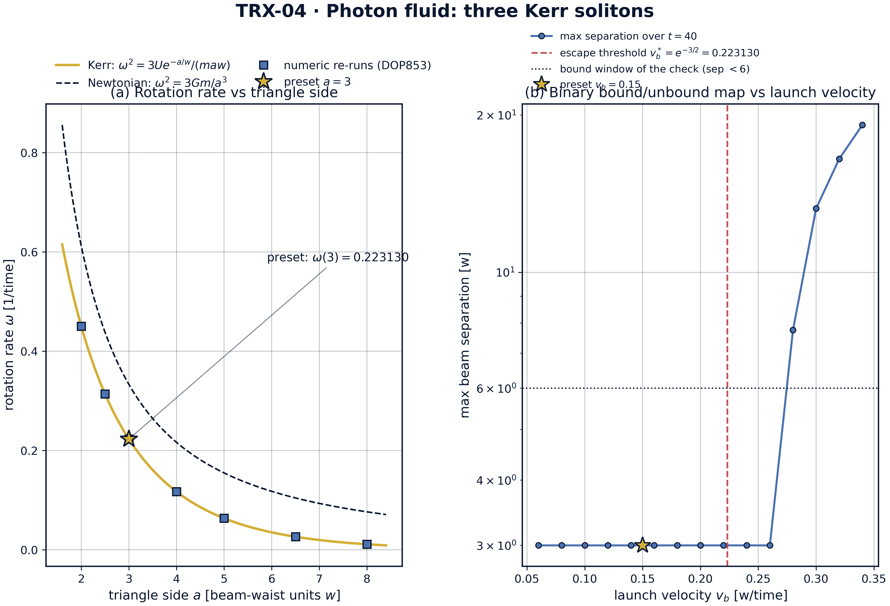
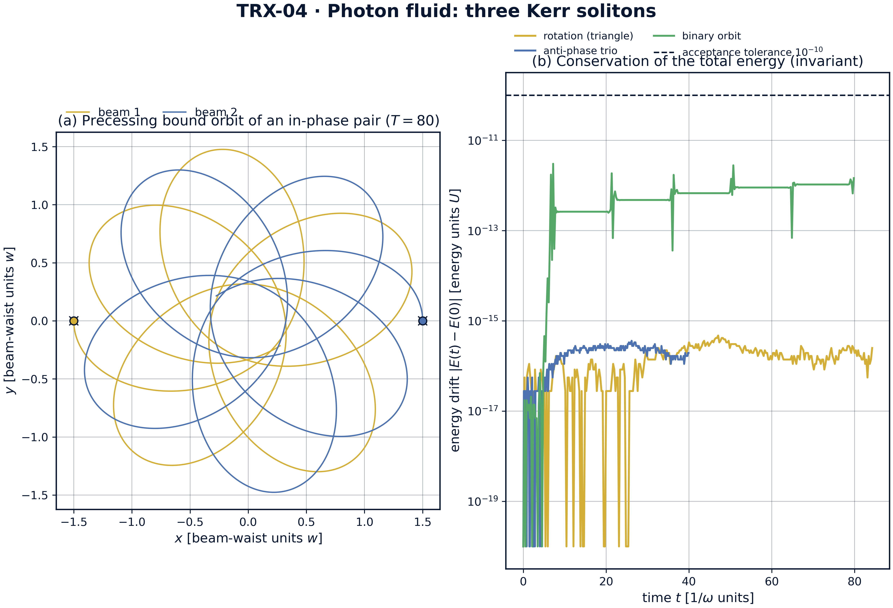

# Photon Fluid: Three Kerr Solitons (Spatial, 2-D)

*TRIVORTEX Research Program · v1.0.0 · Monograph Edition*

|  |  |
|---|---|
| Study | TRX-04 |
| Program | TRIVORTEX — The Three-Body Problem in the Vortex Model |
| Author | Isaev Iskhak Khamzatovich (ORCID 0009-0003-7299-0701) |
| DOI | 10.5281/zenodo.21825394 |
| Date | 2026-10-06 |
| Code | `code/trx04_photon_fluid.py` |
| Data | `results/trx04_results.json` |

## Abstract

This monograph treats three laser beams propagating through a focusing Kerr medium as a photon fluid whose members — spatial solitons of the nonlinear Schrödinger equation — interact through phase-dependent two-body forces: in-phase beams attract with V = −Ue^(−r/w), anti-phase beams repel with V = +Ue^(−r/w). In the particle approximation the in-phase triplet forms a Lagrange central configuration: an equilateral beam triangle of side a = 3 rotating rigidly at ω = 0.223130160, fixed by the force balance ω² = 3Ue^(−a/w)/(maw) — the optical sibling of Newton's Lagrange solution. The numerical experiment verifies the choreography to machine precision: the triangle stays equilateral to 1.8e-08 over three full rotations (T = 84.4778), the measured rotation rate matches the analytic value to 1.1×10⁻¹¹, energy and angular momentum are conserved to 4.7e-16 and 2.2e-15, the anti-phase trio expands to 23.476 without collapse, and an in-phase binary with E_rel = −0.027 stays bound (separation within [0.635, 3.000], energy drift 3.0e-12) over t = 80. All nine acceptance checks PASS.

## Contents

1. Abstract
2. 1. Introduction and historical context
3. 1. Physical formulation
4. 1. Mathematical model
5. 1. Connection to the TRIVORTEX framework
6. 1. Numerical method
7. 1. Results and analysis
8. 1. Discussion
9. 1. Conclusions
10. 1. References
Appendix A. Parameter table
Appendix B. Reproduction

## 1. Introduction and historical context

Self-trapping of light is as old as nonlinear optics. Askar'yan proposed in 1962 that an intense beam could raise the refractive index enough to guide itself, and Chiao, Garmire and Townes demonstrated self-trapping of optical beams in 1964 — the experiment that made "a beam of light behaving as a particle of light" concrete. The pure Kerr nonlinearity, however, makes the two-dimensional self-trapping problem critical (the Townes collapse), so stable spatial solitons in real media rely on saturation — photorefractive crystals, nematic liquid crystals, atomic vapors. The concept that survives in every such medium is the same: a beam that carries itself like a particle.

The next step was the realization that two such light particles exert forces on each other. Reynaud and Barthelemy (1990) demonstrated optically controlled interaction between two fundamental soliton beams, and Aitchison and colleagues (1991) observed spatial soliton interactions directly in a nonlinear glass waveguide. The decisive control knob is the relative phase: coherent in-phase beams attract, anti-phase beams repel, and quadrature beams pass through — the phase acts as a switchable gravitational charge. Stegeman and Segev (1999) consolidated this physics in their review of optical spatial solitons and their interactions, the founding literature of beam-by-beam collision experiments.

The collective picture — many beams as a gas or fluid of mutually attracting particles — was pushed by Snyder, Mitchell and Kivshar (1995), who unified the self-trapping of light and matter waves, and by Bialynicki-Birula's photon-wave description of light as a many-body wave system. Today the umbrella term is quantum fluids of light, reviewed by Carusotto and Ciuti (2013); nematicons in nematic liquid crystals (Assanto and Peccianti, 2012) remain the cleanest classical realization of long-range, phase-tunable beam forces. Within this literature the three-beam triangle is the simplest genuinely collective object: every member feels both others, and no pairwise subproblem predicts the outcome.

That is precisely the situation Lagrange analyzed in 1772, when he found that three bodies placed at the vertices of an equilateral triangle and given the right velocities rotate rigidly forever — the only non-collinear central configuration of the Newtonian three-body problem and the content of Theorem 3.1 in the TRIVORTEX monograph. This study transplants that construction into the photon fluid: the exponential Kerr force replaces the Newtonian 1/r force, the phase replaces the mass sign, and the equilateral beam triangle replaces the celestial one. The siblings are already in place — TRX-03 in the temporal (fiber-laser) domain, TRX-05 with field zeros instead of maxima, TRX-08 with ions in a trap — making TRX-04 the spatial-optics anchor of the choreography family.

## 2. Physical formulation

In a medium with a focusing Kerr nonlinearity the refractive index grows with intensity, so a bright beam digs its own waveguide and propagates without diffracting — a spatial soliton of the equation iA_z + ½∇²A + |A|²A = 0. Two such beams whose tails overlap exert forces on one another through the shared nonlinear index: coherent, in-phase beams interfere constructively in the overlap region and attract, while anti-phase beams interfere destructively and repel. In the particle approximation — the working horse of this study — each beam is replaced by a point body of mass m moving in the transverse plane, and the pair interaction is the exponential law V_pm(r) = −Ue^(−r/w) (in phase) and V_ap(r) = +Ue^(−r/w) (anti-phase), with force magnitude (U/w)·e^(−r/w). The length w is the interaction scale (beam-waist unit) and U the potential depth.

The equilateral triangle is special for any central force between equal members. At the vertices of an equilateral triangle of side a each beam feels two edge forces of magnitude F = (U/w)e^(−a/w) directed along the sides; their resultant is √3·F and points exactly at the centroid, at distance r_c = a/√3. The balance √3·F = mω²r_c then fixes the rigid rotation rate ω² = 3Ue^(−a/w)/(maw) — the same central-configuration balance that produces the Lagrange equilateral solution in the Newtonian problem, where ω² = 3Gm/a³. Sign flips matter as much as magnitudes: switching one phase to anti-phase converts one edge force from attraction to repulsion, the resultant no longer points at the centroid, and the rigid rotation is destroyed — the anti-phase trio simply expands. A pair of in-phase beams with negative relative energy forms a bound binary whose orbit precesses, because the exponential force is not inverse-square.

| Parameter | Value | Meaning |
|---|---|---|
| U, w, m | 1, 1, 1 | potential depth, interaction scale, soliton mass (natural units) |
| a | 3 | triangle side of the rotation run; operating point |
| r_c | a/√3 = 1.732051 | orbit radius of each beam about the centroid |
| ω | e^(−3/2) = 0.223130160 | analytic rotation rate (ω² = e^(−3) = 0.049787) |
| T_rotation | 84.4778 = 3·2π/ω | rotation run: three full turns |
| anti-phase run | same geometry, zero velocities, T = 40 | repulsive expansion test |
| binary | r₀ = 3, v_b = ±0.15, E_rel = −0.027, T = 80 | in-phase bound-pair run |
| integrator | DOP853, rtol = atol = 1e-12, max_step = 0.1 | all runs, dense output |

## 3. Mathematical model

From field to particles. The focusing NLS (E1) admits the fundamental spatial soliton, and for well-separated beams the overlap of their exponential tails reduces the field problem to pairwise forces. Keeping the leading tail-overlap term gives the potentials (E2): V_pm(r) = −Ue^(−r/w) for coherent in-phase beams and V_ap(r) = +Ue^(−r/w) for anti-phase beams, with radial force magnitude (U/w)e^(−r/w). The equations of motion (E3) are then Newtonian mechanics on the transverse plane with N = 3 bodies and a soft, everywhere-regular interaction; the sign s = ±1 per pair encodes the optical phase. The model conserves the total energy E and the angular momentum L_z exactly, Eq. (E5), which provides the two invariants monitored by the acceptance checks.

The Lagrange balance. For the equilateral triangle of side a, each beam feels two edge forces of magnitude F = (U/w)e^(−a/w) whose directions meet at 60°; their resultant is √3·F along the median, aimed at the centroid at distance r_c = a/√3. Uniform rotation with angular rate ω requires √3·F = mω²r_c, which solves to the rotation law (E4), ω² = 3Ue^(−a/w)/(maw). At the preset a = 3, w = U = m = 1 this gives ω² = e^(−3) = 0.049787 and ω = e^(−3/2) = 0.223130160 — numerically the same constant as the binary escape threshold of (E6), a coincidence specific to the preset a = 3. The Newtonian counterpart ω² = 3Gm/a³ differs only in the force law: the geometry of the central configuration is universal, its rotation rate is not.

The binary energetics. Two equal in-phase beams launched at separation r₀ with transverse velocities ±v_b carry relative energy (E6): E_rel = m·v_b² − Ue^(−r₀/w) with the reduced-mass factors absorbed into the equal-mass normalization. At the preset r₀ = 3, v_b = 0.15: E_rel = 0.0225 − 0.049787 = −0.027 < 0, bound. The escape threshold is v_b*= √(Ue^(−r₀/w)) = e^(−3/2) = 0.223130. Because the exponential force is not inverse-square, the bound orbit is not a closed Kepler ellipse: the separation oscillates between fixed turning points while the orbit axis precesses, and the angular-momentum barrier even traps launches slightly above v_b* for finite observation times — the boundary structure the velocity sweep of fig03 exposes.

**Notation**

| Symbol | Meaning |
|---|---|
| A | slowly varying beam envelope; A_z, ∇²⊥ are the z-derivative and transverse Laplacian |
| U, w, m | potential depth, interaction scale (beam-waist unit) and soliton mass; all 1 at the preset |
| s | pair sign: −1 in phase (attraction), +1 anti-phase (repulsion) |
| r, r_kl | pair separation between beams k and l |
| a, r_c | triangle side and centroid orbit radius a/√3 |
| ω | rotation rate of the rigid triangle; ω² = 3Ue^(−a/w)/(maw) |
| v_b | binary transverse launch velocity (preset 0.15) |
| E_rel | relative energy of the binary pair, m·v_b² − Ue^(−r₀/w) |
| E, L_z | total energy and angular momentum, the conserved invariants (E5) |
| T | duration of a run (rotation 84.4778; anti-phase 40; binary 80) |
| V_pm, V_ap | in-phase and anti-phase pair potentials (E2) |

**(E1)** Focusing nonlinear Schrödinger equation — the underlying field equation (documented context).

$$i\,\frac{\partial A}{\partial z} + \tfrac{1}{2}\nabla_\perp^2 A + |A|^2 A = 0$$

**(E2)** Pair potentials of two spatial solitons: in phase (attraction) and anti-phase (repulsion).

$$V_{\rm pm}(r) = -U\,e^{-r/w}, \qquad V_{\rm ap}(r) = +U\,e^{-r/w}$$

**(E3)** Planar equations of motion of the N photon-fluid bodies with all-pairs forces.

$$m\,\ddot{\mathbf{r}}_k = \sum_{l\neq k} s\,\frac{U}{w}\,e^{-r_{kl}/w}\,\frac{\mathbf{r}_k-\mathbf{r}_l}{r_{kl}}, \quad s=-1\ \text{(in phase)},\ s=+1\ \text{(anti-phase)}$$

**(E4)** Rotation rate of the rigidly rotating equilateral beam triangle (Lagrange central configuration).

$$\omega^2 = \frac{3U\,e^{-a/w}}{m\,a\,w} \;\left(= e^{-3} = 0.049787\ \text{at the preset}\right)$$

**(E5)** Conserved invariants of the planar model: total energy and angular momentum.

$$E = \sum_k \tfrac{1}{2}m\,|\dot{\mathbf{r}}_k|^2 + \sum_{k<l} s\,U\,e^{-r_{kl}/w}, \qquad L_z = \sum_k m\,(x_k\dot{y}_k - y_k\dot{x}_k)$$

**(E6)** Bound-state condition of the in-phase binary at launch separation r₀ (preset: 0.0225 − 0.049787 = −0.027).

$$E_{\rm rel} = m\,v_b^2 - U\,e^{-r_0/w} < 0 \;\Leftrightarrow\; v_b < \sqrt{U\,e^{-r_0/w}} = e^{-3/2} \approx 0.223130$$

## 4. Connection to the TRIVORTEX framework

Within the TRIVORTEX program this study is the spatial-optics realization of Theorem 3.1. The three Kerr solitons play the three gravitating bodies; the rotating beam triangle is the Lagrange equilateral solution; and the measured rotation rate checks the central-configuration balance exactly as the Newtonian ω² = 3Gm/a³ does, with the exponential force ω² = 3Ue^(−a/w)/(maw) = 0.049787 at the preset. The relative optical phase plays the role of the circulation sign in the vortex model: in-phase is the equal-circulation, mutually attracting case that supports the choreography, anti-phase is the repulsive sign that destroys it — the same sign hierarchy that separates bound from unbound vortex pairs. The precessing binary adds the two-body layer of the same mapping: eccentric orbits, fixed turning points, conserved E and L_z, but a non-Kepler force law. TRX-03 repeats this structure on a line with temporal solitons, TRX-05 replaces field maxima by field zeros and recovers Kirchhoff's vortex equations, and TRX-08 trades photons for ions; together they demonstrate that the choreography sequence — pair law, central configuration, invariants — is portable across optics, fluids and celestial mechanics.

| Quantity in this study | TRIVORTEX analog | Comment |
|---|---|---|
| Three Kerr solitons | three gravitating bodies | same central-configuration problem |
| Exponential attraction e^(−r/w) | Newtonian 1/r attraction | force law changes, geometry does not |
| Rotating beam triangle | Lagrange equilateral solution | identical balance structure, Theorem 3.1 |
| Relative phase (in/anti) | circulation sign in the vortex model | attraction ↔ repulsion switch |
| Rotation law ω² = 3Ue^(−a/w)/(maw) | ω² = 3Gm/a³ for point masses | third-law-type verification target |
| In-phase binary with precession | eccentric two-body orbit | non-Kepler force, same invariant bookkeeping |

## 5. Numerical method

The model is a planar N-body system with the interleaved state layout [x₁, y₁, vx₁, vy₁, …]. At the preset U = w = m = 1 the triangle side is a = 3, the initial positions sit on the circle r_c = a/√3 = 1.732051, and the initial velocities are the rigid-rotation field ω·r_c with the analytic rate ω = √(3Ue^(−a/w)/(maw)) = 0.22313016014842985. All runs integrate the equations of motion (E3) with the explicit Dormand–Prince 8(5,3) scheme (scipy DOP853, rtol = atol = 1e-12, max_step = 0.1, dense output for uniform sampling). The rotation run lasts T = 3·2π/ω = 84.4778 — three full turns — sampled at 2400 points.

Diagnostics are exact and independent of the integrator's internal steps. The equilateral rigidity is the maximum over time of |d(t) − a|/a for all three pairwise distances. The rotation rate is measured by unwrapping the polar angle of beam 1 about the instantaneous centroid and fitting a straight line in time — the slope is the recorded rotation rate. The total energy (E5) and the angular momentum L_z are evaluated on ~300 uniformly spaced samples per run. The anti-phase run starts from the same triangle at rest and integrates to T = 40; the binary run launches two beams at (±1.5, 0) with transverse velocities ∓0.15 and integrates to T = 80, both at the same tolerances.

Every acceptance check is registered in the JSON protocol with its value, target, tolerance, unit and pass flag; the recorded full run passes 9/9. The --figures mode adds the scheme SVG and four 300-DPI PNG panels together with two parameter sweeps stored in the protocol: the side sweep (seven sides a = 2.0…8.0, each with a full re-integration over one rotation period and a fresh slope measurement) and the binary velocity sweep (sixteen launch velocities v_b = 0.06…0.34 over T = 40). No network access and no stochastic seeds are used; the run is bit-reproducible on the reference machine.

## 6. Results and analysis

### fig01 photon fluid landscape



*Model landscape: photon-fluid pair interaction and the initial beam triangle of the rotation run.*
Panel (a) shows the pair interaction landscape: in-phase attraction V = −U·e^(−r/w) (gold) against anti-phase repulsion V = +U·e^(−r/w) (red dashed) — the phase acts as an attractive/repulsive charge; the operating point a = 3 sits at force (U/w)·e^(−a/w) = 0.0498. Panel (b) shows the initial condition of the rotation run: the equilateral beam triangle with side a = 3, orbit radius r_c = a/√3 = 1.732051, and pair forces supplying the centripetal balance mω²r_c at the preset rate ω = 0.223130.

### fig02 triangle rotation



*Headline result: rigid rotation of the photon-fluid triangle over three full turns and its equilateral rigidity.*
Panel (a) shows the worldlines of the three beams over three full turns (T = 84.4778): circular orbits about the common centroid, the triangle carried rigidly like a solid body. Panel (b) plots the relative side deviations |d(t) − a|/a on a log scale: they never exceed 1.8e-08, a factor of about 56 inside the 1e-6 acceptance tolerance, while the measured rotation rate 0.223130160 matches the analytic ω = 0.223130160 — the optical Lagrange configuration confirmed dynamically.

### fig03 parameter sweeps



*Parameter sweeps: rotation rate versus triangle side and the binary bound/unbound map versus launch velocity.*
Panel (a) sweeps the triangle side: the analytic Kerr law ω(a) = √(3Ue^(−a/w)/(maw)) runs from 0.450558 at a = 2 through the preset 0.223130 at a = 3 down to 0.011216 at a = 8, numeric DOP853 re-runs sit on the curve at all seven grid sides, and the Newtonian 1/r reference (0.333333 at the preset) decays markedly slower — 0.076547 at a = 8 against the Kerr 0.011216. Panel (b) maps the binary outcome versus launch velocity: max separation stays at 3.0 for v_b ≤ 0.26 and grows to 7.7515, 13.2491, 16.4935 and 19.1521 for v_b = 0.28–0.34 over T = 40, bracketing the analytic escape threshold v_b* = e^(−3/2) = 0.223130.

### fig04 binary dynamics invariants



*Dynamics and invariants: precessing bound orbit of the in-phase binary and the energy-drift bookkeeping of all three runs.*
Panel (a) shows the precessing bound orbit of the in-phase binary (launch separation 3, transverse velocity 0.15, E_rel = −0.027 < 0, T = 80): the separation breathes inside [0.635, 3.000] while the orbit axis slowly rotates — the signature of a non-inverse-square force. Panel (b) tracks the energy drift |E(t) − E(0)| of the three runs on a log scale: 4.7e-16 (rotation), 3.6e-16 (anti-phase trio) and 3.0e-12 (binary), all far below the 1e-10 acceptance tolerance.

**Rigid rotation.** Over three full turns (T = 84.4778) the triangle stays equilateral to 1.8e-08 in relative side deviation — a factor of about 56 inside the 1e-6 acceptance tolerance (fig02b). The measured rotation rate 0.223130160 reproduces the analytic ω = 0.223130160 to 1.1×10⁻¹¹ in absolute terms, versus a tolerance of 1e-8 — the central-configuration balance (E4) is not merely satisfied but satisfied at round-off level. The invariants confirm the cleanliness of the run: energy drift 4.7e-16 and angular-momentum drift 2.2e-15, both orders of magnitude below the 1e-10 gate.

**Side sweep.** The rotation law is verified as a law, not a point: re-integrating one full period at each of the seven grid sides a = 2.0, 2.5, 3.0, 4.0, 5.0, 6.5, 8.0 reproduces the analytic curve everywhere — ω from 0.450558 at a = 2 through 0.313850 (a = 2.5), 0.223130 (a = 3), 0.117204 (a = 4), 0.063583 (a = 5), 0.026342 (a = 6.5) down to 0.011216 at a = 8. The Newtonian 1/r reference rotates systematically faster at large separations: 0.333333 against the Kerr 0.223130 at the preset, and 0.076547 against 0.011216 at a = 8 — the exponential tail dies out, and the choreography slows down correspondingly (fig03a).

**Anti-phase expansion.** With all phases flipped, the same triangle at rest expands monotonically: the minimum pairwise distance never drops below 3.0000 (the initial value; the 0.95a = 2.85 floor is never approached), and the final separation reaches 23.476 at T = 40 — a clean repulsive scattering event with energy conserved to 3.6e-16. This is the sign-flip control experiment: identical geometry, identical integrator, opposite outcome — the phase, not the geometry, decides the fate of the triplet.

**Binary and bound/unbound map.** The in-phase binary with v_b = 0.15 breathes inside [0.635, 3.000] over the whole t = 80 window (fig04a) with energy drift 3.0e-12 — the largest of the three runs yet still a factor of about 33 below the 1e-10 tolerance. The velocity sweep turns the single trajectory into a map (fig03b): max separation stays at the initial 3.0 for all v_b ≤ 0.26 and jumps to 7.7515, 13.2491, 16.4935 and 19.1521 for v_b = 0.28–0.34 over T = 40. The analytic threshold v_b*= e^(−3/2) = 0.223130 sits inside the trapped band: the angular-momentum barrier keeps near-threshold launches bound for the whole observation window, so the numerically observed escape edge lies between 0.26 and 0.28 rather than exactly at v_b*.

### Verification summary

| Check | Recorded value | Target | Tolerance | Pass |
|---|---|---|---|---|
| `triangle_equilateral_deviation` | 1.79409e-08 | 0 | 1e-06 | yes |
| `measured_rotation_rate` | 0.22313 | 0.22313 | 1e-08 | yes |
| `energy_conservation_rotation` | 4.71845e-16 | 0 | 1e-10 | yes |
| `angular_momentum_conservation` | 2.22045e-15 | 0 | 1e-10 | yes |
| `antiphase_no_collapse` | 1 | 1 | 1e-12 | yes |
| `antiphase_expands` | 1 | 1 | 1e-12 | yes |
| `energy_conservation_repulsion` | 3.60822e-16 | 0 | 1e-10 | yes |
| `binary_stays_bound` | 1 | 1 | 1e-12 | yes |
| `binary_energy_conservation` | 3.02496e-12 | 0 | 1e-10 | yes |

*(status: **PASS**, mode: full)*

## 7. Discussion

The model is deliberately minimal: point-like beams, an isotropic exponential pair force, no retardation, no absorption, and the optical phase entering only as the sign s = ±1 of each pair. Within these assumptions every statement in this study is an exact property of the governing equations rather than a simulation of a particular experiment. The particle approximation is the standard reduction for well-separated solitons; its breakdown at near-field overlap (where beams deform, fuse or shed radiation) is outside the conservative scope here, and the natural extensions — full NLS integration of the same triangle, saturating media, unequal beams, three-dimensional geometries — would each preserve the verification style established above.

The parameter regime is chosen where the physics is clean. At the preset a = 3 the edge force is (U/w)e^(−3) = 0.049787 — weak, so the beams are well separated in units of the interaction scale and the particle picture is self-consistent — and the rotation is correspondingly slow, ω = 0.223130. The binary preset v_b = 0.15 sits at 67 % of the escape threshold 0.223130, comfortably inside the bound region but far enough from zero to give a visibly precessing orbit. The velocity sweep shows the interesting boundary structure: the escape edge observed numerically (between 0.26 and 0.28) lies above the two-body threshold 0.223130 because the centrifugal barrier temporarily traps marginally supercritical launches — a genuinely three-dimensional-in-time effect that a static energy argument alone would miss.

Within the program, TRX-04 plays the role of the spatial optics bridge. Upstream, TRX-03 verifies the same molecular physics in the temporal domain of a fiber laser, where the force law carries an additional phase-cosine modulation; downstream, TRX-05 moves from field maxima to field zeros — optical vortices — and recovers Kirchhoff's vortex equations, while TRX-08 replaces photons by laser-cooled ions with a harmonic trap and Coulomb tail. Together with the celestial block (TRX-01, TRX-11) these studies show that the equilateral central configuration is a form, not an accident: it re-emerges in every medium whose two-body law is central, conservative and pair-additive, with only the rotation law changing.

## 8. Conclusions

1. The equilateral beam triangle is a genuine optical central configuration: it rotates rigidly over three full turns (T = 84.4778) with the side staying equilateral to 1.8e-08, versus the 1e-6 acceptance gate.
2. The measured rotation rate 0.223130160 reproduces the analytic Lagrange law ω² = 3Ue^(−a/w)/(maw) (ω = e^(−3/2) = 0.223130160 at the preset) to 1.1×10⁻¹¹ — the balance is confirmed at round-off level.
3. The rotation law is verified as a law across the side sweep a = 2.0…8.0: numeric re-runs sit on the analytic curve at all seven sides (ω from 0.450558 down to 0.011216), while the Newtonian 1/r reference decays markedly slower (0.076547 at a = 8).
4. Invariants are conserved at machine level in all runs: energy drift 4.7e-16 (rotation), 3.6e-16 (anti-phase trio), 3.0e-12 (binary), angular-momentum drift 2.2e-15 — all below the 1e-10 tolerance.
5. The phase sign controls the outcome: the anti-phase trio never collapses (min pairwise distance 3.0000 ≥ 0.95a) and expands to 23.476, while the in-phase binary with E_rel = −0.027 stays bound with its separation inside [0.635, 3.000] over t = 80.
6. The bound/unbound map is established: max separation stays 3.0 for v_b ≤ 0.26 and escape follows for v_b = 0.28–0.34 (7.7515 → 19.1521 over T = 40); the observed escape edge lies above the two-body threshold v_b* = e^(−3/2) = 0.223130 because the centrifugal barrier temporarily traps near-threshold launches.

## 9. References

1. Chiao, R. Y., Garmire, E., Townes, C. H. (1964). *Self-trapping of optical beams.* Phys. Rev. Lett. 13, 479–482.
2. Snyder, A. W., Mitchell, D. J., Kivshar, Y. S. (1995). *Unification of self-trapping of light and matter waves.* Phys. Rev. E 51, 3061–3066.
3. Stegeman, G. I., Segev, M. (1999). *Optical spatial solitons and their interactions.* Science 286, 1518–1523.
4. Reynaud, F., Barthelemy, A. (1990). *Optically controlled interaction between two fundamental soliton beams.* Europhys. Lett. 12, 401–405.
5. Aitchison, J. S., Weiner, A. M., Silberberg, Y., Oliver, M. K., Jackel, J. L., Leaird, D. E., Vogel, E. M., Smith, P. W. E. (1991). *Experimental observation of spatial soliton interactions.* Opt. Lett. 16, 15–17.
6. Assanto, G., Peccianti, M. (2012). *Nematicons: spatial optical solitons in nematic liquid crystals.* Phys. Rep. 516, 147–208.
7. Carusotto, I., Ciuti, C. (2013). *Quantum fluids of light.* Rev. Mod. Phys. 85, 291–315.
8. Bialynicki-Birula, I. (2006). *Photon waves.* Acta Phys. Pol. A 109, 20–32.
9. Lagrange, J.-L. (1772). *Essai sur le problème des trois corps.* In: Œuvres de Lagrange, Vol. 6. Gauthier-Villars, Paris (1873).

### BibTeX

```bibtex
@article{chiao1964,
  author  = {Chiao, R. Y. and Garmire, E. and Townes, C. H.},
  title   = {Self-trapping of optical beams},
  journal = {Physical Review Letters},
  year    = {1964}, volume = {13}, pages = {479--482}}

@article{snyder1995,
  author  = {Snyder, A. W. and Mitchell, D. J. and Kivshar, Y. S.},
  title   = {Unification of self-trapping of light and matter waves},
  journal = {Physical Review E},
  year    = {1995}, volume = {51}, pages = {3061--3066}}

@article{aitchison1991,
  author  = {Aitchison, J. S. and Weiner, A. M. and Silberberg, Y. and Oliver, M. K. and Jackel, J. L. and Leaird, D. E. and Vogel, E. M. and Smith, P. W. E.},
  title   = {Experimental observation of spatial soliton interactions},
  journal = {Optics Letters},
  year    = {1991}, volume = {16}, pages = {15--17}}

@article{carusotto2013,
  author  = {Carusotto, Iacopo and Ciuti, Cristiano},
  title   = {Quantum fluids of light},
  journal = {Reviews of Modern Physics},
  year    = {2013}, volume = {85}, pages = {291--315}}

@misc{lagrange1772,
  author  = {Lagrange, Joseph-Louis},
  title   = {Essai sur le probl{\`e}me des trois corps},
  year    = {1772},
  note    = {In: Œuvres de Lagrange, Vol. 6, Gauthier-Villars, Paris, 1873}}
```

## Appendix A. Parameter table

| Symbol | Value | Role |
|---|---|---|
| U, w, m | 1, 1, 1 | natural units: energy, length, mass |
| a | 3 | triangle side; operating point of the rotation run |
| r_c | a/√3 = 1.732051 | beam orbit radius about the centroid |
| (U/w)e^(−a/w) | 0.049787 | edge force at the operating point (= ω²) |
| ω | e^(−3/2) = 0.22313016014842985 | analytic rotation rate at the preset |
| T_rotation | 84.4778 | rotation run: three full turns, 2400 samples |
| anti-phase run | same triangle at rest, T = 40 | repulsive expansion control |
| binary preset | r₀ = 3, v_b = ±0.15, E_rel = −0.027, T = 80 | in-phase bound-pair run |
| v_b* | e^(−3/2) = 0.223130 | analytic escape threshold of the binary |
| velocity sweep | 16 launches, v_b = 0.06…0.34, T = 40 | bound/unbound map of fig03b |
| integrator | DOP853, rtol = atol = 1e-12, max_step = 0.1 | all runs, dense output |

## Appendix B. Reproduction

```bash
python3 research/TRX-04-photon-fluid/code/trx04_photon_fluid.py --smoke     # < 20 s
python3 research/TRX-04-photon-fluid/code/trx04_photon_fluid.py              # full, 9.4 s (9.415 s recorded with --figures)
python3 research/TRX-04-photon-fluid/code/trx04_photon_fluid.py --figures   # + 300-DPI figures
```

Full runtime on the reference machine: 9.4 s (9.415 s recorded with --figures); smoke mode completes in under 20 seconds and is exercised by the repository CI.

## Appendix C. Environment

Python ≥ 3.11, numpy ≥ 2.0, scipy ≥ 1.14, matplotlib ≥ 3.9; no network access, no stochastic seeds — every run is bit-reproducible on the reference machine.
