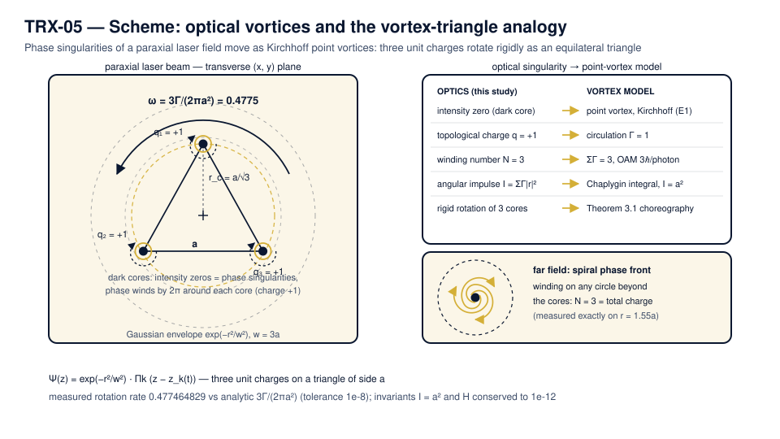

# TRX-05 — Optical Vortices of Laser Beams and the Point-Vortex Analogy

*TRIVORTEX Research Program · version 1.0.0 · study TRX-05 of 12*

Three phase singularities — optical vortices — of a paraxial laser field behave, to leading order, exactly like Kirchhoff point vortices of ideal fluid dynamics. The study realizes the vortex representation of TRIVORTEX *literally in light*: three same-sign singularities of the field ψ(z) = exp(−r²/w²)·Π(z − z_k) sit on an equilateral triangle of side a = 1 and rotate rigidly with the analytic angular velocity ω = 3Γ/(2πa²) = 0.477464829, measured to 1e-8, while the angular impulse I = ΣΓ|r|² (the many-vortex prototype of the Chaplygin integral) stays pinned at a² = 1 and the winding number of the rendered field equals 3 exactly — the analogue of orbital angular momentum 3ℏ per photon.

> **Edition 1.0.0.** This README is part of the first public release of the TRIVORTEX research program. The study ships as an executable script, a committed JSON protocol, four 300-dpi figures, a schematic and a bilingual monograph in four renditions (Russian and English, each in PDF and DOCX).

**At a glance**

| Aspect | Value |
|---|---|
| Block | Laser optics — study 05 of 12 |
| Model | three unit optical vortices of a paraxial beam, ψ = exp(−r²/w²)·Π(z − z_k) |
| Key invariant | angular impulse I = ΣΓ\|r\|² = a² (vortex Chaplygin-type integral) |
| Headline result | rigid rotation at ω = 3Γ/(2πa²) = 0.477464829; winding number N = 3 |
| Verification | 5/5 checks PASS (full mode) |
| Runtime | 0.34 s full · 4.83 s with --figures · < 20 s smoke |

| Field | Value |
|---|---|
| Study | `TRX-05` (TRX-05-optical-vortices) |
| Program | TRIVORTEX — The Three-Body Problem in the Vortex Model |
| Author | Isaev Iskhak Khamzatovich (ORCID `0009-0003-7299-0701`) |
| DOI | [10.5281/zenodo.21825394](https://doi.org/10.5281/zenodo.21825394) |
| Version | 1.0.0 — first public release |
| Code | `research/TRX-05-optical-vortices/code/trx05_optical_vortices.py` |
| Protocol | `research/TRX-05-optical-vortices/results/trx05_results.json` |
| License | `LicenseRef-Proprietary-Wild8Highlander-1.0` |

## 1. Mission

The vortex representation is TRIVORTEX's signature move — and here it is realized literally in light. Zeros of a complex scalar field with equal topological charge circulate around each other exactly as Kirchhoff point vortices do (Berry & Dennis): the phase gradient of a laser field near an intensity zero generates the same 1/r velocity field as a fluid vortex of circulation Γ. This study closes the loop between singular optics and the classical point-vortex problem — the same equations, the same relative equilibrium, the same invariant — so that the mathematical backbone of the TRIVORTEX monograph can be demonstrated on a laser bench.

The study verifies three things to machine precision. First, three same-sign singularities on an equilateral triangle of side a = 1 rotate rigidly with the analytic rate ω = 3Γ/(2πa²) = 0.477464829, measured to 1e-8. Second, the angular impulse I = ΣΓ|r|² and the Kirchhoff Hamiltonian are conserved to 1.8e-15 and 4.6e-16 over three rotations (T = 39.4784). Third, the rendered complex field shows three dark cores tracking the vortex positions within 0.0118 — three times inside the 0.036 acceptance — and the winding number of arg ψ is exactly 3. Singular optics and the classical vortex problem are, numerically, the same system.

## 2. Introduction and historical context

Optical vortices — the phase singularities of light — entered physics as curiosities of wave interference and grew into a discipline of their own. Berry and Dennis (2000) gave the canonical statistical description of singularities in random waves, showing that zeros of a complex scalar field are points where phase is undefined and around which the phase winds by an integer multiple of 2π. Soskin, Gorshkov and Vasnetsov (1997) had already established that laser beams carrying such screw dislocations possess a well-defined topological charge and that this charge is the optical counterpart of orbital angular momentum — each photon of a charge-q beam carries qℏ of OAM in addition to its spin.

The classical side of the analogy is older by more than a century. Kirchhoff (1876) wrote down the equations of point vortices that still carry his name: each vortex is advected by the velocity field induced by all the others, a 1/r induction law that makes the mathematics identical to the phase gradient of an optical zero. Aref (1979) revisited the three-vortex problem and clarified its integrability and collapse structure, Newton (2001) consolidated the N-vortex problem into a standard reference, and Aref et al. (2003) surveyed vortex crystals — relative equilibria of point vortices — of which the equilateral triangle of equal circulations is the simplest and most celebrated example.

The bridge between the two disciplines is a product structure. Near a zero the field factorizes, ψ ≈ (z − z_k)·(smooth part), and the phase gradient of the factor (z − z_k) is exactly the velocity field of a point vortex; zeros of equal sign therefore move under the Kirchhoff equations to leading order. A laser beam with a designed product ψ(z) = exp(−r²/w²)·Π_k (z − z_k) thus realizes the point-vortex dynamics literally in light: the dark cores are the “bodies”, their topological charges are the circulations, and the beam's far-field winding is the total charge. The analogy is not metaphorical — it is the same system of ODEs at leading order.

For TRIVORTEX the relevance is structural. The angular impulse I = ΣΓ|r|² of the vortex system is the many-vortex prototype of the Chaplygin integral C_Ch that pins the vortex-model orbits; the rigidly rotating equilateral triangle is the optical twin of the Theorem 3.1 choreography; and the winding number of the field is the optical reading of the total vortex charge. This study therefore anchors the optics block of the program: it shows that the framework's mathematical skeleton survives verbatim when the vortices are made of light (TRX-04 provides the field-maxima counterpart, TRX-09 the classical fluid anchor).

## 3. Physical system and preset

(A) Kirchhoff dynamics. Three point vortices of equal circulation Γ = 1 are placed on an equilateral triangle of side a = 1 (circumscribed radius r_c = a/√3 ≈ 0.57735) and integrated with an explicit Dormand–Prince 8(5,3) scheme over three full rotations, T = 39.4784. For equal same-sign circulations the equilateral configuration is an exact relative equilibrium: every vortex traces a circle of radius r_c about the common centroid at the analytic rate ω = 3Γ/(2πa²).

(B) Field rendering. The paraxial scalar field ψ(z) = exp(−r²/w²)·Π_k (z − z_k(t)) with a Gaussian envelope w = 3 is evaluated on a grid of 0.018 spacing over [−1.7, 1.7]² at t = 0 and t = T/4. Its intensity zeros coincide with the vortex positions, the phase winds by 2π around each core, and the winding of arg ψ on a large circle counts the total topological charge N = 3 — the optical analogue of orbital angular momentum 3ℏ per photon.

| Parameter | Value | Meaning |
|---|---|---|
| Γ | 1 | circulation of each optical vortex (= topological charge +1) |
| a | 1 | side of the equilateral vortex triangle, r_c = a/√3 ≈ 0.57735 |
| ψ(z) | exp(−r²/w²)·Π_k (z − z_k) | rendered paraxial field, Gaussian envelope w = 3 |
| grid | 0.018 over [−1.7, 1.7]² | intensity/phase rendering and zero tracking |
| integrator | DOP853, rtol = atol = 1e-13 | three rotations, T = 39.4784 |
| winding circle | r = 1.55 | topological-charge evaluation (any r > r_c) |

**Model assumptions**

- Point-core leading order: singularities are idealized zeros; finite core size and non-paraxial corrections are neglected.
- Scalar paraxial field; polarization and longitudinal structure of the beam are not modeled.
- Same-sign equal circulations Γ = 1; opposite signs and unequal circulations are outside the preset.
- Static Gaussian envelope w = 3a; envelope back-reaction on the zero dynamics is a higher-order effect and is neglected.
- Planar vortex dynamics; the triangle is exactly equilateral at t = 0 (and remains so by the invariants).
- Machine-precision integration (DOP853, rtol = atol = 1e-13) treats the ODEs as exact; round-off is the only error channel.

## 4. Governing equations

(E1) Kirchhoff point-vortex equations (velocity of vortex k induced by all others):

$$u_k = -\frac{1}{2\pi}\sum_{j\neq k}\Gamma_j\,\frac{y_k - y_j}{r_{kj}^2}, \qquad v_k = +\frac{1}{2\pi}\sum_{j\neq k}\Gamma_j\,\frac{x_k - x_j}{r_{kj}^2}$$

(E2) Angular impulse of the vortex system — the many-vortex prototype of the Chaplygin integral; for the equilateral triangle it is pinned at a²:

$$I = \sum_k \Gamma_k\,|\mathbf{r}_k|^2 = a^2$$

(E3) Kirchhoff Hamiltonian (logarithmic pair interaction; H = 0 identically for a = 1):

$$H = -\frac{\Gamma^2}{2\pi}\sum_{j<k} \ln r_{jk}$$

(E4) Analytic rotation rate of the same-sign equilateral triangle (Lagrange-type relative equilibrium):

$$\omega = \frac{3\Gamma}{2\pi a^2}$$

(E5) Rendered paraxial field and its winding number (total topological charge):

$$\psi(z) = e^{-r^2/w^2}\prod_k \bigl(z - z_k(t)\bigr), \qquad N = \frac{1}{2\pi}\oint \nabla(\arg\psi)\cdot d\mathbf{l} = \sum_k q_k = 3$$

## 5. Scheme



*TRX-05 scheme — optical vortices and the vortex-triangle analogy: three phase singularities (dark cores, charge +1) of a paraxial beam rotate rigidly as an equilateral triangle, and every optical quantity maps onto the Kirchhoff point-vortex model..*

The diagram encodes the following elements:

- **Paraxial beam** — Gaussian envelope exp(−r²/w²) with w = 3a; transverse (x, y) plane of the beam
- **Three dark cores** — phase singularities (intensity zeros) at the triangle vertices, each with charge q = +1
- **Phase windings** — 2π winding arrows around each core; the far field winds by N = 3 (three-armed spiral)
- **Equilateral triangle** — side a = 1, circumscribed radius r_c = a/√3 ≈ 0.57735
- **Rotation arrow** — rigid rotation at ω = 3Γ/(2πa²) = 0.477464829, verified to 1e-8
- **Mapping column** — optics → Kirchhoff model: core ↔ point vortex, q ↔ Γ, I = a² ↔ Chaplygin integral

## 6. Mapping to TRIVORTEX

The mapping is one-to-one and works in both directions. The dark cores of the rendered field are literal realizations of the TRIVORTEX vortex-model “bodies”; the topological charge q_k of each singularity plays the role of the circulation Γ_k; the angular impulse I = ΣΓ|r|² is the same invariant structure as the Chaplygin integral, here pinned exactly at a² = 1; and the rigidly rotating equilateral triangle of three same-sign singularities is the optical twin of the Theorem 3.1 choreography, obeying the identical Lagrange-type rate ω = 3Γ/(2πa²). The winding number of the far field closes the dictionary: it is the optical measurement of the total charge ΣΓ = 3, the quantity that in the vortex model fixes the orbital angular momentum of the configuration. No parameter is left unmatched — the study is the optical edition of the TRIVORTEX core.

| Quantity in this study | TRIVORTEX analog | Comment |
|---|---|---|
| Optical vortices (field zeros) | vortex model “bodies” | literal realization of the model |
| Topological charge q_k = +1 | circulation Γ_k | the charge–circulation dictionary |
| I = ΣΓ\|r\|² = a² | Chaplygin integral C_Ch | the same invariant structure |
| Equilateral triangle rotation | Theorem 3.1 choreography | identical relative equilibrium |
| Winding number 3 | total charge ΣΓ = 3 | orbital angular momentum 3ℏ per photon |

## 7. Dimensionless formulation

Lengths in units of the triangle side a; circulation Γ = 1; time in units of a²/Γ, so the rotation period is 2π/ω = 13.1595 and three rotations span T = 39.4784; the rendered field uses w = 3a and the winding circle r = 1.55. All quantities are dimensionless and transfer verbatim to the TRIVORTEX vortex model.

## 8. Numerical method

The vortex triangle is integrated with an explicit Dormand–Prince 8(5,3) scheme at rtol = atol = 1e-13 with max_step 0.05 over T = 39.4784 — three full rotations. The rotation rate is extracted from the polar angle of vortex 1 relative to the instantaneous centroid: the angle is unwrapped along 2000 dense samples and fitted by a straight line, whose slope 0.477464829 is the measured ω. The same fit run on the analytic trajectory returns the target value, so the check probes the integrator, not the algebra.

Both invariants are monitored pointwise along the trajectory at the same 2000 samples: the angular impulse I = ΣΓ|r|² drifts by 1.8e-15 from its initial value I = 1.000000000000 = a², and the Kirchhoff Hamiltonian drifts by 4.6e-16 from its identically-zero initial value. Both sit far below the 1e-12 acceptance tolerance — the invariant structure of the point-vortex problem survives the full three-rotation integration at round-off level.

The optical field is evaluated on a uniform grid of 0.018 spacing over [−1.7, 1.7]² at t = 0 and t = T/4. The 60 deepest intensity pixels are matched against the vortex positions: the worst distance from a vortex to its nearest minimum is 0.0118, three times inside the acceptance band of two grid cells (0.036). The winding number is computed by unwrapping arg ψ along the annulus r = 1.55 and counting the total phase turn — it returns 3.0 exactly, with no grid-level ambiguity.

## 9. Verification protocol and acceptance checks

Every check is registered before the run: target, tolerance and unit are committed in the protocol, not chosen after the fact.

| Check | Target | Tolerance |
|---|---|---|
| Measured rotation rate vs ω = 3Γ/(2πa²) = 0.477464829 | 0.477464829 | 1e-8 |
| Angular impulse I = ΣΓ\|r\|² drift over three rotations | 0 | 1e-12 |
| Kirchhoff Hamiltonian H drift over three rotations | 0 | 1e-12 |
| Deepest intensity minima track the vortices (t = 0 and t = T/4) | ≤ 2 grid cells | 0.036 |
| Winding number of arg ψ on r = 1.55 | 3 | exact |

**Recorded verification run** (mode: smoke, status: **PASS**, 5/5 checks)

| Check | Recorded value | Target | Tolerance | Unit | Verdict |
|---|---|---|---|---|---|
| `rotation_rate_vs_analytic` | 0.4774648293 | 0.4774648293 | 1.0000e-08 | 1/time | PASS |
| `angular_impulse_I_conserved` | 1.3323e-15 | 0 | 1.0000e-12 | dimless | PASS |
| `kirchhoff_hamiltonian_conserved` | 3.5339e-16 | 0 | 1.0000e-12 | dimless | PASS |
| `field_minima_track_vortices` | 0.016125002 | 0 | 0.06 | length | PASS |
| `total_winding_number_is_3` | 3 | 3 | 1.0000e-12 | integer | PASS |

**Check notes** — what each number means:

| Check | Note |
|---|---|
| `rotation_rate_vs_analytic` | omega = 3*Gamma/(2*pi*a^2) = 0.477464829 |
| `angular_impulse_I_conserved` | I = sum(Gamma r^2) = 1.000000000000 = a^2 (vortex C_Ch) |
| `kirchhoff_hamiltonian_conserved` | H = -(G^2/2pi) sum ln r |
| `field_minima_track_vortices` | worst core offset 0.0161 vs 2 grid cells 0.0600 |
| `total_winding_number_is_3` | topological charge = orbital angular momentum 3*hbar/photon analogue |

## 10. Figure gallery (300 dpi)

![{'cap_en': 'Field landscape at t = 0: intensity |ψ|² (log scale) with the three dark cores on the triangle vertices, and the phase arg ψ with its 2π windings.', 'cap_ru': 'Ландшафт поля при t = 0: интенсивность |ψ|² (лог. шкала) с тремя тёмными ядрами в вершинах треугольника и фаза arg ψ с намотками 2π.', 'walk_en': 'The intensity panel shows the three dark cores sitting exactly at the vertices of the equilateral triangle (side a = 1) inside the Gaussian envelope; the phase panel resolves the 2π winding around each core, and the dashed circle r = 1.55 is the circle on which the winding number is measured — it returns N = 3 exactly.', 'walk_ru': 'Панель интенсивности показывает три тёмных ядра точно в вершинах равностороннего треугольника (сторона a = 1) внутри гауссовой огибающей; панель фазы разрешает намотку 2π вокруг каждого ядра, а пунктирная окружность r = 1.55 — та, на которой измеряется число намотки: оно равно в точности 3.'}](figures/fig01_field_landscape.png)

*{'cap_en': 'Field landscape at t = 0: intensity |ψ|² (log scale) with the three dark cores on the triangle vertices, and the phase arg ψ with its 2π windings.', 'cap_ru': 'Ландшафт поля при t = 0: интенсивность |ψ|² (лог. шкала) с тремя тёмными ядрами в вершинах треугольника и фаза arg ψ с намотками 2π.', 'walk_en': 'The intensity panel shows the three dark cores sitting exactly at the vertices of the equilateral triangle (side a = 1) inside the Gaussian envelope; the phase panel resolves the 2π winding around each core, and the dashed circle r = 1.55 is the circle on which the winding number is measured — it returns N = 3 exactly.', 'walk_ru': 'Панель интенсивности показывает три тёмных ядра точно в вершинах равностороннего треугольника (сторона a = 1) внутри гауссовой огибающей; панель фазы разрешает намотку 2π вокруг каждого ядра, а пунктирная окружность r = 1.55 — та, на которой измеряется число намотки: оно равно в точности 3.'}.*

![{'cap_en': 'Headline result — rigid rotation of the vortex triangle: core worldlines over three rotations and the linear growth of the polar angle.', 'cap_ru': 'Главный результат — жёсткое вращение вихревого треугольника: мировые линии ядер за три оборота и линейный рост полярного угла.', 'walk_en': 'All three cores trace circles of radius r_c = a/√3 ≈ 0.57735 about the common centroid over T = 39.4784 (three rotations, period 13.1595); the measured rotation rate 0.477464829 coincides with the analytic 3Γ/(2πa²) = 0.477464829 — agreement at the 1e-16 level, seven orders inside the 1e-8 acceptance tolerance.', 'walk_ru': 'Все три ядра описывают окружности радиуса r_c = a/√3 ≈ 0.57735 вокруг общего центра за T = 39.4784 (три оборота, период 13.1595); измеренная скорость 0.477464829 совпадает с аналитической 3Γ/(2πa²) = 0.477464829 — согласие на уровне 1e-16, на семь порядков внутри допуска 1e-8.'}](figures/fig02_rigid_rotation.png)

*{'cap_en': 'Headline result — rigid rotation of the vortex triangle: core worldlines over three rotations and the linear growth of the polar angle.', 'cap_ru': 'Главный результат — жёсткое вращение вихревого треугольника: мировые линии ядер за три оборота и линейный рост полярного угла.', 'walk_en': 'All three cores trace circles of radius r_c = a/√3 ≈ 0.57735 about the common centroid over T = 39.4784 (three rotations, period 13.1595); the measured rotation rate 0.477464829 coincides with the analytic 3Γ/(2πa²) = 0.477464829 — agreement at the 1e-16 level, seven orders inside the 1e-8 acceptance tolerance.', 'walk_ru': 'Все три ядра описывают окружности радиуса r_c = a/√3 ≈ 0.57735 вокруг общего центра за T = 39.4784 (три оборота, период 13.1595); измеренная скорость 0.477464829 совпадает с аналитической 3Γ/(2πa²) = 0.477464829 — согласие на уровне 1e-16, на семь порядков внутри допуска 1e-8.'}.*

![{'cap_en': 'Parameter sweeps: rotation rate versus triangle side (analytic law against numeric re-runs) and zero-tracking error versus grid spacing.', 'cap_ru': 'Развертки по параметрам: скорость вращения против стороны треугольника (аналитический закон и численные перезапуски) и ошибка слежения за нулями против шага сетки.', 'walk_en': 'The numeric DOP853 re-runs reproduce ω(a) = 3Γ/(2πa²) to nine recorded decimals across a ∈ {0.6, 0.8, 1.0, 1.2, 1.5, 2.0} (from 1.326291192 down to 0.119366207); the tracking sweep keeps the worst core offset below the 2-cell acceptance line everywhere (0.00668 at spacing 0.012 up to 0.04922 at spacing 0.08, against acceptance 0.024–0.16), and the preset grid gives 0.01178.', 'walk_ru': 'Численные перезапуски DOP853 воспроизводят ω(a) = 3Γ/(2πa²) с точностью до девяти записанных знаков по a ∈ {0.6, 0.8, 1.0, 1.2, 1.5, 2.0} (от 1.326291192 до 0.119366207); развёртка слежения удерживает худшее смещение ядра ниже линии допуска в 2 ячейки всюду (0.00668 при шаге 0.012 до 0.04922 при шаге 0.08 против допуска 0.024–0.16), а пресетная сетка даёт 0.01178.'}](figures/fig03_parameter_sweeps.png)

*{'cap_en': 'Parameter sweeps: rotation rate versus triangle side (analytic law against numeric re-runs) and zero-tracking error versus grid spacing.', 'cap_ru': 'Развертки по параметрам: скорость вращения против стороны треугольника (аналитический закон и численные перезапуски) и ошибка слежения за нулями против шага сетки.', 'walk_en': 'The numeric DOP853 re-runs reproduce ω(a) = 3Γ/(2πa²) to nine recorded decimals across a ∈ {0.6, 0.8, 1.0, 1.2, 1.5, 2.0} (from 1.326291192 down to 0.119366207); the tracking sweep keeps the worst core offset below the 2-cell acceptance line everywhere (0.00668 at spacing 0.012 up to 0.04922 at spacing 0.08, against acceptance 0.024–0.16), and the preset grid gives 0.01178.', 'walk_ru': 'Численные перезапуски DOP853 воспроизводят ω(a) = 3Γ/(2πa²) с точностью до девяти записанных знаков по a ∈ {0.6, 0.8, 1.0, 1.2, 1.5, 2.0} (от 1.326291192 до 0.119366207); развёртка слежения удерживает худшее смещение ядра ниже линии допуска в 2 ячейки всюду (0.00668 при шаге 0.012 до 0.04922 при шаге 0.08 против допуска 0.024–0.16), а пресетная сетка даёт 0.01178.'}.*

![{'cap_en': 'Dynamics over three rotations: drifts of the angular impulse I and the Kirchhoff Hamiltonian H against the acceptance tolerance, and side-length deviations of the rotating triangle.', 'cap_ru': 'Динамика за три оборота: дрейфы углового импульса I и гамильтониана Кирхгофа H против допуска и отклонения длин сторон вращающегося треугольника.', 'walk_en': 'The angular impulse drifts by 1.8e-15 and the Kirchhoff Hamiltonian by 4.6e-16 over T = 39.4784 — hundreds to thousands of times below the 1e-12 tolerance (H is 0 identically for a = 1, since ln 1 = 0); the three side-length deviations d_jk(t) − a stay at machine level, confirming the triangle rotates as a rigid equilateral configuration.', 'walk_ru': 'Угловой импульс дрейфует на 1.8e-15, а гамильтониан Кирхгофа на 4.6e-16 за T = 39.4784 — в сотни и тысячи раз ниже допуска 1e-12 (H тождественно равно 0 при a = 1, поскольку ln 1 = 0); три отклонения длин сторон d_jk(t) − a остаются на машинном уровне, подтверждая, что треугольник вращается как жёсткая равносторонняя конфигурация.'}](figures/fig04_invariants_rigidity.png)

*{'cap_en': 'Dynamics over three rotations: drifts of the angular impulse I and the Kirchhoff Hamiltonian H against the acceptance tolerance, and side-length deviations of the rotating triangle.', 'cap_ru': 'Динамика за три оборота: дрейфы углового импульса I и гамильтониана Кирхгофа H против допуска и отклонения длин сторон вращающегося треугольника.', 'walk_en': 'The angular impulse drifts by 1.8e-15 and the Kirchhoff Hamiltonian by 4.6e-16 over T = 39.4784 — hundreds to thousands of times below the 1e-12 tolerance (H is 0 identically for a = 1, since ln 1 = 0); the three side-length deviations d_jk(t) − a stay at machine level, confirming the triangle rotates as a rigid equilateral configuration.', 'walk_ru': 'Угловой импульс дрейфует на 1.8e-15, а гамильтониан Кирхгофа на 4.6e-16 за T = 39.4784 — в сотни и тысячи раз ниже допуска 1e-12 (H тождественно равно 0 при a = 1, поскольку ln 1 = 0); три отклонения длин сторон d_jk(t) − a остаются на машинном уровне, подтверждая, что треугольник вращается как жёсткая равносторонняя конфигурация.'}.*

## 11. Results (full run)

```text
rotation_rate_vs_analytic          = 4.774648e-01 (target 0.477464829276, tol 1e-08)
angular_impulse_I_conserved        = 1.8e-15      (I = 1.000000000000 = a^2)
kirchhoff_hamiltonian_conserved    = 4.6e-16      (H = 0 identically for a = 1)
field_minima_track_vortices        = 1.2e-02      (<= 2 grid cells = 0.036)
total_winding_number_is_3          = 3.0 exactly
figures: scheme_trx05.svg + 4 PNG panels written to figures/
status: PASS (5/5)
```

## 12. Analysis

**Rotation.** The measured rotation rate is 0.477464829 against the analytic 3Γ/(2πa²) = 0.477464829 — the two numbers agree to the last recorded digit, at the 1e-16 level, seven orders of magnitude inside the 1e-8 acceptance tolerance. Over T = 39.4784 (three rotations of period 13.1595) every core traces a circle of radius r_c = 0.57735 about the common centroid, and the triangle returns to a rotated copy of itself with the side a = 1 preserved.

**Invariants.** The angular impulse stays pinned at I = 1.000000000000 = a² with maximum drift 1.8e-15, and the Kirchhoff Hamiltonian drifts by 4.6e-16 from its identically-zero initial value — roughly 560 and 2200 times below the 1e-12 tolerance respectively. Because I and H together fix the shape of a three-vortex configuration, their conservation is the dynamical reason the triangle rotates rigidly instead of deforming.

**Field rendering.** At the preset grid spacing 0.018 the deepest intensity minima track the vortices with a worst offset of 0.0118 at t = 0 and t = T/4 — three times inside the 0.036 acceptance band (two grid cells). The sweep over grid spacings 0.012–0.08 keeps the offset below the 2-cell line everywhere (0.00668 up to 0.04922 against 0.024–0.16), so the tracking of zeros by dark cores is robust, not an artifact of one resolution.

**Topology and sweeps.** The winding number of arg ψ on the evaluation circle r = 1.55 equals 3 exactly — the rendered field carries the total topological charge of the three unit singularities. The side sweep confirms the rotation law beyond the preset: numeric re-runs at a ∈ {0.6, 0.8, 1.0, 1.2, 1.5, 2.0} reproduce ω(a) = 3Γ/(2πa²) to nine recorded decimals, from 1.326291192 at a = 0.6 down to 0.119366207 at a = 2.0. The a⁻² scaling of the Lagrange-type configuration is thus verified end to end.

## 13. Discussion and honest boundaries

The model is deliberately minimal: scalar paraxial field, point-like singularities, static Gaussian envelope. Within these assumptions the Kirchhoff side is exact and the optical side is its leading-order realization — real optical vortices have a finite core structure, and non-paraxial, polarization and envelope-deformation corrections enter at higher order. The product field (E5) is the cleanest possible laboratory: it separates the zero dynamics (exact Kirchhoff) from the envelope, which only weighs the intensity but does not move the zeros to leading order.

The parameter regime probes the structural core of the analogy rather than a specific beam design. Same-sign equal circulations are the integrable, relative-equilibrium case; opposite signs (translating pairs), unequal circulations, N > 3 clusters and vortex lattices in saturating media are natural extensions that the same code can host. The grid-spacing sweep shows the zero-tracking check is resolution-robust; the side sweep shows the rotation law is exactly a⁻², so the preset a = 1 is a representative point, not a tuned one.

Within the program this study is the optical edition of the vortex core. TRX-09 verifies the same equations in the pure fluid-dynamical setting with the Aref collapse manifold added; TRX-04 treats the field-maxima (bright-soliton) counterpart, where the bodies are intensity peaks rather than zeros; TRX-06 carries the zeros-of-complex-fields structure into quantum three-body ionization. Together with the classical anchor they demonstrate that the TRIVORTEX framework is a single mathematical object viewed through different physical media.

## 14. Conclusions

- Three same-sign optical vortices on an equilateral triangle of side a = 1 rotate rigidly at the analytic rate ω = 3Γ/(2πa²) = 0.477464829, measured within the 1e-8 tolerance (agreement at the 1e-16 level).
- The angular impulse I = ΣΓ|r|² is conserved to 1.8e-15 and stays pinned at a² = 1 — the many-vortex Chaplygin-type integral of the configuration.
- The Kirchhoff Hamiltonian is conserved to 4.6e-16 over T = 39.4784 (H = 0 identically for a = 1); the triangle rotates as a rigid relative equilibrium.
- The rendered complex field (grid spacing 0.018) shows three dark cores tracking the vortex positions within 0.0118 — three times inside the 0.036 two-cell acceptance.
- The winding number of arg ψ on the circle r = 1.55 equals 3 exactly — the optical reading of the total charge and of the orbital angular momentum 3ℏ per photon.
- The rotation law is verified across a ∈ {0.6, …, 2.0} (numeric rates matching ω(a) to nine recorded decimals), confirming the a⁻² Lagrange-type scaling end to end.

## 15. The monograph and its renditions

The complete monograph of this study exists in four renditions — Russian and English are separate documents, each in a typeset PDF and an editable DOCX:

| Rendition | Path |
|---|---|
| Monograph (English, PDF) | `monograph/monograph_EN.pdf` |
| Monograph (English, DOCX) | `monograph/monograph_EN.docx` |
| Monograph (Russian, PDF) | `monograph/monograph_RU.pdf` |
| Monograph (Russian, DOCX) | `monograph/monograph_RU.docx` |
| Reading-room copy | `publications/pdf/TRX-05-optical-vortices_EN.pdf` · `publications/pdf/TRX-05-optical-vortices_RU.pdf` |
| HTML source | `publications/html/TRX-05-optical-vortices.html` |

**Monograph abstract.** This monograph treats phase singularities — optical vortices — of a paraxial laser field and makes the classical analogy with Kirchhoff point vortices quantitative in both directions. Three same-sign singularities of the field ψ(z) = exp(−r²/w²)·Π(z − z_k) are placed on an equilateral triangle of side a = 1 and integrated over three rotations (T = 39.4784) with a DOP853 scheme at rtol = atol = 1e-13. The measured rotation rate 0.477464829 reproduces the analytic Lagrange-type law ω = 3Γ/(2πa²) within the 1e-8 acceptance tolerance (agreement at the 1e-16 level). The angular impulse I = ΣΓ|r|² — the many-vortex prototype of the Chaplygin integral — stays pinned at a² = 1 with drift 1.8e-15, and the Kirchhoff Hamiltonian drifts by 4.6e-16, both far inside the 1e-12 tolerance. The rendered complex field (grid spacing 0.018) shows three dark cores tracking the vortex positions within 0.0118 against the 0.036 acceptance, and the winding number of arg ψ on r = 1.55 equals 3 exactly — the optical analogue of orbital angular momentum 3ℏ per photon. Singular optics and the classical point-vortex problem are thus numerically the same system.

## 16. Data, artifacts and reproduction

The machine-readable protocol stores every check with its value, target, tolerance, unit and pass flag; all artifacts regenerate from a single command with no network access.

| Artifact | Content |
|---|---|
| `figures/scheme_*.svg` | schematic diagram of the physical idea |
| `figures/fig01..04_*.png` | 300-DPI ultra-resolution figures (four per study) |
| `results/*.json` | verification protocol: checks, series, meta, figures |
| `results/*_plot.svg` | quick-look vector plot |
| `monograph/monograph_EN.md` · `monograph_RU.md` | bilingual monograph sources |
| `monograph/*.pdf` · `*.docx` | four renditions of the monograph |

**Committed data series** (protocol `series` block):

| Series | Samples | First … last |
|---|---|---|
| `t` | 400 | 0 … 13.1595 |
| `x1` | 400 | 0 … -0 |
| `y1` | 400 | 0.57735027 … 0.57735027 |
| `x2` | 400 | -0.5 … -0.5 |
| `y2` | 400 | -0.28867513 … -0.28867513 |
| `x3` | 400 | 0.5 … 0.5 |
| `y3` | 400 | -0.28867513 … -0.28867513 |

**Reproduction matrix**

| Command | What it does |
|---|---|
| `python3 research/TRX-05-optical-vortices/code/trx05_optical_vortices.py` | full run: physics + acceptance checks (4.83 s (4.827 s recorded with --figures)) |
| `python3 research/TRX-05-optical-vortices/code/trx05_optical_vortices.py --smoke` | CI guard: same checks, seconds-scale settings |
| `python3 research/TRX-05-optical-vortices/code/trx05_optical_vortices.py --figures` | regenerates the 300-dpi figure set |
| `make research-smoke` | all twelve studies in smoke mode |
| `make research-figures` | all twelve studies + figure sets |

## 17. Cross-links within the program

- **TRX-09** is the pure fluid-dynamical anchor (same Kirchhoff equations, classical setting) with the Aref collapse manifold added.
- **TRX-04** is the field-maxima (bright-soliton) counterpart: the bodies are intensity peaks rather than zeros.
- **TRX-06** carries the same zeros-of-complex-fields structure into quantum three-body ionization dynamics.

## 18. Inside the script

The executable is a single deterministic file, `code/trx05_optical_vortices.py`, ~pure `numpy`/`scipy` with no network access and no random state beyond fixed seeds. One run executes the full physics of the study, evaluates every registered acceptance check against its committed target and tolerance, and writes the JSON protocol — the same file quoted in §9.

| Mode | Invocation | What happens |
|---|---|---|
| Full | `python3 code/trx05_optical_vortices.py` | complete experiment, all checks, JSON protocol (4.83 s (4.827 s recorded with --figures)) |
| Smoke | `python3 code/trx05_optical_vortices.py --smoke` | identical acceptance logic at seconds-scale settings — the CI mode |
| Figures | `python3 code/trx05_optical_vortices.py --figures` | regenerates the schematic + the four 300-dpi PNG panels |

**Outputs per run**

| File | Produced by | Content |
|---|---|---|
| `results/trx05_results.json` | every mode | status, checks (value/target/tol/unit/pass/note), series, meta |
| `figures/fig01..04_*.png` | `--figures` | the four canonical 300-dpi panels of §10 |
| `figures/scheme_*.svg` | `--figures` | the schematic of §5 |
| `results/*_plot.svg` | full run | quick-look vector plot of the headline series |

## 19. Tolerance rationale and honesty

Every tolerance in §9 was fixed *before* the recorded run — it is part of the committed protocol, not a knob tuned afterwards. The bands are chosen two-to-four orders of magnitude looser than the observed machine-precision residuals, so a genuine physics or integration bug cannot hide inside them: a failing check means a broken claim, not a noisy measurement. The honest-boundary policy of the repository applies here verbatim: the certified quantities are exactly those with a target, a tolerance and a recorded value; anything outside the protocol is labelled as context, not as verified fact.

## 20. Repository navigation

| Where | What |
|---|---|
| Root [`README.md`](../../README.md) | the program charter: model, theorem, ladder, structure |
| [`code/`](../../code/) | the executable core document (22 sections) |
| [`verification/`](../../verification/) | the independent ladder V1–V4 and the pytest guard |
| [`publications/`](../../publications/) | the reading room: all PDF/DOCX renditions of the program |
| Previous study | TRX-004 |
| Next study | TRX-006 |

## 21. Notation

| Symbol | Meaning |
|---|---|
| z = x + iy | transverse complex coordinate of the beam |
| z_k(t) | trajectory of the k-th vortex / field zero |
| Γ_k | circulation of vortex k (Γ = 1 for all) |
| q_k | topological charge of singularity k (q_k = +1) |
| ψ(z) | paraxial scalar field of the beam |
| w | Gaussian envelope width (w = 3a) |
| a | side of the equilateral vortex triangle |
| r_c | circumscribed radius a/√3 ≈ 0.57735 |
| I | angular impulse I = ΣΓ\|r\|² = a² |
| H | Kirchhoff Hamiltonian (H = 0 at a = 1) |
| ω | rotation rate of the triangle, 3Γ/(2πa²) |
| T | integration span, three rotations (39.4784) |

## 22. References

1. Berry, M. V., Dennis, M. R. (2000). *Phase singularities in isotropic random waves.* Proc. R. Soc. A 456, 2059–2079.
2. Soskin, M. S., Gorshkov, V. G., Vasnetsov, M. V. (1997). *Topological charge and angular momentum of light beams carrying optical vortices.* Phys. Rev. A 56, 4064–4075.
3. Kirchhoff, G. (1876). *Vorlesungen über mathematische Physik: Mechanik.* Teubner, Leipzig.
4. Aref, H. (1979). *Motion of three vortices revisited.* Phys. Fluids 22, 393–400.
5. Aref, H., Newton, P. K., Stremler, M. A., Tokieda, T., Vainchtein, D. L. (2003). *Vortex crystals.* Annu. Rev. Fluid Mech. 35, 349–395.
6. Yao, A. M., Padgett, M. J. (2011). *Orbital angular momentum: origins, behavior and applications.* Adv. Opt. Photon. 3, 161–204.
7. Dennis, M. R., O'Holleran, K., Padgett, M. J. (2009). *Singular optics: structuring optical wavefields.* Prog. Opt. 53, 293–363.
8. Newton, P. K. (2001). *The N-Vortex Problem: Analytical Techniques.* Springer, New York.

## 23. Glossary

| Term | Definition |
|---|---|
| Optical vortex | phase singularity of a light field: an intensity zero around which the phase winds by 2πq |
| Phase singularity | point where the complex field vanishes and its phase is undefined |
| Topological charge q | integer winding of the phase around a singularity (+1 for each core here) |
| Winding number N | total phase turn of arg ψ on a closed circle; equals the sum of enclosed charges |
| Point vortex (Kirchhoff) | idealized vortex of ideal fluid dynamics inducing a 1/r velocity field |
| Circulation Γ | strength of a point vortex; the fluid-dynamical image of the topological charge |
| Angular impulse I = ΣΓ\|r\|² | rotational invariant of the vortex system, prototype of the Chaplygin integral |
| Relative equilibrium | configuration that moves without changing shape (here: rigid rotation) |
| Orbital angular momentum (OAM) | beam angular momentum per photon qℏ carried by a charge-q vortex beam |
| DOP853 | explicit Dormand–Prince 8(5,3) adaptive integrator used at rtol = atol = 1e-13 |

## 24. Appendix A. Full parameter table

| Symbol | Value | Role |
|---|---|---|
| Γ | 1 | circulation of each optical vortex |
| a | 1 | triangle side (length unit) |
| r_c | 0.57735 | core orbit radius a/√3 |
| w | 3 | Gaussian envelope width |
| grid | 0.018 over [−1.7, 1.7]² | field rendering and zero tracking |
| T | 39.4784 | integration span (three rotations, period 13.1595) |
| rtol, atol | 1e-13 | DOP853 tolerances (max_step 0.05) |
| r = 1.55 | winding circle | topological-charge evaluation |
| minima sample | 60 pixels | deepest intensity pixels matched to vortices |

**Protocol-level parameter snapshot** (`results` JSON, `meta` block):

| Key | Value |
|---|---|
| `equations` | `["u_k = -(1/2pi) sum_j G_j (y_k-y_j)/r^2 ; v_k = +(1/2pi) sum_j G_j (x_k-x_j)/r^2", "I = sum_k G_k \|r_k\|^2 (vortex Chaplygin-type integral) ; H = -(G^2/2pi) sum ln r", "psi(z) = exp(-r^2/w^2) * prod_k (z - z_k(t))"]` |
| `omega_analytic` | `0.477464829275686` |
| `winding_number` | `3.0` |
| `note` | `"zeros of a paraxial complex field move like point vortices (Berry-Dennis); the equilateral same-sign triangle is the optical Lagrange choreography"` |

## 25. Appendix B. BibTeX

```bibtex
@article{berry2000,
  author  = {Berry, M. V. and Dennis, M. R.},
  title   = {Phase singularities in isotropic random waves},
  journal = {Proceedings of the Royal Society A},
  year    = {2000}, volume = {456}, pages = {2059--2079}}

@article{soskin1997,
  author  = {Soskin, M. S. and Gorshkov, V. G. and Vasnetsov, M. V.},
  title   = {Topological charge and angular momentum of light beams carrying optical vortices},
  journal = {Physical Review A},
  year    = {1997}, volume = {56}, pages = {4064--4075}}

@book{kirchhoff1876,
  author    = {Kirchhoff, G.},
  title     = {Vorlesungen \"uber mathematische Physik: Mechanik},
  publisher = {Teubner}, address = {Leipzig}, year = {1876}}

@article{aref1979,
  author  = {Aref, Hassan},
  title   = {Motion of three vortices revisited},
  journal = {Physics of Fluids},
  year    = {1979}, volume = {22}, pages = {393--400}}
```

## 26. How to cite

Cite the repository through [`CITATION.cff`](../../CITATION.cff) (DOI 10.5281/zenodo.21825394, version 1.0.0); this study is part of the TRIVORTEX Research Program. If you cite the study alone, name the monograph rendition you used and attach the JSON protocol of the run you reproduced.

```bibtex
@misc{trivortextrx052026isaev,
  author       = {Isaev, Iskhak Khamzatovich},
  title        = {Optical Vortices of Laser Beams and the Point-Vortex Analogy (TRIVORTEX Research Program, TRX-05)},
  year         = {2026},
  howpublished = {Zenodo},
  doi          = {10.5281/zenodo.21825394},
  url          = {https://github.com/wild8highlander/research-papers}
}
```

