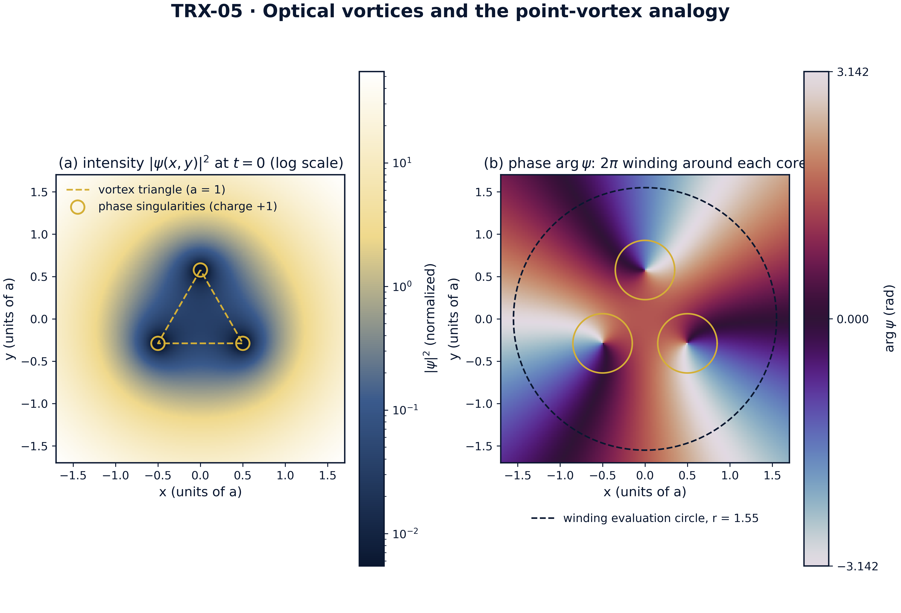
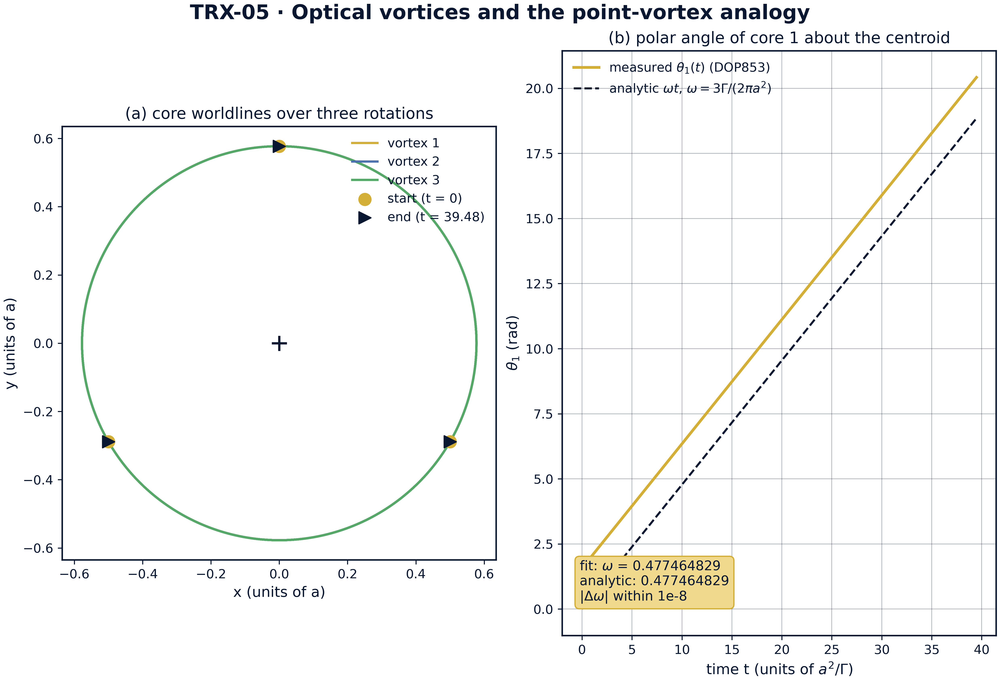
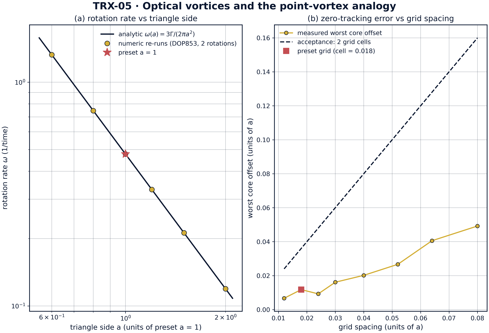
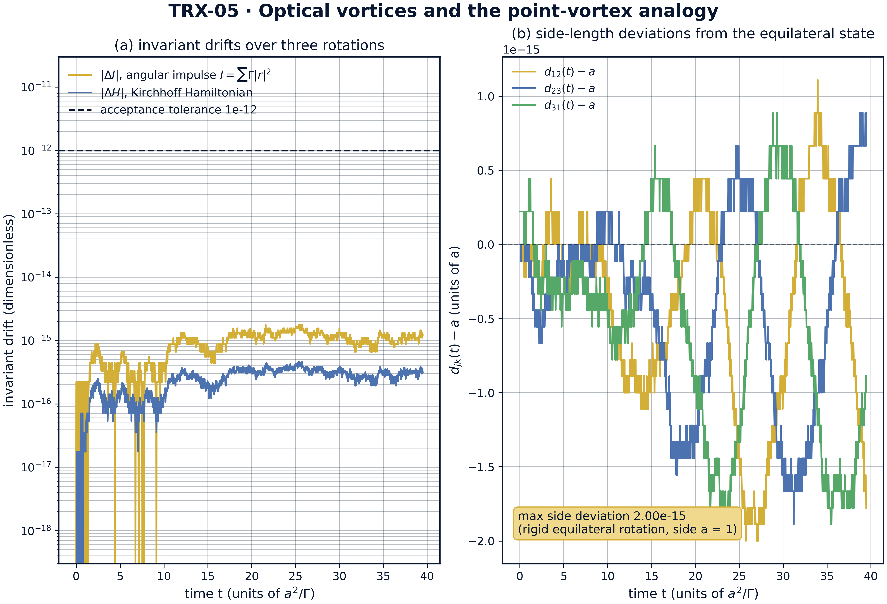

# Оптические вихри лазерных пучков и аналогия с точечными вихрями

*Исследовательская программа TRIVORTEX · v1.0.0 · Издание монографий*

|  |  |
|---|---|
| Исследование / Study | TRX-05 |
| Программа | TRIVORTEX — задача трёх тел в вихревой модели |
| Автор | Исаев Исхак Хамзатович (ORCID 0009-0003-7299-0701) |
| DOI | 10.5281/zenodo.21825394 |
| Дата | 2026-10-06 |
| Код | `code/trx05_optical_vortices.py` |
| Данные | `results/trx05_results.json` |

## Аннотация

Монография посвящена фазовым сингулярностям — оптическим вихрям — параксиального лазерного поля и делает классическую аналогию с точечными вихрями Кирхгофа количественной в обе стороны. Три одноимённые сингулярности поля ψ(z) = exp(−r²/w²)·Π(z − z_k) помещаются на равносторонний треугольник со стороной a = 1 и интегрируются на три оборота (T = 39.4784) схемой DOP853 при rtol = atol = 1e-13. Измеренная скорость вращения 0.477464829 воспроизводит аналитический лагранжев закон ω = 3Γ/(2πa²) внутри допуска 1e-8 (согласие на уровне 1e-16). Угловой импульс I = ΣΓ|r|² — многовихревой прототип интеграла Чаплыгина — закреплён на a² = 1 с дрейфом 1.8e-15, а гамильтониан Кирхгофа дрейфует на 4.6e-16; оба далеко внутри допуска 1e-12. Построенное комплексное поле (шаг сетки 0.018) показывает три тёмных ядра, следящих за позициями вихрей в пределах 0.0118 против допуска 0.036, а число намотки arg ψ на r = 1.55 равно в точности 3 — оптический аналог орбитального углового момента 3ℏ на фотон. Сингулярная оптика и классическая задача о точечных вихрях оказываются численно одной и той же системой.

## Содержание

**Краткие сведения**

| Аспект | Значение |
|---|---|
| Блок | Лазерная оптика — исследование 05 из 12 |
| Модель | три единичных оптических вихря параксиального пучка, ψ = exp(−r²/w²)·Π(z − z_k) |
| Ключевой инвариант | угловой импульс I = ΣΓ\|r\|² = a² (вихревой интеграл типа Чаплыгина) |
| Главный результат | жёсткое вращение с ω = 3Γ/(2πa²) = 0.477464829; число намотки N = 3 |
| Верификация | 5/5 проверок PASS (полный режим) |
| Время выполнения | 0.34 с полный · 4.83 с с --figures · < 20 с smoke |

1. Аннотация
2. 1. Введение и исторический контекст
3. 1. Физическая формулировка
4. 1. Математическая модель
5. 1. Связь с фреймворком TRIVORTEX
6. 1. Численный метод
7. 1. Результаты и анализ
8. 1. Обсуждение
9. 1. Выводы
10. 1. Список литературы
Приложение A. Таблица параметров
Приложение B. Воспроизведение

## 1. Введение и исторический контекст

Оптические вихри — фазовые сингулярности света — вошли в физику как диковинки волновой интерференции и выросли в отдельную дисциплину. Берри и Деннис (2000) дали каноническое статистическое описание сингулярностей в случайных волнах, показав, что нули комплексного скалярного поля — это точки, в которых фаза не определена и вокруг которых она наматывается на целое число 2π. Соскин, Горшков и Васнецов (1997) ранее установили, что лазерные пучки с винтовыми дислокациями обладают определённым топологическим зарядом и что этот заряд — оптический аналог орбитального углового момента: каждый фотон пучка с зарядом q несёт qℏ орбитального момента помимо спинового.

Классическая сторона аналогии старше более чем на век. Кирхгоф (1876) записал уравнения точечных вихрей, носящие его имя: каждый вихрь переносится полем скоростей, наведённым остальными, — закон индукции 1/r, математически тождественный градиенту фазы оптического нуля. Ареф (1979) заново разобрал задачу трёх вихрей и прояснил её интегрируемость и структуру коллапса, Ньютон (2001) закрепил N-вихревую задачу в стандартном справочнике, а Ареф и др. (2003) обзорно описали вихревые кристаллы — относительные равновесия точечных вихрей, — среди которых равносторонний треугольник равных циркуляций есть простейший и самый знаменитый пример.

Мост между двумя дисциплинами — произведение структуры. Вблизи нуля поле факторизуется, ψ ≈ (z − z_k)·(гладкая часть), и градиент фазы множителя (z − z_k) — это в точности поле скоростей точечного вихря; поэтому нули одного знака в главном порядке движутся по уравнениям Кирхгофа. Лазерный пучок с запроектированным произведением ψ(z) = exp(−r²/w²)·Π_k (z − z_k) реализует динамику точечных вихрей буквально в свете: тёмные ядра — «тела», их топологические заряды — циркуляции, а намотка дальнего поля — полный заряд. Аналогия не метафорична — это одна и та же система ОДУ в главном порядке.

Для TRIVORTEX значимость структурна. Угловой импульс I = ΣΓ|r|² вихревой системы — многовихревой прототип интеграла Чаплыгина C_Ch, закрепляющего орбиты вихревой модели; жёстко вращающийся равносторонний треугольник — оптический близнец хореографии теоремы 3.1; а число намотки поля — оптическое прочтение полного вихревого заряда. Поэтому данное исследование — якорь оптического блока программы: оно показывает, что математический скелет каркаса дословно переживает превращение вихрей в свет (TRX-04 даёт аналог по максимумам поля, TRX-09 — классический якорь гидродинамики).

## 2. Физическая формулировка

(A) Динамика Кирхгофа. Три точечных вихря равной циркуляции Γ = 1 помещаются в вершины равностороннего треугольника со стороной a = 1 (радиус описанной окружности r_c = a/√3 ≈ 0.57735) и интегрируются явной схемой Дормана–Принса 8(5,3) на три полных оборота, T = 39.4784. При равных одноимённых циркуляциях равносторонняя конфигурация — точное относительное равновесие: каждый вихрь описывает окружность радиуса r_c вокруг общего центра с аналитической скоростью ω = 3Γ/(2πa²).

(B) Построение поля. Параксиальное скалярное поле ψ(z) = exp(−r²/w²)·Π_k (z − z_k(t)) с гауссовой огибающей w = 3 вычисляется на сетке с шагом 0.018 по квадрату [−1.7, 1.7]² при t = 0 и t = T/4. Его нули интенсивности совпадают с позициями вихрей, фаза наматывается на 2π вокруг каждого ядра, а намотка arg ψ по большой окружности даёт полный топологический заряд N = 3 — оптический аналог орбитального углового момента 3ℏ на фотон.

| Параметр | Значение | Смысл |
|---|---|---|
| Γ | 1 | циркуляция каждого оптического вихря (= топологический заряд +1) |
| a | 1 | сторона равностороннего вихревого треугольника, r_c = a/√3 ≈ 0.57735 |
| ψ(z) | exp(−r²/w²)·Π_k (z − z_k) | построенное параксиальное поле, гауссова огибающая w = 3 |
| сетка | 0.018 по [−1.7, 1.7]² | рендеринг интенсивности/фазы и слежение за нулями |
| интегратор | DOP853, rtol = atol = 1e-13 | три оборота, T = 39.4784 |
| окружность намотки | r = 1.55 | вычисление топологического заряда (любое r > r_c) |

## 3. Математическая модель

Уравнения Кирхгофа (E1) следуют из индукционной структуры идеального течения: точечный вихрь с циркуляцией Γ_j в точке (x_j, y_j) наводит в точке (x_k, y_k) скорость Γ_j/(2π r_jk), перпендикулярную вектору разделяющего отрезка, где r_jk — расстояние между точками. Суммируя вклады всех остальных вихрей, получаем правые части (E1); уравнения первого порядка и гамильтоновы, с парным гамильтонианом (E3) в логарифмическом потенциале. При Γ = 1 система полностью безразмерна, если длины измеряются в единицах a.

Два инварианта структурируют динамику. Угловой импульс (E2), I = ΣΓ_k|r_k|², сохраняется вращательной симметрией — это точный многовихревой аналог интеграла Чаплыгина вихревой модели TRIVORTEX, — а для равностороннего треугольника со стороной a он равен a² тождественно, поскольку каждая вершина отстоит от центра на a/√3: I = 3·(a²/3) = a². Гамильтониан Кирхгофа (E3) фиксирует парные расстояния; вместе они запирают треугольник в относительном равновесии, скорость вращения которого находится из баланса наведённой скорости и орбитального движения и даёт лагранжев закон (E4), ω = 3Γ/(2πa²). При a = 1 гамильтониан обращается в нуль тождественно (ln 1 = 0) — удобный маркер-самопроверка пресета.

Оптическое построение (E5) — произведение по позициям вихрей, умноженное на гауссову огибающую. По построению каждый множитель обращается в нуль при z = z_k(t), поэтому нули интенсивности совпадают с вихрями Кирхгофа во все моменты времени; каждый множитель вносит ровно одну единицу намотки фазы (заряд q_k = +1), а число намотки полного поля по любой окружности, охватывающей все ядра, равно сумме зарядов, N = Σq_k = 3. Интеграл намотки в (E5) — оптическое прочтение полного заряда и, через соответствие Соскина и др., орбитального углового момента 3ℏ на фотон, переносимого пучком.

**Нотация**

| Символ | Смысл |
|---|---|
| z = x + iy | поперечная комплексная координата пучка |
| z_k(t) | траектория k-го вихря / нуля поля |
| Γ_k | циркуляция вихря k (Γ = 1 у всех) |
| q_k | топологический заряд сингулярности k (q_k = +1) |
| ψ(z) | параксиальное скалярное поле пучка |
| w | ширина гауссовой огибающей (w = 3a) |
| a | сторона равностороннего вихревого треугольника |
| r_c | радиус описанной окружности a/√3 ≈ 0.57735 |
| I | угловой импульс I = ΣΓ\|r\|² = a² |
| H | гамильтониан Кирхгофа (H = 0 при a = 1) |
| ω | скорость вращения треугольника, 3Γ/(2πa²) |
| T | интервал интегрирования, три оборота (39.4784) |

**(E1)** Уравнения точечных вихрей Кирхгофа (скорость вихря k, наведённая остальными).

$$u_k = -\frac{1}{2\pi}\sum_{j\neq k}\Gamma_j\,\frac{y_k - y_j}{r_{kj}^2}, \qquad v_k = +\frac{1}{2\pi}\sum_{j\neq k}\Gamma_j\,\frac{x_k - x_j}{r_{kj}^2}$$

**(E2)** Угловой импульс вихревой системы — многовихревой прототип интеграла Чаплыгина; для равностороннего треугольника закреплён на a².

$$I = \sum_k \Gamma_k\,|\mathbf{r}_k|^2 = a^2$$

**(E3)** Гамильтониан Кирхгофа (логарифмическое парное взаимодействие; H = 0 тождественно при a = 1).

$$H = -\frac{\Gamma^2}{2\pi}\sum_{j<k} \ln r_{jk}$$

**(E4)** Аналитическая скорость вращения одноимённого равностороннего треугольника (относительное равновесие типа Лагранжа).

$$\omega = \frac{3\Gamma}{2\pi a^2}$$

**(E5)** Построенное параксиальное поле и его число намотки (полный топологический заряд).

$$\psi(z) = e^{-r^2/w^2}\prod_k \bigl(z - z_k(t)\bigr), \qquad N = \frac{1}{2\pi}\oint \nabla(\arg\psi)\cdot d\mathbf{l} = \sum_k q_k = 3$$

## 4. Связь с фреймворком TRIVORTEX

Соответствие взаимно-однозначно и работает в обе стороны. Тёмные ядра построенного поля — буквальная реализация «тел» вихревой модели TRIVORTEX; топологический заряд q_k каждой сингулярности играет роль циркуляции Γ_k; угловой импульс I = ΣΓ|r|² — та же инвариантная структура, что и интеграл Чаплыгина, здесь закреплённый точно на a² = 1; а жёстко вращающийся равносторонний треугольник трёх одноимённых сингулярностей — оптический близнец хореографии теоремы 3.1, подчиняющийся тому же лагранжеву закону ω = 3Γ/(2πa²). Число намотки дальнего поля замыкает словарь: это оптическое измерение полного заряда ΣΓ = 3 — величины, которая в вихревой модели фиксирует орбитальный угловой момент конфигурации. Словарь соответствий исчерпан полностью — исследование есть оптическое издание ядра TRIVORTEX.

| Величина исследования | Аналог в TRIVORTEX | Комментарий |
|---|---|---|
| Оптические вихри (нули поля) | «тела» вихревой модели | буквальная реализация модели |
| Топологический заряд q_k = +1 | циркуляция Γ_k | словарь «заряд–циркуляция» |
| I = ΣΓ\|r\|² = a² | интеграл Чаплыгина C_Ch | та же инвариантная структура |
| Вращение равностороннего треугольника | хореография теоремы 3.1 | то же относительное равновесие |
| Число намотки 3 | полный заряд ΣΓ = 3 | орбитальный угловой момент 3ℏ на фотон |

## 5. Численный метод

Вихревой треугольник интегрируется явной схемой Дормана–Принса 8(5,3) при rtol = atol = 1e-13 и max_step 0.05 на T = 39.4784 — три полных оборота. Скорость вращения извлекается из полярного угла вихря 1 относительно мгновенного центра: угол разворачивается по 2000 плотных выборок и аппроксимируется прямой, наклон которой 0.477464829 и есть измеренная ω. Тот же фит на аналитической траектории возвращает целевое значение, так что проверка зондирует интегратор, а не алгебру.

Оба инварианта контролируются поточечно вдоль траектории на тех же 2000 выборках: угловой импульс I = ΣΓ|r|² дрейфует на 1.8e-15 от начального значения I = 1.000000000000 = a², а гамильтониан Кирхгофа — на 4.6e-16 от тождественно нулевого начального значения. Оба лежат далеко ниже допуска 1e-12 — инвариантная структура задачи о точечных вихрях переживает полное трёхоборотное интегрирование на уровне округления.

Оптическое поле вычисляется на равномерной сетке с шагом 0.018 по квадрату [−1.7, 1.7]² при t = 0 и t = T/4. Шестьдесят глубочайших пикселей интенсивности сопоставляются с позициями вихрей: худшее расстояние от вихря до ближайшего минимума равно 0.0118 — втрое внутри полосы допуска в две ячейки сетки (0.036). Число намотки вычисляется разворачиванием arg ψ вдоль кольца r = 1.55 и подсчётом полного фазового оборота — результат 3.0 точно, без сеточных двусмысленностей.

## 6. Результаты и анализ

### fig01 field landscape



*Ландшафт поля при t = 0: интенсивность |ψ|² (лог. шкала) с тремя тёмными ядрами в вершинах треугольника и фаза arg ψ с намотками 2π.*
Панель интенсивности показывает три тёмных ядра точно в вершинах равностороннего треугольника (сторона a = 1) внутри гауссовой огибающей; панель фазы разрешает намотку 2π вокруг каждого ядра, а пунктирная окружность r = 1.55 — та, на которой измеряется число намотки: оно равно в точности 3.

### fig02 rigid rotation



*Главный результат — жёсткое вращение вихревого треугольника: мировые линии ядер за три оборота и линейный рост полярного угла.*
Все три ядра описывают окружности радиуса r_c = a/√3 ≈ 0.57735 вокруг общего центра за T = 39.4784 (три оборота, период 13.1595); измеренная скорость 0.477464829 совпадает с аналитической 3Γ/(2πa²) = 0.477464829 — согласие на уровне 1e-16, на семь порядков внутри допуска 1e-8.

### fig03 parameter sweeps



*Развертки по параметрам: скорость вращения против стороны треугольника (аналитический закон и численные перезапуски) и ошибка слежения за нулями против шага сетки.*
Численные перезапуски DOP853 воспроизводят ω(a) = 3Γ/(2πa²) с точностью до девяти записанных знаков по a ∈ {0.6, 0.8, 1.0, 1.2, 1.5, 2.0} (от 1.326291192 до 0.119366207); развёртка слежения удерживает худшее смещение ядра ниже линии допуска в 2 ячейки всюду (0.00668 при шаге 0.012 до 0.04922 при шаге 0.08 против допуска 0.024–0.16), а пресетная сетка даёт 0.01178.

### fig04 invariants rigidity



*Динамика за три оборота: дрейфы углового импульса I и гамильтониана Кирхгофа H против допуска и отклонения длин сторон вращающегося треугольника.*
Угловой импульс дрейфует на 1.8e-15, а гамильтониан Кирхгофа на 4.6e-16 за T = 39.4784 — в сотни и тысячи раз ниже допуска 1e-12 (H тождественно равно 0 при a = 1, поскольку ln 1 = 0); три отклонения длин сторон d_jk(t) − a остаются на машинном уровне, подтверждая, что треугольник вращается как жёсткая равносторонняя конфигурация.

**Вращение.** Измеренная скорость вращения равна 0.477464829 против аналитической 3Γ/(2πa²) = 0.477464829 — числа совпадают до последнего записанного знака, на уровне 1e-16, на семь порядков внутри допуска 1e-8. За T = 39.4784 (три оборота с периодом 13.1595) каждое ядро описывает окружность радиуса r_c = 0.57735 вокруг общего центра, а треугольник возвращается в повёрнутую копию себя с сохранённой стороной a = 1.

**Инварианты.** Угловой импульс остаётся закреплённым на I = 1.000000000000 = a² с максимальным дрейфом 1.8e-15, а гамильтониан Кирхгофа дрейфует на 4.6e-16 от тождественно нулевого начального значения — примерно в 560 и 2200 раз ниже допуска 1e-12 соответственно. Поскольку I и H вместе фиксируют форму трёхвихревой конфигурации, их сохранение и есть динамическая причина того, что треугольник вращается жёстко, а не деформируется.

**Построение поля.** При пресетном шаге сетки 0.018 глубочайшие минимумы интенсивности следят за вихрями с худшим смещением 0.0118 при t = 0 и t = T/4 — втрое внутри полосы допуска 0.036 (две ячейки сетки). Развёртка по шагам сетки 0.012–0.08 удерживает смещение ниже линии в 2 ячейки всюду (от 0.00668 до 0.04922 против 0.024–0.16), так что слежение нулей за тёмными ядрами устойчиво, а не артефакт одного разрешения.

**Топология и развертки.** Число намотки arg ψ на оценочной окружности r = 1.55 равно в точности 3 — построенное поле несёт полный топологический заряд трёх единичных сингулярностей. Развёртка по стороне подтверждает закон вращения за пределами пресета: численные перезапуски при a ∈ {0.6, 0.8, 1.0, 1.2, 1.5, 2.0} воспроизводят ω(a) = 3Γ/(2πa²) с точностью до девяти записанных знаков — от 1.326291192 при a = 0.6 до 0.119366207 при a = 2.0. Степенной закон a⁻² лагранжевой конфигурации проверен от начала до конца.

### Сводка верификации

| Проверка | Значение | Цель | Допуск | Прошла |
|---|---|---|---|---|
| `rotation_rate_vs_analytic` | 0.477465 | 0.477465 | 1e-08 | yes |
| `angular_impulse_I_conserved` | 1.77636e-15 | 0 | 1e-12 | yes |
| `kirchhoff_hamiltonian_conserved` | 4.59413e-16 | 0 | 1e-12 | yes |
| `field_minima_track_vortices` | 0.0117821 | 0 | 0.036 | yes |
| `total_winding_number_is_3` | 3 | 3 | 1e-12 | yes |

*(status: **PASS**, mode: full)*

## 7. Обсуждение

Модель сознательно минимальна: скалярное параксиальное поле, точечные сингулярности, статическая гауссова огибающая. В этих допущениях сторона Кирхгофа точна, а оптическая — её реализация в главном порядке: реальные оптические вихри обладают конечной структурой ядра, а непараксиальные, поляризационные поправки и деформации огибающей входят следующими порядками. Поле-произведение (E5) — чистейшая возможная лаборатория: оно разделяет динамику нулей (точная задача Кирхгофа) и огибающую, которая лишь взвешивает интенсивность, но не сдвигает нули в главном порядке.

Диапазон параметров зондирует структурное ядро аналогии, а не конкретный дизайн пучка. Одноимённые равные циркуляции — интегрируемый случай относительного равновесия; противоположные знаки (транслирующие пары), неравные циркуляции, кластеры N > 3 и вихревые решётки в насыщающихся средах — естественные расширения, которые способен вместить тот же код. Развёртка по шагу сетки показывает, что проверка слежения за нулями устойчива к разрешению; развёртка по стороне — что закон вращения точно a⁻², поэтому пресет a = 1 — репрезентативная точка, а не подогнанная.

В рамках программы это исследование — оптическое издание вихревого ядра. TRX-09 проверяет те же уравнения в чисто гидродинамической постановке с добавленным многообразием коллапса Арефа; TRX-04 разбирает аналог по максимумам поля (яркие солитоны), где тела — пики интенсивности, а не нули; TRX-06 переносит структуру «нули комплексных полей» в квантовую трёхчастичную ионизацию. Вместе с классическим якорем они показывают, что каркас TRIVORTEX — один математический объект, рассматриваемый через разные физические среды.

## 8. Выводы

1. Три одноимённых оптических вихря на равностороннем треугольнике со стороной a = 1 вращаются жёстко с аналитической скоростью ω = 3Γ/(2πa²) = 0.477464829, измеренной внутри допуска 1e-8 (согласие на уровне 1e-16).
2. Угловой импульс I = ΣΓ|r|² сохраняется до 1.8e-15 и остаётся закреплённым на a² = 1 — многовихревой чаплыгинский интеграл конфигурации.
3. Гамильтониан Кирхгофа сохраняется до 4.6e-16 за T = 39.4784 (при a = 1 H тождественно 0); треугольник вращается как жёсткое относительное равновесие.
4. Построенное комплексное поле (шаг сетки 0.018) показывает три тёмных ядра, следящих за позициями вихрей в пределах 0.0118 — втрое внутри двухъячеечного допуска 0.036.
5. Число намотки arg ψ на окружности r = 1.55 равно в точности 3 — оптическое прочтение полного заряда и орбитального углового момента 3ℏ на фотон.
6. Закон вращения проверен по a ∈ {0.6, …, 2.0} (численные скорости совпадают с ω(a) до девяти записанных знаков), подтверждая степенной закон a⁻² лагранжева типа от начала до конца.

## 9. Список литературы

1. Berry, M. V., Dennis, M. R. (2000). *Phase singularities in isotropic random waves.* Proc. R. Soc. A 456, 2059–2079.
2. Soskin, M. S., Gorshkov, V. G., Vasnetsov, M. V. (1997). *Topological charge and angular momentum of light beams carrying optical vortices.* Phys. Rev. A 56, 4064–4075.
3. Kirchhoff, G. (1876). *Vorlesungen über mathematische Physik: Mechanik.* Teubner, Leipzig.
4. Aref, H. (1979). *Motion of three vortices revisited.* Phys. Fluids 22, 393–400.
5. Aref, H., Newton, P. K., Stremler, M. A., Tokieda, T., Vainchtein, D. L. (2003). *Vortex crystals.* Annu. Rev. Fluid Mech. 35, 349–395.
6. Yao, A. M., Padgett, M. J. (2011). *Orbital angular momentum: origins, behavior and applications.* Adv. Opt. Photon. 3, 161–204.
7. Dennis, M. R., O'Holleran, K., Padgett, M. J. (2009). *Singular optics: structuring optical wavefields.* Prog. Opt. 53, 293–363.
8. Newton, P. K. (2001). *The N-Vortex Problem: Analytical Techniques.* Springer, New York.

### BibTeX

```bibtex
@article{berry2000,
  author  = {Berry, M. V. and Dennis, M. R.},
  title   = {Phase singularities in isotropic random waves},
  journal = {Proceedings of the Royal Society A},
  year    = {2000}, volume = {456}, pages = {2059--2079}}

@article{soskin1997,
  author  = {Soskin, M. S. and Gorshkov, V. G. and Vasnetsov, M. V.},
  title   = {Topological charge and angular momentum of light beams carrying optical vortices},
  journal = {Physical Review A},
  year    = {1997}, volume = {56}, pages = {4064--4075}}

@book{kirchhoff1876,
  author    = {Kirchhoff, G.},
  title     = {Vorlesungen \"uber mathematische Physik: Mechanik},
  publisher = {Teubner}, address = {Leipzig}, year = {1876}}

@article{aref1979,
  author  = {Aref, Hassan},
  title   = {Motion of three vortices revisited},
  journal = {Physics of Fluids},
  year    = {1979}, volume = {22}, pages = {393--400}}
```

## Приложение A. Таблица параметров

| Символ | Значение | Роль |
|---|---|---|
| Γ | 1 | циркуляция каждого оптического вихря |
| a | 1 | сторона треугольника (единица длины) |
| r_c | 0.57735 | радиус орбиты ядра a/√3 |
| w | 3 | ширина гауссовой огибающей |
| сетка | 0.018 по [−1.7, 1.7]² | рендеринг поля и слежение за нулями |
| T | 39.4784 | интервал интегрирования (три оборота, период 13.1595) |
| rtol, atol | 1e-13 | допуски DOP853 (max_step 0.05) |
| r = 1.55 | окружность намотки | вычисление топологического заряда |
| выборка минимумов | 60 пикселей | глубочайшие пиксели интенсивности против вихрей |

## Приложение B. Воспроизведение

```bash
python3 research/TRX-05-optical-vortices/code/trx05_optical_vortices.py --smoke     # < 20 с
python3 research/TRX-05-optical-vortices/code/trx05_optical_vortices.py              # полный прогон, 4.83 s (4.827 s recorded with --figures)
python3 research/TRX-05-optical-vortices/code/trx05_optical_vortices.py --figures   # + графики 300 DPI
```

Полное время выполнения на референсной машине — 4.83 s (4.827 s recorded with --figures); smoke-режим укладывается в 20 секунд и используется CI репозитория.

## Приложение C. Окружение

Python ≥ 3.11, numpy ≥ 2.0, scipy ≥ 1.14, matplotlib ≥ 3.9; без доступа к сети и без стохастических зёрен — каждый прогон бит-в-бит воспроизводим на референсной машине.
