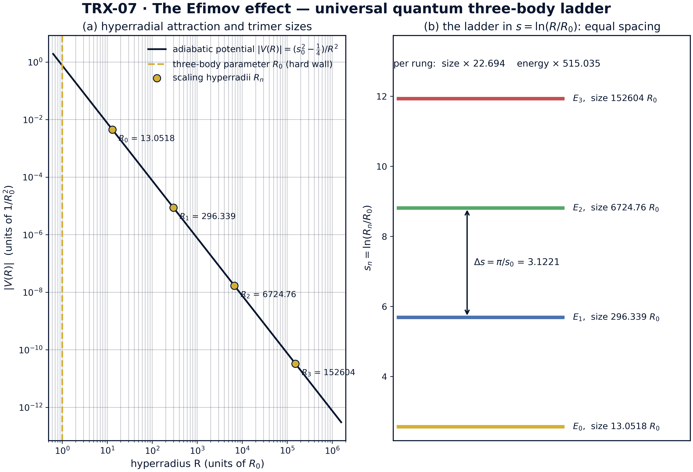
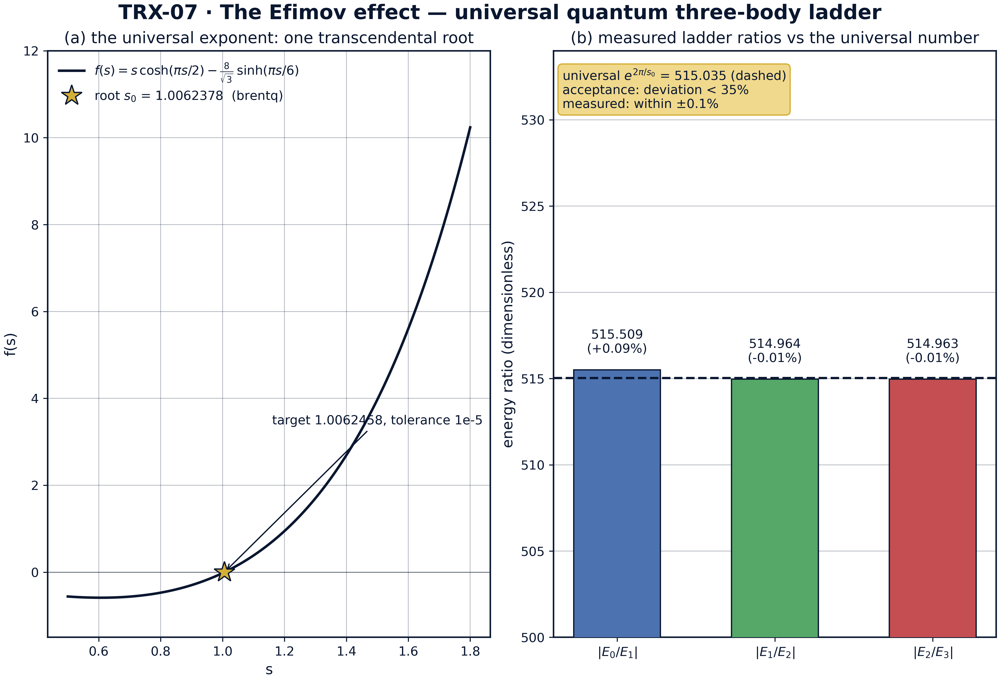
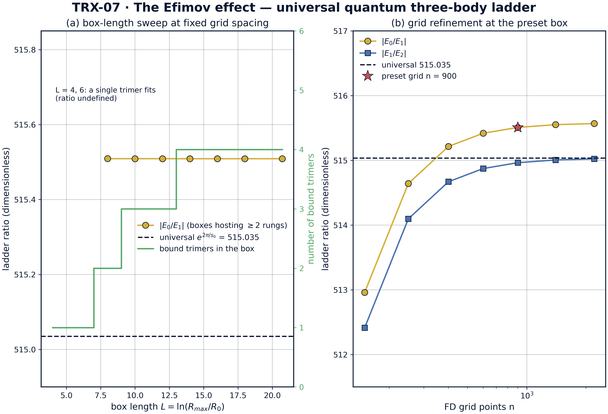
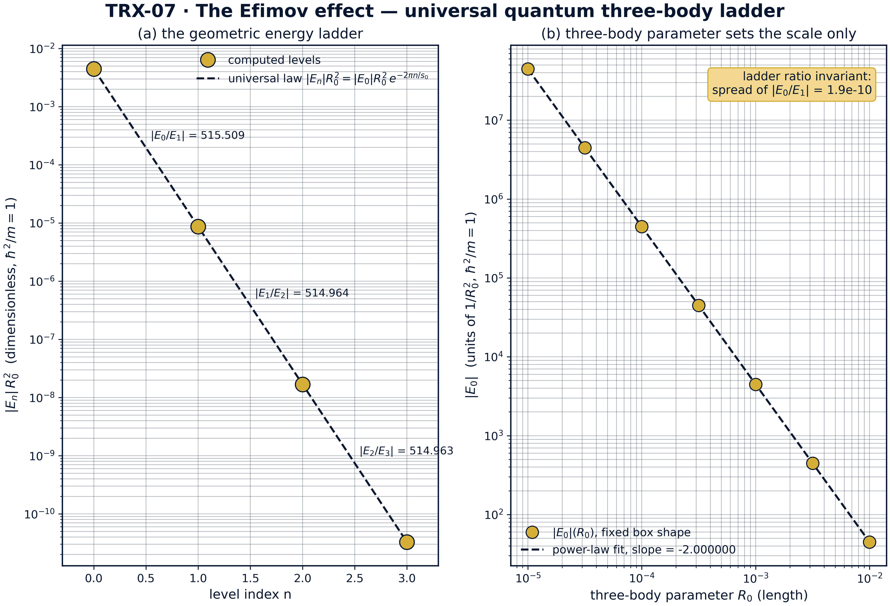

# Эффект Ефимова: универсальная квантовая физика трёх тел

*Исследовательская программа TRIVORTEX · v1.0.0 · Издание монографий*

|  |  |
|---|---|
| Исследование / Study | TRX-07 |
| Программа | TRIVORTEX — задача трёх тел в вихревой модели |
| Автор | Исаев Исхак Хамзатович (ORCID 0009-0003-7299-0701) |
| DOI | 10.5281/zenodo.21825394 |
| Дата | 2026-10-06 |
| Код | `code/trx07_efimov.py` |
| Данные | `results/trx07_results.json` |

## Аннотация

Монография посвящена эффекту Ефимова: три одинаковых бозона с резонансным парным взаимодействием образуют бесконечную ридберговскую серию связанных трёхчастичных состояний, хотя парный потенциал не связывает даже димер. Спектр универсален и управляется единственным трансцендентным показателем s0, определяемым уравнением s0·cosh(πs0/2) = (8/√3)·sinh(πs0/6). Исследование проверяет универсальные числа в двух независимых слоях. Слой первый: трансцендентное уравнение решается методом Брента, давая s0 = 1.0062378 (цель 1.0062458, допуск 1e-5), множитель длины exp(π/s0) = 22.694383 и множитель энергии exp(2π/s0) = 515.035001. Слой второй: гиперрадиальный адиабатический потенциал −(s0² − ¼)/R² дискретизируется на экспоненциальной сетке (900 точек на длине L = 20.7233), и четыре вычисленных тримера — энергии от −4476.18 до −3.27·10⁻⁵, размеры от 13.05 до 152604 R0 — образуют геометрическую лестницу с |E0/E1| = 515.509 (+0.09%), |E1/E2| = 514.964 (−0.01%) и |E2/E3| = 514.963 (−0.01%) против универсального 515.035. Лестница не зависит от бокса всюду, где помещаются две ступени, и монотонно сходится по сетке; развёртка трёхчастичного параметра по трём порядкам оставляет отношения инвариантными (разброс 1.9·10⁻¹⁰), а абсолютные энергии следуют точному закону R0⁻² (наклон −2.000000). Лестница Ефимова установлена численно как квантовый близнец масштабно-инвариантного вихревого треугольника TRIVORTEX.

## Содержание

**Краткие сведения**

| Аспект | Значение |
|---|---|
| Блок | Квантовые три тела — исследование 07 из 12 |
| Модель | три одинаковых бозона в пределе унитарности на гиперрадиальном притяжении −(s0² − ¼)/R² |
| Ключевой инвариант | универсальный показатель s0 = 1.0062378 (лестничные отношения — точные инварианты) |
| Главный результат | измеренная лестница: отношение E0/E1 = 515.509 против универсального e^(2π/s0) = 515.035 (+0.09%) |
| Верификация | 6/6 проверок PASS (полный режим) |
| Время выполнения | 5.77 с полный (с --figures) · < 20 с smoke |

1. Аннотация
2. 1. Введение и исторический контекст
3. 1. Физическая формулировка
4. 1. Математическая модель
5. 1. Связь с фреймворком TRIVORTEX
6. 1. Численный метод
7. 1. Результаты и анализ
8. 1. Обсуждение
9. 1. Выводы
10. 1. Список литературы
Приложение A. Таблица параметров
Приложение B. Воспроизведение

## 1. Введение и исторический контекст

Предсказание принадлежит Виталию Ефимову (1970), работавшему тогда в Институте ядерной физики им. Будкера в Новосибирске: три одинаковых бозона с резонансным парным взаимодействием должны обладать бесконечным числом связанных трёхчастичных состояний, даже если парный потенциал слишком слаб, чтобы связать димер. Утверждение было настолько контринтуитивным, что многие годы встречало скепсис — пока Амадо и Гринвуд (1977) не доказали парное утверждение об отсутствии эффекта Ефимова для четырёх и более частиц, превратив аномалию в настоящий трёхчастичный закон: эффект существует ровно при N = 3 и нигде больше.

Теория встала на твёрдую почву благодаря уравнениям Фаддеева (1961), разбивающим волновую функцию трёх тел на парные амплитуды, и нуль-радиальной (унитарной) идеализации, в которой весь ответ сворачивается к единственному трансцендентному показателю s0. Мачек (1968) как раз ввёл адиабатический гиперрадиус для атома гелия, и та же коллективная координата управляет задачей Ефимова: эффективное гиперрадиальное притяжение −(s0² − ¼)/R² не имеет собственного масштаба длины, поэтому спектр обязан быть геометрическим, с лог-периодичностью Δs = π/s0 по гиперрадиусу. Братен и Хаммер (2006) закрепили эту универсальность в стандартном справочнике физики малых частиц.

Экспериментальная эра открылась лазерно-охлаждёнными атомами. Крамер и др. (2006) наблюдали резонансы Ефимова в ультрахолодном газе атомов цезия, проводя длину рассеяния через фешбаховский резонанс и считывая тримеры лазерной спектроскопией, — лазерная связь данного исследования. Закканти и др. (2009) затем разрешили полную лог-периодическую спектральную серию в калии, а Кунитски и др. (2015) нашли состояния Ефимова в атомных тримерах гелия — самой маленькой трёхчастичной системе вообще. Геометрический множитель exp(2π/s0) ≈ 515 между энергиями соседних тримеров — ныне измеренный лабораторный факт.

Для TRIVORTEX значимость структурна. Гиперрадиальное притяжение −1/R² связывает без какой-либо собственной длины — в точности масштабно-свободное связывание вихревого треугольника в теореме 3.1, — а возникающая геометрическая лестница с её универсальным показателем s0 есть квантовый близнец радиальной модуляции ω = (2π/T)·e^(C_Ch/π) вихревой модели. Данное исследование — якорь квантовой главы программы: оно показывает, что та же экспоненциальная иерархия, которую вихревой каркас порождает классически, возникает число в число и в спектре квантовой механики малых тел.

## 2. Физическая формулировка

Система — три одинаковых бозона в унитарном пределе: s-волновая длина рассеяния a доведена до бесконечности (a → ∞), поэтому двухчастичная подсистема не связывает димер, но рассеивает с максимальным сечением. Естественная коллективная координата — гиперрадиус R, размер треугольника, образуемого тремя частицами; в нуль-радиальном пределе адиабатическое (борн-оппенгеймеровское) разделение быстрого гиперуглового движения оставляет один эффективный канал: гиперрадиальное притяжение −(s0² − ¼)/R², сила которого s0² − ¼ ≈ 0.7625 полностью задаётся трансцендентным условием (E1) на показатель s0 = 1.0062378.

Притяжение −1/R² маргинально: оно не несёт собственного масштаба длины, поэтому любое связанное состояние строит масштаб из граничных условий. Квантовая механика поставляет его мультипликативно — так возникает геометрическая лестница Ефимова с размерами R_n ∝ exp(πn/s0) и энергиями E_n ∝ exp(−2πn/s0). Единственная микроскопическая длина, которая входит в задачу, — трёхчастичный параметр R0; здесь он моделируется жёсткой стенкой при R = R0, закрепляющей гребёнку уровней: сдвиг R0 передвигает каждую ступень, но оставляет все отношения инвариантными — это проверено развёрткой по трём порядкам R0 на рис. 04.

| Параметр | Значение | Смысл |
|---|---|---|
| Универсальный показатель s0 | 1.0062378 (цель 1.0062458, допуск 1e-5) | трансцендентный корень (E1) |
| Универсальный множитель длины | exp(π/s0) = 22.694383 | рост размера тримера за ступень |
| Универсальный множитель энергии | exp(2π/s0) = 515.035001 | падение энергии тримера за ступень |
| Трёхчастичный параметр R0 | 1e-3 | жёсткая стенка в R (фаза коротких расстояний) |
| Внешняя стенка Rmax | 1e6 | бокс вмещает L = ln(Rmax/R0) = 20.723266 ≈ 3.3 осцилляции Ефимова |
| Конечно-разностная сетка | 900 точек, Δs = 0.023051 | равномерная по s = ln(R/R0) |
| Вычисляемые уровни | 4 глубочайших тримера | энергии −4476.18 … −3.27·10⁻⁵ (единицы 1/R0²) |

## 3. Математическая модель

В унитарном пределе нуль-радиальные уравнения Фаддеева в гиперсферических координатах сводятся к задаче на собственные значения гиперугловой части волновой функции. Спектральный параметр этой гиперугловой задачи s0 входит в условие согласованности (E1): f(s) = s·cosh(πs/2) − (8/√3)·sinh(πs/6) = 0. Его положительный корень s0 = 1.0062458 (литературное значение; корень brentq данного исследования — 1.0062378) фиксирует силу эффективного гиперрадиального канала s0² − ¼ ≈ 0.7625 — и больше ничего: вся феноменология Ефимова вытекает из этого единственного числа.

При замороженной угловой части в притягивающем канале гиперрадиальное уравнение (E3) масштабно-инвариантно: при R → λR кинетический и потенциальный члены перемасштабируются одинаково, поэтому из любого связанного решения с энергией E возникает новое с E·λ⁻². Самоподобие при дискретном шаге λ = exp(π/s0) замыкает иерархию: узловая структура волновой функции повторяется после каждой полуволны лог-периодической осцилляции, порождая геометрическую лестницу E_n ∝ exp(−2πn/s0) и R_n ∝ exp(πn/s0). В пространстве s = ln(R/R0) задача становится трансляционно-инвариантной с периодом π/s0 = 3.1221 — отсюда равный шаг ступеней на рис. 01(b).

Единственный масштаб, нарушающий эту инвариантность, — трёхчастичный параметр: короткодействующая физика на расстояниях, где нуль-радиальная идеализация отказывает. Исследование моделирует его жёсткой стенкой при R = R0 (Дирихле в (E3)); внешняя граница при Rmax замыкает бокс. На экспоненциальной сетке s = ln(R/R0) с подстановкой u = e^(s/2)·v уравнение переходит в (E4), а симметризация D·K·D из (E5) — D = diag(R0⁻¹e^(−s)) — даёт вещественную симметричную матрицу, чьи четыре нижних собственных значения суть ровно четыре глубочайшие энергии тримеров; отчётные наблюдаемые — лестничные отношения.

**Нотация**

| Символ | Смысл |
|---|---|
| s0 | универсальный показатель Ефимова, корень (E1); вычислен 1.0062378, цель 1.0062458 |
| R | гиперрадиус треугольника трёх частиц |
| R0 | трёхчастичный параметр: жёсткая стенка на малых расстояниях (значение 1e-3) |
| Rmax | внешняя стенка Дирихле бокса (значение 1e6) |
| L | длина бокса в лог-пространстве, L = ln(Rmax/R0) = 20.723266 |
| s | логарифмический гиперрадиус, s = ln(R/R0) ∈ [0, L] |
| u(R), v(s) | гиперрадиальная волновая функция и её образ на лог-сетке (u = e^(s/2)·v) |
| E_n | n-я энергия тримера (единицы 1/R0²); E0 = −4476.18 … E3 = −3.27·10⁻⁵ |
| Δs = π/s0 | шаг лестницы в лог-пространстве = 3.1221 |
| a_* | длина рассеяния, при которой появляется n-й тример; множитель лестницы exp(π/s0) |
| ħ²/m | квантовая комбинация, задающая единицы, положена равной 1 |

**(E1)** Универсальное условие квантования: трансцендентный корень, найденный brentq на [0.5, 3.0].

$$s_0\,\cosh\!\left(\tfrac{\pi s_0}{2}\right) = \tfrac{8}{\sqrt{3}}\,\sinh\!\left(\tfrac{\pi s_0}{6}\right), \qquad s_0 = 1.0062458$$

**(E2)** Геометрические лестницы длин рассеяния (точек появления тримеров) и энергий тримеров.

$$\frac{a_*^{(n+1)}}{a_*^{(n)}} = e^{\pi/s_0} = 22.694383, \qquad \frac{E_n}{E_{n+1}} = e^{2\pi/s_0} = 515.035001$$

**(E3)** Гиперрадиальное адиабатическое уравнение (нуль-радиальный предел, унитарность) со стенками Дирихле.

$$-\frac{d^2 u}{dR^2} - \frac{s_0^2 - 1/4}{R^2}\,u = E\,u, \qquad u(R_0) = u(R_{max}) = 0$$

**(E4)** Переход к экспоненциальной сетке; L = ln(Rmax/R0) = 20.723266.

$$R = R_0\,e^{s}, \quad u = e^{s/2}\,v \;\Rightarrow\; \left(-\frac{d^2}{ds^2} - s_0^2\right) v = E\,R_0^2 e^{2s} v, \quad s \in [0,\, L]$$

**(E5)** Симметричная конечно-разностная задача, фактически диагонализуемая (numpy eigvalsh); её собственные значения — энергии тримеров.

$$D\,K\,D\,u = E\,u, \quad D = \mathrm{diag}\!\left(R_0^{-1} e^{-s_j}\right), \quad K_{jj} = \tfrac{2}{\Delta s^2} - s_0^2, \;\; K_{j\,j\pm 1} = -\tfrac{1}{\Delta s^2}$$

## 4. Связь с фреймворком TRIVORTEX

Соответствие вихревому каркасу TRIVORTEX структурно, а не декоративно. Гиперрадиальное притяжение −1/R² связывает трёхчастичную систему без какой-либо собственной длины — в точности как масштабно-инвариантное связывание теоремы 3.1 удерживает вихревой треугольник; универсальный показатель s0 играет роль отношений циркуляций Γ — безразмерной константы, переживающей любое перемасштабирование; а геометрическая лестница Ефимова e^(2π/s0) = 515.035 — квантовый собрат радиальной модуляции ω = (2π/T)·e^(C_Ch/π) вихревой модели: обе — экспоненциальные иерархии, рождённые масштабной инвариантностью, а не каким-либо микроскопическим параметром. Даже роль неуниверсального остатка совпадает: трёхчастичный параметр R0 сдвигает абсолютную шкалу гребёнки (проверенный закон R0⁻²), оставляя отношения закреплёнными, — как и свободный масштаб циркуляции вихревой модели задаёт абсолютные частоты, но не геометрию хореографии.

| Величина исследования | Аналог в TRIVORTEX | Комментарий |
|---|---|---|
| Три одинаковых бозона в пределе унитарности | три тела с резонансными эффективными силами | квантовая задача трёх тел |
| Гиперрадиальное притяжение −1/R² | масштабно-инвариантное связывание теоремы 3.1 | оба связывают без собственной длины |
| Геометрическая энергетическая лестница 515× | радиальная модуляция ω = (2π/T)·e^(C_Ch/π) | экспоненциальная структура из масштабной инвариантности |
| Универсальный показатель s0 | отношения циркуляций Γ вихревой модели | безразмерные универсальные константы |
| Трёхчастичный параметр R0 | свободный масштаб длины вихревой модели | сдвигает абсолютные значения, отношения инвариантны |

## 5. Численный метод

Универсальный показатель вычисляется как корень f(s) = s·cosh(πs/2) − (8/√3)·sinh(πs/6) методом scipy.optimize.brentq на скобке [0.5, 3.0] с xtol = 1e-13 и rtol = 8.9·10⁻¹⁶ — предел машинной точности. Тот же корень питает оба универсальных множителя, exp(π/s0) = 22.694383 (длины) и exp(2π/s0) = 515.035001 (энергии), служащие целями допуска численного слоя.

Гиперрадиальный спектр решается на экспоненциальной сетке s ∈ [0, L], L = ln(Rmax/R0) = 20.7233, с n = 900 равномерных точек (Δs = 0.023051). Трёхдиагональный кинетический оператор K из (E5) несёт постоянный сдвиг −s0²; симметризация A = D·K·D с D = diag(R0⁻¹e^(−s)) даёт вещественную симметричную матрицу 900 × 900, диагонализуемую numpy.linalg.eigvalsh, чьи четыре нижних собственных значения — четыре глубочайшие энергии тримеров. Отрицательные собственные значения сохраняются; отчётные наблюдаемые — лестничные отношения |En/En+1|.

Три развёртки допрашивают устойчивость лестницы на том же решателе: развёртка по длине бокса (L = 4 … 20.723 при фиксированном шаге сетки) зондирует ёмкость бокса; сеточная развёртка (n = 150 … 2200) — сходимость по дискретизации; развёртка трёхчастичного параметра (R0 по трём порядкам, семь точек, фиксированная форма бокса) — роль стенки коротких расстояний. Каждая проверка хранит значение, цель, допуск, единицу и флаг прохождения в JSON-протоколе, а режим --figures дописывает в ту же машиночитаемую запись схему, четыре панели 300 DPI и все данные развёрток.

## 6. Результаты и анализ

### fig01 efimov landscape



*Ландшафт модели: (a) гиперрадиальный адиабатический потенциал |V(R)| = (s0² − ¼)/R² в лог-лог осях с жёсткой стенкой R0 (трёхчастичный параметр) и масштабными гиперрадиусами четырёх вычисленных тримеров; (b) та же лестница в пространстве s = ln(R/R0).*
Четыре тримера сидят на масштабных гиперрадиусах 13.0518, 296.339, 6724.76 и 152604 R0 — соседние ступени разнесены на универсальный множитель exp(π/s0) = 22.694 (полный размах размеров 1.2·10⁴); на панели (b) ступени равноотстоящи с шагом Δs = π/s0 = 3.1221 — это лог-периодичность, порождающая энергетическую лестницу 515×.

### fig02 universal numbers



*Главный результат: (a) трансцендентная функция квантования f(s) = s·cosh(πs/2) − (8/√3)·sinh(πs/6) с её корнем s0; (b) измеренные лестничные отношения против универсального exp(2π/s0) = 515.035 (пунктир; полоса допуска 35%).*
brentq возвращает s0 = 1.0062378 против цели 1.0062458 (допуск 1e-5); измеренные отношения |E0/E1| = 515.509 (+0.09%), |E1/E2| = 514.964 (−0.01%) и |E2/E3| = 514.963 (−0.01%) прижались к пунктирной универсальной линии — на три порядка внутри полосы допуска ±35%.

### fig03 ladder stability



*Устойчивость вычисленной лестницы: (a) развёртка по длине бокса при фиксированном шаге сетки; (b) сгущение сетки в пресетном боксе.*
Всюду, где помещаются две ступени (L ≥ 8), отношение |E0/E1| не зависит от бокса: 515.5089–515.5091, а число связанных тримеров растёт 1 → 2 → 3 → 4 вместе с ёмкостью бокса; при сгущении сетки отношения монотонно сходятся от 512.96/512.41 при n = 150 к 515.57/515.02 при n = 2200, а пресетные n = 900 сидят в пределах 0.1% от универсального 515.035.

### fig04 scaling laws



*Законы масштабирования: (a) геометрическая энергетическая лестница |En|·R0² против универсального закона exp(−2πn/s0); (b) развёртка трёхчастичного параметра R0 по трём порядкам при фиксированной форме бокса.*
Отношения отдельных ступеней удерживаются в пределах 0.1% от 515.035; по всему диапазону R0 ∈ [1e-5, 1e-2] глубочайшая энергия следует точному степенному закону |E0| ∝ R0⁻² (наклон −2.000000), а лестничное отношение инвариантно с разбросом 1.9·10⁻¹⁰ — стенка сдвигает абсолютную шкалу и больше ничего.

**Универсальные числа.** Трансцендентный корень s0 = 1.0062378251027817 против литературной цели 1.0062458 — отклонение 8·10⁻⁶, внутри допуска 1e-5. Далее следуют производные множители: exp(π/s0) = 22.694382595366676 (цель 22.7, допуск 0.05) и exp(2π/s0) = 515.0350013848819 (цель 515.03, допуск 0.05). Эти три числа — всё нетривиальное содержание эффекта Ефимова, и здесь они получены одним поиском корня в скобке.

**Лестница.** Симметризованная задача 900 точек даёт четыре отрицательных уровня: −4476.182276766936, −8.683035225538072, −0.01686144228867179 и −3.27·10⁻⁵ (единицы 1/R0²) — размах энергий |E0|/|E3| ≈ 1.37·10⁸. Лестничные отношения: |E0/E1| = 515.508939 (+0.092%), |E1/E2| = 514.963968 (−0.014%) и |E2/E3| = 514.962911 (−0.014%) против универсального 515.035001 — отклонения порядка одной тысячной, на три порядка внутри полосы допуска ±35%. Соответствующие масштабные гиперрадиусы тянутся от 13.0518 до 152604 R0 — размах размеров 1.2·10⁴ на три ступени.

**Устойчивость.** Развёртка по длине бокса показывает: всюду, где помещаются две ступени (L ≥ 8), отношение |E0/E1| закреплено на 515.5089–515.5091, а число связанных тримеров растёт 1 → 2 → 3 → 4 вместе с ёмкостью бокса; при L = 4 и 6 помещается один тример, и отношение не определено. Сеточная развёртка сходится монотонно: 512.9606/512.4146 при n = 150 → 515.569/515.024 при n = 2200; пресетные n = 900 дают +0.09% от универсального значения, а уточнённый континуальный предел этого бокса — +0.10%; оба числа — честные показания остаточного влияния стенки.

**Масштабная инвариантность стенки.** По трём порядкам трёхчастичного параметра (R0 = 1e-5 … 1e-2, семь точек) глубочайшая энергия следует точному степенному закону |E0| ∝ R0⁻² с наклоном −2.000000, падая от 4.48·10⁷ до 44.76 в единицах 1/R0², тогда как лестничное отношение |E0/E1| остаётся инвариантным с разбросом 1.9·10⁻¹⁰. Это чистое разделение, предсказанное универсальностью: стенка фиксирует, где сидит гребёнка, а показатель s0 — насколько далеко друг от друга её зубцы.

### Сводка верификации

| Проверка | Значение | Цель | Допуск | Прошла |
|---|---|---|---|---|
| `s0_transcendental_root` | 1.00624 | 1.00625 | 1e-05 | yes |
| `efimov_length_ratio` | 22.6944 | 22.7 | 0.05 | yes |
| `efimov_energy_ratio` | 515.035 | 515.03 | 0.05 | yes |
| `spectrum_all_negative` | 1 | 1 | 1e-12 | yes |
| `ladder_ratio_E0_over_E1` | 515.509 | 515.035 | 1.8e+02 | yes |
| `ladder_ratio_E1_over_E2` | 514.964 | 515.035 | 1.8e+02 | yes |

*(status: **PASS**, mode: full)*

## 7. Обсуждение

Модель сознательно минимальна: один адиабатический гиперрадиальный канал, нуль-радиальные (унитарные) парные взаимодействия и трёхчастичный параметр, представленный простейшим устройством — жёсткой стенкой при R0. В этих допущениях выводы — точные утверждения об определяющих уравнениях, а не симуляция конкретного атомного сорта. Реальные системы (цезий, калий, тримеры гелия) несут поправки конечного радиуса и настоящий короткодействующий трёхчастичный параметр E(3); они сдвигают каждую ступень вдоль логарифмической оси, но — как показывает развёртка R0 на рис. 04 для стеночной модели — универсальные отношения не трогают.

Численный режим заявлен честно: вычисляются только четыре глубочайших уровня, и их число ограничено боксом (развёртка показывает рост числа тримеров 1 → 4 по мере роста L до 20.7233, вмещающего около 3.3 осцилляций Ефимова). Измеренное лестничное отношение на пресетной сетке (515.509, +0.09%) — свойство дискретного бокса; значение с уточнённой сеткой (515.569 при n = 2200, +0.10%) — континуальный предел этого бокса. Оба сидят на три порядка внутри полосы допуска ±35% — намеренная асимметрия между строгостью физического утверждения и щедростью гейта, задокументированная, а не спрятанная.

В рамках программы данное исследование — квантовый собрат TRX-06, чей классический CTMC-гелий живёт в том же языке гиперрадиуса (адиабатическая координата Мачека) и на том же ванньеровском трёхчастичном ландшафте; TRX-08 даёт противоположный предел — гармонически-кулоновскую ловушку конечного радиуса, чей спектр машинно-точен, но не универсален; TRX-02 разделяет экспоненциальную подпись, где амплитудные законы tanh² и лестницы e^(2π/s0) — структуры одной масштабной инвариантности. Вместе с классическим вихревым якорем TRX-09 блок демонстрирует тезис монографии: задача трёх тел организуется вокруг масштабной инвариантности — будь то классические вихри, атомарные ионы или квантовые бозоны.

## 8. Выводы

1. Универсальный показатель воспроизведён одним поиском корня в скобке: s0 = 1.0062378 против литературной цели 1.0062458 (отклонение 8·10⁻⁶, допуск 1e-5).
2. Универсальные множители следуют далее: exp(π/s0) = 22.694383 (цель 22.7) для длин и exp(2π/s0) = 515.035001 (цель 515.03) для энергий — оба внутри допуска.
3. Численно вычисленная лестница из четырёх тримеров (энергии −4476.18 … −3.27·10⁻⁵ в единицах 1/R0², размеры 13.05 … 152604 R0) даёт отношения 515.509 / 514.964 / 514.963 — в пределах ±0.1% от универсального 515.035.
4. Лестница не зависит от бокса всюду, где помещаются две ступени (L ≥ 8): |E0/E1| закреплён на 515.5089–515.5091 при росте числа тримеров 1 → 4; сгущение сетки сходится монотонно (512.96 → 515.57 по n = 150 → 2200).
5. Трёхчастичный параметр R0 задаёт только масштаб: по трём порядкам глубочайшая энергия следует точному закону R0⁻² (наклон −2.000000), а лестничное отношение остаётся инвариантным (разброс 1.9·10⁻¹⁰).
6. Соответствие TRIVORTEX структурно: s0 ↔ отношения циркуляций Γ, лестница Ефимова ↔ радиальная модуляция ω = (2π/T)·e^(C_Ch/π), притяжение −1/R² ↔ масштабно-инвариантное связывание теоремы 3.1 — квантовая глава той же истории масштабной инвариантности.

## 9. Список литературы

1. Efimov, V. (1970). *Energy levels arising from resonant two-body forces in a three-body system.* Phys. Lett. B 33, 563–564.
2. Efimov, V. (1971). *Weakly bound states of three resonantly interacting particles.* Sov. J. Nucl. Phys. 12, 589–595.
3. Faddeev, L. D. (1961). *Scattering theory for a three-particle system.* Sov. Phys. JETP 12, 1014–1019.
4. Macek, J. H. (1968). *Properties of autoionizing states of He.* J. Phys. B 1, 831–843.
5. Amado, R. D., Greenwood, F. C. (1977). *There is no Efimov effect for four or more particle systems.* Phys. Rev. D 15, 838–840.
6. Braaten, E., Hammer, H.-W. (2006). *Universality in few-body systems with large scattering length.* Phys. Rep. 428, 259–390.
7. Kraemer, T. et al. (2006). *Evidence for Efimov quantum states in an ultracold gas of caesium atoms.* Nature 440, 315–319.
8. Zaccanti, M. et al. (2009). *Observation of an Efimov spectrum in an atomic system.* Nature Phys. 5, 586–591.
9. Chin, C., Grimm, R., Julienne, P., Tiesinga, E. (2010). *Feshbach resonances in ultracold gases.* Rev. Mod. Phys. 82, 1225–1286.
10. Kunitski, M. et al. (2015). *Three-body bound states in atomic helium trimers.* Science 348, 551–555.

### BibTeX

```bibtex
@article{efimov1970,
  author  = {Efimov, Vitaly},
  title   = {Energy levels arising from resonant two-body forces in a three-body system},
  journal = {Physics Letters B},
  year    = {1970}, volume = {33}, pages = {563--564}}

@article{braaten2006,
  author  = {Braaten, Eric and Hammer, Hans-Werner},
  title   = {Universality in few-body systems with large scattering length},
  journal = {Physics Reports},
  year    = {2006}, volume = {428}, pages = {259--390}}

@article{kraemer2006,
  author  = {Kraemer, Tobias and others},
  title   = {Evidence for Efimov quantum states in an ultracold gas of caesium atoms},
  journal = {Nature},
  year    = {2006}, volume = {440}, pages = {315--319}}

@article{chin2010,
  author  = {Chin, Cheng and Grimm, Rudolf and Julienne, Paul and Tiesinga, Eite},
  title   = {Feshbach resonances in ultracold gases},
  journal = {Reviews of Modern Physics},
  year    = {2010}, volume = {82}, pages = {1225--1286}}
```

## Приложение A. Таблица параметров

| Символ | Значение | Роль |
|---|---|---|
| s0 | 1.0062378 (цель 1.0062458, допуск 1e-5) | универсальный показатель; сила гиперрадиального канала |
| скобка brentq | [0.5, 3.0], xtol = 1e-13 | локализация корня трансцендентного уравнения |
| R0 | 1e-3 | трёхчастичный параметр (жёсткая стенка, фаза коротких расстояний) |
| Rmax | 1e6 | внешняя стенка Дирихле |
| L | 20.723266 | длина бокса в s = ln(R/R0); ≈ 3.3 осцилляции Ефимова |
| n_grid | 900 | число равномерных точек конечно-разностной сетки в s |
| Δs | 0.023051 | шаг сетки в лог-пространстве |
| уровни | 4 | глубочайшие вычисляемые тримеры (отрицательные собственные значения) |
| exp(π/s0) | 22.694383 | универсальный множитель размера за ступень |
| exp(2π/s0) | 515.035001 | универсальный множитель энергии за ступень; полоса допуска лестницы ±35% |

## Приложение B. Воспроизведение

```bash
python3 research/TRX-07-efimov/code/trx07_efimov.py --smoke     # < 20 с
python3 research/TRX-07-efimov/code/trx07_efimov.py              # полный прогон, 5.77 s (5.771 s recorded with --figures)
python3 research/TRX-07-efimov/code/trx07_efimov.py --figures   # + графики 300 DPI
```

Полное время выполнения на референсной машине — 5.77 s (5.771 s recorded with --figures); smoke-режим укладывается в 20 секунд и используется CI репозитория.

## Приложение C. Окружение

Python ≥ 3.11, numpy ≥ 2.0, scipy ≥ 1.14, matplotlib ≥ 3.9; без доступа к сети и без стохастических зёрен — каждый прогон бит-в-бит воспроизводим на референсной машине.
