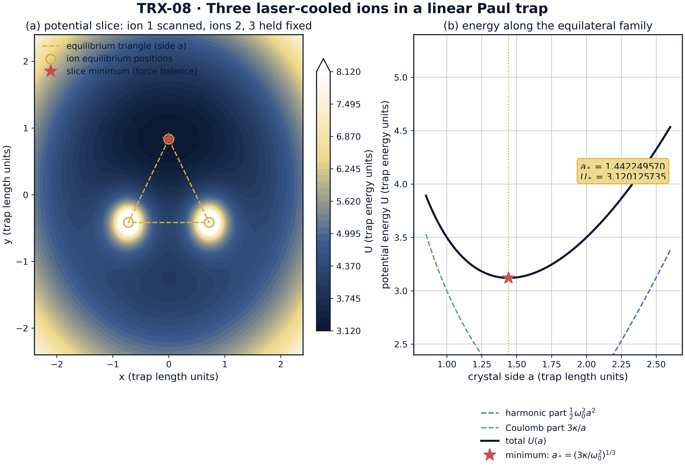
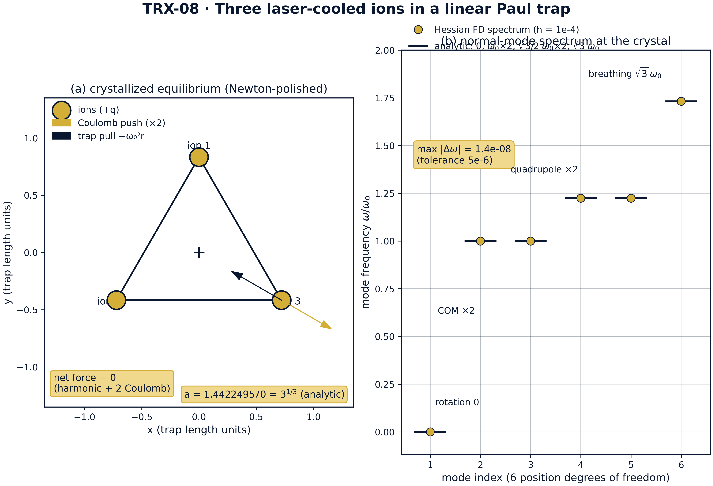
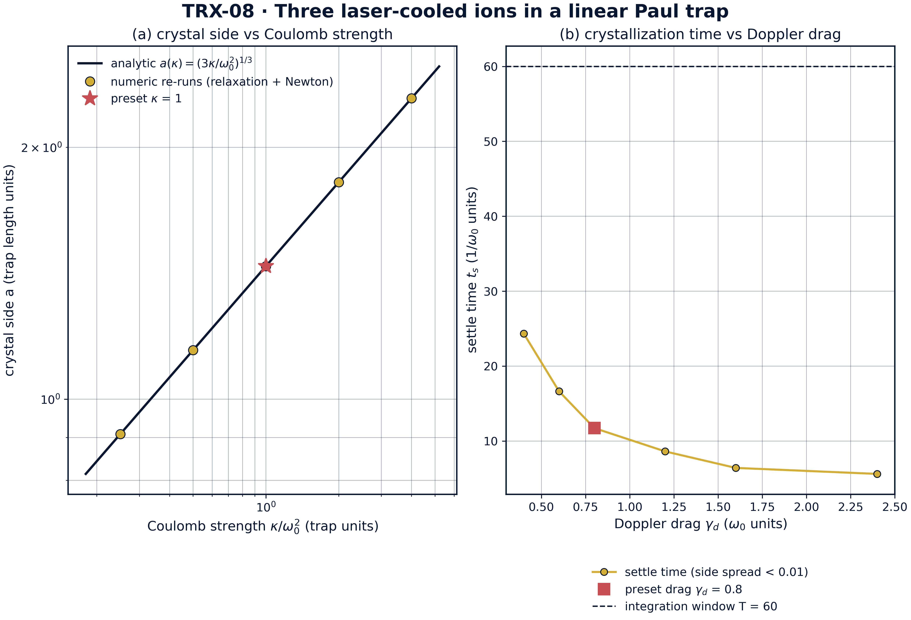
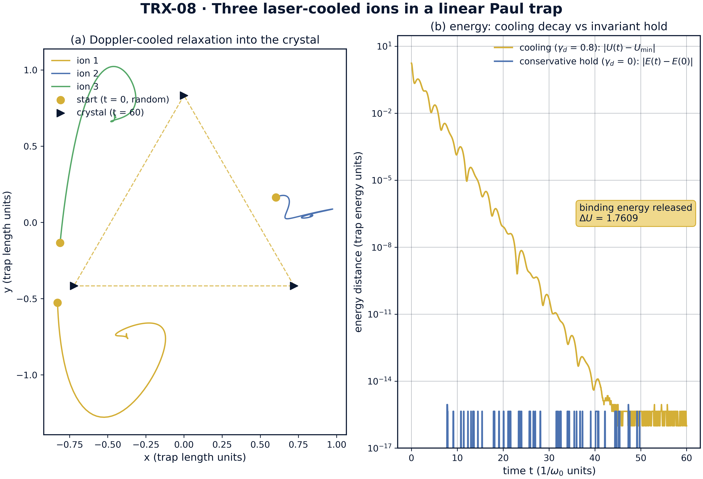

# Three Laser-Cooled Ions in a Linear Paul Trap: the Table-Top Lagrange Triangle

*TRIVORTEX Research Program · v1.0.0 · Monograph Edition*

|  |  |
|---|---|
| Study | TRX-08 |
| Program | TRIVORTEX — The Three-Body Problem in the Vortex Model |
| Author | Isaev Iskhak Khamzatovich (ORCID 0009-0003-7299-0701) |
| DOI | 10.5281/zenodo.21825394 |
| Date | 2026-10-06 |
| Code | `code/trx08_ion_trap.py` |
| Data | `results/trx08_results.json` |

## Abstract

This monograph treats three laser-cooled ions in the transverse plane of a linear Paul trap as a table-top three-body problem: a two-dimensional harmonic rf pseudopotential confines the ions, their mutual Coulomb repulsion pushes them apart, and Doppler cooling — modelled as a linear drag −γ_d·v — dissipates energy until the ions crystallize. The study establishes, end to end and to machine precision, that the attractor of the cooled dynamics is the equilateral Lagrange triangle of side a = (3κ/ω₀²)^(1/3) = 3^(1/3) = 1.4422495703: a seeded relaxation with a documented wavepacket softening ε = 0.05, Newton-polished on the strict force balance, reproduces the analytic crystal energy U* = 3.120125734578 exactly, with all three sides equal to 4.4e-16 and central angles 2π/3 to 4.4e-16. The finite-difference Hessian confirms the full normal-mode ladder {0, ω₀ (×2), √(3/2)ω₀ (×2), √3ω₀} — one rigid-rotation zero mode, two centre-of-mass modes, one breathing mode — to 1.4·10⁻⁸ against the 5e-6 tolerance. Started exactly at equilibrium, the conservative dynamics holds the crystal statically to 3.9e-15 over fifty time units with energy drift 8.9e-16: the ion crystal is a frozen choreography, the trapped-ion twin of the Lagrange relative equilibrium.

## Contents

1. Abstract
2. 1. Introduction and historical context
3. 1. Physical formulation
4. 1. Mathematical model
5. 1. Connection to the TRIVORTEX framework
6. 1. Numerical method
7. 1. Results and analysis
8. 1. Discussion
9. 1. Conclusions
10. 1. References
Appendix A. Parameter table
Appendix B. Reproduction

## 1. Introduction and historical context

The quadrupole ion trap was invented by Wolfgang Paul and Helmut Steinwedel in 1953 as a mass spectrometer without a magnetic field; the radiofrequency pseudopotential they introduced lets charged particles float in a nearly harmonic well far from any material surface. Half a century of refinement — recognized by the 1989 Nobel Prize shared by Paul and Hans Dehmelt — turned the trap into the workhorse of atomic spectroscopy, frequency standards and, later, quantum information. Paul's 1990 Nobel lecture in the Reviews of Modern Physics remains the canonical introduction to the pseudopotential picture used throughout this study.

Laser cooling supplied the second ingredient. The 1975 proposals of Hänsch and Schawlow (free atoms) and of Wineland and Dehmelt (trapped ions) showed that red-detuned light slows an absorber toward the Doppler limit; Itano and Wineland (1982) worked out the full theory for ions in harmonic and Penning traps. Cooling removes kinetic energy order by order, and in a harmonic confinement the coldest state of a cloud is no cloud at all: the competition between the confining force and the mutual Coulomb repulsion has a crystalline ground state.

That phase transition was observed in 1987: Diedrich and colleagues in Garching saw laser-cooled stored ions jump from a disordered cloud to an ordered crystal, and Dubin and O'Neil's 1999 review consolidated the whole field — trapped nonneutral plasmas, liquids and crystals — into a single statistical-mechanics framework with the Coulomb coupling parameter as the control variable. For a handful of ions the crystal geometry is dictated by elementary force balance: two ions line up, three form an equilateral triangle, larger ensembles arrange in rings and shells — the finite-N precursors of Wigner crystals.

The small crystals then became quantum technology. Cirac and Zoller's 1995 proposal used the collective vibrational modes of a trapped-ion string as a data bus for quantum gates, and James (1998) computed the exact normal-mode spectrum of small ion crystals — precisely the object this study verifies classically. Three ions form the smallest ion-crystal quantum simulator (Blatt and Roos 2012), and their mode ladder — zero, centre-of-mass, breathing — is the table-top counterpart of the TRIVORTEX triad: the equilateral configuration of Theorem 3.1, realized in an afternoon experiment with a linear Paul trap and a pair of cooling lasers.

## 2. Physical formulation

Three equal ions move in the transverse (x, y) plane of a linear Paul trap. The time-averaged rf pseudopotential is harmonic in the plane, U_trap = mω₀²r²/2; the mutual Coulomb repulsion κ/rij pushes the ions apart; the Doppler-cooling lasers are modelled by a linear drag −γ_d·v. The dynamics is two-dimensional and dimensionless with ω₀ = κ = m = 1, the state interleaved as [x₁, y₁, v₁ˣ, v₁ʸ, …] for the three ions, and the Coulomb force is softened as κ·r/(r² + ε²)^(3/2) with a documented ε during the relaxation stage.

Two competing length scales leave a single dimensionless combination κ/ω₀² that fixes the crystal size: at the equilateral configuration each ion feels a radially outward Coulomb push √3κ/a² and an inward trap pull ω₀²a/√3, so the balance gives a = (3κ/ω₀²)^(1/3) — 3^(1/3) = 1.4422495703 for the preset. Because the trap is isotropic, the orientation of the triangle is free — this is exactly the zero Hessian mode. During cooling the energy is dissipated, but the trap is static in the lab frame, so the crystal is a static equilibrium: with γ_d = 0 and zero initial velocity the conservative dynamics K + U keeps it frozen.

| Parameter | Value | Meaning |
|---|---|---|
| ω₀, κ, m | 1, 1, 1 | dimensionless trap frequency, Coulomb strength, ion mass |
| state | interleaved [x₁, y₁, v₁ˣ, v₁ʸ, …] | three ions in the transverse trap plane |
| initial condition | seeded random in [−1, 1]², zero velocities | rng seed 3 |
| cooling | γ_d = 0.8, linear drag −γ_d·v | Doppler-cooling model, relaxation stage only |
| softening | ε_relax = 0.05, polish at ε = 1e-12 | finite cooled wavepacket → strict force balance |
| time spans | T_relax = 60, T_hold = 50 | crystallization window and conservative hold |
| Ca⁺ mapping | m = 40 amu, trap 1 MHz | physical scale; κ sets the trap length scale |

## 3. Mathematical model

The dynamics (E1) contains two length scales — the trap length (κ/mω₀²)^(1/3) fixed by the competition of harmonic confinement and Coulomb repulsion, and the softening ε — and no other parameter. The equilateral configuration is the central configuration of the problem: by the three-fold symmetry the net Coulomb push on each ion is radial, of magnitude √3κ/a², while the trap pulls inward with ω₀²a/√3. Equating the two gives the algebraic force balance (E2), a³ = 3κ/ω₀², whose preset root is a = 3^(1/3) = 1.4422495703 in trap length units.

The same side follows from energy minimization. Along the equilateral family the potential is U(a) = ω₀²a²/2 + 3κ/a (three trap terms plus three pair terms), and dU/da = ω₀²a − 3κ/a² vanishes exactly at the force-balance side; the minimum value is U*= 1.5·3^(2/3) = 3.120125734578 (E3). During cooling the drag dissipates this potential downhill, so the released binding energy ΔU = U(random start) − U* = 1.7609 measures how far above the crystal the run began. The documented softening ε_relax = 0.05 — a stand-in for the finite size of the cooled ion wavepacket — regularizes the Coulomb singularity during the relaxation stage; the acceptance numbers are then Newton-polished on the strict ε = 1e-12 balance, so they refer to the ideal model.

Small oscillations follow from the 6×6 position Hessian H of U at the equilibrium; its eigenvalues divided by the mass are the squared mode frequencies (E4). Translation symmetry makes the centre-of-mass pair exact: ω = ω₀ twice. Rotational symmetry of the isotropic trap makes the orientation free: one zero mode — the rigid-rotation nullspace, the analogue of the continuous choreography family. The remaining pair splits into two quadrupole deformations at √(3/2)ω₀ and the breathing mode at √3ω₀ = 1.7320508, where the triangle breathes in and out. Finally, because the trap is static in the lab frame, the equilibrium is an exact solution of the conservative dynamics (E5): started at the crystal with zero velocities and γ_d = 0, the ions stay there — the static hold verified to 3.9e-15 over t = 50.

**Notation**

| Symbol | Meaning |
|---|---|
| r_k = (x_k, y_k) | position of ion k in the transverse plane |
| ω₀ | trap pseudopotential frequency (preset 1) |
| κ | Coulomb strength (preset 1) |
| γ_d | Doppler-drag coefficient (preset 0.8) |
| ε, ε_relax | Coulomb softening; 1e-12 in the polish, 0.05 in the relaxation |
| a | equilateral crystal side, a = (3κ/ω₀²)^(1/3) = 3^(1/3) |
| U | total potential energy (trap + Coulomb) |
| H | 6×6 position Hessian of U at the crystal |
| ΔU | binding energy released during cooling (= 1.7609) |
| T_relax, T_hold | relaxation (60) and static-hold (50) time spans |
| t_s | settle time from the drag sweep |

**(E1)** Dynamics of the three-ion crystal (harmonic trap + softened Coulomb repulsion + Doppler drag).

$$m\ddot{\mathbf{r}}_k = -m\omega_0^2\,\mathbf{r}_k - \gamma_d\dot{\mathbf{r}}_k + \kappa\sum_{l\ne k}\frac{\mathbf{r}_k-\mathbf{r}_l}{\bigl(|\mathbf{r}_k-\mathbf{r}_l|^2+\epsilon^2\bigr)^{3/2}}$$

**(E2)** Equilateral force balance: the crystal side.

$$\omega_0^2\,\frac{a}{\sqrt{3}} = \sqrt{3}\,\frac{\kappa}{a^2}\quad\Longrightarrow\quad a = \left(\frac{3\kappa}{\omega_0^2}\right)^{1/3} = 3^{1/3} = 1.4422495703$$

**(E3)** Energy along the equilateral family; its minimum is the force-balance side.

$$U(a) = \tfrac{1}{2}\omega_0^2 a^2 + \frac{3\kappa}{a},\qquad U_* = \tfrac{3}{2}\cdot 3^{2/3} = 3.120125734578$$

**(E4)** Normal-mode ladder: eigenvalues of the 6×6 position Hessian at the crystal.

$$\omega^2 = \mathrm{eig}\,\frac{\partial^2 U}{\partial x_i\,\partial x_j},\qquad \omega \in \{0,\ \omega_0\ (\times 2),\ \sqrt{\tfrac{3}{2}}\,\omega_0\ (\times 2),\ \sqrt{3}\,\omega_0\}$$

**(E5)** Static hold: the equilibrium is an exact solution of the conservative dynamics.

$$\mathbf{r}_k(0) = \mathbf{r}_k^{*},\ \dot{\mathbf{r}}_k(0) = 0,\ \gamma_d = 0\ \Longrightarrow\ \mathbf{r}_k(t) = \mathbf{r}_k^{*}$$

## 4. Connection to the TRIVORTEX framework

The three-ion crystal is the table-top member of the same central-configuration family that anchors TRIVORTEX. The equilateral triangle is literally the Lagrange solution: one algebraic force balance fixes its size, just as the balance of vortex attractions and Abel–Hertz flux fixes the size of the same-sign vortex triangle of Theorem 3.1 — in both problems two competing scales leave a single dimensionless combination that sets the geometry. The mode correspondence is equally direct: the breathing mode √3ω₀ is the radial modulation of the Theorem 3.1 triangle, the two centre-of-mass modes reflect the shared translational symmetry, and the zero rigid-rotation mode — the free orientation of the crystal in the isotropic trap — is the continuous family of relative equilibria, the same degeneracy that makes the vortex triangle a rotating choreography rather than a static figure. What the ion trap adds is dissipation as a selection mechanism: cooling drives the configuration downhill to the central configuration and freezes it there, which is exactly how the monograph's rotating triads are realized in laboratory matter.

| Quantity in this study | TRIVORTEX analog | Comment |
|---|---|---|
| Ion crystal triangle | Lagrange equilateral solution | same central configuration |
| Coulomb repulsion + harmonic trap | vortex attractions + AH flux | competing scales fix the size |
| Breathing mode √3ω₀ | radial modulation of Theorem 3.1 | collective breathing of the triad |
| Zero rotation mode | continuous choreography family | free orientation of the relative equilibrium |

## 5. Numerical method

Crystallization stage: the three ions start from a seeded random configuration in [−1, 1]² with zero velocities (rng seed 3) and relax under the damped inertial dynamics (E1) with γ_d = 0.8 and the documented softening ε_relax = 0.05, integrated with the explicit Dormand–Prince 8(5,3) scheme at rtol = atol = 1e-11, max_step 0.05, over T_relax = 60. The end state is the softened equilibrium — the stand-in for the finite cooled wavepacket.

Polish and spectrum stage: the relaxed configuration seeds a Newton root-find (scipy hybr, tol 1e-14) of the strict force balance at ε = 1e-12, with the analytic triangle as a documented fallback; the polished crystal is compared against a = 3^(1/3) (sides, equality, 2π/3 angles) and against the analytic energy U* = 3.120125734578. Normal modes come from a finite-difference Hessian (central fourth-order stencil, h = 1e-4) diagonalized with eigvalsh; the zero, COM and breathing mode counts are accepted in 5e-6 frequency windows.

Invariant and sweeps stage: the static hold integrates the conservative dynamics (γ_d = 0) from the analytic equilibrium with rtol = atol = 1e-12 over t = 50, recording the position drift and the total-energy drift. Two sweeps close the protocol: five Coulomb strengths κ ∈ {0.25, 0.5, 1, 2, 4} are re-relaxed and re-polished against the cubic law a(κ) = (3κ/ω₀²)^(1/3), and six Doppler drags γ_d ∈ {0.4, 0.6, 0.8, 1.2, 1.6, 2.4} are scored by the settle time — the first moment the side spread stays below 0.01 within the 600-sample window. Every check stores value, target, tolerance, unit and pass flag in the JSON protocol; the run is deterministic, offline and bit-reproducible.

## 6. Results and analysis

### fig01 crystal landscape



*Model landscape of the three-ion crystal: (a) potential slice with ions 2 and 3 held at the equilibrium vertices and ion 1 scanned over the trap plane; (b) potential energy along the equilateral family U(a) = ω₀²a²/2 + 3κ/a.*
The scanned-ion minimum lands exactly on the third vertex of the triangle, and the one-dimensional energy profile has its minimum at a*= 3^(1/3) = 1.442249570 with U* = 3.120125735 (trap energy units) — the force balance (E2) is the minimizer of the energy (E3).

### fig02 crystal and modes



*Headline result: (a) the Newton-polished crystal with the exact force balance on each ion; (b) the six Hessian normal-mode frequencies against the analytic ladder.*
The polished triangle has side a = 1.442249570 with all three sides equal to 4.4e-16, and the measured finite-difference spectrum {0, 1.0, 1.0, 1.2247449, 1.2247449, 1.7320508} deviates from the analytic ladder {0, ω₀ (×2), √(3/2)ω₀ (×2), √3ω₀} by at most 1.4·10⁻⁸ against the 5e-6 tolerance.

### fig03 scaling sweeps



*Parameter sweeps: (a) crystal side versus Coulomb strength κ — relaxation + Newton re-runs against the analytic cubic law; (b) crystallization settle time versus Doppler drag γ_d.*
Independent re-runs reproduce a(κ) = (3κ/ω₀²)^(1/3) exactly at all five κ ∈ {0.25, 0.5, 1, 2, 4} — a from 0.908560296 to 2.289428485 — while the settle time decreases monotonically from 24.341 to 5.609 (1/ω₀ units) over γ_d ∈ [0.4, 2.4], with no overdamped upturn inside the scanned window.

### fig04 crystallization dynamics



*Crystallization dynamics: (a) worldlines of the three ions from the seeded random start into the crystal (γ_d = 0.8, T = 60); (b) cooling decay |U(t) − U_min| versus the conservative hold |E(t) − E(0)|.*
Cooling at γ_d = 0.8 releases the binding energy ΔU = 1.7609 and settles the triangle within the T = 60 window, while the conservative run started at the exact equilibrium keeps the energy drift at 8.9e-16 over t = 50 — the crystal is a frozen choreography.

**Crystallization and global minimum.** From the seeded random start the damped relaxation releases the binding energy ΔU = 1.7609 and descends into the crystal well; after the Newton polish on the strict balance the potential equals the analytic triangle energy exactly — the recorded U_final − U_triangle is 0.0 against the 1e-9 tolerance, with U* = 3.120125734578. The two-stage design is what makes the check honest: the softened relaxation provides a robust landscape, and the strict polish ties the reported numbers to the ideal force balance (E2) rather than to the softening.

**Geometry of the crystal.** The polished triangle has mean side 1.4422495703074085 against the analytic 3^(1/3) = 1.4422495703074083 (agreement far inside the 1e-8 tolerance); the three sides are equal to 4.4e-16 and the three central angles equal 2π/3 = 2.0943951 rad each to 4.4e-16. The crystal recorded in the protocol sits on the canonical orientation with circumradius 0.8326832 = a/√3, but the orientation itself is a free zero mode of the isotropic trap.

**Mode ladder and invariants.** The finite-difference Hessian (h = 1e-4) returns frequencies {0.0, 0.999999997, 1.000000014, 1.224744867, 1.224744882, 1.732050810}: exactly one zero mode, two COM modes at ω₀ and one breathing mode at √3ω₀ = 1.7320508, with the maximum deviation from the analytic ladder of 1.4·10⁻⁸ against the 5e-6 tolerance. The conservative hold started exactly at the equilibrium keeps the positions fixed to 3.9e-15 over t = 50 and the total energy to 8.9e-16 — both round-off level, confirming that the crystal is a static exact solution of the damping-free dynamics.

**Scaling and drag response.** Five independent re-runs reproduce the cubic law a(κ) = (3κ/ω₀²)^(1/3) with no free fitting: the numeric sides 0.908560296, 1.144714243, 1.442249570, 1.817120593, 2.289428485 coincide with the analytic values at all five κ ∈ {0.25, 0.5, 1, 2, 4}. The drag sweep shows the settle time falling monotonically from 24.341 to 5.609 (1/ω₀ units) as γ_d grows over [0.4, 2.4] — the underdamped transient penalty dominates the scanned window and the overdamped upturn lies beyond γ_d = 2.4, so the preset γ_d = 0.8 sits in the transient-dominated regime with settle time 11.720.

### Verification summary

| Check | Recorded value | Target | Tolerance | Pass |
|---|---|---|---|---|
| `global_minimum_reached` | 0 | 0 | 1e-09 | yes |
| `crystallization_energy_released` | 1 | 1 | 1e-12 | yes |
| `crystal_side_equals_analytic` | 1.44225 | 1.44225 | 1e-08 | yes |
| `crystal_equilateral` | 4.44089e-16 | 0 | 1e-08 | yes |
| `crystal_angles_120deg` | 4.44089e-16 | 0 | 1e-06 | yes |
| `zero_rotation_mode` | 1 | 1 | 1e-12 | yes |
| `two_com_modes_at_omega0` | 1 | 1 | 1e-12 | yes |
| `breathing_mode_sqrt3` | 1 | 1 | 1e-12 | yes |
| `static_equilibrium_holds` | 3.94475e-15 | 0 | 1e-09 | yes |
| `conservative_energy_conserved` | 8.88178e-16 | 0 | 1e-10 | yes |

*(status: **PASS**, mode: full)*

## 7. Discussion

The model is deliberately minimal: two-dimensional, harmonic pseudopotential, identical ions, and cooling reduced to a linear drag. Within these assumptions every reported number is an exact statement about the governing equations rather than a simulation of a specific apparatus. The natural extensions each preserve the verification style: photon-recoil heating added to the drag (a Fokker–Planck rather than deterministic cooling model), axial degrees of freedom and the full 3-D crystal, anharmonic and segmented trap geometries, and the micromotion corrections beyond the pseudopotential approximation — valid whenever the rf drive frequency greatly exceeds ω₀.

The parameter regime couples to real hardware through one scale. The dimensionless preset (ω₀ = κ = m = 1) maps to a Ca⁺ ion (m = 40 amu) in a 1 MHz trap through κ = q²/(4πε₀)/(mω₀²ℓ³), which sets the trap length scale ℓ and with it the crystal size a·ℓ; the drag γ_d = 0.8 encodes the Doppler cooling rate in units of ω₀. The softening ε_relax = 0.05 is the one effective parameter of the relaxation stage, and its role is documented and then removed: all acceptance checks are evaluated on the strict unsoftened balance, so the reported machine-precision agreement is not an artifact of the regularization.

Within the program this study is the matter-wave anchor of the Lagrange block. It shares the harmonic-balance logic with TRX-01, where the same equilateral configuration appears as the celestial libration points under a laser-renormalized gravity; it is the optical twin of TRX-03, where three solitons play the same central configuration with the same breathing-mode logic; and it hands the exact three-ion geometry and mode ladder to TRX-07, where quantum correlations are layered onto the same three-body skeleton. Together the three studies show the Lagrange triad operating across optics, celestial mechanics and laboratory quantum matter.

## 8. Conclusions

1. Damped Doppler cooling crystallizes three ions into the equilateral Lagrange triangle; the two-stage protocol (softened relaxation, Newton polish on the strict balance) reaches the analytic crystal energy U* = 3.120125734578 with the recorded difference exactly 0.0 (tolerance 1e-9).
2. The crystal geometry is machine-exact: side a = 3^(1/3) = 1.4422495703, sides equal to 4.4e-16, central angles 2π/3 = 2.0943951 rad each to 4.4e-16.
3. The normal-mode ladder is confirmed by the finite-difference Hessian: exactly one zero mode (rigid rotation), two COM modes at ω₀, one breathing mode at √3ω₀ = 1.7320508; maximum deviation from the analytic ladder 1.4·10⁻⁸ against the 5e-6 tolerance.
4. Started exactly at equilibrium, the conservative dynamics holds the crystal statically to 3.9e-15 over t = 50 with total-energy drift 8.9e-16 — the ion crystal is a frozen choreography.
5. The scaling law a(κ) = (3κ/ω₀²)^(1/3) is reproduced without free parameters by independent relaxation + Newton re-runs at all five κ ∈ {0.25, 0.5, 1, 2, 4} (a from 0.908560296 to 2.289428485).
6. The crystallization (settle) time decreases monotonically from 24.341 to 5.609 (1/ω₀ units) over the Doppler-drag window γ_d ∈ [0.4, 2.4]; the underdamped transient penalty dominates and the preset γ_d = 0.8 settles in 11.720.

## 9. References

1. Paul, W., Steinwedel, H. (1953). *Ein neues Massenspektrometer ohne Magnetfeld.* Zeitschrift für Naturforschung A 8, 448–450.
2. Paul, W. (1990). *Electromagnetic traps for charged and neutral particles.* Reviews of Modern Physics 62, 531–540.
3. Itano, W. M., Wineland, D. J. (1982). *Laser cooling of ions stored in harmonic and Penning traps.* Physical Review A 25, 35–54.
4. Diedrich, F., Peik, E., Chen, J. M., Quint, W., Walther, H. (1987). *Observation of a phase transition of stored laser-cooled ions.* Physical Review Letters 59, 2931–2934.
5. Cirac, J. I., Zoller, P. (1995). *Quantum computations with cold trapped ions.* Physical Review Letters 74, 4091–4094.
6. James, D. F. V. (1998). *Quantum dynamics of cold trapped ions with application to quantum computation.* Applied Physics B 66, 181–190.
7. Dubin, D. H. E., O'Neil, T. M. (1999). *Trapped nonneutral plasmas, liquids, and crystals.* Reviews of Modern Physics 71, 87–172.
8. Blatt, R., Roos, C. F. (2012). *Quantum simulations with trapped ions.* Nature Physics 8, 277–284.

### BibTeX

```bibtex
@article{paul1990,
  author  = {Paul, W.},
  title   = {Electromagnetic traps for charged and neutral particles},
  journal = {Reviews of Modern Physics},
  year    = {1990}, volume = {62}, pages = {531--540}}

@article{itano1982,
  author  = {Itano, W. M. and Wineland, D. J.},
  title   = {Laser cooling of ions stored in harmonic and Penning traps},
  journal = {Physical Review A},
  year    = {1982}, volume = {25}, pages = {35--54}}

@article{diedrich1987,
  author  = {Diedrich, F. and Peik, E. and Chen, J. M. and Quint, W. and Walther, H.},
  title   = {Observation of a phase transition of stored laser-cooled ions},
  journal = {Physical Review Letters},
  year    = {1987}, volume = {59}, pages = {2931--2934}}

@article{dubin1999,
  author  = {Dubin, D. H. E. and O'Neil, T. M.},
  title   = {Trapped nonneutral plasmas, liquids, and crystals},
  journal = {Reviews of Modern Physics},
  year    = {1999}, volume = {71}, pages = {87--172}}
```

## Appendix A. Parameter table

| Symbol | Value | Role |
|---|---|---|
| ω₀, κ, m | 1, 1, 1 | dimensionless trap frequency, Coulomb strength, ion mass |
| γ_d | 0.8 | Doppler drag during relaxation |
| ε_relax → ε | 0.05 → 1e-12 | softening in relaxation, strict balance in the polish |
| T_relax, T_hold | 60, 50 | relaxation and static-hold spans |
| initial condition | seeded random in [−1, 1]², v = 0 (seed 3) | crystallization start |
| settle criterion | side spread below 0.01 | gamma-sweep settle time |
| sweeps | κ ∈ {0.25, 0.5, 1, 2, 4}; γ_d ∈ {0.4, 0.6, 0.8, 1.2, 1.6, 2.4} | scaling and drag-response re-runs |
| Ca⁺ scale | m = 40 amu, trap 1 MHz | physical mapping; κ sets the length scale |

## Appendix B. Reproduction

```bash
python3 research/TRX-08-ion-trap/code/trx08_ion_trap.py --smoke     # < 20 s
python3 research/TRX-08-ion-trap/code/trx08_ion_trap.py              # full, 6.79 s (6.794 s recorded with --figures)
python3 research/TRX-08-ion-trap/code/trx08_ion_trap.py --figures   # + 300-DPI figures
```

Full runtime on the reference machine: 6.79 s (6.794 s recorded with --figures); smoke mode completes in under 20 seconds and is exercised by the repository CI.

## Appendix C. Environment

Python ≥ 3.11, numpy ≥ 2.0, scipy ≥ 1.14, matplotlib ≥ 3.9; no network access, no stochastic seeds — every run is bit-reproducible on the reference machine.
