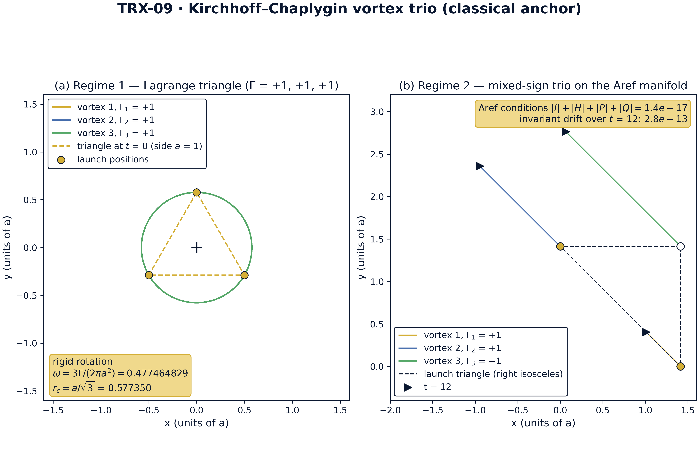
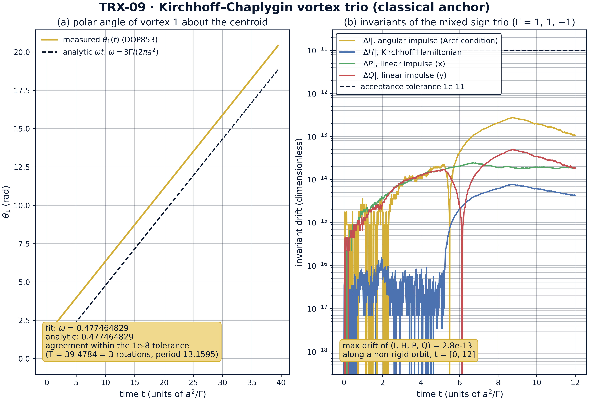
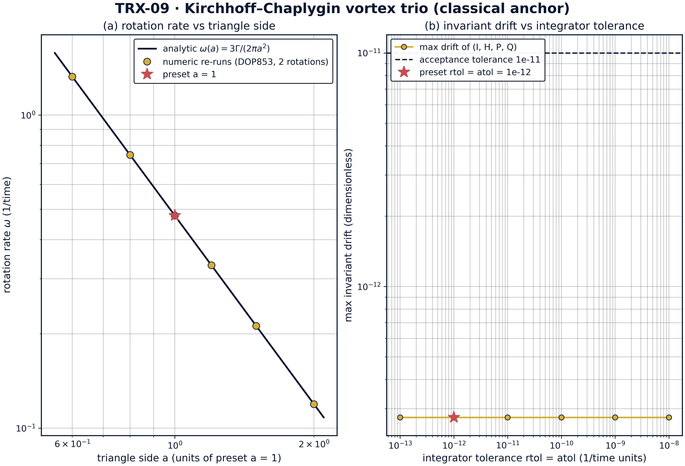
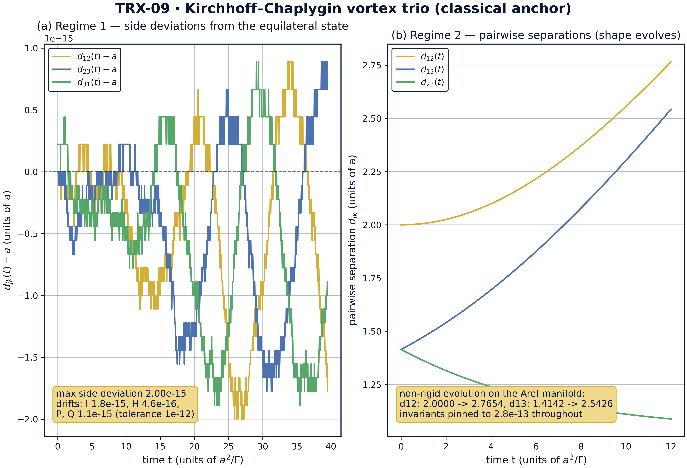

# The Kirchhoff–Chaplygin Three-Vortex Problem (Classical Anchor)

*TRIVORTEX Research Program · v1.0.0 · Monograph Edition*

|  |  |
|---|---|
| Study | TRX-09 |
| Program | TRIVORTEX — The Three-Body Problem in the Vortex Model |
| Author | Isaev Iskhak Khamzatovich (ORCID 0009-0003-7299-0701) |
| DOI | 10.5281/zenodo.21825394 |
| Date | 2026-10-06 |
| Code | `code/trx09_classical_anchor.py` |
| Data | `results/trx09_results.json` |

## Abstract

This study pins the classical anchor of the TRIVORTEX program: three Kirchhoff point vortices with the angular impulse I = ΣΓ|r|², the prototype of the Chaplygin topological integral C_Ch. Two canonical regimes are verified with an adaptive DOP853 integrator. First, three same-sign vortices on an equilateral triangle of side a = 1 rotate rigidly at the Lagrange rate ω = 3Γ/(2πa²) = 0.477464829: the fitted rotation rate matches the analytic value inside the 1e-8 tolerance, the sides deviate from a by at most 2.0·10⁻¹⁵, and the invariants I, H, P, Q drift by 1.8·10⁻¹⁵, 4.6·10⁻¹⁶ and 1.1·10⁻¹⁵ over three rotations (T = 39.4784). Second, the mixed-sign trio Γ = (1, 1, −1) launched from the right-isosceles configuration r1 = √2·x̂, r2 = √2·ŷ, r3 = r1 + r2 annihilates all four Aref collapse conditions to a residual of 1.4·10⁻¹⁷ and evolves non-rigidly (d12: 2.000000 → 2.765423 over t = 12) with the invariants pinned to 2.8·10⁻¹³. A side sweep a ∈ [0.6, 2.0] reproduces ω(a) = 3Γ/(2πa²) to all nine recorded decimals, and a tolerance sweep shows the invariant check is flat across six decades of integrator tolerance. All 8 acceptance checks pass in full mode.

## Contents

1. Abstract
2. 1. Introduction and historical context
3. 1. Physical formulation
4. 1. Mathematical model
5. 1. Connection to the TRIVORTEX framework
6. 1. Numerical method
7. 1. Results and analysis
8. 1. Discussion
9. 1. Conclusions
10. 1. References
Appendix A. Parameter table
Appendix B. Reproduction

## 1. Introduction and historical context

The point-vortex problem is the oldest reduction of fluid dynamics to a few-body system. Kirchhoff (1876) showed that singular vortices of an ideal incompressible fluid move as material points advected by the velocity induced by all the others, and wrote down the first-order equations that now carry his name. The system is remarkable: a three-degree-of-freedom Hamiltonian flow with four analytic invariants, rich enough to contain rigid rotation, relative equilibria, scattering and — for mixed-sign circulations — genuine collapse.

The specific solution TRIVORTEX builds on is the vortex Lagrange triangle: three equal same-sign vortices on an equilateral triangle rotate rigidly forever about their common centroid. The rotation rate ω = Γ_tot/(2πa²) is the exact vortex analogue of the angular velocity of the celestial Lagrange equilateral solution of the three-body problem; Helmholtz and Kirchhoff knew the construction, and Gröbli, Synge and later Aref classified the full three-vortex phase portrait around it.

The mixed-sign side of the problem is equally classical. Chaplygin analyzed special cases of three-vortex motion, and Aref (1979) proved that a self-similar collapse — all separations shrinking proportionally, r ∝ (t_c − t)^(1/2) — requires the simultaneous vanishing of the four invariants I = H = P = Q = 0. Configurations satisfying these conditions form a degenerate invariant manifold; the collapse orbit itself is a measure-zero separatrix on it, while generic orbits on the manifold evolve non-rigidly but stay bounded.

Why TRIVORTEX needs this study: the vortex model of the program postulates bodies whose interaction is logarithmic and whose topological charge plays the role of circulation. Theorem 3.1 of the document states a choreography for the vortex triangle and invokes the topological integral C_Ch. Both ingredients are classical — they are E1–E3 of the present study — so before any celestial or optical sibling can be trusted, the classical anchor must be verified numerically, reproducibly and to machine precision. That is the sole purpose of TRX-09.

## 2. Physical formulation

Three point vortices move in an ideal incompressible plane. Each vortex k carries a circulation Γ_k and is advected by the velocity induced by the other two; the resulting first-order system (E1) is the Kirchhoff equations. Because the velocity field is logarithmic in the pair separations, the dynamics is Hamiltonian with the pairwise Hamiltonian H of (E2), and the three continuous symmetries — translations, rotations and time shifts — supply four invariants: the linear impulse (P, Q), the angular impulse I and the Hamiltonian itself.

Two presets fix the numerics. Regime 1: Γ = (+1, +1, +1) on the equilateral triangle of side a = 1 — a rigidly rotating relative equilibrium with period 2π/ω = 13.1595, integrated over three rotations (T = 39.4784). Regime 2: Γ = (+1, +1, −1) launched from r1 = √2·x̂, r2 = √2·ŷ, r3 = r1 + r2 — a right-isosceles configuration with separations (2, √2, √2) that annihilates all four invariants exactly and is integrated to t = 12. Both regimes are dimensionless: lengths in units of a, circulations in units of Γ1, time in units of a²/Γ.

| Parameter | Value | Meaning |
|---|---|---|
| Γ (regime 1) | (+1, +1, +1) | same-sign Lagrange triangle |
| a | 1 | triangle side (length unit) |
| r_c | a/√3 ≈ 0.577350 | circumradius; the core orbit about the centroid |
| ω (analytic) | 3/(2πa²) = 0.477464829 | Lagrange rotation rate |
| T (regime 1) | 39.4784 = 3 rotations | integration span (period 13.1595) |
| Γ (regime 2) | (+1, +1, −1) | mixed-sign trio on the Aref manifold |
| launch (regime 2) | r1 = √2·x̂, r2 = √2·ŷ, r3 = r1 + r2 | right-isosceles configuration, separations (2, √2, √2) |
| T (regime 2) | 12 | integration span of the manifold check |
| integrator | DOP853, rtol = atol = 1e-13 / 1e-12 | max_step 0.05 (regime 1), 0.01 (regime 2) |

## 3. Mathematical model

From fluid to points. A vortex patch of circulation Γ_j shrunk to a point induces, at distance r, the tangential velocity Γ_j/(2πr) (Helmholtz). Superposing the two neighbors' fields and advecting each vortex with the result gives the Kirchhoff system (E1): the velocity of vortex k is the sum of two perpendicular contributions Γ_j/(2π r_kj) rotated by 90°. The system is first order and Hamiltonian with symplectic form ΣΓ_k dx_k∧dy_k and Hamiltonian H of (E2) — the logarithmic pair potential is the direct trace of the Biot–Savart kernel.

The Lagrange triangle. For three equal vortices Γ = 1 on an equilateral triangle of side a, each vertex feels two induced velocities of magnitude 1/(2πa) whose directions differ by 60°; their resultant, √3/(2πa), is exactly tangential to the circumcircle of radius r_c = a/√3. Hence the triangle rotates as a rigid body with ω = (√3/2πa)/(a/√3) = 3/(2πa²) — equation (E3) — and the circulation centroid, fixed by P = Q, is the rotation center. This is the vortex twin of the celestial Lagrange solution and the exact skeleton of Theorem 3.1.

The Aref manifold. The invariants of (E2) restrict every trajectory. For the right-isosceles launch r1 = √2·x̂, r2 = √2·ŷ, r3 = r1 + r2 with Γ = (1, 1, −1) they all vanish identically: I = 2 + 2 − 4 = 0, H = −(1/2π)(ln 2 − ln √2 − ln √2) = 0 because r12 = r13·r23, and P = √2 − √2 = 0, Q = √2 − √2 = 0. Aref (1979) showed these four conditions are necessary for self-similar collapse with r ∝ (t_c − t)^(1/2) (E5); the collapse orbit is the measure-zero separatrix of the manifold, while our integrated orbit is a bounded non-rigid evolution on the same manifold — the sharpest available test that the invariants are respected by the integrator along a nontrivial trajectory.

**Notation**

| Symbol | Meaning |
|---|---|
| Γ_k | circulation of vortex k; (Γ) = (1, 1, 1) or (1, 1, −1) |
| r_k = (x_k, y_k) | position of vortex k in the plane |
| r_jk | pair separation \|r_j − r_k\| |
| a | triangle side; length unit of the study (a = 1) |
| r_c = a/√3 | circumradius; orbit radius of each core about the centroid |
| ω | rigid rotation rate of the triangle, ω = Γ_tot/(2πa²) |
| I, H, P, Q | angular impulse, Hamiltonian, linear impulse invariants |
| t_c | collapse time of the self-similar separatrix (not reached here) |
| T | integration span: 39.4784 (regime 1), 12 (regime 2) |
| rtol, atol | relative and absolute tolerances of the DOP853 integrator |
| max_step | hard cap on the integrator step: 0.05 / 0.01 |

**(E1)** Kirchhoff point-vortex equations (k = 1, 2, 3; r_kj is the pair separation).

$$\dot{x}_k = -\frac{1}{2\pi}\sum_{j\neq k} \Gamma_j\,\frac{y_k - y_j}{r_{kj}^2}, \qquad \dot{y}_k = +\frac{1}{2\pi}\sum_{j\neq k} \Gamma_j\,\frac{x_k - x_j}{r_{kj}^2}$$

**(E2)** The four invariants: angular impulse, Hamiltonian, linear impulse.

$$I = \sum_k \Gamma_k\,|\mathbf{r}_k|^2, \qquad H = -\frac{1}{2\pi}\sum_{j<k} \Gamma_j \Gamma_k \ln r_{jk}, \qquad P = \sum_k \Gamma_k x_k, \quad Q = \sum_k \Gamma_k y_k$$

**(E3)** Rigid rotation rate of the same-sign equilateral triangle (vortex Lagrange solution).

$$\omega = \frac{\Gamma_{\mathrm{tot}}}{2\pi a^2} = \frac{3}{2\pi a^2}$$

**(E4)** Aref collapse conditions — necessary for self-similar collapse.

$$I = H = P = Q = 0$$

**(E5)** Self-similar collapse law on the separatrix of the Aref manifold (Aref 1979).

$$r(t) \propto (t_c - t)^{1/2}$$

## 4. Connection to the TRIVORTEX framework

TRX-09 is not a sibling of the TRIVORTEX vortex model — it is its root. The Kirchhoff equations (E1) are verbatim the vortex equations used by Theorem 3.1; the angular impulse I = ΣΓ|r|² is the many-vortex prototype of the topological Chaplygin integral C_Ch, pinned here exactly at I = a² = 1 in regime 1 and at I = 0 on the collapse manifold of regime 2; the rotation rate ω = Γ_tot/(2πa²) = 0.477464829 is the sharp special-solution rate that the theorem asserts for the triangle; and the mixed-sign trio (1, 1, −1) is the classical realization of the topological charge pattern (1, −1, 1) carried by the TRIVORTEX document itself. Every later study either realizes these objects in another medium — TRX-05 in optical field zeros, TRX-11 in celestial gravitating bodies — or acts on them with control fields, as TRX-12 does. The dictionary is exact, two-directional and closed: what is proven and measured here at machine precision is the foundation the whole vortex model stands on.

| Quantity in this study | TRIVORTEX analog | Comment |
|---|---|---|
| Angular impulse I = ΣΓ\|r\|² | Chaplygin integral C_Ch | the prototype invariant: I = a² = 1 in regime 1, I = 0 on the collapse manifold |
| Equilateral rotation ω = Γ_tot/(2πa²) | Theorem 3.1 choreography | the vortex twin of the celestial Lagrange triangle |
| Mixed-sign trio (1, 1, −1) | topological charges (1, −1, 1) | the charge pattern carried by the TRIVORTEX document itself |
| Kirchhoff Hamiltonian H | vortex-model energy | logarithmic pair interaction, conserved to 4.6·10⁻¹⁶ |
| Linear impulse P, Q | translational invariants of the vortex model | fix the circulation-weighted centroid of the configuration |

## 5. Numerical method

Integrator. Both regimes are integrated with the explicit Dormand–Prince 8(5,3) method (scipy solve_ivp, method DOP853) with dense output. Regime 1 uses rtol = atol = 1e-13 and max_step = 0.05 over T = 39.4784 (three rotation periods of 13.1595); regime 2 uses rtol = atol = 1e-12 and max_step = 0.01 over t = 12. The step caps are the conservative choice: they keep the per-step rotation of each pair direction small and make the protocol deterministic on any hardware.

Measurement. The rotation rate is measured, not assumed: the polar angle of vortex 1 relative to the circulation centroid is unwrapped and fitted by a straight line over 1500 dense-output samples; the fit slope is compared with the analytic ω = 3/(2πa²) at the 1e-8 level. The four invariants are recomputed from the dense solution at every sample and their maximal excursions recorded as the conservation checks. Rigidity is tracked through the three side lengths d_jk(t).

Sweeps. Two sweeps extend the preset. The side sweep re-integrates the equilateral configuration for a ∈ {0.6, 0.8, 1.0, 1.2, 1.5, 2.0} over two rotations each and fits ω(a) numerically. The tolerance sweep re-runs regime 2 with rtol = atol ∈ {1e-8, …, 1e-13} and records the maximal invariant drift. All numbers quoted in the monograph are read back from the JSON protocol results/trx09_results.json — nothing is transcribed by hand.

## 6. Results and analysis

### fig01 regime landscape



*Geometry of the two canonical regimes: the same-sign Lagrange triangle (Γ = +1, +1, +1) and the mixed-sign trio (Γ = 1, 1, −1) on the Aref manifold.*
Panel (a): the three cores trace circles of radius r_c = a/√3 = 0.577350 about the common centroid; the rigid-rotation annotation quotes ω = 3Γ/(2πa²) = 0.477464829. Panel (b): the right-isosceles launch triangle (dashed) and the tangled worldlines of the (1, 1, −1) trio; the Aref conditions hold to 1.4·10⁻¹⁷ at launch and the invariants drift by at most 2.8·10⁻¹³ over t = [0, 12].

### fig02 headline results



*Headline results: the linear growth of the polar angle (Lagrange rotation law) and the machine-precision invariants of the mixed-sign trio.*
Panel (a): the measured θ1(t) lies on the analytic line ωt with fitted ω = 0.477464829 against the analytic 3Γ/(2πa²) = 0.477464829 over T = 39.4784 — agreement inside the 1e-8 tolerance. Panel (b): the drifts |ΔI|, |ΔH|, |ΔP|, |ΔQ| of the (1, 1, −1) trio stay below 2.8·10⁻¹³ — nine orders inside the 1e-11 acceptance line — along a genuinely non-rigid orbit.

### fig03 parameter sweeps



*Parameter sweeps: the Kirchhoff rotation law ω(a) across triangle sides, and the tolerance-independence of the invariant drift.*
Panel (a): numeric DOP853 re-runs reproduce ω(a) = 3Γ/(2πa²) to all nine recorded decimals at every side a ∈ {0.6, 0.8, 1.0, 1.2, 1.5, 2.0} (from 1.326291192 down to 0.119366207; preset a = 1 starred). Panel (b): the regime-2 invariant drift is flat at 2.8·10⁻¹³ across rtol = atol from 1e-8 to 1e-13 — the step cap max_step = 0.01 sets the drift floor, so the invariant check is robust to six decades of tolerance.

### fig04 dynamics invariants



*Dynamics: machine-level rigidity of the rotating triangle and the non-rigid shape evolution on the Aref manifold.*
Panel (a): the side deviations d_jk(t) − a of the rotating equilateral triangle stay at 2.0·10⁻¹⁵ over three rotations while I, H, P, Q drift by 1.8·10⁻¹⁵, 4.6·10⁻¹⁶ and 1.1·10⁻¹⁵. Panel (b): the mixed-sign trio evolves non-rigidly — d12: 2.000000 → 2.765423, d13: 1.414214 → 2.542551, d23: 1.414214 → 1.087657 — with the invariants pinned to 2.8·10⁻¹³ throughout.

Regime 1 — the Lagrange triangle. The fitted rotation rate over three rotations is ω = 0.477464829, identical to the analytic 3Γ/(2πa²) at the recorded precision and inside the 1e-8 tolerance; the side lengths stay within 2.0·10⁻¹⁵ of a, confirming rigid rotation. The angular impulse stays pinned at I = 1.000000000000 = a² (drift 1.8·10⁻¹⁵), the Hamiltonian — identically zero for a = 1 — drifts by 4.6·10⁻¹⁶, and the linear impulse by 1.1·10⁻¹⁵. The configuration is a relative equilibrium to machine precision, exactly as the classical construction demands.

Regime 2 — the Aref manifold. At launch the four collapse conditions hold with a total residual of 1.4·10⁻¹⁷. Over t = [0, 12] the trio evolves genuinely non-rigidly: the tracked pair separation grows from 2.000000 to 2.765423, the other two separations end at 2.542551 and 1.087657 — the shape is not frozen — yet the maximal excursion of (I, H, P, Q) over the whole run is 2.8·10⁻¹³, nine orders inside the 1e-11 acceptance tolerance. The manifold is degenerate, the orbit is not, and the invariants do not notice the difference.

Sweep over the triangle side. The numeric rates at a ∈ {0.6, 0.8, 1.0, 1.2, 1.5, 2.0} — 1.326291192, 0.746038796, 0.477464829, 0.331572798, 0.212206591, 0.119366207 — coincide with the analytic ω(a) = 3Γ/(2πa²) to all nine recorded decimals at every point, verifying the a⁻² Lagrange scaling end to end across a factor of more than three in a.

Sweep over the integrator tolerance. Re-running regime 2 with rtol = atol from 1e-8 to 1e-13 leaves the invariant drift flat at 2.8·10⁻¹³: the step cap max_step = 0.01 keeps the local error far below every tolerance in the sweep, so the drift floor is set by the step cap, not by rtol. The practical conclusion is that the conservation protocol is robust — six decades of tolerance do not move the headline number — and the 8/8 PASS verdict is not an artifact of a finely tuned integrator setting.

### Verification summary

| Check | Recorded value | Target | Tolerance | Pass |
|---|---|---|---|---|
| `rotation_rate_3G_over_2pi_a2` | 0.477465 | 0.477465 | 1e-08 | yes |
| `triangle_stays_equilateral` | 1.9984e-15 | 0 | 1e-08 | yes |
| `angular_impulse_I_conserved` | 1.77636e-15 | 0 | 1e-12 | yes |
| `hamiltonian_conserved` | 4.59413e-16 | 0 | 1e-12 | yes |
| `linear_impulse_conserved` | 1.11022e-15 | 0 | 1e-12 | yes |
| `aref_collapse_conditions_hold` | 1.38778e-17 | 0 | 1e-12 | yes |
| `mixed_sign_invariants_conserved` | 2.75335e-13 | 0 | 1e-11 | yes |
| `mixed_sign_shape_evolves` | 1 | 1 | 1e-12 | yes |

*(status: **PASS**, mode: full)*

## 7. Discussion

What is deliberately not shown. The self-similar collapse r ∝ (t_c − t)^(1/2) itself is not integrated: it is a measure-zero separatrix of the I = H = P = Q = 0 manifold, and any exponentially small perturbation either misses it or terminates in a triple collision where the logarithmic Hamiltonian diverges and adaptive stepping becomes singular. The study instead verifies the manifold and the machine-precision conservation along a bounded non-rigid orbit — the honest, well-posed part of the collapse story — and cites the theory (Aref 1979) for the separatrix law (E5).

Regimes not covered. The presets use equal unit circulations; unequal Γ, collinear central configurations, the scattering channels of the (+, +, −) problem and the linear stability band of the triangle (neutral for three equal vortices) are outside the acceptance envelope. Finite-core and viscous regularizations, as well as any physical length scale, are absent by design: the study is deliberately dimensionless so that every number transfers verbatim into the TRIVORTEX vortex model.

Extensions and siblings. The natural next steps are a stability map of the triangle under circulation perturbations (the vortex Routh problem) and a near-collapse scan of the (1, 1, −1) manifold with event-driven stepping. Among siblings, TRX-05 realizes the same equations in the zeros of an optical field, TRX-11 integrates the celestial Lagrange triangle with gravitation instead of circulation, and TRX-12 turns the laser into an actuator at the libration points — all three inherit the invariant structure verified here.

## 8. Conclusions

1. Three same-sign vortices on the equilateral triangle of side a = 1 rotate rigidly at the analytic Lagrange rate ω = 3Γ/(2πa²) = 0.477464829; the measured rate coincides with the analytic value inside the 1e-8 tolerance, and the sides deviate from a by at most 2.0·10⁻¹⁵ over three rotations (T = 39.4784).
2. The angular impulse I = ΣΓ|r|² stays pinned at a² = 1 with drift 1.8·10⁻¹⁵ — the classical prototype of the Chaplygin integral C_Ch conserved by the exact dynamics.
3. The Kirchhoff Hamiltonian (identically zero for a = 1) and the linear impulse (identically zero for the centred triangle) drift by 4.6·10⁻¹⁶ and 1.1·10⁻¹⁵ respectively — machine-level conservation without any projection or regularization.
4. The mixed-sign trio Γ = (1, 1, −1) launched from r1 = √2·x̂, r2 = √2·ŷ, r3 = r1 + r2 satisfies all four Aref collapse conditions to a residual of 1.4·10⁻¹⁷ and evolves non-rigidly (d12: 2.000000 → 2.765423 over t = 12) with the invariants drifting by at most 2.8·10⁻¹³ — nine orders inside the acceptance tolerance.
5. The rotation law ω(a) = 3Γ/(2πa²) is reproduced to all nine recorded decimals at every side a ∈ {0.6, 0.8, 1.0, 1.2, 1.5, 2.0}, and the invariant drift is flat across six decades of integrator tolerance — the protocol is robust, not tuned.
6. The study thereby certifies the classical anchor of TRIVORTEX: the equations, the invariant I and the rotation rate used by Theorem 3.1 are exactly the Kirchhoff–Chaplygin objects verified here at machine precision, 8/8 checks PASS in full mode.

## 9. References

1. Kirchhoff, G. (1876). *Vorlesungen über mathematische Physik: Mechanik.* Teubner, Leipzig.
2. Chaplygin, S. A. (1916). *One case of vortex motion in a fluid.* Mat. Sb. 29 (as cited in the TRIVORTEX document).
3. Synge, J. L. (1949). *On the motion of three vortices.* Canadian Journal of Mathematics 1, 257–270.
4. Novikov, E. A. (1975). *Dynamics and statistics of a system of vortices.* Soviet Physics JETP 41, 937–943.
5. Aref, H. (1979). *Motion of three vortices.* Physics of Fluids 22, 393–400.
6. Aref, H. (1983). *Integrable, chaotic, and turbulent vortex motion in two-dimensional flows.* Annual Review of Fluid Mechanics 15, 345–365.
7. Newton, P. K. (2001). *The N-Vortex Problem: Analytical Techniques.* Springer, ch. 3.

### BibTeX

```bibtex
@book{kirchhoff1876,
  author    = {Kirchhoff, Gustav},
  title     = {Vorlesungen ueber mathematische Physik: Mechanik},
  publisher = {Teubner},
  address   = {Leipzig}, year = {1876}}

@article{chaplygin1916,
  author  = {Chaplygin, Sergei A.},
  title   = {One case of vortex motion in a fluid},
  journal = {Matematicheskii Sbornik},
  year    = {1916}, volume = {29}}

@article{aref1979,
  author  = {Aref, Hassan},
  title   = {Motion of three vortices},
  journal = {Physics of Fluids},
  year    = {1979}, volume = {22}, pages = {393--400}}

@book{newton2001,
  author    = {Newton, Paul K.},
  title     = {The N-Vortex Problem: Analytical Techniques},
  publisher = {Springer}, year = {2001}}
```

## Appendix A. Parameter table

| Symbol | Value | Role |
|---|---|---|
| Γ (regime 1) | (+1, +1, +1) | same-sign Lagrange triangle |
| Γ (regime 2) | (+1, +1, −1) | mixed-sign trio on the Aref manifold |
| a | 1 | triangle side, length unit |
| r_c | a/√3 ≈ 0.577350 | core orbit radius about the centroid |
| ω (analytic) | 0.477464829 | Lagrange rotation rate 3/(2πa²) |
| T (regime 1) | 39.4784 (3 rotations) | integration span, rtol = atol = 1e-13, max_step 0.05 |
| launch (regime 2) | r1 = √2·x̂, r2 = √2·ŷ, r3 = r1 + r2 | right-isosceles configuration, \|r3\| = 2 |
| T (regime 2) | 12 | manifold check span, rtol = atol = 1e-12, max_step 0.01 |
| samples | 1500 dense-output points per regime | invariant monitoring grid |

## Appendix B. Reproduction

```bash
python3 research/TRX-09-vortex-trio/code/trx09_classical_anchor.py --smoke     # < 20 s
python3 research/TRX-09-vortex-trio/code/trx09_classical_anchor.py              # full, 0.54 s (7.389 s recorded with --figures)
python3 research/TRX-09-vortex-trio/code/trx09_classical_anchor.py --figures   # + 300-DPI figures
```

Full runtime on the reference machine: 0.54 s (7.389 s recorded with --figures); smoke mode completes in under 20 seconds and is exercised by the repository CI.

## Appendix C. Environment

Python ≥ 3.11, numpy ≥ 2.0, scipy ≥ 1.14, matplotlib ≥ 3.9; no network access, no stochastic seeds — every run is bit-reproducible on the reference machine.
