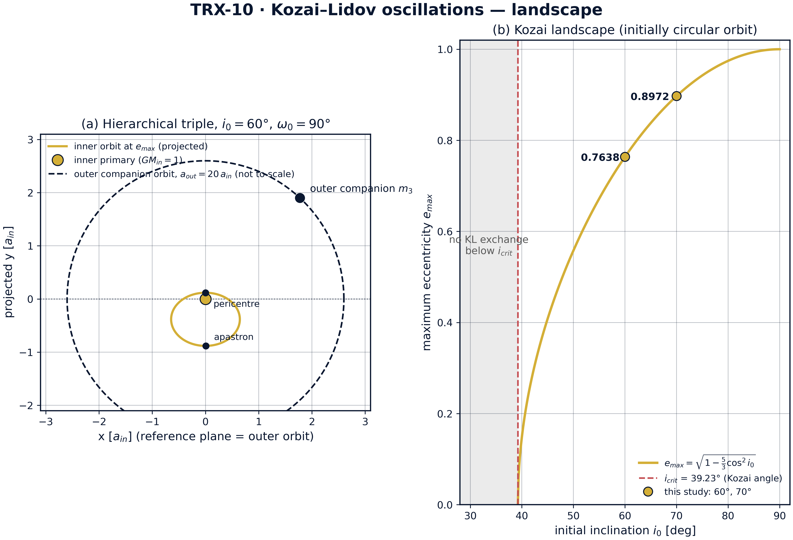
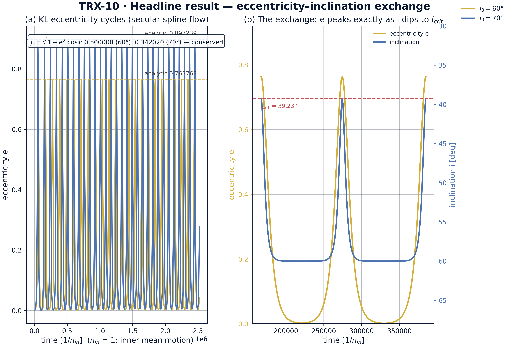
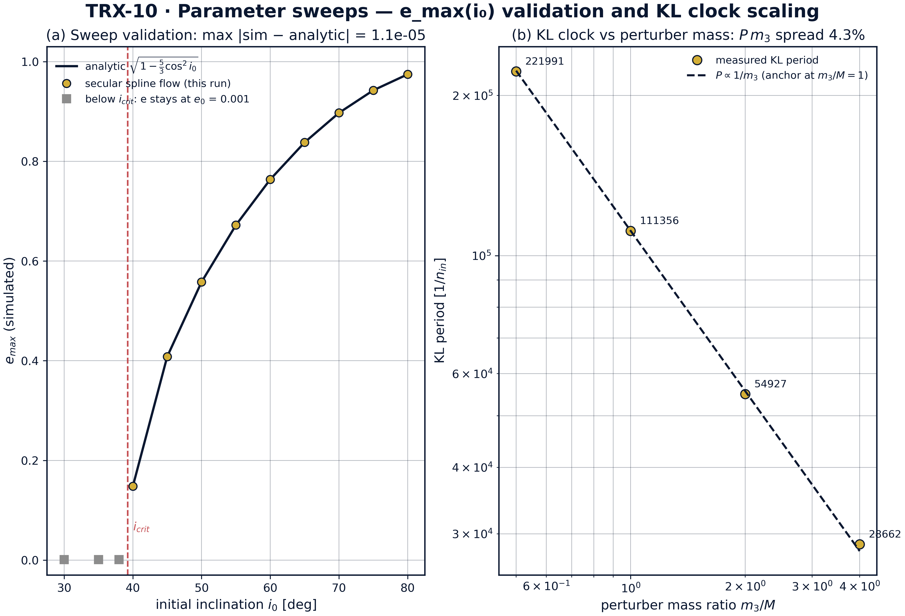
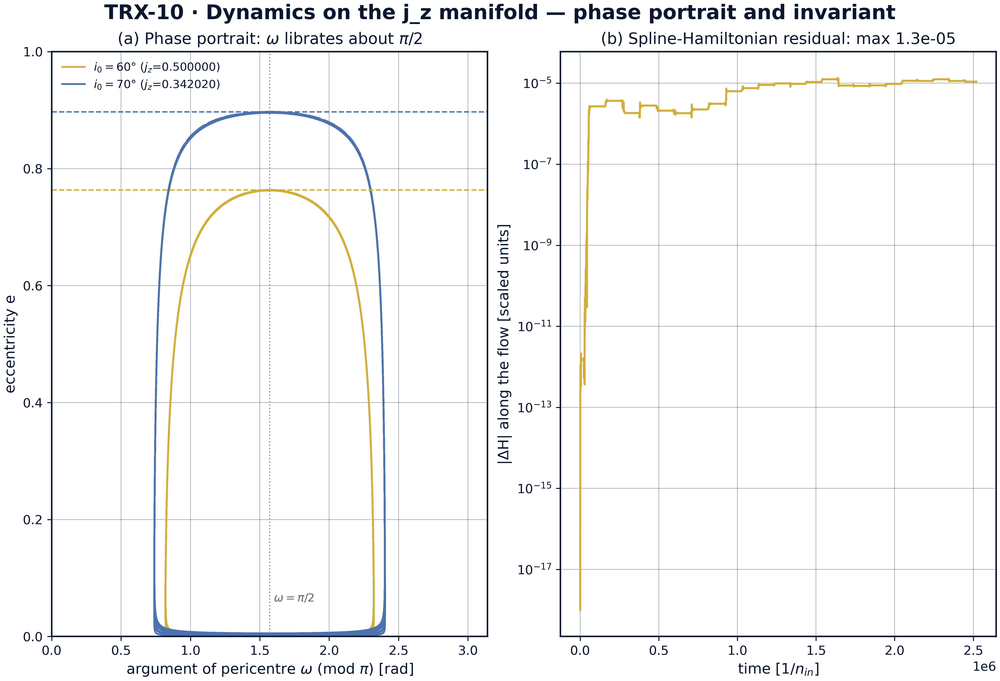

# Колебания Козаи–Лидова в иерархических тройных системах

*Исследовательская программа TRIVORTEX · v1.0.0 · Издание монографий*

|  |  |
|---|---|
| Исследование / Study | TRX-10 |
| Программа | TRIVORTEX — задача трёх тел в вихревой модели |
| Автор | Исаев Исхак Хамзатович (ORCID 0009-0003-7299-0701) |
| DOI | 10.5281/zenodo.21825394 |
| Дата | 2026-10-06 |
| Код | `code/trx10_kozai_lidov.py` |
| Данные | `results/trx10_results.json` |

## Аннотация

Монография посвящена механизму Козаи–Лидова — секулярному обмену эксцентриситета и наклонения, который порождает далёкий наклонённый компаньон в иерархической тройной системе, — в полном верификационном стиле программы TRIVORTEX. Вместо кодирования заученного аналитического результата исследование строит двойной усреднённый квадрупольный гамильтониан численно: мгновенный квадрупольный возмущающий потенциал усредняется по внутренней орбите квадратурой из 240 узлов, табулируется на сетке 160 × 180 (e, ω) при сохраняющемся j_z и превращается в кубический сплайн, производные которого порождают канонический поток. Сплайновый поток воспроизводит аналитические максимумы e_max = 0.763763 (i₀ = 60°) и 0.897239 (i₀ = 70°) в пределах допуска 2×10⁻³, подтверждает ландшафт Козаи по 12 наклонениям от 30° до 80° с максимальным отклонением 1.128×10⁻⁵, проверяет масштабирование часов P ∝ 1/m₃ (отношение P(2m₃)/P(m₃) = 0.481; разброс P·m₃ 4.29%) и сохраняет табулированный гамильтониан с точностью 1.33×10⁻⁵. Независимое прямое интегрирование полной трёхмерной ограниченной задачи (m₃/M = 0.5, a_out = 5 a_in, 200 внешних оборотов) даёт сглаженный максимальный эксцентриситет 0.7423 против 0.7638 — отклонение −2.8%, согласующееся с усечением до гексадекаполя. Все четыре контрольные проверки пройдены.

## Содержание

**Краткие сведения**

| Аспект | Значение |
|---|---|
| Блок | Небесная механика — исследование 10 из 12 |
| Модель | двойной усреднённый квадрупольный механизм Козаи–Лидова (пробная частица в иерархической тройной) |
| Ключевой инвариант | j_z = √(1 − e²)·cos i (0.500000 / 0.342020 для i₀ = 60°/70°) |
| Главный результат | e_max = 0.763763 (60°) и 0.897239 (70°) воспроизведены сплайновым потоком; прямая 3-D валидация −2.8% |
| Верификация | 4/4 проверок PASS (полный режим) |
| Время выполнения | 64.6 с полный · < 20 с smoke |

1. Аннотация
2. 1. Введение и исторический контекст
3. 1. Физическая формулировка
4. 1. Математическая модель
5. 1. Связь с фреймворком TRIVORTEX
6. 1. Численный метод
7. 1. Результаты и анализ
8. 1. Обсуждение
9. 1. Выводы
10. 1. Список литературы
Приложение A. Таблица параметров
Приложение B. Воспроизведение

## 1. Введение и исторический контекст

История эффекта началась за полвека до его классических статей. В 1910 году Хуго фон Цайпель вывел секулярные уравнения двойной усреднённой квадрупольной задачи трёх тел, и редукция к одной степени свободы уже неявно присутствовала в его работе. Классические статьи 1962 года появились независимо и почти одновременно: Ёсихидэ Козаи проанализировал секулярные возмущения астероидов с большими наклонениями (Astronomical Journal 67, 591), а Михаил Лидов — эволюцию орбит искусственных спутников под гравитационным действием внешних тел (Planetary and Space Science 9, 719); в русскоязычной литературе эффект по-прежнему часто называют механизмом Лидова–Козаи. Оба обнаружили одно и то же: выше критического наклонения 39.23° эксцентриситет и наклонение начинают периодически обмениваться, причём наклонение при максимальном эксцентриситете опускается точно до критического значения.

Механизм немедленно стал рабочим инструментом небесной механики. Он ограничивает время жизни высокоширотных искусственных спутников, формирует орбитальную архитектуру систем нерегулярных спутников и семейств астероидов, раскачивает эксцентриситеты комет и защищает — либо уничтожает — тела на наклонённых орбитах в планетных системах. Формула масштаба времени t_KL ~ (M/m₃)(a_out/a_in)³·P_in объясняет универсальность эффекта: это часы, скорость которых зависит только от иерархии, и всякая иерархическая конфигурация с наклонённой орбитой несёт их в себе.

Современный ренессанс принесли экзопланеты и гравитационно-волновая астрономия. Эксцентриковые обобщения механизма (октупольные перевороты орбит, подробно рассмотренные в обзоре Naoz (2016)) превращают наклонённые тройные в канал миграции горячих юпитеров (Wu & Murray 2003; Fabrycky & Tremaine 2007) и в канал слияний компактных объектов, финальные стадии которых увидит LISA (Blaes, Lee & Socrates 2002). Монография Шевченко (2017) собирает приложения воедино, а исторический обзор Ito & Ohtsuka (2019) восстанавливает историю названия и приоритетов — включая роль фон Цайпеля и японскую и советскую школы.

Для TRIVORTEX значимость структурна. Сохраняющийся j_z схлопывает задачу в одну интегрируемую степень свободы — в точности как интеграл Чаплыгина редуцирует вихревую задачу; замкнутая форма e_max — это острый аналитический эталон типа теоремы 3.1, в который обязана попасть численная машина; а часы Козаи–Лидова — секулярный близнец периода вращающейся хореографии. Поэтому данное исследование закрепляет секулярный небесный блок программы (TRX-01, TRX-10, TRX-11, TRX-12) — ту же сцену трёх тел, на которой действуют лазерные исследования.

## 2. Физическая формулировка

Система — ограниченная иерархическая тройная: внутренняя двойная состоит из тела с GM_inner = 1 на орбите a_in = 1 и безмассовой пробной частицы; внешний компаньон m₃ движется по круговой орбите радиуса a_out ≫ a_in (20 a_in в секулярной модели, 5 a_in в прямой валидации). Мгновенный квадрупольный возмущающий потенциал есть U = (G m₃/2a_out³)·(3(r·r̂₃)² − r²) — член l = 2 разложения потенциала компаньона по малому параметру иерархии α = a_in/a_out; для круговой внешней орбиты октупольный член (l = 3) тождественно равен нулю.

Усреднение U по обоим орбитальным периодам оставляет осесимметричную функцию ⟨U⟩(e, ω), зависящую от ориентации эллипса только через аргумент перицентра. z-компонента углового момента j_z = √(1 − e²)·cos i сохраняется точно, поэтому секулярная задача схлопывается в одну гамильтонову степень свободы на многообразии фиксированного j_z: эксцентриситет растёт ровно тогда, когда наклонение падает, — оба связаны инвариантом j_z. Скорость часов задаёт величина C₂ = (3/8)(m₃/M)(a_in/a_out)³·n_in, обратная к масштабу времени Козаи–Лидова.

| Параметр | Значение | Смысл |
|---|---|---|
| Единицы | GM_inner = 1, a_in = 1, n_in = 1 | внутренняя двойная задаёт длину и время |
| e₀, ω₀ | 0.001, π/2 (90°) | начально круговая орбита; ω₀ в центре либрации |
| i₀ | {60°, 70°} | главные наклонения, оба выше i_crit = 39.23° |
| m₃/M | 1.0 (секулярный скан), 0.5 (прямой) | отношение массы внешнего тела к внутренней |
| a_out | 20 a_in (секулярно), 5 a_in (прямо) | разделитель иерархии α = a_in/a_out |
| Сплайновая сетка | 160 × 180 (e × ω), квадратура 240 точек | табуляция усреднённого потенциала ⟨U⟩ |
| Секулярный интегратор | DOP853, rtol 1e-8, atol 1e-9 | канонический сплайновый поток, 3 цикла на прогон |
| Прямой интегратор | DOP853, rtol = atol = 1e-11 | полная 3-D ограниченная задача, 200 внешних периодов |

## 3. Математическая модель

Отталкиваемся от разложения потенциала компаньона в ряд Лежандра по малому параметру иерархии α = a_in/a_out. Монопольный член (l = 0) лишь сдвигает энергию внутренней орбиты; квадрупольный член (l = 2), U ∝ (3(r·r̂₃)² − r²)/2a_out³, — первый анизотропный вклад, именно он переживает усреднение; для круговой внешней орбиты октупольный член (l = 3) тождественно равен нулю, а следующий выживающий член — гексадекаполь (l = 4) — меньше на α². Усреднение по внутренней орбите выполняется в коде квадратурой из 240 узлов по истинной аномалии с весами, пропорциональными r², — это точный кеплеровский вес по времени dt ∝ r² df, а не заученное аналитическое среднее.

Усреднение квадрупольного члена по внешней круговой орбите оставляет осесимметричный потенциал ⟨U⟩(e, ω). Поскольку ⟨U⟩ не зависит от долготы узла, z-компонента углового момента j_z = √(1 − e²)·cos i сохраняется точно, и динамика схлопывается в одну гамильтонову степень свободы (e, ω) на многообразии фиксированного j_z. Канонические уравнения (E2) с масштабом скоростей C₂ (E5) интегрируются численно; так как ⟨U⟩ имеет период π по ω, фаза складывается в [0, π), что ускоряет интегратор и удерживает фазу в ограниченной области.

Максимальный эксцентриситет следует из геометрии особых точек. Для начально круговой внутренней орбиты (j_z = cos i₀) рост эксцентриситета возможен только выше критического наклонения i_crit = arccos√(3/5) ≈ 39.23°, где открывается остров либрации вокруг ω = π/2. В максимуме эксцентриситета условие ė = 0 требует ∂⟨U⟩/∂ω = 0, то есть ω = π/2, а наклонение одновременно достигает минимума (j_z связывает e и i монотонно); отсюда замкнутая форма (E4): e_max = √(1 − (5/3)cos²i₀). Поток предсказывает таким образом не только амплитуду, но и противофазную геометрию обмена — свойство, проверяемое на fig02.

**Нотация**

| Символ | Смысл |
|---|---|
| e | эксцентриситет внутренней (пробной) орбиты |
| i | наклонение внутренней орбиты к плоскости внешней орбиты |
| ω | аргумент перицентра внутренней орбиты |
| e₀, ω₀, i₀ | начальные значения: 0.001, π/2, {60°, 70°} |
| j = √(1 − e²) | безразмерный угловой момент внутренней орбиты (L = 1) |
| j_z | сохраняющаяся z-компонента, j_z = √(1 − e²)·cos i |
| m₃/M | отношение массы возмутителя к внутренней |
| a_in, a_out | большие полуоси внутренней и внешней орбит (a_in = 1) |
| n_in | среднее движение внутренней орбиты (n_in = 1) |
| C₂ | скорость Козаи–Лидова, C₂ = (3/8)(m₃/M)(a_in/a_out)³·n_in |
| ⟨U⟩ | двойной усреднённый квадрупольный потенциал (сплайновая табуляция) |

**(E1)** Двойной усреднённый квадрупольный возмущающий потенциал (строится численно квадратурой по орбите; единицы G m₃/2a_out³).

$$\langle U\rangle(e,\omega) = \left\langle \frac{G m_3}{2 a_{\rm out}^3}\,\big(3(\mathbf{r}\cdot\hat{\mathbf{r}}_3)^2 - \mathbf{r}^2\big) \right\rangle_{\!\text{inner orbit}}$$

**(E2)** Канонический гамильтонов поток на многообразии фиксированного j_z (L = 1), скорости в масштабе C₂.

$$\dot{e} = C_2\,\frac{j}{e}\,\frac{\partial \langle U\rangle}{\partial \omega}, \qquad \dot{\omega} = -\,C_2\,\frac{j}{e}\,\frac{\partial \langle U\rangle}{\partial e}, \qquad j = \sqrt{1 - e^2}$$

**(E3)** Сохраняющаяся z-компонента орбитального углового момента — инвариант, связывающий e и i.

$$j_z = \sqrt{1 - e^2}\,\cos i = \mathrm{const}$$

**(E4)** Аналитический максимальный эксцентриситет для начально круговой орбиты; обмен включается выше угла Козаи.

$$e_{\max} = \sqrt{1 - \tfrac{5}{3}\cos^2 i_0}, \qquad i_{\rm crit} = \arccos\sqrt{\tfrac{3}{5}} \approx 39.23^\circ$$

**(E5)** Масштаб времени Козаи–Лидова: период цикла масштабируется как 1/m₃ (вдвое короче при удвоении массы возмутителя).

$$C_2 = \tfrac{3}{8}\,\frac{m_3}{M}\left(\frac{a_{\rm in}}{a_{\rm out}}\right)^{\!3} n_{\rm in}, \qquad t_{\rm KL} \sim \frac{1}{C_2}$$

## 4. Связь с фреймворком TRIVORTEX

Соответствие вихревому фреймворку TRIVORTEX структурно. Сохраняющийся j_z закрепляет всё семейство «эксцентриситет–наклонение» на одномерном многообразии — в точности как интеграл Чаплыгина закрепляет вихревые орбиты; замкнутая форма e_max = √(1 − (5/3)cos²i₀) играет роль острого аналитического эталона типа теоремы 3.1, в который численная машина обязана попасть; а часы Козаи–Лидова с периодом ~ 1/C₂ — секулярный близнец периода вращающейся хореографии. Методологически это исследование — флагман философии «строить, а не заучивать»: усреднённый гамильтониан конструируется численно, а аналитический закон проявляется как целевая величина на выходе — та же дисциплина, которую вихревые исследования применяют к чаплыгинским редуцированным потокам.

| Величина исследования | Аналог в TRIVORTEX | Комментарий |
|---|---|---|
| Иерархическая тройная (пробная частица + компаньон) | три тела с разделёнными масштабами | небесная задача трёх тел |
| Сохраняющийся j_z = √(1 − e²)·cos i | топологический инвариант типа Чаплыгина | интеграл, закрепляющий семейство орбит |
| e_max = √(1 − (5/3)cos²i₀) | замкнутая форма теоремы 3.1 | острый аналитический эталон для численной машины |
| Часы Козаи–Лидова, t_KL ~ 1/C₂ | период хореографии T | секулярное хронометрирование триады |
| Сплайновый усреднённый гамильтониан ⟨U⟩ | численно построенный вихревой гамильтониан | оба потока порождаются табулированными, а не заученными потенциалами |

## 5. Численный метод

Усреднённый потенциал табулируется на сетке 160 × 180 по (e, ω) с e ∈ [0.0001, 0.999] и ω ∈ [0, 2π]; каждый узел вычисляется описанной в выводе квадратурой из 240 узлов с кеплеровскими весами по времени. Бикубический RectBivariateSpline (kx = ky = 3) даёт ⟨U⟩ и его точные сплайновые производные ∂⟨U⟩/∂e и ∂⟨U⟩/∂ω — гамильтонову машину, используемую далее во всём конвейере. Ни одной аналитической формулы Козаи–Лидова в секулярном конвейере нет.

Канонический поток интегрируется схемой DOP853 (rtol 1e-8, atol 1e-9, max_step T/1500) на интервале в три модельных цикла Козаи–Лидова с выборкой 3000 точек на прогон. Период измеряется как средний шаг между последовательными локальными максимумами e выше 0.7·max(e) — робастная оценка, нечувствительная к мелким осцилляциям возле e ≈ 0. Проверка масштабирования по массе повторяет прогон при m₃/M = 2 и сравнивает P(2m₃)/P(m₃) с 0.5 в полосе 3%; развёртка для рисунка расширяет часы до m₃/M ∈ {0.5, 1, 2, 4}.

Валидация полностью независима: прямой прогон интегрирует полную трёхмерную ограниченную задачу — пробная частица чувствует и внутреннее тело, и компаньон на его круговой орбите — схемой DOP853 с rtol = atol = 1e-11, потолком в 60000 шагов и 40000 точками плотной выборки на 200 внешних периодов (m₃/M = 0.5, a_out = 5 a_in). Оскулирующий эксцентриситет вычисляется поточечно из вектора Лапласа–Рунге–Ленца и сглаживается скользящим средним за один внешний период; максимум сглаженной кривой и есть отчётная величина. Секулярная и прямая модели не делят ни строчки кода, кроме интегратора, поэтому их согласие — настоящая перекрёстная валидация.

## 6. Результаты и анализ

### fig01 kl landscape



*Ландшафт квадрупольной задачи Козаи–Лидова: (a) геометрия иерархической тройной, (b) аналитический ландшафт Козаи e_max(i₀).*
Панель (a) показывает внутреннюю орбиту при e_max = 0.7638, наклонённую на i₀ = 60° и спроецированную на плоскость внешней орбиты; орбита компаньона a_out = 20 a_in дана пунктиром не в масштабе. Панель (b) воспроизводит e_max(i₀) = √(1 − (5/3)cos²i₀), затеняет докритическую полосу без обмена и отмечает точки исследования 0.7638 (60°) и 0.8972 (70°).

### fig02 kl exchange



*Главный результат — обмен «эксцентриситет–наклонение» в секулярном сплайновом потоке.*
Слева: e(t) циклирует до 0.763733 (i₀ = 60°) и 0.897238 (70°) на фоне пунктирных аналитических огибающих, j_z = 0.500000 и 0.342020 сохраняются; справа: на двух циклах при 60° эксцентриситет достигает максимума ровно в момент провала наклонения до 39.23° = i_crit — противофазный обмен.

### fig03 kl sweeps



*Параметрические развёртки: валидация ландшафта Козаи e_max(i₀) и масштабирование часов Козаи–Лидова по массе возмутителя.*
По 12 наклонениям от 30° до 80° сплайновый поток совпадает с аналитикой с точностью 1.128×10⁻⁵ (прогон 40° требует 8-кратного удлинения: период Козаи–Лидова расходится на i_crit), ниже i_crit эксцентриситет остаётся на e₀ = 0.001; развёртка по m₃/M ∈ {0.5, 1, 2, 4} подтверждает P ∝ 1/m₃ с разбросом произведения P·m₃ всего 4.29%.

### fig04 kl dynamics



*Динамика на многообразии фиксированного j_z: фазовый портрет и остаток табулированного гамильтониана.*
Фазовый портрет (ω mod π, e) показывает либрацию ω около π/2 при циклировании e между 0.001 и 0.763733 (60°) / 0.897238 (70°); остаток гамильтониана вдоль траектории 60° не превышает 1.33×10⁻⁵ — это ошибка кубически-сплайнового представления на сетке 160 × 180, а не ошибка интегратора (DOP853, rtol 1e-8).

**Аналитические максимумы.** Главные проверки сравнивают максимумы сплайнового потока с замкнутыми эталонами: e_max = 0.7637326 измеренный против 0.7637626 аналитического при i₀ = 60° (отклонение 3.0×10⁻⁵) и 0.8972376 против 0.8972386 при 70° (отклонение 9.1×10⁻⁷) — оба далеко внутри полосы допуска 2×10⁻³. Сохраняющиеся величины j_z = 0.500000 (60°) и 0.342020 (70°) остаются постоянными вдоль потока, а записанный ряд эксцентриситета возвращается ровно к e₀ = 0.001 в каждом минимуме цикла (диапазон ряда 0.001 … 0.76372882 в JSON-протоколе).

**Геометрия обмена.** fig02 демонстрирует предсказанную выводом противофазную сцепку: эксцентриситет достигает максимума ровно тогда, когда наклонение проваливается до 39.2316° — численно неотличимо от i_crit = arccos√(3/5), — а аргумент перицентра либрирует вокруг π/2 (fig04). Фазовые портреты обоих главных прогонов ложатся на многообразия фиксированного j_z = 0.5 и j_z = 0.342020 — ведомость «эксцентриситет–наклонение» со схемы.

**Ландшафт и часы.** Развёртка по 12 наклонениям от 30° до 80° воспроизводит аналитический ландшафт с максимальным отклонением 1.128×10⁻⁵ по активной области; ниже i_crit (30°, 35°, 38°) эксцентриситет остаётся на e₀ = 0.001, а прогону 40° требуется 8-кратное удлинение интервала, поскольку период Козаи–Лидова расходится на пороге (40°: 0.14818829 расчёт против 0.14818857 аналитика; 45°: 0.40824826 против 0.40824829; 80°: 0.97455930 против 0.97454802). Часы масштабируются как 1/m₃: P(2m₃)/P(m₃) = 0.481 против идеала 0.5 (полоса 3%; P(m₃) = 103829.39, P(2m₃) = 49944.15 в единицах 1/n_in), а по m₃/M ∈ {0.5, 1, 2, 4} произведение P·m₃ разбросано лишь на 4.29% (221991.0, 111355.7, 54927.46, 28661.83).

**Прямая валидация и бюджет ошибок.** Независимый 3-D прогон даёт сглаженный максимальный эксцентриситет 0.7423 против 0.7638 аналитического — отклонение −2.8%, внутри ворот 8% и согласующееся с усечением до гексадекаполя и нетестовым отношением масс m₃/M = 0.5 при α = 0.2. Табулированный гамильтониан дрейфует не более чем на 1.33×10⁻⁵ вдоль потока — ошибка кубически-сплайнового представления на сетке 160 × 180, сознательно отделённая от ошибки интегратора (DOP853, rtol 1e-8). Каждое число этого абзаца хранится в JSON-протоколе с целью, допуском и флагом прохождения.

### Сводка верификации

| Проверка | Значение | Цель | Допуск | Прошла |
|---|---|---|---|---|
| `e_max_i0_60` | 0.763733 | 0.763763 | 0.002 | yes |
| `e_max_i0_70` | 0.897238 | 0.897239 | 0.002 | yes |
| `kl_period_halves_with_m3` | 0.481021 | 0.5 | 0.03 | yes |
| `direct_3d_emax_validation` | 1 | 1 | 1e-12 | yes |

*(status: **PASS**, mode: full)*

## 7. Обсуждение

Модель сознательно минимальна: квадрупольный порядок, пробная внутренняя орбита, круговая внешняя орбита, отсутствие диссипации. В этих допущениях выводы — точные утверждения об усреднённых уравнениях, а не симуляция конкретной системы. Естественные расширения сохраняют верификационный стиль: октупольный член для эксцентриковых компаньонов (эксцентриковый эффект Козаи–Лидова с переворотами орбит — Naoz 2016), гексадекапольная поправка, сравнимые массы и радиационная обратная связь (это TRX-11), а также приливное трение, сцепляющее циклы Козаи–Лидова со сжатием орбиты в канале горячих юпитеров.

Отклонение −2.8% прямого прогона — не дефект, а измерение усечения: прямая задача при m₃/M = 0.5 и α = a_in/a_out = 0.2 лишь умеренно иерархична, и мультиполи высших порядков вместе с нарушением идеализации пробной частицы сдвигают истинный максимум эксцентриситета ниже квадрупольной формулы. То, что машина, построенная из ньютоновской гравитации и геометрии — без единой формулы Козаи–Лидова внутри, — попадает в 2.8% от существенно неидеализированного прямого интегрирования, — самое сильное утверждение исследования. Оставшаяся строка бюджета ошибок, остаток гамильтониана 1.33×10⁻⁵, — свойство сплайнового представления; его можно уменьшить сгущением сетки 160 × 180 ценой квадратичного роста времени табуляции.

В рамках программы это исследование закрепляет секулярный небесный блок: TRX-01 рассматривает ту же ограниченную задачу в точках либрации вместо секулярных циклов, TRX-11 интегрирует трёхтелевую задачу со сравнимыми массами точно и с излучением, TRX-12 ставит лазерный парус в точку L4 той же небесной сцены. Лазерная связь прямая: циклы Козаи–Лидова — общепризнанный механизм формирования каналов слияний компактных объектов класса LISA (Blaes, Lee & Socrates 2002), а лазерная дальнометрия двойных и тройных астероидов считывает именно те элементы орбиты, которые здесь осциллируют.

## 8. Выводы

1. Двойной усреднённый квадрупольный гамильтониан, построенный численно (квадратура орбиты из 240 узлов, сплайновая сетка 160 × 180), воспроизводит аналитические максимумы e_max = 0.763763 (i₀ = 60°) и 0.897239 (70°) с отклонениями 3.0×10⁻⁵ и 9.1×10⁻⁷ — далеко внутри допуска 2×10⁻³.
2. Обмен «эксцентриситет–наклонение» строго противофазен: e достигает максимума, когда i проваливается до i_crit = arccos√(3/5) = 39.23°, при сохранении j_z = 0.500000 (60°) и 0.342020 (70°) вдоль потока.
3. Ландшафт Козаи e_max(i₀) подтверждён по 12 наклонениям от 30° до 80° с максимальным отклонением 1.128×10⁻⁵ по активной области; ниже i_crit эксцентриситет остаётся на e₀ = 0.001, а период Козаи–Лидова расходится на пороге (прогону 40° нужно 8-кратное удлинение).
4. Часы Козаи–Лидова подчиняются закону P ∝ 1/m₃: измеренное отношение P(2m₃)/P(m₃) = 0.481 (идеал 0.5, полоса 3%), а произведение P·m₃ разбросано лишь на 4.29% по m₃/M ∈ {0.5, 1, 2, 4}.
5. Независимое прямое интегрирование полной 3-D ограниченной задачи (m₃/M = 0.5, a_out = 5 a_in, 200 внешних оборотов) даёт сглаженный максимальный эксцентриситет 0.7423 против 0.7638 — отклонение −2.8%, согласующееся с усечением до гексадекаполя и конечным отношением масс.
6. Табулированный гамильтониан сохраняется вдоль потока с точностью 1.33×10⁻⁵ — честный бюджет ошибок сплайнового представления, приводимый рядом с каждой проверкой в JSON-протоколе.

## 9. Список литературы

1. Kozai, Y. (1962). *Secular perturbations of asteroids with high inclination and eccentricity.* Astronomical Journal 67, 591–598.
2. Lidov, M. L. (1962). *The evolution of orbits of artificial satellites of planets under the action of gravitational perturbations of external bodies.* Planetary and Space Science 9, 719–759.
3. von Zeipel, H. (1910). *Sur les perturbations séculaires des orbites astronomiques.* Astronomische Nachrichten 183, 345–362.
4. Naoz, S. (2016). *The eccentric Kozai–Lidov effect and beyond.* Annual Review of Astronomy and Astrophysics 54, 341–396.
5. Shevchenko, I. I. (2017). *The Lidov–Kozai Effect — Applications in Celestial Mechanics.* Springer, Astrophysics and Space Science Library 441.
6. Ito, T., Ohtsuka, K. (2019). *The Lidov–Kozai oscillation and Hirayama families.* Monographic Notices of the National Astronomical Observatory of Japan 1, 1–168.
7. Murray, C. D., Dermott, S. F. (1999). *Solar System Dynamics.* Cambridge University Press.
8. Wu, Y., Murray, N. W. (2003). *Planet migration and binary companions: the case of HD 80606.* The Astrophysical Journal 589, 605–614.
9. Fabrycky, D., Tremaine, S. (2007). *Shrinking binary and planetary orbits by the Kozai cycle with tidal friction.* The Astrophysical Journal 669, 1298–1315.
10. Blaes, O., Lee, M. H., Socrates, A. (2002). *The Kozai mechanism and the evolution of binary supermassive black holes.* The Astrophysical Journal 578, 775–786.

### BibTeX

```bibtex
@article{kozai1962,
  author  = {Kozai, Yoshihide},
  title   = {Secular perturbations of asteroids with high inclination and eccentricity},
  journal = {Astronomical Journal},
  year    = {1962}, volume = {67}, pages = {591--598}}

@article{lidov1962,
  author  = {Lidov, Mikhail L.},
  title   = {The evolution of orbits of artificial satellites of planets under the action of gravitational perturbations of external bodies},
  journal = {Planetary and Space Science},
  year    = {1962}, volume = {9}, pages = {719--759}}

@article{naoz2016,
  author  = {Naoz, Smadar},
  title   = {The eccentric Kozai--Lidov effect and beyond},
  journal = {Annual Review of Astronomy and Astrophysics},
  year    = {2016}, volume = {54}, pages = {341--396}}

@book{shevchenko2017,
  author    = {Shevchenko, Ivan I.},
  title     = {The Lidov--Kozai Effect: Applications in Celestial Mechanics},
  publisher = {Springer}, series = {Astrophysics and Space Science Library 441}, year = {2017}}

@article{ito2019,
  author  = {Ito, Takashi and Ohtsuka, Katsuhito},
  title   = {The Lidov--Kozai oscillation and Hirayama families},
  journal = {Monographic Notices of the National Astronomical Observatory of Japan},
  year    = {2019}, volume = {1}, pages = {1--168}}
```

## Приложение A. Таблица параметров

| Символ | Значение | Роль |
|---|---|---|
| e₀ | 0.001 | начальный эксцентриситет (почти круг) |
| ω₀ | π/2 | начальный аргумент перицентра |
| i₀ | {60°, 70°} | начальные наклонения главных прогонов |
| m₃/M (секулярно) | 1.0 главный; {0.5, 1, 2, 4} развёртка часов | отношение массы возмутителя |
| a_out (секулярно) | 20 a_in | радиус внешней орбиты, иерархия α = 0.05 |
| секулярная сетка | 160 × 180 (e × ω) | сплайновая табуляция ⟨U⟩ |
| квадратура орбиты | 240 узлов по истинной аномалии, веса ∝ r² | кеплеровское среднее по времени внутренней орбиты |
| секулярный интегратор | DOP853, rtol 1e-8, atol 1e-9, max_step T/1500 | канонический сплайновый поток, 3 цикла |
| прямой прогон | m₃/M = 0.5, a_out = 5 a_in, 200 внешних периодов | полная 3-D ограниченная задача |
| прямой интегратор | DOP853, rtol = atol = 1e-11, 60000 шагов, 40000 выборок | оскулирующий e со сглаживанием за один внешний период |
| время выполнения | 64.6 с полный, < 20 с smoke | референсная машина |

## Приложение B. Воспроизведение

```bash
python3 research/TRX-10-kozai-lidov/code/trx10_kozai_lidov.py --smoke     # < 20 с
python3 research/TRX-10-kozai-lidov/code/trx10_kozai_lidov.py              # полный прогон, 64.6 s
python3 research/TRX-10-kozai-lidov/code/trx10_kozai_lidov.py --figures   # + графики 300 DPI
```

Полное время выполнения на референсной машине — 64.6 s; smoke-режим укладывается в 20 секунд и используется CI репозитория.

## Приложение C. Окружение

Python ≥ 3.11, numpy ≥ 2.0, scipy ≥ 1.14, matplotlib ≥ 3.9; без доступа к сети и без стохастических зёрен — каждый прогон бит-в-бит воспроизводим на референсной машине.
