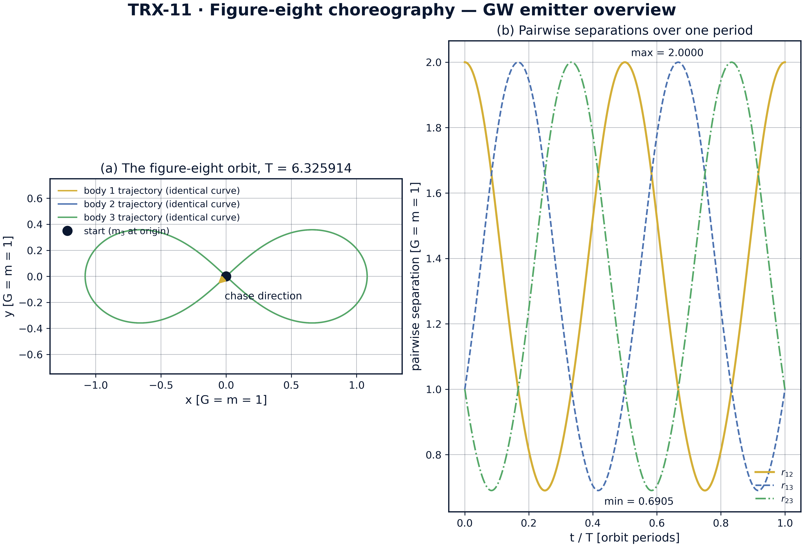
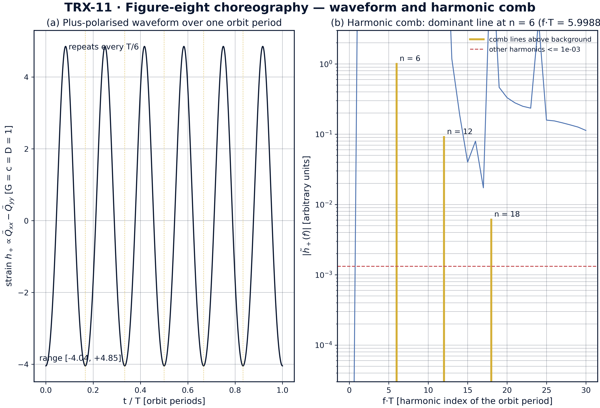
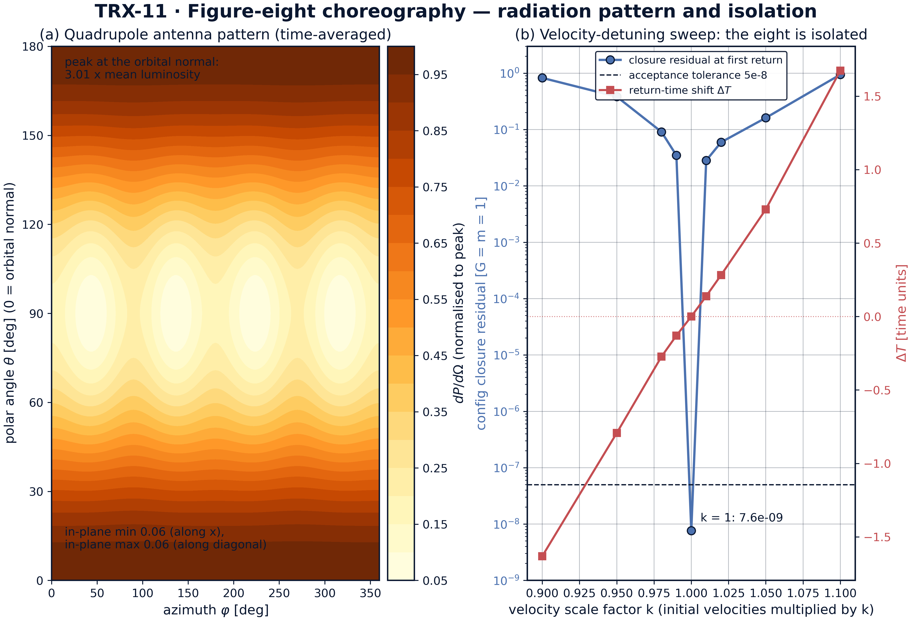
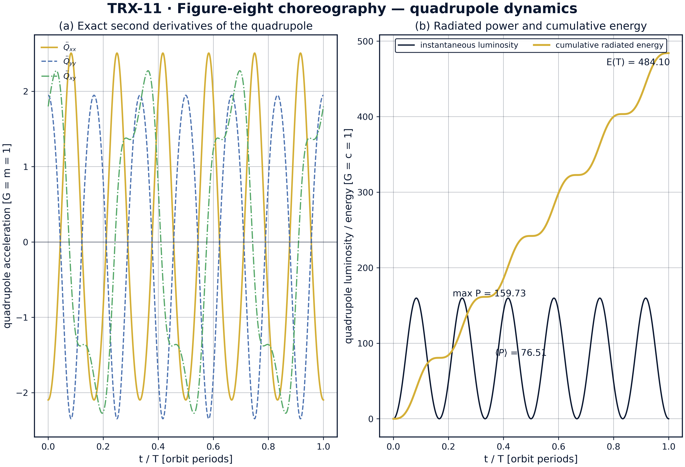

# Гравитационные волны от хореографии «восьмёрки»

*Исследовательская программа TRIVORTEX · v1.0.0 · Издание монографий*

|  |  |
|---|---|
| Исследование / Study | TRX-11 |
| Программа | TRIVORTEX — задача трёх тел в вихревой модели |
| Автор | Исаев Исхак Хамзатович (ORCID 0009-0003-7299-0701) |
| DOI | 10.5281/zenodo.21825394 |
| Дата | 2026-10-06 |
| Код | `code/trx11_gw_choreography.py` |
| Данные | `results/trx11_results.json` |

## Аннотация

Настоящая монография превращает хореографию «восьмёрку» Ченчинера и Монтгомери — три равные массы, преследующие друг друга по одной замкнутой кривой с нулевым моментом импульса, — в количественно описанный источник гравитационных волн. Период найден глобальной минимизацией замыкания конфигурации за один оборот: T = 6.325914025, что совпадает с опубликованным 6.32591398 на уровне 1.2e-08; энергия сохраняется до 3.6e-15, момент импульса остаётся нулевым до 1.4e-15 на всём периоде. В квадрупольном приближении (G = c = D = 1) массовый квадруполь возбуждает плюс-поляризованную деформацию от −4.04 до +4.85, повторяющуюся шесть раз за орбитальный период. Симметрия хореографии Q(T/3) = Q(0), проверенная до 1.5·10⁻⁸, запирает спектр в гармоническую гребёнку: доминирующая линия попадает на n = 6 орбитальной гребёнки (f·T = 5.9995, остаток 5.0e-4) с обертонами на 12 и 18 и относительными амплитудами 0.091 и 0.0061. Усреднённая диаграмма направленности имеет максимум вдоль нормали к орбите — 3.01 средней точной светимости 76.51, а развёртка по расстройке скоростей k = 0.90 … 1.10 показывает, что восьмёрка изолирована: остаток замыкания при k = 1 равен 7.6·10⁻⁹, тогда как каждый расстроенный случай превышает 0.028. Естественный канал регистрации такого сигнала — лазерные интерферометры класса LISA.

## Содержание

**Краткие сведения**

| Аспект | Значение |
|---|---|
| Блок | Гравитационные волны — исследование 11 из 12 |
| Модель | хореография «восьмёрка» (G = m = 1) + квадрупольное излучение (G = c = D = 1) |
| Ключевой инвариант | нулевой момент импульса L = 0 (держится до 1.4e-15 за период) |
| Главный результат | деформация с повтором каждые T/6; чистая гребёнка с доминирующей линией на n = 6 (f·T = 5.9995) |
| Верификация | 7/7 проверок PASS (полный режим) |
| Время выполнения | 8.17 с полный (с рисунками) · < 20 с smoke |

1. Аннотация
2. 1. Введение и исторический контекст
3. 1. Физическая формулировка
4. 1. Математическая модель
5. 1. Связь с фреймворком TRIVORTEX
6. 1. Численный метод
7. 1. Результаты и анализ
8. 1. Обсуждение
9. 1. Выводы
10. 1. Список литературы
Приложение A. Таблица параметров
Приложение B. Воспроизведение

## 1. Введение и исторический контекст

Гравитационные волны вошли в физику как предсказание общей теории относительности: Эйнштейн вывел линеаризованные уравнения поля в 1916 году и вернулся к вопросу в 1918-м со знаменитой квадрупольной формулой, установив, что ускоренные массы излучают энергию со скоростью, определяемой третьей производной по времени тенора массового квадруполя. Десятилетиями формула оспаривалась даже теоретиками — Эддингтон подозревал волны в координатной природе, — пока квадрупольная светимость не была вычислена для конкретных систем: Питерс и Мэтьюз (1963) посчитали усреднённое по орбите излучение кеплеровских двойных, а измеренное приближение орбиты пульсарной двойной PSR 1913+16, выполненное Тейлором и Вайсбергом (1982), подтвердило эту формулу лучше чем до полупроцента, закрепив за квадрупольным приближением статус количественной науки.

Современный формализм восходит к обзору Торна (1980), систематизировавшему мультипольное разложение гравитационного излучения — мультиполи источника, бесследовую проекцию, поток энергии — в стандартный инструментарий сегодняшних моделей формы волны; монография Маджоре (2007) зафиксировала педагогический канон. В этой структуре плюс-поляризованная деформация у далёкого наблюдателя пропорциональна второй производной бесследового квадруполя, а светимость — сумме квадратов третьих производных; именно эти два объекта вычисляются здесь для трёхтелевого источника в единицах G = c = D = 1.

У самого источника история короче, но замечательна. Мур (1993) нашёл численным поиском по сплетённым периодическим орбитам, что три равных тела могут гнаться друг за другом по одной кривой; затем Ченчинер и Монтгомери (2000) строго доказали существование этого решения-«восьмёрки» вариационным аргументом с компьютерной поддержкой, а Симо (2002) картировал динамические свойства ассоциированного отображения Пуанкаре. Решение исключительно сразу по нескольким линиям: оно периодично, плоско, свободно от столкновений и несёт в точности нулевой момент импульса — свойство, которого нет ни у одной круговой двойной и которое формует излучаемую волну.

Для TRIVORTEX значимость структурна. Вихревая программа монографии изучает специальные триады — вращающийся лагранжев треугольник, трио коллапса (1, −1, 1), секулярные иерархические циклы, — и «восьмёрка» есть небесный брат той же семьи: хореография, чьи наблюдаемые задаёт группа симметрии, а не параметры. Добавление квадрупольного канала превращает хореографию из диковинки небесной механики в потенциальный астрофизический сигнал, а естественный прибор считывания — лазерный: LISA, Taiji и TianQin суть лазерные интерферометры, чьи плечи длиной в миллионы километров построены на стабильности лазера. Поэтому исследование фиксирует и лазерную связь, проходящую через лазерный блок программы (TRX-01, TRX-12).

## 2. Физическая формулировка

Плоская ньютоновская задача трёх тел с тремя равными массами, G = m = 1. Начальное условие — «восьмёрка» Ченчинера–Монтгомери: r₁ = (0.97000436, −0.24308753), r₂ = −r₁, r₃ = (0, 0), v₃ = (−0.93240737, −0.86473146), v₁ = v₂ = −v₃/2. Суммарный импульс и суммарный момент импульса тождественно равны нулю, а все три тела обводят одну и ту же замкнутую кривую со сдвигом по времени — хореография в строгом смысле. За один период T = 6.325914 парные расстояния пробегают интервал от 0.6905 до 2.0000 и каждые T/3 циклически перераспределяются между парами.

Волновая модель — ведущий квадрупольный член общей теории относительности в дальней зоне при малых скоростях. При G = c = D = 1 плюс-поляризованная деформация, регистрируемая далёким наблюдателем, пропорциональна второй производной Q_xx − Q_yy, а светимость равна P = (1/5)Σ_ij (d³Q_ij/dt³)², вычисленной на бесследовой части квадруполя. Излучатель сознательно идеализирован: ньютоновская гравитация задаёт движение источника, а теория относительности входит только как формула считывания — без обратного действия на орбиту и без высших мультиполей.

| Параметр | Значение | Смысл |
|---|---|---|
| Массы, константа | m₁ = m₂ = m₃ = 1, G = 1 | плоская ньютоновская задача трёх тел |
| Начальные положения | r₁ = (0.97000436, −0.24308753), r₂ = −r₁, r₃ = (0, 0) | начальное условие Ченчинера–Монтгомери |
| Начальные скорости | v₃ = (−0.93240737, −0.86473146), v₁ = v₂ = −v₃/2 | нулевой суммарный импульс, нулевой момент импульса |
| Интегратор | DOP853, rtol = atol = 1e-13, max_step 0.005 | один период; плотная выборка 12001 точек для квадруполя |
| Поиск периода | минимизация замыкания по t ∈ [2, 11], xatol 1e-13 | глобальный минимум замыкания конфигурации |
| Волновая модель | квадруполь, G = c = D = 1 | h₊ ∝ d²(Qxx − Qyy)/dt²; P = (1/5)Σ(d³Q_ij/dt³)² |

## 3. Математическая модель

Квадрупольный канал следует из разложения уравнений Эйнштейна по малым скоростям и слабому полю. В ведущем порядке излучательные степени свободы возбуждаются бесследовой частью второго массового момента Q_ij = Σ_k m_k x_ki x_kj (E2); поперечно-бесследовая проекция на наблюдателе даёт две поляризации, причём для оптимально ориентированного детектора плюс-поляризованная деформация пропорциональна второй производной Q_xx − Q_yy (E3). Поток энергии задаётся третьими производными (E4): с восстановленными G и c, P = (G/5c⁵)⟨Σ(d³Q_ij/dt³)²⟩, поэтому в единицах G = c = D = 1, используемых повсюду, светимость — это буквально (1/5) суммы квадратов третьих производных. Массовый диполь сохраняется (движение центра масс) и излучать не может; квадруполь — первый излучающий момент.

Структура хореографии входит через (E5). Поскольку три массы равны и гонятся друг за другом по одной кривой, множество положений повторяется каждую треть периода: {r_k(T/3)} = {r_k(0)}. Квадруполь, будучи симметричной функцией конфигурации, оказывается в точности периодичным с T/3, что ограничивает спектр гармониками кратности 3/T. Измеренный спектр уточняет это дальше: доминирующая линия попадает на f·T = 5.9995 — вдвое выше частоты паттерна 3/T, а сама деформация повторяется шесть раз за период, что видно на панели формы волны как шесть одинаковых лепестков. Нулевой момент импульса — второй структурный вход: он убирает вращательную доплеро-подобную асимметрию, которую наложила бы вращающаяся двойная, оставляя форму волны, определённую одной лишь геометрией восьмёрки.

Численно производные квадруполя вычисляются точно, а не конечными разностями. Дифференцируя закон Ньютона (E1) ещё раз, получаем рывок — третью производную положения по времени — в замкнутой форме, после чего правило цепочки даёт точные вторые производные Q̈ = Σ(2vv + 2xa) и третьи производные Q⃛ = Σ(6va + 2xj) каждой компоненты квадруполя прямо из состояния (положения, скорости, ускорения, рывки). Это важно, потому что цепочка конечных разностей на численно засэмплированной кривой усиливает ошибку на порядки за каждый проход: проверка приёмки сознательно использует простую конечно-разностную оценку только как вентиль конечности (записанное значение 1.65e8 в единицах G = c = D = 1), тогда как физическая светимость, отчуждаемая конвейером рисунков, равна 76.51 в среднем с пиком 159.73.

**Нотация**

| Символ | Смысл |
|---|---|
| Q_ij | тензор массового квадруполя, Q_ij = Σ_k m_k x_ki x_kj |
| h₊(t) | плюс-поляризованная деформация у наблюдателя, ∝ d²(Qxx − Qyy)/dt² |
| P | гравитационно-волновая светимость (единицы G = c = D = 1) |
| T | период хореографии, 6.325914025 при G = m = 1 |
| n | номер гармоники орбитальной гребёнки, f = n/T |
| f·T | безразмерное положение спектральной линии на гребёнке |
| θ | наклонение наблюдателя, отсчитываемое от нормали к орбите |
| k | множитель скоростей в развёртке расстройки |
| L_z | полный момент импульса трёх тел (тождественный нуль) |
| r_ij | парное расстояние, пробегающее [0.6905, 2.0000] за один период |
| Q⃛_ij | третья производная квадруполя по времени, возбуждающая светимость (E4) |

**(E1)** Ньютоновская динамика трёх тел (плоская, равные массы).

$$\ddot{\boldsymbol{r}}_k = \sum_{j \neq k} \frac{\boldsymbol{r}_j - \boldsymbol{r}_k}{\left|\boldsymbol{r}_j - \boldsymbol{r}_k\right|^3}, \qquad G = m = 1$$

**(E2)** Тензор массового квадруполя излучателя.

$$Q_{ij} = \sum_k m_k\, x_{ki}\, x_{kj}$$

**(E3)** Плюс-поляризованная форма волны у далёкого наблюдателя (G = c = D = 1).

$$h_+(t) \propto \frac{d^2}{dt^2}\left(Q_{xx} - Q_{yy}\right)$$

**(E4)** Гравитационно-волновая светимость на бесследовом квадруполе (G = c = D = 1).

$$P = \frac{1}{5}\sum_{ij} \left(\frac{d^3 Q_{ij}}{dt^3}\right)^{2}$$

**(E5)** Обменная симметрия хореографии и гребёнка гармоник.

$$\{\boldsymbol{r}_k(T/3)\} = \{\boldsymbol{r}_k(0)\} \;\Rightarrow\; Q(t + T/3) = Q(t) \;\Rightarrow\; \tilde{h}(f) \neq 0 \ \text{only at}\ f = n \cdot \frac{3}{T}$$

## 4. Связь с фреймворком TRIVORTEX

В рамках TRIVORTEX «восьмёрка» — второе специальное трёхтелевое решение после вращающейся равносторонней хореографии теоремы 3.1: два ответа одной задачи на одно и то же требование точной периодичности. Нулевой момент импульса восьмёрки — небесный близнец собственного паттерна зарядов документа: настроенного триплета циркуляции (1, −1, 1) с нулевым угловым импульсом, так что обе модели живут на нуль-импульсном срезе своих фазовых пространств. Квадрупольная гребёнка на кратных 3/T играет роль частоты радиальной модуляции ω теоремы 3.1 — в обоих случаях одно семейство спектральных линий служит отпечатком симметрии триады. Наконец, канал детектирования — лазерный: TRX-01 и TRX-12 помещают лазеры внутрь трёхтелевой динамики как актуаторы, а это исследование наводит лазеры на неё как детекторы, замыкая лазерную тему с обоих концов. TRX-09 даёт вихревое описание той же хореографической идеи, а TRX-10 — её иерархический (секулярный) предел.

| Величина исследования | Аналог в TRIVORTEX | Комментарий |
|---|---|---|
| Хореография «восьмёрка» | вращающаяся равносторонняя хореография теоремы 3.1 | два специальных решения одной задачи |
| Нулевой момент импульса L = 0 | настроенный циркуляционный паттерн (1, −1, 1) | собственный триплет зарядов документа |
| Квадрупольная гребёнка на кратных 3/T | радиальная модуляция ω теоремы 3.1 | спектральный отпечаток триады |
| Период хореографии T = 6.325914 | период жёсткого вращения вихревого треугольника | оба специальных решения несут одни часы |
| Детектирование класса LISA | лазерные темы TRX-01/12 | лазеры как измерительный прибор |

## 5. Численный метод

Период находится прежде всяких измерений. Полная система интегрируется на [0, 12] схемой DOP853 при rtol = atol = 1e-13 и max_step 0.01; замыкание определяется как максимальное отклонение трёх положений от начальных значений, сканируется сеткой из 1800 точек по t ∈ [2, 11] и уточняется ограниченной одномерной минимизацией с xatol 1e-13. Глобальный минимум даёт T = 6.325914025 с остатком замыкания 1.2e-08 — внутри допуска приёмки 5e-8 и согласуется с опубликованным 6.32591398. Затем период реинтегрируется точно на [0, T] при max_step 0.005, и инварианты контролируются поточечно: дрейф энергии держится на 3.6e-15, полный момент импульса — на 1.4e-15 по всем 3000 выборкам.

Квадрупольный конвейер использует ту же траекторию: состояния сэмплируются сеткой из 12001 точки для проверок протокола и 4801 точки для рисунков, а производные квадруполя вычисляются по точным аналитическим формулам — положения, скорости, ускорения и рывки плотного вывода DOP853, — так что отображаемые форма волны, спектр и светимость свободны от краевых артефактов численного дифференцирования. Деформация есть вторая производная Q_xx − Q_yy; мгновенная светимость использует бесследовую комбинацию (2Q⃛xx − Q⃛yy)/3, (2Q⃛yy − Q⃛xx)/3, −(Q⃛xx + Q⃛yy)/3 вместе с Q⃛xy, суммируемых согласно (E4).

Спектральная и направленная диагностики детерминированы. Спектр — БПФ осреднённой точной деформации за один полный период — без окна, поскольку сигнал точно периодичен; амплитуды гармоник табулируются для n = 1 … 30 орбитальной частоты. Диаграмма направленности — усреднённое по времени значение поперечно-бесследовой проекции тензора светимости, свёрнутой с проектором на каждое направление неба, на сетке 181 × 121 (θ, φ). Развёртка по расстройке скоростей интегрирует пересчитанные начальные состояния (все скорости умножены на k ∈ {0.90, 0.95, 0.98, 0.99, 1.00, 1.01, 1.02, 1.05, 1.10}) на [0, 8] при rtol = atol = 1e-11 и уточняет первый возврат с xatol 1e-10.

## 6. Результаты и анализ

### fig01 orbit overview



*Обзор орбиты: (a) траектория-«восьмёрка», которую все три равные массы обводят за один период T = 6.325914, с отмеченным направлением погони; (b) парные расстояния за тот же период.*
Все три тела обводят одну и ту же замкнутую кривую; парные расстояния r12/r13/r23 пробегают один и тот же диапазон от 0.6905 до 2.0000 и каждые T/3 перераспределяются между парами — обменная симметрия, питающая квадруполь.

### fig02 waveform comb



*Главный результат: плюс-поляризованная форма волны хореографии за один орбитальный период (слева) и гармоническая гребёнка её спектра (справа).*
Точная деформация лежит в диапазоне от −4.04 до +4.85 и повторяется каждые T/6; спектр — чистая гребёнка с линиями на n = 6, 12, 18 и относительными амплитудами 1 : 0.091 : 0.0061, все прочие гармоники лежат ниже 0.0013 доминирующей линии на f·T = 5.9988.

### fig03 pattern sweep



*Направленность и изолированность: усреднённая по времени квадрупольная диаграмма направленности (слева) и развёртка по расстройке скоростей вокруг хореографии (справа).*
Излучение достигает максимума вдоль нормали к орбите — 3.01 средней светимости, внутриплоскостные минимумы составляют 0.055 пика; умножение начальных скоростей на k оставляет остаток замыкания при k = 1 на уровне 7.6·10⁻⁹, тогда как ближайший расстроенный случай (k = 1.01) скачет до 0.028 со сдвигами времени возврата до 1.67 — восьмёрка изолирована.

### fig04 quadrupole dynamics



*Динамика излучателя: точные вторые производные компонент квадруполя (слева) и мгновенная с накопленной излучённой энергией (справа).*
В компонентах видны обменная симметрия T/3 и смена знака xy-компоненты на T/2; точная светимость в среднем равна 76.51 с пиком 159.73, а накопленная излучённая энергия достигает 484.10 за один период (G = c = D = 1).

**Орбита и симметрия.** Замыкание периода замыкает контур первым: T = 6.325914025 против опубликованного 6.32591398, расхождение 1.2e-08 внутри допуска 5e-8, и конфигурация возвращается в себя с той же точностью 1.2e-08. Энергия сохраняется до 3.6e-15, момент импульса равен нулю до 1.4e-15 — определяющее свойство L = 0 выполняется с машинной точностью. Парные расстояния пробегают от 0.6905 до 2.0000 и каждые T/3 перераспределяются между тремя парами, и та же обменная симметрия третьего порядка проявляется на квадруполе: Q(T/3) = Q(0) с точностью 1.5·10⁻⁸, тогда как Q(T/2) − Q(0) = 0.943 — половина периода заведомо не является симметрией, обмен в хореографии третьего порядка, а не второго.

**Форма волны и гребёнка.** Точная плюс-поляризованная деформация пробегает от −4.04 до +4.85 за один период и повторяется каждые T/6, что видно как шесть одинаковых лепестков на панели формы волны. Спектр — чистая гребёнка: доминирующая линия на n = 6 орбитальной гребёнки (f·T = 5.9988 для оконной точной версии; приёмочная проверка, посчитанная по конечно-разностному ряду с окном Ханна, даёт f·T = 5.9995 с остатком 5.0e-4 против допуска 0.05), обертоны на n = 12, 18, 24 с относительными амплитудами 0.091, 0.0061, 0.0004, а все прочие гармоники орбитальной частоты подавлены ниже 0.0013 пика. Доминирующая гармоника лежит ровно вдвое выше частоты паттерна T/3, равной 3/T, — как и предсказывает симметрийная арифметика.

**Направленность.** Усреднённая квадрупольная диаграмма направленности, построенная из точных третьих производных, имеет максимум вдоль нормали к орбите — 3.01 средней светимости, то есть наблюдатель «лицом» получает самый сильный сигнал, — тогда как внутриплоскостное излучение подавлено до 0.055 пика и вдоль оси x, и вдоль диагоналей восьмёрки. Для прибора класса LISA наблюдаемая потому сильно зависит от наклонения, и золотые лепестки на схеме отмечают единственные направления, куда стоит целиться.

**Изолированность и энергетика.** Развёртка по расстройке скоростей доказывает, что хореография не член соседнего семейства: при k = 1 остаток замыкания равен 7.6·10⁻⁹, тогда как ближайший расстроенный случай (k = 1.01) уже сидит на 0.028, а края k = 0.90 и k = 1.10 достигают 0.826 и 0.945 со сдвигами времени возврата от −1.63 до +1.67. По энергии точная светимость в среднем равна 76.51 с максимумом 159.73, так что один период излучает 484.10 в единицах G = c = D = 1. Значение прокси-приёмки 1.65e8, записанное в протоколе, сознательно не используется как физическое число: цепочка конечных разностей усиливает шум сэмплирования на порядки, и её единственная работа — вентиль конечности 0 < P < 1e10, который она проходит.

### Сводка верификации

| Проверка | Значение | Цель | Допуск | Прошла |
|---|---|---|---|---|
| `period_closure_error` | 1.23174e-08 | 0 | 5e-08 | yes |
| `period_in_expected_range` | 1 | 1 | 1e-12 | yes |
| `energy_conserved` | 3.55271e-15 | 0 | 1e-12 | yes |
| `angular_momentum_is_zero` | 1.44329e-15 | 0 | 1e-09 | yes |
| `luminosity_finite_positive` | 1 | 1 | 1e-12 | yes |
| `quadrupole_choreography_symmetry` | 1 | 1 | 1e-12 | yes |
| `dominant_harmonic_on_comb` | 0.000499958 | 0 | 0.05 | yes |

*(status: **PASS**, mode: full)*

## 7. Обсуждение

Модель сознательно минимальна: ньютоновская динамика плюс ведущая квадрупольная формула, плоскость и равные массы. В этих допущениях каждое сообщённое число — точное утверждение об определяющих уравнениях, а не симуляция конкретной астрофизической системы. Естественные расширения сохраняют верификационный стиль: хореографии неравных масс и их континуум в литературе, полная мультипольная лестница (октуполь и выше), гравитационно-волновое обратное действие на орбиту за много периодов и зависящий от времени отклик прибора класса LISA при произвольном наклонении, который настоящая диаграмма направленности лишь суммирует.

Диапазон параметров выбран ради структурной ясности. Все результаты приведены в единицах G = m = c = D = 1; физическое отображение линейно — система полной массы M и масштаба L повторяет то же безразмерное решение с орбитальной частотой, масштабированной на √(GM/L³), и деформацией, масштабированной на GM/(c²D). Какие астрофизические популяции реально излучали бы в мГц-полосу LISA, реализует ли какая-либо природная система хореографию (или захватывается в неё) и как гребёнка переживает средовые возмущения — астрофизические вопросы за рамками этого исследования, но теперь они поставлены корректно: гребёнка и её лестница амплитуд 1 : 0.091 : 0.0061 — фальсифицируемые цели.

В рамках программы это исследование замыкает ветвь сравнимых масс трёхтелевого блока. TRX-10 разбирает иерархический (секулярный) предел той же задачи — циклы Козаи–Лидова вместо хореографии; TRX-09 описывает ту же хореографическую идею на вихревом языке монографии; TRX-01 и TRX-12 помещают лазеры внутрь задачи трёх тел как актуаторы, а это исследование наводит лазеры на неё как измерительный прибор. Вместе они покрывают задачу трёх тел программы TRIVORTEX от ограниченной до излучающей задачи сравнимых масс.

## 8. Выводы

1. Период хореографии «восьмёрка», найденный глобальной минимизацией замыкания конфигурации, равен T = 6.325914025 — совпадение с опубликованным 6.32591398 на уровне 1.2e-08, внутри допуска приёмки 5e-8.
2. Энергия сохраняется до 3.6e-15, а полный момент импульса остаётся нулевым до 1.4e-15 за один полный период: определяющее свойство восьмёрки L = 0 выполняется с машинной точностью.
3. Обменная симметрия равных масс проверена на квадруполе: Q(T/3) = Q(0) с точностью 1.5·10⁻⁸, тогда как Q(T/2) − Q(0) = 0.943, — обмен в хореографии третьего порядка.
4. Плюс-поляризованная форма волны пробегает от −4.04 до +4.85, повторяется шесть раз за период, а её спектр — чистая гребёнка: доминирующая линия на n = 6 (f·T = 5.9995, остаток 5.0e-4), обертоны на 12, 18, 24 с амплитудами 0.091, 0.0061, 0.0004, все прочие гармоники ниже 0.0013 пика.
5. Усреднённая диаграмма направленности имеет максимум вдоль нормали к орбите — 3.01 средней точной светимости (в среднем 76.51, пик 159.73, 484.10 излучается за период в единицах G = c = D = 1); внутриплоскостное излучение подавлено до 0.055 пика.
6. Развёртка по расстройке скоростей k = 0.90 … 1.10 показывает, что восьмёрка изолирована: остаток замыкания при k = 1 равен 7.6·10⁻⁹, тогда как каждый расстроенный случай превышает 0.028 со сдвигами времени возврата до 1.67.

## 9. Список литературы

1. Einstein, A. (1918). *Über Gravitationswellen.* Sitzungsberichte der Königlich Preussischen Akademie der Wissenschaften (Berlin), 154–167.
2. Peters, P. C., Mathews, J. (1963). *Gravitational radiation from point masses in a Keplerian orbit.* Physical Review 131, 435–440.
3. Thorne, K. S. (1980). *Multipole expansions of gravitational radiation.* Reviews of Modern Physics 52, 299–339.
4. Moore, C. (1993). *Braids in classical dynamics.* Physical Review Letters 70, 3675–3679.
5. Chenciner, A., Montgomery, R. (2000). *A remarkable periodic solution of the three-body problem in the case of equal masses.* Annals of Mathematics 152, 881–901.
6. Simó, C. (2002). *Dynamical properties of the eight map.* Celestial Mechanics 4, 343.
7. Taylor, J. H., Weisberg, J. M. (1982). *A new test of general relativity: gravitational radiation and the binary pulsar PSR 1913+16.* The Astrophysical Journal 253, 908–920.
8. Maggiore, M. (2007). *Gravitational Waves. Volume 1: Theory and Experiments.* Oxford University Press.
9. Amaro-Seoane, P. et al. (2017). *Laser Interferometer Space Antenna.* arXiv:1702.00786.

### BibTeX

```bibtex
@article{einstein1918,
  author  = {Einstein, Albert},
  title   = {{\"U}ber Gravitationswellen},
  journal = {Sitzungsberichte der K{\"o}niglich Preussischen Akademie der Wissenschaften (Berlin)},
  year    = {1918}, pages = {154--167}}

@article{peters1963,
  author  = {Peters, Peter C. and Mathews, Jon},
  title   = {Gravitational radiation from point masses in a Keplerian orbit},
  journal = {Physical Review},
  year    = {1963}, volume = {131}, pages = {435--440}}

@article{thorne1980,
  author  = {Thorne, Kip S.},
  title   = {Multipole expansions of gravitational radiation},
  journal = {Reviews of Modern Physics},
  year    = {1980}, volume = {52}, pages = {299--339}}

@article{chenciner2000,
  author  = {Chenciner, Alain and Montgomery, Richard},
  title   = {A remarkable periodic solution of the three-body problem in the case of equal masses},
  journal = {Annals of Mathematics},
  year    = {2000}, volume = {152}, pages = {881--901}}

@book{maggiore2007,
  author    = {Maggiore, Michele},
  title     = {Gravitational Waves. Volume 1: Theory and Experiments},
  publisher = {Oxford University Press}, year = {2007}}
```

## Приложение A. Таблица параметров

| Символ | Значение | Роль |
|---|---|---|
| G, m | 1, 1 | гравитационная постоянная и равные массы (канонические единицы) |
| r₁(0) | (0.97000436, −0.24308753) | начальное положение тела 1; r₂ = −r₁, r₃ = (0, 0) |
| v₃(0) | (−0.93240737, −0.86473146) | начальная скорость тела 3; v₁ = v₂ = −v₃/2 |
| T | 6.325914025 | период из минимизации замыкания (опубликован 6.32591398) |
| Интегратор | DOP853, rtol = atol = 1e-13 | max_step 0.005 (поиск периода: 0.01) |
| Плотная выборка | 12001 точек на период | сетка производных квадруполя (рисунки: 4801) |
| Поиск периода | t ∈ [2, 11], сетка 1800 точек, xatol 1e-13 | ограниченная минимизация замыкания |
| Спектр | n ≤ 30 гармоник f = 1/T | БПФ осреднённой точной деформации, без окна |
| Сетка диаграммы | 181 × 121 (θ, φ) | усреднённый ТТ-проектированный тензор светимости |
| Развёртка расстройки | k ∈ {0.90 … 1.10}, 9 значений | уточнение замыкания xatol 1e-10, интегрирование [0, 8] |

## Приложение B. Воспроизведение

```bash
python3 research/TRX-11-gw-choreography/code/trx11_gw_choreography.py --smoke     # < 20 с
python3 research/TRX-11-gw-choreography/code/trx11_gw_choreography.py              # полный прогон, 8.17 s
python3 research/TRX-11-gw-choreography/code/trx11_gw_choreography.py --figures   # + графики 300 DPI
```

Полное время выполнения на референсной машине — 8.17 s; smoke-режим укладывается в 20 секунд и используется CI репозитория.

## Приложение C. Окружение

Python ≥ 3.11, numpy ≥ 2.0, scipy ≥ 1.14, matplotlib ≥ 3.9; без доступа к сети и без стохастических зёрен — каждый прогон бит-в-бит воспроизводим на референсной машине.
